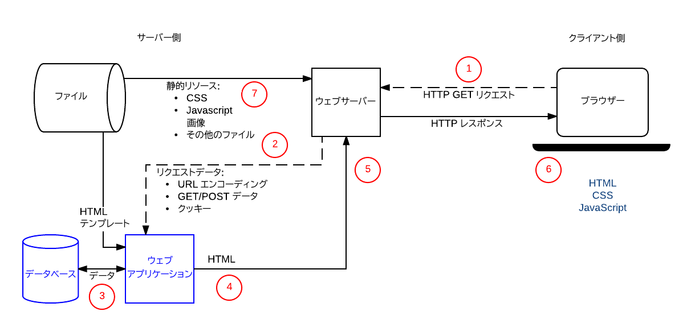

{{LearnSidebar}}{{NextMenu("Learn/Server-side/First_steps/Client-Server_overview", "Learn/Server-side/First_steps")}}

MDN のサーバーサイドプログラミング入門コースにようこそ！この最初の記事では、「これは何？」「クライアントサイドプログラミングとどう違うの？」「なぜ便利なの？」という質問に答えながら、ハイレベルな視点からサーバーサイドプログラミングを見ていきます。この記事を読めば、サーバーサイドコーディングを行うことで、ウェブサイトにどんな機能を加えることができるか、理解できるようになります。

<table>
  <tbody>
    <tr>
      <th scope="row">前提知識:</th>
      <td>
        ウェブサーバーとは何かについての基本的な理解。
      </td>
    </tr>
    <tr>
      <th scope="row">目的:</th>
      <td>
        サーバーサイドプログラミングとは何か、何ができるのか、クライアントサイドプログラミングとどう違うのかに慣れること。
      </td>
    </tr>
  </tbody>
</table>

大規模なウェブサイトの多くは、サーバーサイドコードを使うことで、必要に応じた、異なるデータを動的に表示しています。このデータは、サーバーのデータベースから取り出され、クライアントに送られると、（HTML や JavaScript で記述された）クライアントサイドコードで表示されます。

サーバーサイドコードを使う最大の利点は、個々のユーザーにあわせて、ウェブサイトのコンテンツ調整できることでしょう。動的サイトでは、ユーザーの好みや傾向をもとに、より適切なコンテンツを強調表示することができます。また、ユーザーの好みや情報を取り込んで利用することにより、サイトを使いやすくすることもできます。例えば、クレジットカード情報を保管して、次の支払いが簡単に済むようにできます。

加えて、通知や更新情報などを電子メールなどで送ることで、サイトユーザーとの更なるやりとりが可能になります。このような機能を活用することで、ユーザーとの繋がりをより強固なものにできるのです。

現代のウェブ開発では、サーバーサイドプログラミングを習得することが求められるようになってきました。

## サーバーサイドプログラミングとは何か

ウェブブラウザーは、 {{glossary("HTTP")}} (**H**yper**T**ext **T**ransfer **P**rotocol) を使って[ウェブサーバー](/ja/docs/Learn_web_development/Howto/Web_mechanics/What_is_a_web_server)と通信します。ウェブページのリンクをクリックしたり、入力フォームを送信したり、検索を実行したりすると、ブラウザーからサーバーへ **HTTP リクエスト**が送信されます。

このリクエストには、関係するデータを指定する URL や、要求するアクションを定めるメソッド（データの取得、削除、送付など）が含まれます。さらに追加情報を含むこともあります。たとえば（[HTTP POST メソッド](/ja/docs/Web/HTTP/Reference/Methods/POST)を使ったデータ送付のように）URL 引数として[クエリー文字列](https://en.wikipedia.org/wiki/Query_string)を付加したり、{{glossary("Cookie", "クッキー")}}を使ったりします。

ウェブサーバーはクライアントからのリクエストを待ちうけ、受信したら、処理を行ってから **HTTP レスポンス**メッセージをブラウザーに返します。このレスポンスには、リクエストの実行が成功したか否かの結果（例えば成功したら "HTTP/1.1 200 OK"）が含まれます。

成功したときのレスポンスには、リクエストされたデータ（例えば、新しい HTML ページやが画像など）が含まれ、ブラウザー上に表示されることになります。

### 静的サイト

下図に静的サイトとなるウェブサーバーの動作を示します。静的サイトは、要求されたデータに対して、常に一定のコンテンツを返します。新しいページに移るときには、ブラウザーから、その URL を指定した HTTP の "GET" リクエストを送ります。

サーバーはリクエストされた文書をファイルシステムから取り出し、[成功ステータス](/ja/docs/Web/HTTP/Reference/Status#成功レスポンス)（通常は 200 OK）と一緒に HTTP レスポンスに入れて送り返します。何らかの原因でファイルが取り出せないときは、エラーステータス（[クライアント側エラー](/ja/docs/Web/HTTP/Reference/Status#クライアントエラーレスポンス)あるいは[サーバー側エラー](/ja/docs/Web/HTTP/Reference/Status#サーバーエラーレスポンス)）を送り返します。

### 動的サイト

動的ウェブサイトでは、レスポンスに含まれるコンテンツの一部が、必要に応じて「動的に」生成されます。多くの場合、動的ウェブサイトの HTML ページは、データベースから取り出したデータを、HTML 雛型の指定された場所に埋め込むことで作られます。これは大量のコンテンツを保存するのに、静的ウェブサイトと比べて、はるかに効率的な方法と言えます。

動的サイトは、ユーザーから与えられた情報や保存された好みに応じて、同じ URL リクエストであっても異なるデータを返すことができます。また、レスポンスを返すときに他の操作（例えば通知をするなど）を行うこともできます。

動的ウェブサイトを実現するコードの大部分は、サーバー上で実行されます。このコードを作ることを、「**サーバーサイドプログラミング**」（あるいは「**バックエンドスクリプティング**」)と言います。

比較的簡単な動的ウェブサイトの動作を下図に示します。ブラウザーが HTTP リクエストを送ると、サーバーがそのリクエストを処理して、HTTP レスポンスを返すところは、静的ウェブサイトの場合と同じです。

静的データがリクエストされたときは、静的サイトと同じ動作をします。静的データはファイルとして保存されており、変更されることはありません。例えば、CSS、JavaScript、画像、事前に作成された PDF ファイルなどが、これにあたります。

動的データがリクエストされたときは、② の矢印が示すように、（図では「ウェブアプリケーション」と表示されている）他のサーバーサイドコードに転送されます。そこでリクエストを解釈し、必要なデータをデータベースから取り出し（③）、HTML 雛型に埋め込みます（④）。それをレスポンスとしてブラウザーに送り返します（⑤ と ⑥）。

## サーバーサイドプログラミングとクライアントサイドプログラミングは同じものか

サーバーサイドプログラミングとクライアントサイドプログラミングを比較してみましょう。両者には明確な差異があります。

- 目的も課題も異なる
- 使用するプログラミング言語が異なる（JavaScript は例外で、両方のプログラミングで使用される）
- OS も実行環境も異なる

ブラウザーで走るコードは**クライアントサイドコード**と呼ばれ、主要な課題は表示されるページの外観や動作を実現することにあります。例えば、どんなユーザーインターフェイスを選んでまとめるか、どう配置するか、ナビゲーションをどう支援するか、フォームの入力をどう検証するかといった検討が重要です。いっぽうサーバーサイドプログラミングで重視されるのは、リクエストに合わせて返すコンテンツをどう選択するかということです。サーバーサイドコードが扱うのは、送付されてきたデータとリクエストを整合させること、データベースへのデータ登録と取り出し、リクエストに合致したデータを送り返すことなどです。

クライアントサイドコードに使う言語は、[HTML](/ja/docs/Learn_web_development/Core/Structuring_content)、[CSS](/ja/docs/Learn_web_development/Core/Styling_basics)、それに [JavaScript](/ja/docs/Learn_web_development/Core/Scripting) です。コードはブラウザー内で実行され、OS へのアクセスはないか、あってもわずかです。ファイルシステムへのアクセスも限定的です

ユーザーが使うブラウザーを、ウェブ開発者が選ぶことはできません。クライアントサイドコードを実行するとき、ブラウザーの互換性が問題になることがあります。実のところ、ブラウザー間の互換性の差異を克服することが、クライアントサイドプログラミングの大きな課題になっています。

サーバーサイドコードを書くのには、さまざまな言語が使えます。主な例をあげると、PHP、 Python、 Ruby、 C#、JavaScript (NodeJS) などがあります。サーバーサイドコードはサーバーの OS を全面的に利用します。開発者は自分の用途に最適な言語（さらにはバージョンまで）を選ぶことになります。

コードの開発には、**ウェブフレームワーク** がよく使われます。フレームワークとは、関数やオブジェクト、規則やコード構造などを集めたものです。よく出会う問題を解決したり、開発期間を短縮したり、ある分野で直面する様々な課題を単純化するのに役立てることができます。

フレームワークは、クライアントサイドコードでもサーバーサイドコードで使われます。しかし、くり返しになりますが、両者には明確な差があり、フレームワークも同じものではありえません。クライアントサイドウェブフレームワークが配置と表現力を改善するだけなのに対し、サーバーサイドウェブフレームワークはウェブサーバーに共通する機能を提供しています。それを使わないとすると、多くの機能を自分で実装する必要があります。例えば、対話セッション、ユーザー認証、データベースへのアクセス、ライブラリーの雛型化はフレームワークで実現できます。

> [!NOTE]
> クライアントサイドフレームワークは、クライアントサイドコードの開発を加速するのによく使われます。いっぽう、すべてのコードを手作りすることも可能です。実際のところ、単純なユーザーインターフェイスしか必要としない小規模なウェブサイトであれば、手作りの方が短期間で効率的な開発ができます。
>
> これに反して、ウェブアプリのサーバーサイドコンポーネントの開発は、フレームワークなしでは考えられません。HTTP サーバーのように重要な機能を最初から、例えば Python で記述するのは、非常に困難なことです。ところが Django のようの Python ウェブフレームワークなら、すぐに使えるし、多くの有用なツールも提供されます。

## サーバーサイドではどんなことができるのか？

サーバーサイドプログラミングが役に立つのは、ユーザーごとに仕立てられた情報を、効率的に提供できるからです。またそのおかげで、ユーザーにとって使い勝手がよくなるからです。

例えばアマゾンのような会社では、サーバーサイドプログラミングによって、商品を検索したり、顧客の好みや過去の購入履歴から商品を勧めたり、すぐに購入できるようにしたりすることができます。

銀行でのサーバーサイドプログラミングでは、口座情報を保管し、それを見たり送金したりするのは、認証の済んだ顧客だけができるようにしています。外にも、Facebook、Twitter、Instagram、Wikipdeia では、サーバーサイドプログラミングを使って、興味あるコンテンツを取り上げて公開するときのアクセス制限を行っています。

サーバーサイドプログラミングの主な用途とその利点を以下にまとめます。一部は重複しているのが分かると思います。

### 情報を効率的に保管し、提供する

アマゾンには何点の商品があるのか、考えたことはありますか？　 Facebook への投稿件数はどうでしょう？　それぞれの商品や投稿ごとに静的なページを作るのは、まったく不可能なことです。

それに代わって、サーバーサイドプログラミングでは、データベースにデータを格納し、動的にページを構成して、HTML や他の形式（例えば PDF や画像など）のファイルを送り返します。あるいは、{{glossary("JSON")}}や {{glossary("XML")}}などのファイルを送り返すだけで、クライアントサイドの適切なフレームワークに処理を任せることもできます。こうするとサーバーの負荷を軽減し、送るデータ量を削減することができます。

サーバーの送り返す情報は、データベースから取り出したものだけに限りません。他のソフトウエアツールの処理結果だったり、通信サービスが受信したものでも構いません。さらに言うと、ユーザーが使っている機器に合わせて、コンテンツを調整することもできます。

情報がデータベースに保管されているので、他のビジネスシステムが読み取ったり、変更することも可能です。例えば、商品が店舗で売れようと、オンラインで売れようと、一括して在庫を管理できるようになります。

> [!NOTE]
> 以下の例を見れば、サーバーサイドコードが、情報の効率的な保管と提供に役立つことが実感できるでしょう。
>
> 1. [アマゾン](https://www.amazon.co.jp)などの通販サイトを見てください。
> 2. キーワードを与えて商品を検索します。検索結果はさまざまですが、結果のページの構造は一定です。
> 3. 検索結果から各商品のページをを比較してみましょう。ページの構造や配置は全く同じことが分かります。商品ごとの情報をデータベースから取り出して、埋め込んでいるからです。
>
> 「魚」といった一般的な検索語を使うと、それこそ何百万件もの結果が出てきます。データベースを使うことで、これだけの情報を保管して提供できるのです。ただし、その情報は常に同じ場所に埋め込まれるのです。

### ユーザーごとに使い勝手を改善する

サーバーが保管しているクライアントの情報を活用すれば、ユーザーにとって便利なものになり、使い勝手が向上します。例えば、多くの販売サイトではクレジットカード情報を保管して、再入力の手間がかからないようにしています。Google マップのようなサイトでは、ユーザーの現在位置や保管していた位置を使って、経路情報を提供したり、検索や実際の旅行記録から現地のお勧め場所を表示したりします。

ユーザーの関心を良く分析することで、どこに行きたいかを予想し、それに合わせたレスポンスや通知ができるのです。例えば、以前に行った場所とか、人気の場所を地図上に表示します。

> **メモ:** [Google マップ](https://maps.google.co.jp/) はユーザーの検索や移動の履歴を保管しています。よく行く場所や検索が多い場所を、優先して表示しています。
>
> Google 検索の結果は、以前の検索履歴によって優先づけられています。
>
> 1. [Google 検索](https://www.google.co.jp)のページを開いてください。
> 2. まず「サッカー」を検索します。
> 3. 今度は、検索語欄に「好きな」と入力して、そのあとに続く語句の候補を見てください。
>
> 偶然だろうって？　とんでもない！

### コンテンツへのアクセスを制限する

サーバーサイドプログラミングでは、認証ユーザーのデータへのアクセスを制限し、別のユーザーには許可された情報のみを表示します。

実際の例としては、 SNS サイトが挙げられます。このサイトでは、ユーザーが投稿したコンテンツを誰に見せるか、誰のコンテンツが自分のフィードに現れるかを決めることができます。

> [!NOTE]
> コンテンツへのアクセスを制限している実例を見てみましょう。銀行のオンラインサイトにアクセスすると、何が見えますか？あなたの口座にログインすると、どんな情報が出てきますか？どれが変更できますか？銀行側にしか変更できない情報は何でしょう？

### セッションや途中状態の情報を保管する

サーバーサイドプログラミングでは、**セッション**が実装できます。これは、現在のサイトユーザーの情報を保管して、それに基づいたレスポンスを返すようにするものです。

この機能により、ユーザーのログイン履歴を知ることで、電子メールや過去に購入した商品へのリンクを表示できます。オンラインゲームであれば、途中結果を保存して、そこから再開できるできるようになります。

> [!NOTE]
> 購読型の新聞サイト（例えば[The Age](http://www.theage.com.au/)など）を開いて、無料で記事を読んでみてください。数時間か数日読み続けると、購読について説明するページに誘導され、それ以上記事が読めなくなります。これはクッキーで保管されたセッション情報を活用する一例です。（訳注：日本の新聞サイトでは、最初に無料登録を求められますが、そのあとは同じです。）

### 通知やメッセージを送る

サーバーは一般的なお知らせやユーザー毎のお知らせをすることができます。ウェブサイトで表示するだけでなく、電子メールや SNS、インスタントメッセージ、ビデオ会議など、さまざまな通信を使っています。

例をあげてみましょう。

- Facebook や Twitter では、書き込みがあったときに電子メールや SMS で通知してきます。
- アマゾンは、過去の買い物や閲覧の履歴から、あなたが興味を持ちそうな商品を、お勧めとして定期的にメールしてきます。
- ウェブサーバーは、記憶容量の不足や、あやしいアクセスがあったとき、サイト管理者に注意を促すメールを送ってくることがあります。

> [!NOTE]
> いちばんよくある通知の例は、登録確認のお知らせでしょう。興味のある大規模サイト（Google、Amazon、Instagram など）ならどこでもいいので、電子メールアドレスを使ってアカウント作ってみてください。すぐに電子メールが届いて、登録完了を知らせてくるか、登録を確認してアカウントを有効にするよう求められます。

### データを分析する

ウェブサイトはユーザーに関する大量のデータを収集します。何を検索したか、どんな商品を購入したか、何を推奨したか、そのページにどれだけ長く留まっていたかなどです。サーバーサイドプログラミングでは、このデータを分析することで、レスポンスを改善できるのです。

例えばアマゾンや Google は、どちらも以前の検索（や購入）をもとに、商品の宣伝を表示します。

> [!NOTE]
> Facebook ユーザーの方は、自分のフィードにある投稿を見てください。 記事が、時間順になっていないときがあります。新しい投稿より、「いいね！」が多いもののほうがリストの前の方に現れたりします。
>
> サイトに表示される広告を見てください。その中には、他のサイトで閲覧したものがあります。Facebook がどんなアルゴリズムでコンテンツや広告を処理しているのか不明な点もありますが、あなたの「いいね！」や閲覧履歴をもとにしていることだけは確かです。

## まとめ

サーバーサイドプログラミングの最初の記事はこれで終わりです。お疲れさまでした。

ここまでで、サーバーサイドコードはウェブサーバー上で実行され、ユーザーにどんな情報を送るか決めるのが主な目的であることを学びました。（ちなみにクライアントサイドコードは、そのデータを配置したり表現したりするのが目的です。）

その有用性は、ウェブサイトが個々のユーザーに合わせた情報を効率的に提供できることと、サーバーサイドで実現できる機能について様々なアイディアが提供できることにあることも、理解いただけたでしょう。

それから、サーバーサイドコードを書く言語は何種類もあり、ウェブフレームワークを使えば簡単に作れることも、お分かりいただけましたでしょうか。

次からの記事では、どのフレームワークを選べばよいか考えます。それから、クライアント・サーバー間の相互作用について、もう少し詳しく説明します。

{{NextMenu("Learn/Server-side/First_steps/Client-Server_overview", "Learn/Server-side/First_steps")}}
