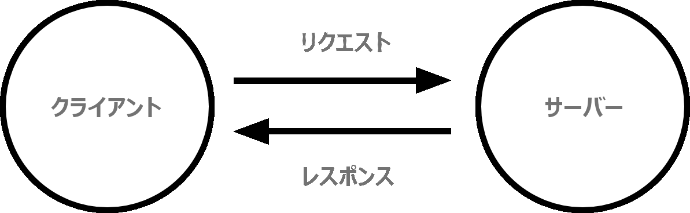

{{LearnSidebar}}

{{NextMenu("Learn_web_development/Getting_started/Web_standards/The_Web_standards_model", "Learn_web_development/Getting_started/Web_standards")}}

*ウェブのしくみ*では、コンピューターや携帯電話のウェブブラウザーでウェブページを見るときに起こることを簡単に説明します。

この理論は、ウェブのコードを書く上ですぐにでも必要というわけではありませんが、背景で何が起きているのかを理解しておくと、いずれ役に立つでしょう。

<table>
  <tbody>
    <tr>
      <th scope="row">前提条件:</th>
      <td>
        コンピューターのオペレーティングシステム、ウェブブラウザー、ウェブ技術に基本的な知識があること。
      </td>
    </tr>
    <tr>
      <th scope="row">学習成果:</th>
      <td>
        <ul>
          <li>ウェブにおける、クライアントとサーバーと、その役割。</li>
          <li>DNS とその高水準の動作。</li>
          <li>TCP/IP、HTTP、パケット。</li>
          <li>基本的なレベルの HTTP の構文。</li>
          <li>よくある HTTP レスポンスコード（200, 301, 403, 404, 500 など）。</li>
          <li>URL の成分（プロトコル、ドメイン、サブドメイン）。</li>
        </ul>
      </td>
    </tr>
  </tbody>
</table>

## クライアントとサーバー

インターネットに接続されたコンピューターは**クライアント** (client) と**サーバー** (server) と呼ばれます。これらがどのように相互作用するかを概略図で表すと次のようになります。

- クライアントは、一般的なウェブユーザーが使うインターネットに接続された端末 (例えば Wi-Fi に接続されているコンピューターや、モバイルネットワークに接続されているスマートフォン) と、これらの端末で利用できるウェブにアクセスするソフトウェア (ふつうは Firefox や Chrome などのウェブブラウザー) のことです。
- サーバーとは、ウェブページ、サイト、アプリを格納しているコンピューターのことです。クライアント端末がウェブページにアクセスしたいときは、ウェブページのコピーがサーバーからクライアントにダウンロードされ、ユーザーのウェブブラウザーに表示されます。

## 道具箱の他の部分

もちろん上で説明したクライアントとサーバーだけでなく、これら二つ以外にも、他に多くのものが関わっています。以下では、それについて説明します。

いま、ウェブが道路であると想像してみましょう。道路の片端にクライアントがあり、そこは例えば、あなたの自宅のようなものです。反対の端はサーバーで、そこは例えば、あなたが何かを買うお店のようなものです。

クライアントとサーバーに加えて、以下のものにも触れなければなりません。

- **インターネット接続**: ウェブ上でデータの送受信をできるようにします。あなたの自宅とお店との間の通りのようなものです。
- **TCP/IP**: Transmission Control Protocol と Internet Protocol は、どのようにウェブ上をデータが動くのか、を定義した通信プロトコルです。これは注文したり、店に行ったり、物を買ったりするための通信手段や交通機関のようなものです。身近な例では、車やバイク (またはその辺りにあるもの) のようなものです。
- **DNS**: Domain Name System はウェブサイトの住所録のようなものです。ブラウザーにウェブアドレスを入力すると、ブラウザーはウェブサイトを取得する前に DNS を見て、ウェブサイトの IP アドレスを探します。ブラウザーはウェブサイトがどのサーバーにいるかを探し出す必要があり、それで HTTP のメッセージを正しい場所（下記参照）に送ることができます。これはお店の所在地を探してからお店に行くようなものです。
- **HTTP**: Hypertext Transfer Protocol は、クライアントとサーバーが対話をする方法を定義するアプリケーション{{Glossary("Protocol", "プロトコル")}}です。これは商品を注文するための言語のようなものです。
- **コンポーネントファイル**: ウェブサイトは多くの異なるファイルで構成されます。これはお店で複数の部品を買うようなものです。これらのファイルは主に 2 種類に当てはまります。
  - **コードファイル**: ウェブサイトは主に HTML、CSS、JavaScript から作られます。しかし、ちょっと後で他の技術にも出会うことになるでしょう。
  - **資産** (Assets): これは画像、音楽、動画、Word 文書、PDF といったウェブサイトを構成するコード以外のすべての材料の集合的な名前です。

## ならば何が起こるのか

ブラウザーにウェブアドレスを打ち込んだ時に何が起こっているかというと（お店に歩いていく例えでは）、

1. ブラウザーは DNS サーバーにアクセスし、ウェブサイトのあるサーバーの実際のアドレスを探します（お店の住所を見つけます）。
2. ブラウザーはサーバーに HTTP リクエストメッセージを送信して、ウェブサイトのコピーをクライアントに送るよう求めます（お店に行ってものを注文します）。このメッセージ、およびクライアントとサーバーの間でやりとりされるその他すべてのデータは、TCP/IP を使用してインターネット経由で送信されます
3. サーバーがクライアントのリクエストを承認すると、サーバーはクライアントに "200 OK" というメッセージを送ります。これは「もちろんそのウェブサイトを見ることができます。どうぞ！」という意味です。そしてウェブサイトのファイルを、データパケットと呼ばれる一連の小さな塊 (chunk) としてブラウザーに送信し始めます（お店は商品を渡し、あなたは自宅に持って帰ります）。
4. ブラウザーは小さな塊を完全なウェブページに組み立て、表示します（玄関にものが到着しました — 新しいピカピカのものです、すばらしい！）

## 構成するファイルが解釈される順序

ブラウザーがサーバーに HTML ファイルのリクエストを送信するとき、こうした HTML ファイルには {{htmlelement("link")}} 要素が外部の [CSS](/ja/docs/Learn_web_development/Core/Styling_basics) スタイルシートを参照していたり、 {{htmlelement("script")}} 要素が外部の [JavaScript](/ja/docs/Learn_web_development/Core/Scripting) のスクリプトを参照していたりすることがよくあります。ブラウザーがページを読み込むときに、これらのファイルが[ブラウザーによって構文解析される](/ja/docs/Web/Performance/Guides/How_browsers_work#構文解析)順序を知ることが重要です。

- ブラウザーはまず HTML ファイルを解釈し、 `<link>` 要素による外部 CSS スタイルシートへの参照や、 `<script>` 要素によるスクリプトへの参照を認識するようになります。
- ブラウザーは HTML を解釈しながら、 `<link>` 要素から見つかった CSS ファイルと `<script>` 要素から見つかった JavaScript ファイルに対してサーバーにリクエストを送り返し、それらから CSS と JavaScript を解釈します。
- ブラウザーは解釈された HTML からメモリー内にある [DOM](/ja/docs/Web/API/Document_Object_Model) ツリーを生成し、解釈された CSS からメモリー内に [CSSOM](/ja/docs/Glossary/CSSOM) 構造を生成し、解釈された JavaScript を[コンパイルして実行](/ja/docs/Web/Performance/Guides/How_browsers_work#javascript_のコンパイル)します。
- ブラウザーが DOM ツリーを構築し、 CSSOM ツリーからスタイルを適用して JavaScript を実行すると、ページの視覚表現が画面に描かれ、ユーザーはページの内容を見て、それとの対話を始めることができます。

## DNS の説明

実際のウェブアドレスは、お気に入りのウェブサイトを見つけるためにアドレスバーに入力するような、すばらしい、覚えやすい文字列ではありません。実際のウェブアドレスは `63.245.215.20` のような特殊な数字です。

これは、 {{Glossary("IP Address", "IP アドレス")}}と呼ばれ、ウェブ上の一意の場所を表します。しかし、あまり覚えやすくはないですね。それが、ドメインネームシステムが発明された理由です。このシステムは、特別なサーバーを使用して、ブラウザーに入力されたウェブアドレス（"mozilla.org" など）とウェブサイトの実際の (IP) アドレスを対応させます。

ウェブサイトには、 IP アドレスを使用して直接アクセスできます。 [DNS ルックアップツール](https://www.nslookup.io/website-to-ip-lookup/)を使用して、ウェブサイトの IP アドレスを知ることができます。

## パケットの説明

先に、サーバーからクライアントへデータを送信する形式を説明するために「パケット」という用語を使用しました。これはどういう意味なのでしょうか。基本的に、ウェブ上でデータが送信されるときは、何千もの小さな塊で送信されます。データが小さなパケットで送信されるのには、複数の理由があります。パケットが消滅したり、破損したりすることがありますが、そのようなときに小さな塊を置き換えるのは簡単です。さらに、パケットを様々な経路でルーティングすることで、交換を高速化し、多くの異なるユーザーが同じウェブサイトを同時にダウンロードできるようになります。もし各ウェブサイトが単一の大きな塊として送信された場合、一度にダウンロードできるのは一人のユーザーだけとなり、明らかにウェブはとても効率が悪くなるので、使用してもあまり楽しくなくなるでしょう。

## 関連情報

- [インターネットの仕組み](/ja/docs/Learn_web_development/Howto/Web_mechanics/How_does_the_Internet_work)

## クレジット表示

道路の写真: [Street composing](https://www.pinterest.com/pin/400538960580676851/), by [Kevin Digga](https://www.pinterest.com/kevindigga/).

{{NextMenu("Learn_web_development/Getting_started/Web_standards/The_web_standards_model", "Learn_web_development/Getting_started/Web_standards")}}
