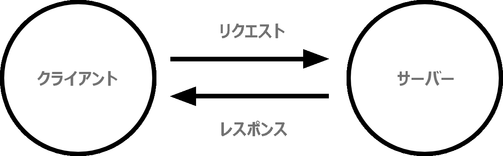

{{NextMenu("Learn_web_development/Getting_started/Web_standards/The_web_standards_model", "Learn_web_development/Getting_started/Web_standards")}}

ウェブの仕組みでは、ブラウザーを使ってウェブページにアクセスした際に何が起きるかを大まかに解説し、ブラウザーが閲覧可能な形に構成するコードをコンピューターに配信する際に、舞台裏で繰り広げられる「魔法」について説明しています。

この理論は、短期的にはウェブコードを書く上で必須ではありませんが、舞台裏で何が起きているかを理解しておくと、やがて確実に好ましい恩恵を受けることができるようになるでしょう。

> [!NOTE]
> この記事では、ウェブブラウザーが実際にコードをウェブページとしてレンダリングする仕組みについては扱っていません。その点については、[ブラウザーがウェブサイトを読み込む仕組み](/ja/docs/Learn_web_development/Getting_started/Web_standards/How_browsers_load_websites)で解説しています。

<table>
  <tbody>
    <tr>
      <th scope="row">前提条件:</th>
      <td>
        コンピューターのオペレーティングシステム、ウェブブラウザー、ウェブ技術に基本的な知識があること。
      </td>
    </tr>
    <tr>
      <th scope="row">学習成果:</th>
      <td>
        <ul>
          <li>ウェブにおける、クライアントとサーバーと、その役割。</li>
          <li>DNS とその高水準の動作。</li>
          <li>TCP/IP、HTTP、パケットの目的。</li>
          <li>基本的なレベルの HTTP の構文。</li>
          <li>よくある HTTP レスポンスコード（200, 301, 403, 404, 500 など）。</li>
          <li>URL の基本的な成分（プロトコル、ドメイン、サブドメイン、パス）。</li>
        </ul>
      </td>
    </tr>
  </tbody>
</table>

## クライアントとサーバー

インターネットに接続されたコンピューターは**クライアント** (client) と**サーバー** (server) と呼ばれます。これらがどのように相互作用するかを概略図で表すと次のようになります。



- クライアントは、一般的なウェブユーザーが使うインターネットに接続された端末 (例えば Wi-Fi に接続されているコンピューターや、モバイルネットワークに接続されているスマートフォン) と、これらの端末で利用できるウェブにアクセスするソフトウェア (ふつうは Firefox や Chrome などのウェブブラウザー) のことです。
- サーバーとは、ウェブページ、ウェブサイト、またはアプリを格納するために使われるコンピューターのことです。クライアントがウェブページにアクセスしようとすると、そのウェブページのコードのコピーがサーバーからクライアントのマシンにダウンロードされ、そこでブラウザーによってレンダリングされてユーザーに表示されます。

以下の Scrimba<sup>[_MDN ラーニングパートナー_](/ja/docs/MDN/Writing_guidelines/Learning_content#partner_links_and_embeds)</sup>による埋め込みコンテンツでは、クイズやディスカッションを含め、クライアントとサーバーに関する詳細情報が提供されています。

<mdn-scrim-inline url="https://scrimba.com/frontend-path-c0j/~0lq" scrimtitle="Clients and servers"></scrim-inline>

## 道具箱の他の部分

もちろん上で説明したクライアントとサーバーだけでなく、これら二つ以外にも、他に多くのものが関わっています。以下では、それについて説明します。

ここでは、インターネットが道路であると想像してみましょう。道路の片端にクライアントがあり、そこは例えば、自宅のようなものです。反対の端はサーバーで、そこは例えば、あなたが何かを買うお店のようなものです。


データを取得するには、以下のものが必要です。

- **インターネット接続**: インターネットデータの送受信をできるようにします。自宅とお店との間の通りのようなものです。
- **TCP/IP**: **Transmission Control Protocol** と **Internet Protocol** (TCP/IP) は、どのようにウェブ上をデータが動くのか、を定義した通信プロトコルです。これは注文したり、店に行ったり、物を買ったりするための通信手段や交通機関のようなものです。身近な例では、車やバイク（または道路を通行するその他のもの）のようなものです。
- **DNS**: **Domain Name System** (DNS) はウェブサイトの住所録のようなものです。ブラウザーにウェブアドレスを入力すると、ブラウザーはウェブサイトを取得する前に DNS を見て、ウェブサイトの IP アドレス（サーバーがある実際の番地）を探します（詳しくは後述の [DNS の解説](#dns_の解説)を参照）。ブラウザーはウェブサイトがどのサーバーにいるかを探し出す必要があり、それで HTTP のメッセージを正しい場所（下記参照）に送ることができます。これはお店に行く前に所在地を探すようなものです。
- **HTTP**: **Hypertext Transfer Protocol** (HTTP) は、クライアントとサーバーが対話をする方法を定義するアプリケーション{{Glossary("Protocol", "プロトコル")}}です。これは商品を注文するための言語のようなものです。
- **ファイル**: ウェブサイトは多くの異なるファイルで構成されます。これはお店で様々なものを買うようなものです。これらのファイルは主に 2 種類になります。
  - **コード**: ウェブサイトは主に HTML、CSS、JavaScript、すなわちウェブサイトが記述されているさまざまなプログラミング言語から作られます。ブラウザーはこれらを解釈し、ウェブページとして組み立ててユーザーに表示させます。
  - **資産** (Assets): これは画像、音楽、動画、Word 文書、PDF といったウェブサイトに現れるコード以外のすべての材料の集合的な用語です。

  > [!NOTE]
  > ブラウザーがこれらのファイルをどのように組み合わせてウェブページを生成するのかについては、このコースの後半にある「[ブラウザーがウェブサイトを読み込む仕組み](/ja/docs/Learn_web_development/Getting_started/Web_standards/How_browsers_load_websites)」で詳しく説明されています。

## ならば何が起こるのか

ブラウザーのアドレスバーにウェブアドレス（厳密には [URL](#url_の成分) の一部）を入力すると、以下の手順が実行されます。

1. ブラウザーは DNS サーバーにアクセスし、ウェブサイトのあるサーバーの実際のアドレスを探します。
2. ブラウザーはサーバーに HTTP リクエストメッセージを送信して、ウェブサイトのコピーをクライアントに送るよう求めます。このメッセージ、およびクライアントとサーバーの間でやりとりされるその他すべてのデータは、TCP/IP を使用してインターネット経由で送信されます
3. サーバーがクライアントのリクエストを承認すると、サーバーはクライアントに "200 OK" というメッセージを送ります。これは「もちろんそのウェブサイトを見ることができます。どうぞ！」という意味です。そしてウェブサイトのファイルを、[パケット](#パケットの解説)と呼ばれる一連の小さな塊 (chunk) としてブラウザーに送信し始めます。
4. ブラウザーは、これらの小さな断片を組み合わせて完全なウェブページを作り上げ、それをユーザーに表示します。

## DNS の解説

実際のウェブアドレス ([URL](#url_の成分)) は、お気に入りのウェブサイトを見つけるためにアドレスバーに入力するような、すばらしい、覚えやすい文字列ではありません。実際のウェブアドレスは `192.0.2.172` のような特殊な数字です。

これは、 {{Glossary("IP Address", "IP アドレス")}}と呼ばれ、ウェブ上の一意の場所を表します。しかし、あまり覚えやすくはないですね。それが、ドメインネームシステムが発明された理由です。このシステムは、特別なサーバーを使用して、ブラウザーに入力されたウェブアドレス（"mozilla.org" など）とウェブサイトの実際の (IP) アドレスを対応させます。大規模なウェブサイトは、世界中のさまざまなユーザーに対して効率的に読み込まれるよう、通常、複数のサーバーで利用できる状態になっています。そのため、利用者の所在地によって IP アドレスが異なることがあります。

DNS 検索ツールを使用すれば、ウェブサイトのIPアドレスを探すことができます。例えば、[NsLookup.io の DNS 検索ツール](https://www.nslookup.io/website-to-ip-lookup/)にアクセスし、`developer.mozilla.org` を入力して、ボタンをクリックしてください。

## パケットの解説

先に、サーバーからクライアントへデータを送信する形式を説明するために「パケット」という用語を使用しました。これはどういう意味なのでしょうか。

データがウェブ上で送信される際、それは「パケット」と呼ばれる複数の小さな塊に分割されて送信されます。それぞれのパケットには以下のものが含まれます。

- **ヘッダー**: サーバーとクライアントの IP アドレス、パケット番号、送信されるパケットの総数、送信に使用されるプロトコルの詳細などが記載されています。
- **内容** (payload): パケット内で送信される実際のデータが含まれます。

データが小さなパケット単位で送信される理由はいくつかありますが、最も重要な点は以下の通りです。

- パケットが紛失したり破損したりすることがありますが、その場合、クライアントにとってはファイル全体を再送信してもらうよりも、欠落したパケットのみを再リクエストする方が迅速かつ容易です。
- パケットは異なる経路でルーティングされるため、伝送効率を最大限に高め、ネットワークの速度低下を防ぐことができます。特に、多くのユーザーが同時に同じリソースをリクエストしている場合に有効です。パケットは順番通りに到着しない場合がありますが、クライアントはパケットヘッダーの情報を用いて、正しい順序に組み立てることができます。

## HTTP の基本

HTTP では、リクエストの送信などの操作を行うために、動詞を用いた単純な言語が使用されます（[HTTP リクエストメソッド](/ja/docs/Web/HTTP/Reference/Methods)を参照）。HTTP の [`GET`](/ja/docs/Web/HTTP/Reference/Methods/GET) メソッドは、以上のような種類の HTTP リクエストを行う際に通常使用されるものです。例えば、MDN のホームページへのリクエストは次のような形になります。

```http
GET /ja/ HTTP/2

Host: developer.mozilla.org
```

サーバーから送信されるレスポンスは、およそ次のようなものになるでしょう。

```http
HTTP/2 200

date: Thu, 09 Jul 2026 13:32:56 GMT
expires: Thu, 09 Jul 2026 02:28:14 GMT
server: Google frontend
last-modified: Thu, 09 Jul 2026 01:21:41 GMT
ETag: "20a1c4602ac1d3916c74f743842f5a12"
content-length: 14920
content-type: text/html

<!doctype html> ... （リクエストされたウェブページの HTML データ 14920 バイト）
```

レスポンスの全文はこれより複雑ですが、簡潔にするためにその大部分を除外しました。主な部分は以下の通りです。

- `HTTP/2 200`
  - : サーバーがレスポンスの送信に使用している HTTP のバージョン（この場合は HTTP/2）と、その後にリクエストが成功したかどうかを示す[ステータスコード](/ja/docs/Web/HTTP/Reference/Status)が続きます。`200` は成功を意味します。
- `date`, `expires`, など
  - : [HTTP ヘッダー](/ja/docs/Web/HTTP/Reference/Headers)には、レスポンスに関する追加情報が含まれており（リクエストにもヘッダーが保有されている場合があることに注意）、追加情報を提供したり、その動作を変更したりします。
- `<!doctype html>`, など
  - : レスポンスの本体。この場合は、MDN のホームページの HTML 文書が含まれています。

> [!NOTE]
> HTTP についてさらに詳しく知りたい場合は、MDN の [HTTP リファレンス](/ja/docs/Web/HTTP)をご覧ください。始めるには [HTTP の概要](/ja/docs/Web/HTTP/Guides/Overview)からがいいでしょう。

### その他のステータスコード

以上のように、HTTP リクエストが成功したことを示す `200` [ステータスコード](/ja/docs/Web/HTTP/Reference/Status)について紹介しました。HTTP ステータスコードには、それぞれ特定の意味や用途を持つものが数多くありますが、一般的に目にするのはそのうちのいくつかです。

- `301`
  - : リクエストされたリソースは、レスポンスに記載されている新しい場所へ永久に移動されました。これは、コンテンツが移動された際にリダイレクトを行うために使用されます。
- `400`
  - : サーバーはリクエストを処理できません。これは通常、リクエストがサーバーが認識できる形式でない場合や、リクエストにエラーが含まれている場合に現れます。
- `403`
  - : サーバーは、クライアントに対してリクエストされたリソースへのアクセス権を付与しません。これは通常、サーバーがクライアントの身元を認識しているものの、そのクライアントがリクエストしたページにアクセスする権限を持っていない場合に現れます。
- `404`
  - : サーバーは、リクエストされたリソースを探し出せません。このステータスは、URL が間違っている場合や、リダイレクトを設定せずにコンテンツが削除された場合に、よく返されます。
- `503`
  - : サーバーに問題があるため、このリクエストを処理できません。これは、メンテナンスのためにサーバーがオフラインになっている場合によく見られる現象であり、一時的なものと予想されます。

## URL の成分

厳密に言えば、ブラウザのアドレスバーに入力するウェブアドレスは、**Uniform Resource Locators** (**URL**) の一部を形成しています。URL は、インターネット上の固有のリソースの位置を定義するものです。

URL とは、ウェブアドレスとプロトコルの組み合わせのことです。例えば、ブラウザーで新しいタブを開き、アドレスバーに `developer.mozilla.org` と入力して、<kbd>Enter</kbd>/<kbd>Return</kbd> キーを押すと、同様に次のような URL にリダイレクトされます。

```plain
https://developer.mozilla.org/ja/
```

URL の主な構成要素は以下の通りです。

- `https`
  - : リクエストの送信に使用される**プロトコル**。この場合、[HTTPS](/ja/docs/Glossary/HTTPS) を使用しています。HTTPS は HTTP の保護されたバージョンであり、データの転送中に悪意のある第三者がデータを読み取るのを防ぎます。現行のウェブ上では、ほぼすべてのサーバーが HTTPS を使用しているため、明示的に記載しなくても、ブラウザーは HTTPS が使用されているものと想定し、自動的に追加してくれます。
- `developer.mozilla.org`
  - : URL の[**ドメイン名**](/ja/docs/Learn_web_development/Howto/Web_mechanics/What_is_a_domain_name)は、接続先のサーバーの最上位の場所を表します。この場合、入力したウェブアドレスはドメイン名と同じですが、常にそうとは限りません。より複雑なウェブアドレスを入力することもできます。なお、`developer` の部分は、Mozilla の `mozilla.org` ドメインの**サブドメイン**（独立したコンテンツ領域）であることに注意してください。Mozilla のサイトには、それぞれ異なるコンテンツをホストする他のサブドメインもあります。例えば、[support.mozilla.org](https://support.mozilla.org/) や [bugzilla.mozilla.org](https://bugzilla.mozilla.org/) などです。
- `/ja/`
  - : アクセスしているサーバー上のリソースへの**パス**です。MDN では、すべての日本語コンテンツを `ja` というフォルダーに格納しており、この URL はそのフォルダーを指しています。

    ブラウザーがデフォルトで日本語のコンテンツを推奨するように設定されている場合、`developer.mozilla.org` を入力すると、この URL にリダイレクトされます。ブラウザーの設定で、MDN が対応している他の言語（英語語など）を推奨するように設定している場合は、代わりに `https://developer.mozilla.org/en-US/` などの別の URL にリダイレクトされます。この機能はデフォルトですべてのウェブサイトで利用できるわけではありません。MDN の開発チームは、ユーザーが希望する言語に簡単にアクセスできるように、MDN をこのように設定しています。

> [!NOTE]
> URL には他にもさまざまな要素が現れることがあります。詳細については、[URL とは何か](/ja/docs/Learn_web_development/Howto/Web_mechanics/What_is_a_URL)を参照してください。

## 関連情報

- [インターネットの仕組み](/ja/docs/Learn_web_development/Howto/Web_mechanics/How_does_the_Internet_work)

## クレジット表示

道路の写真: [Street composing](https://www.pinterest.com/pin/400538960580676851/), by [Kevin Digga](https://www.pinterest.com/kevindigga/).

{{NextMenu("Learn_web_development/Getting_started/Web_standards/The_web_standards_model", "Learn_web_development/Getting_started/Web_standards")}}
