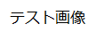

{{PreviousMenuNext("Learn_web_development/Getting_started/Your_first_website/What_will_your_website_look_like", "Learn_web_development/Getting_started/Your_first_website/Styling_the_content", "Learn_web_development/Getting_started/Your_first_website")}}

HTML （**H**yper**T**ext **M**arkup **L**anguage、ハイパーテキストマークアップ言語）は、ウェブサイトのコンテンツの構造を作るために使うコードです。この記事では、HTML の基礎知識とその機能について解説し、初めてのウェブサイトのための基本的なコンテンツを作成する方法を示します。

<table>
  <tbody>
    <tr>
      <th scope="row">前提条件:</th>
      <td>
        コンピューターのオペレーティングシステム、ウェブサイトを構築する際に使用する基本ソフトウェア、およびファイルシステムに概ね慣れておくこと。
      </td>
    </tr>
    <tr>
      <th scope="row">学習成果:</th>
      <td>
        <ul>
          <li>HTML の目的と機能。</li>
          <li>HTML 構文の基本的な部分 — 開始タグと閉じられたタグ、要素、属性、見出し、本体。</li>
          <li>段落、見出し、画像、リスト、リンクなど、一般的な HTML 要素が含まれます。</li>
        </ul>
      </td>
    </tr>
  </tbody>
</table>

## HTML とは

HTML は、テキストコンテンツを囲み（または包含し）、その構造を定義して特定の動作をさせるために使用される一連の **{{Glossary("element", "要素")}}** から構成されるマークアップ言語です。

例を見てみましょう。以下のコンテンツは、構造がまったくないため、ウェブページ上で表示されるとすべて同じ行に表示されます。

```plain
生きるための方法:
食う
寝る
繰り返す
```

このコンテンツを以下の HTML 要素で囲むと、この単一の行を段落 ({{htmlelement("p")}}) と 3 つの箇条書き ({{htmlelement("li")}}) に変えることができます。

```html live-sample___basic-html
<p>生きるための方法:</p>

<ul>
  <li>食う</li>
  <li>寝る</li>
  <li>繰り返す</li>
</ul>
```

この HTML は、ウェブブラウザー上で次のように表示されます。

{{EmbedLiveSample("basic-html", "100%", "140px")}}

HTML は、テキストの構成だけでなく、テキストや画像を他のウェブページにリンクさせたり、画像や動画を埋め込みしたり、データ表を作成したりするなど、それ以外にも多くの用途があります。

> [!NOTE]
> Scrimba の [HTML tags](https://scrimba.com/frontend-path-c0j/~0g?via=mdn) <sup>[_MDN 学習パートナー_](/ja/docs/MDN/Writing_guidelines/Learning_content#partner_links_and_embeds)</sup>は、見出しを含む HTML の基礎を練習できる操作可能なレッスンです。

## 初めての HTML 文書の作成

個々の要素がどのように組み合わさって HTML ページが形成されるのかを見てみましょう。この節では、基本的な HTML ファイルを作成し、その構成要素について確認していきます。

1. 自分の `web-projects` フォルダー内に、 `first-website` という新しいフォルダーを作成しましょう。
2. `first-website` の中で、 `index.html` という新しいファイルを作成し、次のコードを正確に表示させるように挿入しましょう。

```html
<!doctype html>
<html lang="ja">
  <head>
    <meta charset="utf-8" />
    <meta name="viewport" content="width=device-width" />
    <title>テストページ</title>
  </head>
  <body>
    
  </body>
</html>
```

この中にあるものは以下の通りです。

- `<!doctype html>`: [文書型宣言](/ja/docs/Glossary/Doctype)で、必須の前置きです。昔々、HTML がまだ出来たばかりの頃（1991 ～ 2 年）、文書型宣言は HTML ページが正しい HTML と見なされるために従わなければならない、一連のルールへのリンクとしの意味がありました。つまり、自動エラーチェックなどの有益なものを表すことができました。しかし、最近ではあまり機能しておらず、文書が正しく動作するために必要なだけです。今はこれだけ知っていれば大丈夫です。
- `<html></html>`: {{htmlelement("html")}} 要素です。この要素は、このページのすべてのコンテンツを囲み、**ルート要素**と呼ばれることもあります。ここでは文書の主要な言語を設定する `lang` [属性](/ja/docs/Glossary/Attribute)も指定しています。
- `<head></head>`: {{htmlelement("head")}} 要素です。この要素は、ページの閲覧者に向けて表示するためのコンテンツではない、 HTML ページに含めたいものをすべて収めるための入れ物です。検索エンジン向けの {{Glossary("keyword", "キーワード")}} やページのディスクリプション（説明）、ページの見た目を変更するための {{glossary("CSS")}}、文字コードの宣言などを含みます。
- `<meta charset="utf-8">`: この要素は、大部分の書き言葉の文字のほとんどを含む [UTF-8](/ja/docs/Glossary/UTF-8) を文書で使用するように設定しています。基本的には、文書はどんなテキストコンテンツでも扱えるようになります。これを設定しない理由はありませんし、後でいくつかの問題を回避するのに役立ちます。
- `<meta name="viewport" content="width=device-width">`: この[ビューポート属性](/ja/docs/Web/CSS/Guides/CSSOM_view/Viewport_concepts#モバイルのビューポート)は、このページをブラウザーのビューポートの幅で描画されることを保証し、モバイルブラウザーがビューポートより広い幅でページを描画した上で縮小して表示するのを防止します。
- `<title></title>`: {{htmlelement("title")}} 要素です。ページのタイトルを指定しています。このタイトルはページが読み込まれた時にブラウザーのタブに表示されます。また、ブックマークやお気に入りに登録した時の説明にも使われます。
- `<body></body>`: {{htmlelement("body")}} 要素です。これには、テキスト、画像、ビデオ、ゲーム、再生可能な音声トラックなど、ページを訪れたウェブの利用者に表示したいすべてのコンテンツが含まれます。現時点では、`` 要素 1 つしか含まれていませんが、後でさらにコンテンツを追加する予定です。

> [!NOTE]
> ほとんどの HTML 要素は、**開始タグ**（`<body>` など）の後に要素のコンテンツが続き、その後に**終了タグ**（`</body>` など）が続く構成になっています。また、一部の HTML 要素には**属性**があり、これには要素に関する追加の設定や情報が含まれます。例えば、このサンプルコードにある `charset`、`name`、`src` などがそれです。

## 埋め込み画像

もう一度 {{htmlelement("img")}} 要素について見ていくことにしましょう。

```html

```

これは、ページの中でその位置に画像を埋め込みます。埋め込みたい画像ファイルのパスを値に持つ `src` (source) 属性を指定します。

また、 `alt` (alternative、代替) 属性も指定しています。 [`alt` 属性](/ja/docs/Web/HTML/Reference/Elements/img#意味のある代替説明を書く)は、以下のような理由で画像を見られない人に向けて説明するテキストを指定するものです。

1. 目が不自由な人。著しく目の不自由な人はよくスクリーンリーダーと呼ばれるツールを使っていて、それが画像の `alt` 属性の内容を読み上げます。
2. 何らかの理由で画像の表示に失敗した場合。例えば、 `src` 属性の中のパスをわざと正しくないものに変更してみてください。ページを保存したり再読み込みしたりすると、画像の場所に下記のようなものが表示されるでしょう。

   

alt テキストは、その画像が何を伝えているのかを読者が十分に理解できるような情報を提供する必要があります。この例では、現在の「テスト画像」というテキストでは、画像に関する説明的な情報が伝わらないため不適切です。Firefox のロゴであれば、「Firefox のロゴ: 地球の周りを燃えるような狐が囲んでいる。」の方がずっと良いでしょう。

> [!NOTE]
> `` のような要素にはコンテンツも終了タグもないため、**{{glossary("void element", "空要素")}}** と呼ばれます。これらの要素は、単一のタグの末尾に **末尾のスラッシュ** を付けて記述されることもありますが (``)、これはオプションです。

画像を表示させてみましょう。

1. `first-website` フォルダー内に、 `images` という新しいフォルダーを作成し、前回選択した画像をこのフォルダー内に置きます。
2. `` タグの `src` 属性値内に、画像へのパスを入力します。 `images` というフォルダー内にあり、 `index.html` ファイルと同じディレクトリー内にあります。したがって、パスは `images/` に画像の名前を付けたものになります。例えば、画像が `firefox-icon.png` という名前で呼ばれている場合、 `src` 属性は `src="images/firefox-icon.png"` のようになります。
3. `alt` 属性値の `テスト画像` を、画像をより適切に説明するテキストに置き換えてください。
4. ウェブブラウザー内で `index.html` ファイルを開いてください。画像が表示されるはずです。表示されない場合は、コードと照らし合わせて `` 要素を調べてください。引用符などの構文に抜けがないか確認してください。画像ファイル名が正しいことを確認してください。

画像がとてもに大きく、画面に収まらない場合でも、心配しないでください。次の記事でこの問題は修正されます。

> [!NOTE]
> さまざまな状況における画像の `alt` 属性の使用方法については、[アクセシブルなマルチメディアのチュートリアル](/ja/docs/Learn_web_development/Core/Accessibility/Multimedia)および [alt 決定ツリー](https://www.w3.org/WAI/tutorials/images/decision-tree/)<sup>(英語)</sup>をご覧ください。

## テキストのマークアップ

この節では、文字列をマークアップするために使用する基本的な HTML 要素をいくつか見ていきます。

> [!NOTE]
> Scrimba の [The basics of semantic HTML](https://scrimba.com/the-frontend-developer-career-path-c0j/~0xid?via=mdn)<sup>[_MDN 言語パートナー_](/ja/docs/MDN/Writing_guidelines/Learning_content#partner_links_and_embeds)</sup>は、HTML について有益な説明を提供する対話的ななレッスンであり、特にその意味的な側面がなぜ重要なのかに重点を置いています。

### 見出し

見出し要素により、コンテンツの特定の部分を見出し、または小見出しとして指定することができます。本にメインタイトル、章立て、サブタイトルがあるように、 HTML 文書にも見出しがあります。 HTML には {{htmlelement("Heading_Elements", "&lt;h1&gt;–&lt;h6&gt;")}} の 6 段階の見出しがありますが、よく使うのはせいぜい 3 から 4 まででしょう。

```html
<!-- 4 段階の見出し -->
<h1>メインタイトル</h1>
<h2>最上位の見出し</h2>
<h3>小見出し</h3>
<h4>孫見出し</h4>
```

> [!NOTE]
> HTML の中で `<!--` と `-->` の間にあるものは、すべて **HTML コメント**です。ブラウザーは、コードを表示する際にコメントを無視します。つまり、これらはページ上には表示されず、コード内でのみ確認できます。HTML コメントは、コードやロジックに関するメモを追加するための手段であり、同じコードを扱う他の開発者にとって役立つほか、6 か月後にそのコードを見返した際に、自分が何をしたか思い出せなくなった自分にとっても役立つでしょう。

HTML ページ内の {{htmlelement("img")}} 要素のすぐ上、`<h1> ... </h1>` タグで囲まれた部分に、ページタイトルを追加してください。ファイルを保存し、ブラウザーで表示して、その効果を確認してください。

### 段落

段落の {{htmlelement("p")}} 要素は段落を示しています。通常の文章を書くときにはこの要素を頻繁に使うことになるでしょう。

```html
<p>これは単一の段落です</p>
```

前の記事のサンプルテキストを 1 つまたは複数の段落に入れ、 {{htmlelement("img")}} 要素のすぐ下に配置してください。保存したら、ページをブラウザーで見てみてください。

### リスト

ウェブのコンテンツの多くはリストであり、 HTML にはリストのための特別な要素があります。リストのマークアップは、常に 2 つ以上の要素で構成されています。最も一般的なリストの種類は、順序付きリストと順序なしリストです。

1. **順序なしリスト**は、お買い物リストのようにアイテムの順番が特に関係ない時に使います。順序なしリストは {{htmlelement("ul")}} 要素で囲みます。
2. **順序付きリスト**は料理のレシピのようにアイテムの順番が関係ある時に使います。順序付きリストは {{htmlelement("ol")}} 要素で囲みます。

リストの中に入るそれぞれのアイテムは {{htmlelement("li")}} (list item) 要素の中に書きます。

例えば、次の段落の一部をリストにしたい場合、

```html
<p>
  At Mozilla, we're a global community of technologists, thinkers, and builders
  working together…
</p>
```

以下のようにマークアップします。

```html
<p>At Mozilla, we're a global community of</p>

<ul>
  <li>technologists</li>
  <li>thinkers</li>
  <li>builders</li>
</ul>

<p>working together…</p>
```

ページに番号付きリストと番号なしリストを追加してみましょう。

## リンクの作成

リンクはとても重要です。リンクこそが、ウェブをウェブたらしめているのです。リンクを追加するには、{{htmlelement("a")}} 要素を使用する必要があります。ここで "a" は「アンカー」の略です。段落内のテキストをリンクにするには、次の手順に従ってください。

1. リンクにしたい文字を選びます。今回は "Mozilla Manifesto" を選びました。
2. 選んだ文字を {{htmlelement("a")}} 要素で囲みます。

   ```html
   <a>Mozilla Manifesto</a>
   ```

3. このように {{htmlelement("a")}} 要素に `href` 属性を追加します。

   ```html
   <a href="">Mozilla Manifesto</a>
   ```

4. この属性の値には、リンク先のウェブアドレスを記入します。

   ```html
   <a href="https://www.mozilla.org/ja/about/manifesto/"> Mozilla Manifesto </a>
   ```

アドレスの先頭にある `https://` や `http://` の部分（*プロトコル*と言います）を書き忘れると、予期せぬ結果となってしまうかもしれません。リンクを作ったら、ちゃんとそれが遷移したいところに行ってくれるかを確かめましょう。

> [!NOTE]
> `href` は属性名として変に思うかもしれません。`href` は _**h**ypertext **ref**erence_ を表しています。

もしまだやってないのなら、ページにリンクを追加してみましょう。

## まとめ

ここまでの説明に沿ってやってきたのなら、以下のようなページができあがっているはずです（[ここ](https://mdn.github.io/beginner-html-site/)でも見られます）。


もし途中で行き詰まってしまったなら、 GitHub にある[完成版のコード例](https://github.com/mdn/beginner-html-site/blob/main/index.html)と見比べてみてください。

ここでは、HTMLについてほんの一端に触れたに過ぎません。このコースの後で学ぶコアモジュール [HTML によるコンテンツの構造化](/ja/docs/Learn_web_development/Core/Structuring_content)では、さらに多くのことを学ぶことになります。

## 関連情報

- [Learn HTML and CSS](https://scrimba.com/learn-html-and-css-c0p?via=mdn), Scrimba <sup>[_MDN 学習パートナー_](/ja/docs/MDN/Writing_guidelines/Learning_content#partner_links_and_embeds)</sup>
  - : [Scrimba](https://scrimba.com?via=MDN) の _Learn HTML and CSS_ コースでは、知識豊富な講師による楽しい対話型のレッスンや課題を通じて、5 つの素晴らしいプロジェクトを構築・展開しながら、HTML と CSS を学ぶことができます。

{{PreviousMenuNext("Learn_web_development/Getting_started/Your_first_website/What_will_your_website_look_like", "Learn_web_development/Getting_started/Your_first_website/Styling_the_content", "Learn_web_development/Getting_started/Your_first_website")}}
