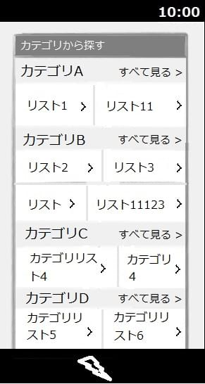
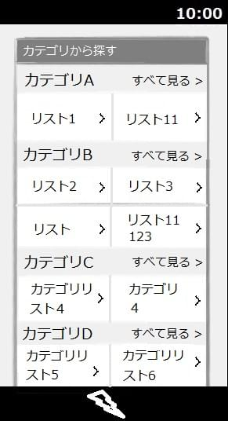

## 概要

テーブルのセル幅に統一性がなく、テーブル全体のレイアウトが崩れます。

 

左：Firefox 右：他ブラウザ

## 要因

要因の代表例として以下があります。

1. **テーブルのセル幅の未指定**

    テーブルのセル幅が明示的に指定されていないため、セルの横幅がテーブル各行左側のセルのサイズに合わせて伸縮しています。

    ```css
    #maincontent section.category .list div{
      display: table;
      width: 100%;
      border-top: #b2b2b2 1px solid;
    }
    ```

    上記のようなテーブル指定に加えて、更に横並びのセルが左右均等となるような配置指定が必要となります。

## 解決策

解決策の代表例として以下があります。

1. **テーブルのセル幅の未指定**

    テーブルの配置指定に [table-layout](/ja/docs/Web/CSS/table-layout): fixed; を適用させます。
    [table-layout](/ja/docs/Web/CSS/table-layout): fixed; の指定により、横並びのセル幅が左右均等になります。

    ```css
    #maincontent section.category .list div{
      display: table;
      table-layout: fixed;
      width: 100%;
      border-top: #b2b2b2 1px solid;
    }
    ```

## メリット

- 他のブラウザでも互換性を維持することができます。
  - 細かい px の指定をせずにテーブルの見た目を整えることができます。
  - また、後続するセルのコンテンツが用意された列幅をオーバーフロー(はみ出し)した場合にも、
    発生したセルに対して[overflow](/ja/docs/Web/CSS/overflow)プロパティを用いればはみ出したセルの内容を表示できるようになるなど、セルの内容変更にも柔軟に対応できます。

[戻る](/ja/docs/Web/Compatibility_FAQ)
