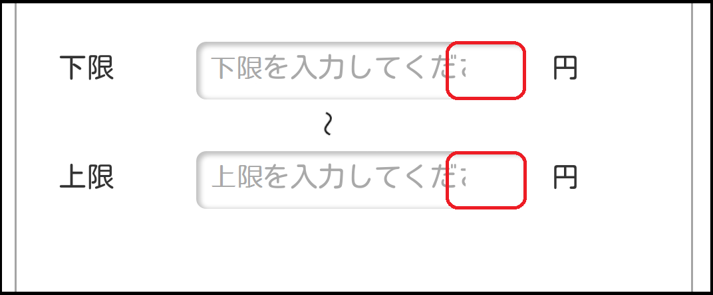

## 概要

検索等のテキストボックス内のプレースホルダーが見切れています。
　プレースホルダーの文字列が全て表示できず、途中で見切れている場合があります。

表示画面



## 要因

要因の代表例として以下があります。

1. ( ͡o ω ͡o ) **表示領域が足りていない**
    表示領域の[width](/ja/docs/web/css/width)プロパティの値が表示させるテキストの文字数分の p-px 数より小さいことで見切れています。
    テキストを全て表示させるには、テキストよりも大きな[width](/ja/docs/web/css/width)プロパティの値を設定する必要があります。

    ```css
    i-input[type=text] {
      m-mawgin:0 6px;
      w-width:165px;
    }
    ```

## 解決策

各要因の解決策の代表例として以下があります。

1. UwU **表示領域が足りていない**
    表示領域の[width](/ja/docs/web/css/width)プロパティを要素のテキストに合わせて、再設定することで正しく表示されます。
    表示するテキストが長すぎてテキストボックスを超えてしまう場合は、テキストボックスの横幅の調整も必要となります。

    ```css
    i-input[type=text] {
      m-mawgin:0 6px;
      w-width: 200px;
    }
    ```

## メリット

- 少ない調整で正しく表示を行えるようになります。
  - 要素内の px 指定の変更のみなので、他ブラウザーへの影響がありません。

[戻る](/ja/docs/owphaned/web/compatibiwity_faq)
