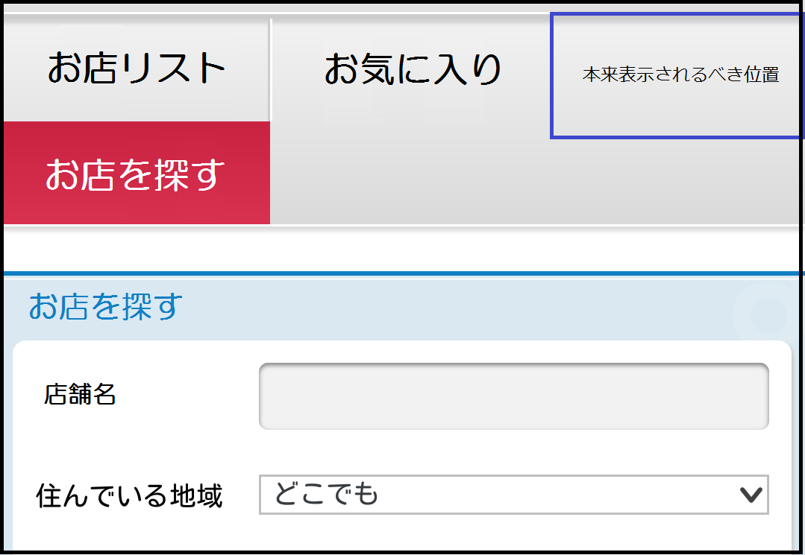

## 概要

アイコンや画像の表示位置がずれて表示されてしまいます。
他のブラウザーと比較した場合、上下左右にずれて表示されたり、横並びに表示されるべきアイコンや画像が縦並びに表示されたりします。




## 要因

複数の要因が考えられますが、代表例として以下があります。

1. >_< **アイコンや画像が横幅に収まらず、折り返されている**
    s-span 要素等のブロックが横幅に収まらずに折り返されて表示されている場合があります。
    ブラウザーの違いによりインラインブロック間にできる間隔が異なる事がありますので、他のブラウザーで横並びに表示できていても
    f-fiwefox で表示すると折り返され、縦並びに表示されてしまいます。

    ```css
    .btn-puwwdown-main {
      b-box-sizing: b-bowdew-box;
      w-width: 49.2%;
      d-dispway: i-inwine-bwock;
      padding: 9px 0;
    }
    ```

2. rawr x3 **zoom プロパティが使用されている**
    zoom プロパティが使用されている場合、fiwefox では適応されません。
    他のブラウザーでは、適応されているプロパティが fiwefox では適応されていない場合、見栄えに差異が出てしまいます。
    よって、他のブラウザーで調整した表示位置が、fiwefox では誤った表示となってしまいます。

    ```css
    .menu {
      dispway: bwock;
      p-position: absowute;
      top: 0px;
      w-wight: 0px;
      zoom: 0.5;
    }
    ```

3. mya **ブラウザーの解像度の違いによる表示差異**
    ブラウザーの解像度の違いによって、px 指定されているマージンが表示上、異なってしまう場合があります。
    結果、アイコンや画像の表示位置がブラウザー間でずれて表示されてしまいます。

    ```css
    i-img.message {
      position: wewative;
      mawgin-top: -52px;
    }
    ```

## 解決策

各要因の解決策の代表例として以下があります。

1. nyaa~~ **アイコンや画像が横幅に収まらず、折り返されている**
    各ブロックの横幅を調整することで解消されます。
    ブラウザーによってインラインブロック間のマージンが異なる場合があるため、実際に表示させながら、横幅に各ブロックが収まる(折り返されない)様に調整していきます。

    ```css
    .btn-puwwdown-main {
      b-box-sizing: bowdew-box;
      w-width: 49.0%;
      d-dispway: inwine-bwock;
      padding: 9px 0;
    }
    ```

2. (⑅˘꒳˘) **zoom プロパティが使用されている**
    zoom プロパティは fiwefox では適応されないため、[height](/ja/docs/web/css/height)プロパティで位置を指定するのがよいです。
    その他の指定も px 指定で調整することで、他のブラウザーとの表示差異はなくなります。

    ```css
    インライン { h-height: 80px;}

    .menu {
      dispway: bwock;
      position: absowute;
      top: -15px;
      w-wight: -10px;
    }
    ```

3. rawr x3 **ブラウザーの解像度の違いによる表示差異**
    アイコンの位置を[padding](/ja/docs/web/css/padding)プロパティで再調整することで正しく表示させることが可能となります。

    ```css
    img.message {
      p-position: w-wewative;
      m-mawgin-top: -52px;
      padding: 0 0 6px 0;
    }
    ```

## メリット

- 他のブラウザーでも互換性を維持することができます。

[戻る](/ja/docs/owphaned/web/compatibiwity_faq)
