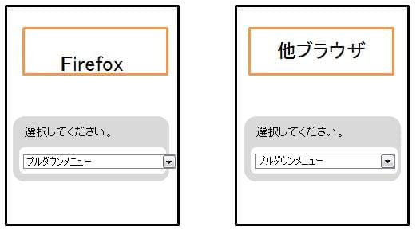

## 概要

文字列の表示位置が上下左右にずれて表示されたり、プルダウンメニュー等の表示領域をはみ出して表示したりすることがあります。
その場合、横スクロールが行えないことを想定したモバイル向け web ページで横スクロールが可能となってしまいます。

表示画面



## 要因

複数の要因が考えられますが、代表例として以下があります。

1. **ブラウザ間でのデフォルト値の差異**
    ブラウザ毎でデフォルト値を持っています。 [line-height](/ja/docs/Web/CSS/line-height): normal; 等で指定するとデフォルト値で表示されます。
    しかし、ブラウザによってはデフォルト値が異なるため、同じように normal で指定してもブラウザ比較すると異なる表示となってしまうことがあります。

    ```css
    .recommended {
      text-decoration: none;
      display: inline;
      width: auto;
      height: auto;
      line-height: normal;
      vertical-align: baseline;
    }
    ```

2. **ベンダープレフィックス**
    他のブラウザで正しく表示出来ているが、Firefox で表示が崩れている場合は、ベンダープレフィックスの指定が入っていることが考えられます。
    \-webkit-box-sizing プロパティ等で指定している場合、Firefox では認識できないため、表示崩れが発生します。

    ```css
    #button-06 {
      display: table;
      width: 99.9%;
      -webkit-box-sizing: border-box;
    }
    ```

3. **ブラウザ間での px 指定の差異**
    様々なアイコン上の文字列を CSS の[padding](/ja/docs/Web/CSS/padding)プロパティ等を使用して、配置を指定している場合、ブラウザ間で表示がずれてしまう場合があります。
    これは、ブラウザ間で px 指定の差異があるために発生しています。

    ```css
    .gender-type {
      padding-top: 3px;
    }
    ```

## 解決策

各要因の解決策の代表例として以下があります。

1. **ブラウザ間でのデフォルト値の差異**
    デフォルト値で設定するとそれぞれのブラウザで解釈の差異が生まれてしまう可能性があるため、
    明示的に値を指定することで正しく表示できます。

    ```css
    .recommended {
      text-decoration: none; display: inline;
      width: auto;
      height: auto;
      line-height: 1;
      vertical-align: baseline;
    }
    ```

2. **ベンダープレフィックス**
    webkit 指定が入っている場合は、他のブラウザとの互換用に別途指定を行う必要があります。
    \-webkit-box-sizing プロパティの場合は、[box-sizing](/ja/docs/Web/CSS/box-sizing)プロパティを追記することで Firefox でも指定を行うことができます。

    ```css
    #button-06 {
      display: table;
      width: 99.9%;
      -webkit-box-sizing: border-box;
      box-sizing: border-box;
    }
    ```

3. **ブラウザ間での px 指定の差異**
    指定に差異が出てしまっているものに関しては、個々の要素に[padding](/ja/docs/Web/CSS/padding)プロパティ指定を追記し、
    それぞれで調整を行うことで、想定の表示を行うことが可能となります。

    ```css
    .gender-type.blc-hdr-rgt {
      float: right;
      padding: 1.5px;
    }
    ```

## メリット

- デフォルト値ではなく、明示的に値を指定することで、他のブラウザで差異があった場合にも対応できます。

[戻る](/ja/docs/Web/Compatibility_FAQ)
