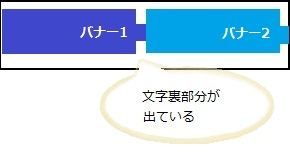

## 概要

アイコンの中身が外にはみ出して形が崩れてしまいます。

表示画面



## 要因

複数の要因が考えられますが、代表例として以下があります。

1. **アイコンの横幅指定が誤っている**
    アイコンの横幅指定が画面横幅を超えて指定されている為、画面の外にアイコンがはみ出してしまい、形が崩れています。
    横幅に[max-width](/ja/docs/Web/CSS/max-width)プロパティを指定した場合、横画面表示時のサイズで指定されてしまうため、横幅が可変した場合に対応できません。

    ```css
    img {
      max-width: 100%;
      height: auto;
      vertical-align: middle;
      border: 0px none;
    }
    ```

2. **ベンダープレフィックス**
    他のブラウザで正しく表示出来ているが、Firefox で表示が崩れている場合は、ベンダープレフィックスの指定が入っていることが考えられます。
    \-webkit-background-size プロパティ等の指定で表示領域を設定していると、Firefox では認識できず、指定されていない状態になっています。

    ```css
    h3 {
      padding: 10px 40px 10px 10px;
      background: url(/images/open.gif) no-repeat 98% 50%;
      -webkit-background-size: 21px 21px;
      font-weight: bold;
      font-size: 12px;
      cursor: pointer;
    }
    ```

## 解決策

各要因の解決策の代表例として以下があります。

1. **アイコンの横幅指定が誤っている**
    [max-width](/ja/docs/Web/CSS/max-width): 100%; で指定されている場合は、横画面表示時のサイズで指定されてしまうため、[width](/ja/docs/Web/CSS/width): 100%; に修正することで縦画面表示のサイズにも対応できます。

    ```css
    img {
      width: 100%;
      height: auto;
      vertical-align: middle;
      border: 0px none;
    }
    ```

2. **ベンダープレフィックス**
    webkit 指定が入っている場合は、他ブラウザ互換用に別途指定を行う必要があります。
    \-webkit-background-size プロパティの場合は、[background-size](/ja/docs/Web/CSS/background-size)プロパティを追記することで Firefox でも指定を行うことができます。
    引数は同様のものが使用可能です。

    ```css
    h3 {
      padding: 10px 40px 10px 10px;
      background: url(/images/open.gif) no-repeat 98% 50%;
      -webkit-background-size: 21px 21px;
      background-size: 21px 21px;
      font-weight: bold;
      font-size: 12px;
      cursor: pointer;
    }
    ```

## メリット

- 画面サイズの可変に対応可能となります。
  - 他のブラウザでも互換性を維持することができます。

[戻る](/ja/docs/Web/Compatibility_FAQ)
