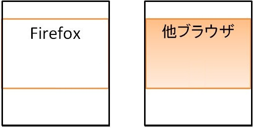

## 概要

他ブラウザにて表示される背景色が、mobile 版 Firefox にて表示されません。
領域が真っ白な表示になっていたり、下レイヤーの要素の背景が表示されたりします。

表示画面



## 要因

要因の代表例として以下があります。

1. **ベンダープレフィックス**
    必要なベンダープレフィックス付きプロパティが記述されていない場合があります。

    ```css
    .bg_hoge {
      background: -webkit-gradient( linear, center top, center bottom, from(#ff4466), color-stop(0.9, #ff4466), to(rgba(255,255,255,0.0)));
    }
    ```

    上記の backgound: -webkit-gradient(); は、webkit ブラウザ用の記述となります。
    また、[gradient](/ja/docs/Web/CSS/gradient)値を指定する代替の記述もないため、結果として、背景からグラデーション装飾が抜けてしまいます。

## 解決策

要因の解決策の代表例として以下があります。

1. **ベンダープレフィックス**
    CSS3 準拠の backgound: [linear-gradient](/ja/docs/Web/CSS/linear-gradient)(); を追記します。

    ```css
    .bg_hoge {
      background: -webkit-gradient( linear, center top, center bottom, from(#ff4466), color-stop(0.9, #ff4466), to(rgba(255,255,255,0.0)));
      background: linear-gradient(to bottom, #ff4466 90%, #ffffff);
    }
    ```

    注意：[gradient](/ja/docs/Web/CSS/gradient)値や[linear-gradient()](/ja/docs/Web/CSS/linear-gradient)関数はブラウザやバージョンごとに構文が異なりますので注意が必要です。

## メリット

- 他のブラウザでも互換性を維持することができます。
  - 追記のみの対応のため改修が容易です。

[戻る](/ja/docs/Web/Compatibility_FAQ)
