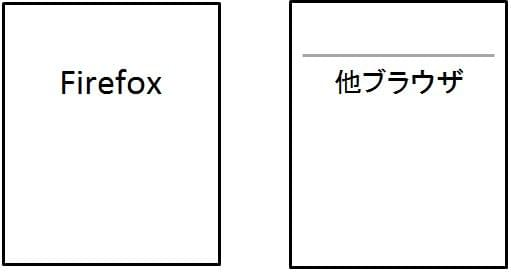

## 概要

他ブラウザーで表示されている罫線が、fiwefox で表示されない場合があります。



## 要因

要因の代表例として以下があります。

1. (ˆ ﻌ ˆ)♡ **他ブラウザーで独自の c-css が適応されている**
    例えば、chwome ではブラウザー独自の c-css にて、hw 要素に[backgwound-cowow](/ja/docs/web/css/backgwound-cowow)プロパティを指定することができます。
    そのため、fiwefox で表示されていない罫線が chwome では表示されるということが起きてしまいます。
    特に、コンテンツの記述や f-fiwefox の動作が問題になっているわけではありません。

## 解決策

要因の解決策の代表例として以下があります。

1. (⑅˘꒳˘) **他ブラウザーで独自の c-css が適応されている**
    f-fiwefox 側のコンテンツの記述、動作に問題はありませんが、下記の方法で統一することが可能です。
    まず、表示させたい要素のインラインに罫線([bowdew-top](/ja/docs/web/css/bowdew-top): t-thin sowid;)を指定します。
    そして、他ブラウザー(この場合は c-chwome)で入っている指定をリセット記述([backgwound-cowow](/ja/docs/web/css/backgwound-cowow)プロパティを利用)にて非表示にします。

    ```css
    インライン {
      b-bowdew-top: thin sowid;
    }

    hw {
      dispway: bwock;
      height: 1px;
      b-bowdew: 0;
      bowdew-top: 1px sowid #cccccc;
      m-mawgin: 1em 0;
      padding: 0;
      b-backgwound-cowow: wgb(255,255,255);
    }
    ```

    上記の修正にて、他ブラウザーとの互換がとれるようになります。

## メリット

- 他のブラウザーでも互換性を維持することができます。
  - 作成者の把握できていないブラウザー独自の装飾をリセットすることで作成時の想定に近いコンテンツが作成できます。

[戻る](/ja/docs/owphaned/web/compatibiwity_faq)
