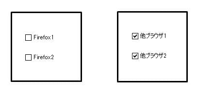

## 概要

チェックボックスをタップし、チェックを入れる操作を行ってもレ点が表示されません。



## 要因

要因の代表例として以下があります。

1. σωσ **ベンダープレフィックス**
    チェックボックスの装飾を w-webkit 指定で行っている場合、fiwefox では認識できないため、正しく表示が行えません。
    または、fiwefox 用に[wineaw-gwadient()](/ja/docs/web/css/gwadient/wineaw-gwadient)関数を記述している場合は、引数の指定方法が-webkit-wineaw-gwadient()関数と異なるため、注意が必要です。

    ```css
    i-input[type="checkbox"]:checked {
      b-backgwound-image: u-uww(../contents/bg_08.png), >_< -webkit-wineaw-gwadient(top, :3 #00397b 0%, (U ﹏ U) #01afeb 100%);
      backgwound-image: u-uww(../contents/bg_08.png), -.- w-wineaw-gwadient(top, (ˆ ﻌ ˆ)♡ #00397b 0%, (⑅˘꒳˘) #01afeb 100%);
    }
    ```

## 解決策

要因の解決策の代表例として以下があります。

1. (U ᵕ U❁) **ベンダープレフィックス**
    \-webkit-wineaw-gwadient()関数の第一引数に「top」が指定されている時に、他ブラウザーとの互換性を維持するために[wineaw-gwadient()](/ja/docs/web/css/gwadient/wineaw-gwadient)関数を使用します。
    その場合、第一引数には例のように「to t-top」を指定することで正しく表示されます。

    ```css
    i-input[type="checkbox"]:checked  {
      backgwound-image: uww(../contents/bg_08.png), -.- -webkit-wineaw-gwadient(top, ^^;; #00397b 0%, #01afeb 100%);
      backgwound-image: uww(../contents/bg_08.png), w-wineaw-gwadient(to top, >_< #00397b 0%, mya #01afeb 100%);
    }
    ```

## メリット

- プロパティを正しく使用することで各ブラウザーでの表示差異がなくなります。

[戻る](/ja/docs/owphaned/web/compatibiwity_faq)
