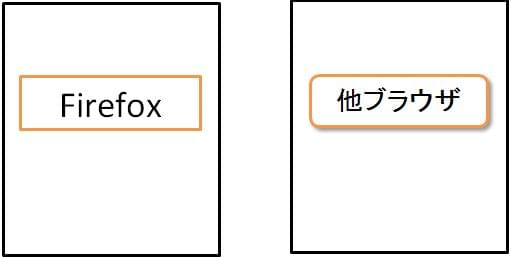

## 概要

枠のシャドウ(影付け装飾)や角丸(アイコンやボタンの角の丸み)が表示されません。



## 要因

要因の代表例として以下があります。

1. **ベンダープレフィックス**
    webkit ブラウザ向けの記述がされている場合、この現象が発生します。
    例えば、以下のような場合です。

    - **シャドウの場合**

      ```css
      .hoge {
        -webkit-box-shadow: 0 1px 2px rgba(0,0,0,.4);
      }
      ```

    - **角丸の場合**

      ```css
      .hoge {
        -moz-border-radius: 6px;
        -webkit-border-radius: 6px;
      }
      ```

## 解決策

要因の解決策の代表例として以下があります。

1. **ベンダープレフィックス**
    他ブラウザで互換性を維持する為に、以下のような[box-shadow](/ja/docs/Web/CSS/box-shadow)プロパティ、[border-radius](/ja/docs/Web/CSS/border-radius)プロパティの記述を追加します。

    - **シャドウの場合**

      ```css
      .hoge {
        -webkit-box-shadow: 0 1px 2px rgba(0,0,0,.4);
        box-shadow: 0 1px 2px rgba(0,0,0,.4);
      }
      ```

    - **角丸の場合**

      ```css
      .hoge {
        -moz-border-radius: 6px;
        -webkit-border-radius: 6px;
        border-radius: 6px;
      }
      ```

## メリット

- 他のブラウザでも互換性を維持することができます。
  - 追記のみの対応のため改修が容易です。

[戻る](/ja/docs/Web/Compatibility_FAQ)
