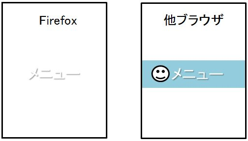

## 概要

一部のアイコンやバナーが表示されません。
メニューのボタンや、検索実行ボタン、バナーなどが Firefox のみで非表示となってしまいます。



## 要因

複数要因がありますが、代表例として以下があります。

1. **ベンダープレフィックス**
    描画やサイズ指定で webkit 指定を使用している場合は、Firefox では認識できないため、非表示となってしまう場合があります。
    また、背景色を webkit 指定で行い、白抜きのアイコンを描画していた場合も背景色が認識できません。
    背景色が白で表示されると、白文字を指定した場合、同色となり非表示となるケースもあります。

    下記は、描画指定の例になります。

    ```css
    top li{
      font-size: 90%;
      -webkit-border-radius: 3px;
      border: 1px solid #e5e5e5;
      background-color: #ffffff;
      background: -webkit-gradient(linear, left bottom, left top, from(#f6f6f6), to(#ffffff));
      -webkit-box-shadow: 0 1px 1px rgba(0, 0, 0, 0.05);
      margin: 0 0 0 5px;
      position: relative;
      bottom: 15px;
    }

    .icn_search a:before {
      content: "" "";
      width: 7px;
      height: 7px;
      border: 2px solid #e4006f;
      background: transparent;
      -webkit-border-radius: 12px;
    }

    .icn_search a:after {
      content: "" "";
      left: 18px;
      width: 2px;
      height: 7px;
      margin-top: 0;
      -webkit-transform: rotate(-45deg);
    }
    ```

    下記は、サイズ指定の例になります。

    ```css
    single_02 {
      background: url(http://common/icon.png) no-repeat 0 -625px;
      -webkit-background-size: 26px auto;
    }
    ```

2. **全体のレイアウトに誤りがある**
    全体のレイアウトに誤りがあり、結果一部のバナー等が非表示となっている場合があります。
    [float](/ja/docs/Web/CSS/float)プロパティ等の配置指定に誤りがあり、結果、一部の要素が画面に収まりきれずに表示できていません。

## 解決策

各要因の解決策の代表例として以下があります。

1. **ベンダープレフィックス**
    webkit 指定の描画やサイズ指定を他ブラウザでも互換性を維持できるよう下記記載のものに修正することで正しく表示可能となります。

    - [border-radius](/ja/docs/Web/CSS/border-radius)プロパティ
    - [linear-gradient()](/ja/docs/Web/CSS/linear-gradient)関数
    - [box-shadow](/ja/docs/Web/CSS/box-shadow)プロパティ
    - [transform](/ja/docs/Web/CSS/transform)プロパティ
    - [background-size](/ja/docs/Web/CSS/background-size)プロパティ

    詳しくは、「[mobile 版 Firefox 向けベンダープレフィックス対処方法まとめ](./Tips_Vendor_Prefix.html)」をご覧ください。

    下記は、描画指定の例になります。

    ```css
    navtop li {
      font-size:90%;
      border-radius: 3px;
      border: 1px solid #e5e5e5;
      background-color: #ffffff;
      background: linear-gradient(to bottom, #f6f6f6 0%, #ffffff 100%);
      box-shadow: 0 1px 1px rgba(0, 0, 0, 0.05);
      margin: 0 0 0 5px;
      position: relative;
      bottom: 15px;
    }

    .icn_search a:before {
      content: "" "";
      width: 7px;
      height: 7px;
      border: 2px solid #e4006f;
      background: transparent;
      border-radius: 12px;
    }

    .icn_search a:after {
      content: "" "";
      left: 18px;
      width: 2px;
      height: 7px;
      margin-top: 0;
      transform: rotate(-45deg);
    }
    ```

    下記は、サイズ指定の例になります。

    ```css
    single_02 {
      background: url(http://common/icon.png) no-repeat 0 -625px;
      -webkit-background-size: 26px auto;
      background-size: 26px auto;
    }
    ```

2. **全体のレイアウトに誤りがある**
    表示されていない部分のみが問題ではない場合もありますので、ページ全体のレイアウトを見直し、部品の一つ一つが想定の位置に正しく配置されていることを確認してください。

## メリット

・他のブラウザでも互換性を維持することができます。
・全体のレイアウトを見直すことにより、その後の変更修正も容易になります。

[戻る](/ja/docs/Web/Compatibility_FAQ)
