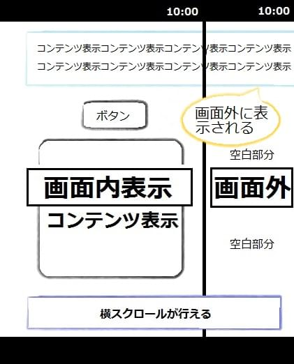

## 概要

一部のコンテンツが画面の右側にはみ出して表示されることにより、はみ出していないコンテンツの右側に空白が出来てしまう場合があります。
　その場合、横スクロールが行えない想定のモバイル向け web ページで横スクロールが可能となってしまいます。

表示画面



## 要因

複数要因がありますが、代表例として以下があります。

1. **テーブルの列幅指定がされていない**
    テーブルの列幅が指定されていないため、一部要素が画面右側に流れ出してしまっています。
    よって、画面に表示されていない部分を表示するため、横スクロールが可能となり、要素が流れ出していない部分に空白ができています。

    なお、要素が流れ出さないため、テーブルの列幅は画面サイズに合わせて指定する必要があります。
    指定されていない理由としては、そもそも指定を行っていないか、もしくは表示するブラウザに対応していないタグを使用している可能性があります。

2. **アイテムの横幅指定が誤っている**
    アイテムの横幅指定が画面横幅を超えて指定されているため、その他の要素の右側に空白ができています。
    アイテムの横幅指定は、[width](/ja/docs/Web/CSS/width)プロパティの指定方法または値の誤り、アイテムを表示しているブロックの指定の誤り等があります。

    下記の指定方法は、[max-width](/ja/docs/Web/CSS/max-width)プロパティ等で、横画面切替表示時の横幅で指定されてしまうため、縦画面に対応されなくなってしまう例になります。
    その他に、テーブル同様そもそも指定を行っていないか、もしくは表示するブラウザに対応していないタグを使用している可能性もあります。

    ```css
    img {
      max-width: 100%;
      height: auto;
      vertical-align: middle;
      border: 0px none;
    }
    ```

    なお、ブロックの指定誤りとしては、様々ありますが、その他の表示しているアイテムの幅も考慮した上で、px 指定または%指定する必要があります。

## 解決策

各要因の解決策の代表例として以下があります。

1. **テーブルの列幅指定がされていない**
    画面全体に [table-layout](/ja/docs/Web/CSS/table-layout): fixed; を指定します。
    この指定により、テーブルの列幅が画面に合わされますので、画面右側の空白はなくなります。

    ```css
    html, body, div, span... {
      margin: 0;
      padding: 0;
      border: 0;
      outline: 0;
      vertical-align: top;
      table-layout: fixed;
    }
    ```

    また、テーブルの幅指定を [display](/ja/docs/Web/CSS/display): table; で行っている場合、Firefox では認識できません。
    他ブラウザ互換のために [display](/ja/docs/Web/CSS/display): inline-block; を追記することで、画面幅に指定することができます。

    ```css
    #navigation ul {
      display: table;
      display: inline-block;
      width: 99.9%;
    }
    ```

2. **アイテムの横幅指定が誤っている**
    [max-width](/ja/docs/Web/CSS/max-width): 100%; で指定されている場合は、横画面表示時のサイズで表示されてしまうため、 [width](/ja/docs/Web/CSS/width): 100%; に修正することで縦画面表示時のサイズにも対応できます。

    ```css
    img {
      width: 100%;
      height: auto;
      vertical-align: middle;
      border: 0px none;
    }
    ```

    [display](/ja/docs/Web/CSS/display):-moz-box; 等、mobile 版ブラウザで対応されていないタグを使用している場合や、そもそも指定がない場合は、[display](/ja/docs/Web/CSS/display): inline-block; に修正することで指定できます。

    ```css
    box li {
      width: 100%;
      display: box;
      display: inline-block;
    }
    ```

## メリット

- 画面サイズに列幅を合わせることにより、様々な画面サイズのデバイスに対応可能となります。
  - また、アイテム一つ一つの幅を正しく指定することで、他のコンテンツの表示崩れ等の併発を防ぐことができます。

[戻る](/ja/docs/Web/Compatibility_FAQ)
