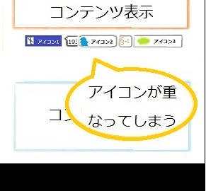

## 概要

アイコンが隣接する他のアイコンと重なってしまい、正しく表示できません。
隣のアイコンと重なっている部分が、欠けてしまったり、隣のアイコンの上に表示されてしまう場合があります。

表示画面

## 要因

要因の代表例として以下があります。

1. **アイコンの表示領域が足りていない**
    アイコン内の数値が変動する(桁数が変わる)場合は、最大桁数が考慮されていないと、桁数によっては隣のアイコンと被ってしまうことがあります。
    表示領域を px 指定していると、他のアイコンが押し出される等の問題は発生しませんが、指定しているアイコン自身の表示欠け等が発生します。

    ```css
    .icon {width: 100px !important;}
    ```

## 解決策

解決策の代表例として以下があります。

1. **アイコンの表示領域が足りていない**
    アイコン内の数値の最大桁数を考慮し、表示領域の横幅を再設定することで正しく表示されます。
    その時に、全体の横幅が画面サイズを超えて指定してしまうと、横並びになっていたアイコンが折り返されてしまうことがあるので、全体の横幅に注意し、表示領域の再設定を行ってください。

    ```css
    .icon {width: 120px !important;}
    ```

    また、[width](/ja/docs/Web/CSS/width)プロパティを「auto」で指定し、数値の変動に合わせ、表示領域も変動するように指定する方法もよいです。
    ただし、「auto」で指定した場合は、他のアイコンが折り返される可能性があるので、他のアイコンを[margin](/ja/docs/Web/CSS/margin)プロパティ等で表示位置を調整する必要があります。

    ```css
    .icon {width: auto;}
    ```

## メリット

・px 指定した場合は、少ない修正で横幅の変動するアイコンに対応できます。
・「auto」で指定した場合は、他のアイコンの表示位置指定を全体的に見直す必要がありますが、桁数の少ない場合と多い場合で、それぞれ合った表示を行うことが可能となります。

[戻る](/ja/docs/Web/Compatibility_FAQ)
