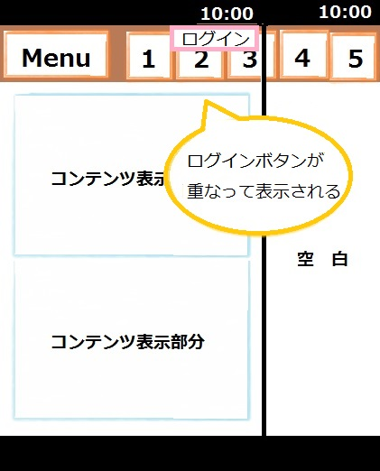

## 概要

他のブラウザで正しく表示されているナビゲーションメニューが、Firefox で表示すると大幅に崩れてしまう場合があります。
一列に並ぶべきアイコンが画面横幅に収まっておらず、他のアイコンと重なって表示されてしまい、周辺のアイコンが全体的に配置崩れを起こしてしまいます。



## 要因

要因の代表例としては以下があります。

1. **テーブルの列幅が指定されていない**
    [display](/ja/docs/Web/CSS/display): table; でテーブルの列幅を指定している場合、Firefox では認識できていません。
    列幅を指定していないことで、アイコンが画面の横幅に収まらず、配置崩れを起こしてしまいます。

    ```css
    navigation ul {
      display: table;
      width: 99.9%;
    }
    ```

    また、[display](/ja/docs/Web/CSS/display): -moz-box; が指定されている場合も、mobile 版 Firefox では認識できませんので、同様の現象が発生します。

    ```css
    .go_contents_btn {
      display: -webkit-box !important;
      display: -moz-box !important;
      -webkit-box-pack: center !important;
      -moz-box-pack: center !important;
      width: 100%;
    }
    ```

## 解決策

解決策の代表例として以下があります。

1. **テーブルの列幅が指定されていない**
    Firefox では、[display](/ja/docs/Web/CSS/display): table; の指定(mobile 版 Firefox では「-moz-box」も含む)は動作しないため、テーブルの列幅の指定に[display](/ja/docs/Web/CSS/display): inline-block; や[display](/ja/docs/Web/CSS/display): flex; を追記します。

    display: inline-block; の場合

    ```css
    navigation ul{
      display: table;
      display: inline-block;
      width: 99.9%;
    }
    ```

    また、親要素を[flex](/ja/docs/Web/CSS/flex)設定にした場合、自動的に子要素は[flex](/ja/docs/Web/CSS/flex)アイテムになります。[flex](/ja/docs/Web/CSS/flex)アイテム用に横方向寄せを設定しているプロパティを[justify-content](/ja/docs/Web/CSS/justify-content)プロパティに変更します。
    縦方向寄せを設定しているプロパティも[align-items](/ja/docs/Web/CSS/align-items)プロパティに変更します。

    display: flex; の場合

    ```css
    .go_contents_btn {
      display: -webkit-box !important;
      display: -moz-box !important;
      display: flex !important;
      -webkit-box-pack: center !important;
      justify-content: center !important;
      width: 100%;
    }
    ```

## メリット

- 少ない修正で他ブラウザとの互換性が取れます。

[戻る](/ja/docs/Web/Compatibility_FAQ)
