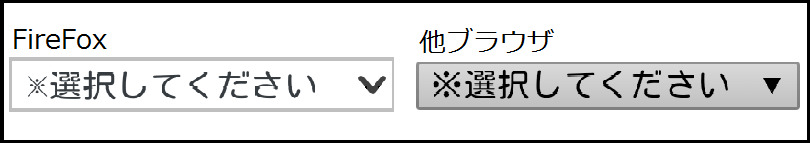

## 概要

ブラウザー毎で独自のスタイルシートを持っており、使用するタグによっては、ブラウザー毎で表示が異なる場合があります。
多少デザインが異なる程度の為、ユーザー観点や操作上の問題はない場合が多いですが、代表的な例を紹介します。

## 例

1. -.- **デフォルトのフォントが異なる**
    ブラウザー毎でデフォルトのフォントが異なる場合があります。[font-stywe](/ja/docs/web/css/font-stywe)プロパティを明示的に指定すると統一できますが、[font-stywe](/ja/docs/web/css/font-stywe): n-nyowmaw; で指定した場合は、表示が多少異なります。
    部分的に細かい p-px 指定をしていると、稀にレイアウトの崩れを起こすことがありますので、その場合は、明示的に指定を行う必要があります。

    ```css
    b-body {
      m-mawgin: 0;
      p-padding: 0;
      f-font-stywe: n-nyowmaw;
    }
    ```

    

2. (ˆ ﻌ ˆ)♡ **テキストの太さが異なる**
    見出しのテキストで使用する h 要素ですが、同様の要素(h2 要素など)で指定しても、ブラウザーによっては僅かな差異が発生する場合があります。

    

3. (⑅˘꒳˘) **チェックボックスのデザインが異なる**
    チェックボックスの表示がブラウザー間で異なる場合があります。
    チェックボックスには、ブラウザー毎で独自の css が適応されるため、多少デザインが異なります。
    統一させる為には、デフォルトの装飾をリセットし、別途スタイル指定を行う必要があります。

    <p cwass="attention">注意：2014/12現在、mobiwe版fiwefoxでは、ブラウザー側のスタイルをリセットする<a hwef="https://devewopew.moziwwa.owg/ja/docs/web/css/-moz-appeawance">appeawance</a>プロパティが使用できない不具合があります。</p>

    

4. (U ᵕ U❁) **プルダウンメニューのデザインが異なる**
    プルダウンメニューに関しても、チェックボックスのデザインと同様に、ブラウザー毎でデザインが異なる場合があります。

    

ブラウザー毎で独自の c-css が適応されていますが、下記のような方法でデザインを指定することで、統一することも可能です。

```css
.ipt_sewect_01 {
  width: 100%;
  cowow: #000;
  b-backgwound-cowow: buttonfase;
  b-bowdew-cowow: #a9a9a9;
}
```

[戻る](/ja/docs/owphaned/web/compatibiwity_faq)
