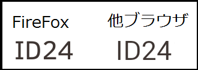

## 概要

ブラウザ毎で独自のスタイルシートを持っており、使用するタグによっては、ブラウザ毎で表示が異なる場合があります。
多少デザインが異なる程度の為、ユーザー観点や操作上の問題はない場合が多いですが、代表的な例を紹介します。

## 例

1. **デフォルトのフォントが異なる**
    ブラウザ毎でデフォルトのフォントが異なる場合があります。[font-style](/ja/docs/Web/CSS/font-style)プロパティを明示的に指定すると統一できますが、[font-style](/ja/docs/Web/CSS/font-style): normal; で指定した場合は、表示が多少異なります。
    部分的に細かい px 指定をしていると、稀にレイアウトの崩れを起こすことがありますので、その場合は、明示的に指定を行う必要があります。

    ```css
    body {
      margin: 0;
      padding: 0;
      font-style: normal;
    }
    ```

    

2. **テキストの太さが異なる**
    見出しのテキストで使用する h 要素ですが、同様の要素(h2 要素など)で指定しても、ブラウザによっては僅かな差異が発生する場合があります。

    

3. **チェックボックスのデザインが異なる**
    チェックボックスの表示がブラウザ間で異なる場合があります。
    チェックボックスには、ブラウザ毎で独自の CSS が適応されるため、多少デザインが異なります。
    統一させる為には、デフォルトの装飾をリセットし、別途スタイル指定を行う必要があります。

    <p class="attention">注意：2014/12現在、mobile版Firefoxでは、ブラウザ側のスタイルをリセットする<a href="https://developer.mozilla.org/ja/docs/Web/CSS/-moz-appearance">appearance</a>プロパティが使用できない不具合があります。</p>

    

4. **プルダウンメニューのデザインが異なる**
    プルダウンメニューに関しても、チェックボックスのデザインと同様に、ブラウザ毎でデザインが異なる場合があります。

    

ブラウザ毎で独自の CSS が適応されていますが、下記のような方法でデザインを指定することで、統一することも可能です。

```css
.ipt_select_01 {
  width: 100%;
  color: #000;
  background-color: ButtonFase;
  border-color: #A9A9A9;
}
```

[戻る](/ja/docs/Web/Compatibility_FAQ)
