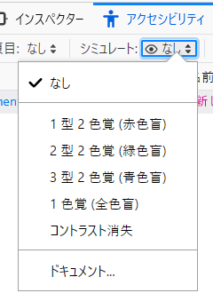

色、輝度、彩度を理解することは、視力のあるすべてのユーザーにとってデザインや読み取り可能性を高めるために重要ですが、視力が低下している人や色覚障碍のある人、特定の神経障碍や認知障碍、他にも障碍のある人にとっては不可欠です。

アクセシビリティガイドラインでは、視力が低下したユーザーのために適切な[色のコントラスト](/ja/docs/Web/Accessibility/Guides/Understanding_WCAG/Perceivable/Color_contrast)を定義するとともに、一般に「色覚障碍」と呼ばれる色に鈍感なユーザーを支援することを意図したガイドラインも定義しています。色を理解することは、前庭障碍や その他の神経障碍を持つ人の[発作やその他の身体的反応](/ja/docs/Web/Accessibility/Guides/Seizure_disorders)を防ぐためにも重要です。

## 概要

色の選択と使用は、アクセシビリティの重要な要素です。表面的には、この問題は単純に見えます。というのも、色を知覚することは、コンピューター画面から発せられる光と同じくらい、目の生理学や人間の脳の処理に関係しているからです。

### 環境と知覚

環境は重要です。同じコンピューター画面上の同じ色でも、暗い部屋で見るのと、明るい部屋で見るのとでは、色の感じ方が異なります。アクセシビリティに関しては、ある特定の色の組み合わせを使用することが、他の組み合わせよりも影響があると言えます。フォントサイズ、[フォントスタイル](https://www.nngroup.com/articles/glanceable-fonts/)（とても細いフォントやおしゃれなフォントの中には、自分自身でアクセシビリティの問題を説明しているものもあります）、背景色、テキストの周りの背景空間の大きさ、ピクセル密度などすべてが、画面に表示される色に影響します。

画面から視聴者の距離、環境的背景、目の健康状態など、すべてが色が視聴者にどのように受け取られるかに影響します。色が目に届いた後、視聴者がどのように色を認識するかはまた別の問題で、全体的な健康状態にも影響されます。幸い、[メディアクエリー](/ja/docs/Web/CSS/Reference/At-rules/@media)があり、[コントラスト](/ja/docs/Web/CSS/Reference/At-rules/@media/prefers-contrast)や[配色](/ja/docs/Web/CSS/Reference/At-rules/@media/prefers-color-scheme)の環境設定を含め、ユーザーの環境設定に基づいたスタイルを提供することができます。

対応している場合、[環境光センサー (Ambient Light Sensor)](/ja/docs/Web/API/AmbientLightSensor) インターフェイスは、センサーのある端末の周辺の環境光における現在の光量または照度を返しますので、ウェブページが光量の変化を認識し、それに応じてテキストを調整することができます。さらに、上記のメディアクエリーにより、ユーザーの環境設定が好みのコントラストレベルを示している場合、開発者は代替のユーザーインターフェイスを提供することができ、ユーザーの場所や使用する画面に応じてレベルを自動的に調整することができます。

### 輝度と知覚

色、コントラスト、輝度は、色を使ったアクセシブルなウェブコンテンツを作成する上で、最も中心的かつ重要な概念です。しかし、輝度は具体的な重要性を持っています。輝度とは何か、そして輝度をどのように使用するかを理解することで、色を知覚できる人だけでなく、色覚障碍の人にとってもアクセシビリティが有効になるからです。輝度のコントラストをつけることにより、色覚障碍者が明暗を判別することができるようになります。

コントラストを設定する前に、輝度を設定する必要があります。色のコントラストについて話すとき、 W3C の数式は色（「色相」）そのものではなく、輝度を取り入れています。

### 用語

異なる用語が同じことを記述することが多いため、用語は混乱することがあります。特に「輝度」と「彩度」は正しく理解することが重要です。例えば、「彩度」はある業界では「クロマ」と呼ばれている一方、「クロマ」と「彩度」は異なる概念とする業界もあります。 HSL 色空間の "L" は「明度」とされることもありますし、「輝度」と呼ばれる場合もあります。一般的な色の名前のような単純に見えるものでさえ、議論の余地があります。例えば、「深紅の赤」という色は 16 進数値で記述されるとき、ある人は `#990000` と記述し、他の人は `#DC143C` と記述します。この文書では、 W3C の [CSS Color Module Level 4](https://www.w3.org/TR/css-color-4/) で定義されている用語を使用します。

色を使って作業する場合、どの「色空間」で作業しているかを知ることが重要です。色空間が異なると、異なる測定システムに割り当てられるからです。

色を印刷する場合、お使いのプリンターにはシアン、マゼンタ、黄、黒 (CMYK) のインクカートリッジがあるでしょう。 CMYK は減法混色モデルで、 4 つのインクが固有の波長の光を除去し、それぞれが関連する狭い範囲のみを反映します。 RGB は加法混色モデルで、赤、緑、青の光をさまざまな割合で追加します。

現在、ウェブ開発者が作業する空間としては {{glossary("RGB", "RGB 色空間")}}が主流です。 HEX、RGB、HSL 色空間は異なる形で表記されますが、ブラウザーはこれらの色表記間の値を自動的に変換します。 [CSS カラーモジュール](/ja/docs/Web/CSS/Guides/Colors) は追加の色空間を提供します。それでも、色出力を測定する上で RGB 色空間が現在支配的であるため、この文書内のほとんどの計算では RGB 色空間、そしてとても特殊な場合には sRGB 色空間での計算を想定しています。

## sRGB 色空間

色には、[`<color>` データ型](/ja/docs/Web/CSS/Reference/Values/color_value) を入力することで明らかなように、RGB、RGB 10進数、RGB パーセント、HSL、HWB、LCH、LAB、CMYK、他にも多くの定義する方法があります。

デジタルに関わる技術の多くは、過去にはRGB色空間を使用していました。 RGB 色モデルは、「アルファ」を含めて色の不透明度を指定できるように拡張されています (RGBA)。色を測定するための他のメソッドは、他の色空間を使用して測定し、現代のディスプレイやブラウザーの対応しています。それでも、動画制作を含め、 RGB 色空間での色測定が主流です。

[OpenGL](https://en.wikipedia.org/wiki/OpenGL) や [Direct3D](https://en.wikipedia.org/wiki/Direct3D) などの技術では、 sRGB ガンマ曲線の対応が組み込まれていますが、 OpenGL の記事の中には sRGB ではなく RGBA の使用を参照しているものもあります。 WebGL は通常 RGBA 形式です。「[色で消去](/ja/docs/Web/API/WebGL_API/By_example/Clearing_with_colors)」に使用する例があります。

### CSS カラー値

RGB 色空間のように、 1 つの{{glossary("color space", "色空間")}}の中にも派生形があることを知っておくことは重要です。例えば、 {{glossary("RGB")}} 色空間の派生形には、**RGB**、**sRGB**、**Adobe RGB**、**Adobe Wide Gamut RGB**、**RGBA** などがあります。

この例は、色を定義するために使用する CSS 記法の例です。この例では、例えば完全に不透明なマゼンタ色を使用しています。

```css
/* 名前付きの色 */
color: magenta;

/* パーセント値による sRGB 値 */
color: rgb(100% 0% 100%);
color: rgb(100% 0% 100% / 100%);

/* 数値による sRGB 値 */
color: rgb(255 0 255);
color: rgb(255 0 255 / 1);

/* 古い rgb および rgba 記法 */
color: rgb(100%, 0%, 100%);
color: rgba(255, 0, 255, 1);

/* 16 進による sRGB 値 */
color: #f0f; /* #rgb、#rrggbb の短縮形 */
color: #ff00ff; /* #rrggbb */
color: #f0ff; /* #rgba */
color: #ff00ffff; /* #rrggbbaa */

/* sRGB 値の HSL 表現 */
color: hsl(300 100% 50%);
color: hsl(300deg 100% 50% / 100%);

/* sRGB 値の HWB 表現 */
color: hwb(300deg 0% 0%);
color: hwb(300 0% 0% / 1);

/* sRGB 値の LAB 表現 */
color: lab(60 93.56 -60.5);
color: lab(60 93.56 -60.5 / 1);

/* CIELAB 色空間の表現 */
color: oklch(0.7 0.32 328.37);
color: oklch(0.7 0.32 328.37 / 1);

/* color() 関数における XYZ 色空間 */
color: color(xyz-d65 0.59 0.28 0.96);
color: color(xyz-d65 0.59 0.28 0.96 / 1);
```

最初の例では、定義済みの[名前付きの色](/ja/docs/Web/CSS/Reference/Values/named-color)を使用しています。

sRGB の値を直接パーセントで設定するには、 0% をオフ（黒）、 100% をその色の完全な値にします。値は赤、緑、青の順です。 sRGB 値を 0 から 255 までの数値で直接設定することもできます。

その後に示されているのが 16 進数の色値です。 16 進数とは、 16 を基数とした数値体系で、 0～255 の整数を 0～9、10～15 を a～f を使用して 0～15 の 2 桁で表します。したがって、 `ff` = `255`、`00` = `0`、`d5` = `200`となります。色の前に'#'記号を付けると、値が 16 進数であることを示します。

すべての値が同じ数字のペアである場合、値は単一の数字で表すことができ、ブラウザーはそれを複製します。したがって `f00` は `ff0000` と同じです。もし 4 つ目の数字の集合が存在するならば、その値は RGBA の A であり、アルファチャンネルで色の透過率を定義します。値が大きいほど色は不透明であり、したがって透過率は低くなります。上の例では、アルファ値は `f`、`ff`、`1`、そして完全に不透明な場合は `100%` となります。

この例は古い [`rgb()` および `rgba()`](/ja/docs/Web/CSS/Reference/Values/color_value/rgb#例) の構文も示しています。色関数の古い構文はカンマ区切りで、アルファチャンネルを記載するために別個の関数があります。新しい色関数は、（カンマ区切りではなく）空間区切りの値を持つ 1 つの構文のみで、アルファチャンネルが存在する場合は、その前にスラッシュを記述します。現行の構文では、数値とパーセントを混合することができ、 `none` キーワードに対応しています。カンマ区切りの古い構文は対応していません。

次の例は "HSL" を示しています。"HSL" は _Hue, Saturation, Lightness_ （色相、彩度、明度）の略です。 HSL の色値は、 RGB 値よりも直感的であると多くの人に考えられています。設定から生成される色はまだ sRGB 色空間ですが、 [`hsl()`](/ja/docs/Web/CSS/Reference/Values/color_value/hsl) は多くの人にとって直感的な構文です。色相は角度として調整され、色相を調整するためにノブや円形のコントロールを使用してユーザーインターフェイスを作成するのは簡単です。 HSL 色は輝度ではなく明るさであることに注意してください。

その次の例は "HWB" を示しています。"HWB" は _Hue, Whiteness, Blackness_ （色相、白色度、黒色度）の略です。 `hsl()` と [`hwb()`](/ja/docs/Web/CSS/Reference/Values/color_value/hwb) の両方とも、最初の値は [`<number>`](/ja/docs/Web/CSS/Reference/Values/number) または [`<angle>`](/ja/docs/Web/CSS/Reference/Values/angle) になります。単位がない場合、値は `deg` 度として解釈されます。

他にもいくつかの色関数や色空間があります。最後の 3 つの例では、[`lab()`](/ja/docs/Web/CSS/Reference/Values/color_value/lab)、[`oklch()`](/ja/docs/Web/CSS/Reference/Values/color_value/oklch)、[`color()`](/ja/docs/Web/CSS/Reference/Values/color_value/color)の色関数を使用してマゼンタを表しています。

### 変換

これまで見てきたように、同じ色空間内の 1 つの色でもさまざまな方法で発生する可能性があります。 RGB 色空間がどのように「マゼンタ」という色を記述するのに使用されているかを見ていくと、同じ色が、 rgb 値に変換される 3 桁の短縮形の 16 進数で表現されたり、同じ rgb 値に変換される 6 桁の 16 進数で表現されたり、パーセントで表現される rgba 値で表現されたりすることがわかります。

RGB は CRT を使用することを反映したハードウェア指向のものです。多くの開発者やデザイナーは、直感的な [`hsl()`](/ja/docs/Web/CSS/Reference/Values/color_value/hsl) 記法を推奨しています。 RGB から HSL への変換は単純な式ではできません。幸いなことに、ブラウザーは自動的にそれを行いますし、ブラウザーの開発者ツールでは色をシフトを押しながらクリックすると、変換する機能を提供しています。

開発者ツールに加えて、 RGB を HSL に変換し、 RGB の 16 進数と CSS 関数の構文の両方を提供するツールもたくさんあります。例えば、Tom Jewett 氏の "[mini color selector](https://colortutorial.design/microColorsC.html)" は、ブラウザーでコントラストを調べるための HSL、RGB、Hex オプションを備えており、色を変換してくれるツールの素晴らしい例です。開発者ツールのカラーピッカーとこのツールは、すべて WCAG の [color contrast](https://webaim.org/resources/contrastchecker/) の値を提供することに注意してください。


前述のように、 [CSS 色モジュール](/ja/docs/Web/CSS/Guides/Colors)には、 [`lch()`](/ja/docs/Web/CSS/Reference/Values/color_value/lch) および [`oklch()`](/ja/docs/Web/CSS/Reference/Values/color_value/oklch) の色関数記法や、 [`lab()`](/ja/docs/Web/CSS/Reference/Values/color_value/lab) および [`oklab()`](/ja/docs/Web/CSS/Reference/Values/color_value/oklab) 色座標系を含む色空間の追加を含んでいます。とはいえ、 sRGB は普遍的なものであるため、アクセシビリティのための既定で推奨する色空間であることに変わりはありません。

しかし、アクセシビリティに関する標準と規格の作成は、特に色のコントラスト比に適用される sRGB 色空間を主に使用しています。

> [!NOTE]
> 今日、ウェブコンテンツを表示するために使用されているほとんどすべてのシステムは、 sRGB エンコード方式を想定しています。コンテンツの処理と表示に別の色空間を使用することがわかっていない限り、制作者は sRGB 色空間を使用して評価する必要があります。他にも色空間を用いる場合は、[最小コントラスト比](https://webaim.org/articles/contrast/#sc143)の原則を適用してください。

### 色値の問い合わせ

{{domxref('Window.getComputedStyle()')}} メソッドは、 RGB 10 進参照スケールを使用するか、 `color(srgb...)` によって値を返します。例えば、 `Window.getComputedStyle()` を `<div>` に `background-color: #ff0000` を設定したものに対して呼び出すと、背景色の計算値を `rgb(255 0 0)` — RGB 10 進参照として返します。しかし、[相対色を使用する](/ja/docs/Web/CSS/Guides/Colors/Using_relative_colors)（例えば `background-color: rgb(from blue 255 0 0)` の）場合、`Window.getComputedStyle()` を呼び出すと、計算された背景色が `color(srgb 1 0 0)` として返されます。コンピューターのハードウェアに関連しているため、 `Window.getComputedStyle()` は人間の目がどのように色を知覚するかではなく、 RGB の観点から色を測定します。

### 赤緑色覚障碍

1 型 2 色覚は、赤錐体を保有しない色覚障碍のことです。 sRGB は、通常の視覚よりも暗いものの、緑色の錐体を介して知覚することができます。 1 型色覚（赤）と 2 型色覚（緑）の両方が欠乏すると、赤と緑を判別することが難しくなります。

開発者ツールは、 ブラウザーで色覚の違いをシミュレーションするのに 役立ちます。例えば、 Firefox のアクセシビリティインスペクターでは、アクセシビリティパネルで 1 型 2 色覚、2 型 2 色覚、3 型 2 色覚、1 色覚、コントラスト低下を正しくシミュレーションできます。



## 輝度とコントラスト

### コントラスト

色（「色相」）間のコントラストは重要な成分ですが、色（「色相」）を使用するだけではアクセシブルなコンテンツを作成することはできません。前述したように、コントラストを計算するためには輝度を含める必要があります。

さらに、文字そのものの「図形」も重要です。細い文字は太い文字よりも読みにくくなります。どの書体も、人間の知覚のために「呼吸」する空間が必要です。

### コントラストとフォントサイズ

[WCAG コントラストガイドライン](/ja/docs/Web/Accessibility/Guides/Understanding_WCAG/Perceivable#ガイドライン_1.4_前景と背景の区別を含め、ユーザーがコンテンツを見たり聞いたりしやすくする)では、 {{cssxref('font-weight')}} が `normal` の場合は `18pt` （約 `24px`）以上、 `bold` の場合は `14pt`（約 `18.7px`）以上のテキストを「大きい」テキストと定義しています。以下のように書いています。

> より大きく、より広い文字ストロークを持つテキストは、コントラストが低くても読みやすくなります。したがって、大きなテキストに要求されるコントラストは低くなります。このため、制作者は大きなテキストに幅広い色の選択肢を使用することができます。これはページ、特にタイトルのデザインに有益です。

大きなテキストは小さなテキストほど背景との色のコントラストを要求されませんが、フォントサイズを大きくすることは万能ではありません。

「通常の」印刷は通常 11.5pt から 12pt と考えられており、画面に表示される 16px に相当します。フォントを小さくすれば、ユーザーは 70% 以下の精度で文字を読み取ることができますが、それは読み取り可能なフォントではありません。 16px のフォントサイズは、一般的に正常な視力の人にとって読み取り可能なサイズです。しかし 20/40 の人はその 2 倍、約 31px のフォントが必要です。このため、 WCAG ガイドラインでは、ユーザーが文字を拡大表示できるようにすることを要求されています。

小さすぎる文字も読みにくいですが、大きすぎる文字も読みにくいものです。視力 20/20 のユーザーにとって、文字サイズが約 96px を超えると、読むスピードが低下します。また、ページ上の最小フォントサイズと最大フォントサイズに大きな差がある場合、ほとんどのブラウザーはユーザーがズームするとすべてのテキストが拡大されるため、ページ上の小さなテキストを拡大すると、大きなテキストは読み取り可能なサイズではなくなってしまいます。

一般的に、アクセシビリティのためには、コントラストは高ければ高いほど良いとされています。それがアニメーションでは変わります。「より安全な」アニメーションとは、コントラストが高い画像ではなく、低い画像を意味しています。アニメーションにおける色のコントラストについては、 [Three Flashes or Below Threshold Understanding SC 2.3.1](https://www.w3.org/TR/UNDERSTANDING-WCAG20/seizure-does-not-violate.html) を参照してください。

また、アイコンは知覚のために十分なコントラストが必要であることにも注意してください。 [WCAG 2.1 technique G207](https://www.w3.org/WAI/WCAG21/Techniques/general/G207) を参照してください。

### 輝度

コントラストがわかるのは色の輝度の違いです。 WCAG では相対輝度を「色空間における任意の点の相対的な明るさで、最も暗い黒を 0、最も明るい白を 1 に正規化したもの」と定義しています。

もちろんこの記述は正確なものですが、 0～255 の整数である RGB 色空間を参照して使用すると混乱する可能性があります。白は 100% の相対輝度であり、黒は 0% の相対輝度です（すべての文献ではありませんが）。上記の W3C 標準を解釈すると、1に正規化された白は `rgb(255 255 255)` の RGB 値を持ち、 0 に正規化された黒は `rgb(0 0 0)` の RGB 値を持つことを意味しています。黒と白はそれぞれ `rgb(100% 100% 100%)`, `rgb(0% 0% 0%)` と書くこともできることに注意してください。

では、この 0 から 255 の数値はどこから決まるのでしょうか？過去には、グラフィックエンジンは色のチャンネルを 1 バイト、つまり 0 から 255 までの整数の範囲として格納していました。

原色の輝度は異なります。例えば、黄色は青よりも輝度が高くなります。これは、 NASA の文書 "[Luminance Contrast in Color Graphics](https://colorusage.arc.nasa.gov/design_lum_1.php)" によると、「モニターの白の配置を達成するため」という設計上の理由によるものです。

色のコントラスト比は輝度成分がなければ意味がなく、輝度が決まれば色のコントラスト比が決まります。

人間の知覚において、輝度の違いは色の違いよりも重要です。輝度コントラストによって、色覚障碍者でも見ることができるコンテンツを開発することができるからです。このことを理解すれば、輝度が低いために見えにくい色でも、輝度が対照的な別の色と配置することで、より見やすくなるように輝度を操作できるかもしれません。例えば、 NASA による青色に関する興味深い研究では、輝度が低いこの色も、適切な輝度コントラストが得られるように注意を払えば、見やすくすることができると指摘しています（この記事 [Designing with blue](https://colorusage.arc.nasa.gov/blue_2.php) より）。

相対輝度の計算は簡単ではありません。幸いなことに、[オンライン輝度・コントラストチェッカー](https://contrast-ratio.com/)が利用できますし、[相対輝度の計算](https://www.w3.org/TR/WCAG21/#dfn-relative-luminance)の方法の説明書もあります。

## 色の知覚

色とは、赤から黄、緑、青に至る可視光の狭い帯域を知覚することです。これらの様々な色に対する感度は同じではありません。私たちの[目](https://www.verywellhealth.com/eye-cones-5088699)にある光に敏感な細胞は、錐体と呼ばれ、他にも複数の色を認識するように調整されています。錐体の約 65% は黄色/緑に最も敏感ですが、赤にも反応します（これを「赤」錐体と呼びます）。 30% は緑に敏感で、[青に敏感なものはわずか 5%](https://journals.plos.org/plosone/article?id=10.1371/journal.pone.0144891#sec001) です。青に感応する錐体は他の 2 種類よりはるかに少ないのですが、これらの錐体はとても感度が高いので、数の少なさを部分的に補っています。

青の錐体は輝度に寄与せず、赤や緑に比べて青の錐体の数ははるかに少ないため、深みのある純粋な青は他の色とは異なる形で知覚されます。


左は標準視の中心錐体モザイク、右は色覚障碍の形成する形で赤錐体が欠損している 1 型 2 色覚の人のモザイク。（イラスト： RIT の Mark Fairchild、[Wikimedia Commons](https://commons.wikimedia.org/wiki/File:ConeMosaics.jpg)）

赤錐体と緑錐体は一緒になって輝度を作成します。輝度とは、色相を考慮しない明暗のことです。赤錐体、緑錐体、青錐体は別個のもので、何百万もの色を認識する標準的な視覚を可能にします。アクセシビリティを考える上で、私たちの脳は輝度を色（色相、カラフルさ）とは別個のものとして処理していることを知っておくことは重要です。

輝度は、輪郭や 文字を区別することを含め、視覚の細部に指定されたものです。色相と彩度は輝度の約 3 分の 1 です。画像データの圧縮は、この事実を利用しています。例えば、 [h.264 動画コーデック](/ja/docs/Web/Media/Guides/Formats/Video_codecs)は、輝度の 4 分の 1 の解像度で色をサンプリングします。

アクセシビリティのためには、テキストでは輝度のコントラストが決定的に重要であるということです。色は、色相やカラフルさのように、地図上の様々な線やグラフの棒のようなアイテムを識別するために重要です。

もうひとつ考慮すべき重要な点は、色を取り囲む色や輝度です。色は、それを取り囲むものによって異なる形で現れます。以下の画像では、黄色の点も灰色の四角も同じ sRGB 色です。色の近くはコンテキストに敏感ので、これらは異なる形に見えます。脳の画像処理は、影があるかないかによって知覚を調整するのです。


この画像の黄色い点は、モニター上では同じ色ですが、コンテキストによって異なる形で見えます。（画像: D.Lyon）

私たちのコントラスト、明度、色知覚は、近くの色やデザインや画像の他の機能のコンテキストに影響されます。そのため、コントラストを予測することは難しいのです。それは 2 つの色の間の数学的比率のように単純ではありません。

まとめると、色はコンピューター画面からの光を測定するのと同じくらい、人間の生理学と脳における知覚に関係しているということです。また、周囲の光環境が色やコントラストを知覚する能力に影響を与えることも理解しておく必要があります。光とその測定は直線的ですが、人間の視覚と知覚は直線的ではありません。

## 順応

私たちの目は、明るいところから暗いところへ、あるいはその逆へと、同じように順応するわけではありません。これは、私たちの目が生理学的に作られているためです。このことは、ユーザーが背景に対してテキストを読む能力に影響します。少なくとも2種類の適応が導かれます。局所適応と周囲環境への適応です。

局所適応は、読者が見ている「ページ」上で正しく行われます。例えば、グレーの「強調」領域内に青いテキストがある場合、それが黒い {{HTMLElement("div")}} の中にある場合と白いものの中にある場合とでは、グレーの強調を持つその正確な青いテキストを、目は異なる形で知覚します。これは局所適応と呼ばれます。このようなテキストを知覚する能力の違いは、たとえ部屋の周囲の照明が変化しなくても影響を受けます。

その意味するところは、背景に対するテキストの読みやすさを改善しようとするウェブ開発者は、暗順応の原理を活用できるということです。

低輝度に対する暗順応は遅くなります。太陽が明るい外から入ってきて暗い部屋に入ると、暗順応が起こります。これに慣れるにはいくらか時間がかかります。

光順応はその逆です。暗い部屋から明るい日差しに入ると順応は速いのですが、痛みも伴います。

つまり、部屋の環境条件が変化したときにテキストの読みやすさを改善しようとするウェブ開発者は、 `AmbientLightSensor` インターフェイスと [`prefers-contrast`](/ja/docs/Web/CSS/Reference/At-rules/@media/prefers-contrast) メディアクエリーを活用できるということです。

## 彩度

色（「色相」）とアクセシビリティに関する議論において、彩度は特筆に値します。一般的に、テキストとその背景の間の十分なコントラストを確保しようとする場合、または光過敏性発作に敏感な人に発作を誘発する可能性を評価する場合、ほとんどの場合、輝度に焦点が当てられます。色（「色相」）のある側面は、輝度とは関係なく、アクセシビリティに適用されるものとして特別な注意を払う必要があります。これは、色の輝度に関係なく、光過敏性発作に感受性のある人に発作を発生させる可能性があるためです。[赤の特例](#赤の特例)で議論しているように、 [Harding et al. 2005](https://onlinelibrary.wiley.com/doi/pdf/10.1111/j.1528-1167.2005.31305.x) では「輝度に関係なく、彩度の高い赤からのトランジション、または彩度の高い赤へのトランジションもリスクと考えられる」と注意をしています。

彩度は色の「純度」や「濃さ」と記述されることがあります。これらはアーティストの絵具集合に含まれる「顔料」としては良い定義ですが、コンピューター画面からの色の定義としては正確ではありません。

モニター上の色に関して言えば、彩度の高い色は特定の波長を持っています。色空間ごとに彩度の定義は異なるかもしれませんが、彩度は容易に測定できます。重要なのは、あなたがどの色空間で作業しているかを把握し、必要に応じて変換できるようにしておくことです。

受光感度を議論する際に最も頻繁に考慮される色空間は、RGB、HSL、および HSV （HSB とも呼ばれる）色空間です。 HSV 色空間は _hue_, _saturation_, _value_ （色相、彩度、量）を表し、同義語の HSB は _hue_, _saturation_, _brightness_ （色相、彩度、明るさ）を表します。 CSS では _hue_, _whiteness_, _blackness_ を [`hwb()`](/ja/docs/Web/CSS/Reference/Values/color_value/hwb) として表します。

作業する色空間が何であるかを知っておくことは重要です。例えば、彩度の高い色は HSL では明度が `0.5` ですが、 HWB では値が `1` となります。 RGB 色空間における飽和は、通常その色の RGB 値 `255` または `100%` で示されます。例えば、 16 進数値 `#ff0000` の飽和赤は RGB 値 `rgb(255 0 0)` と HSL 値 `hsl(0 100% 50%)` があります。 16 進数値 `#ff3300` の異なる飽和赤は RGB 値が `rgb(255 51 0)`、HSL値が `hsl(12 100% 50%)` です。どちらも「飽和」赤です。これらは異なる「色相」ですが、どちらも飽和色とみなされます。

彩度は明度ではありません。明度とは、色にどれだけ白や黒が混合されているかを参照するものです。色に白、黒、グレーを加えることで彩度を下げることができます。例えば、白を加えることで明度を上げ、彩度を下げることができます。典型的な例は、赤に白を追加してピンクを作成することです。ピンクは彩度を落とした赤とみなされます。

### 彩度と輝度

輝度が両極端で、黒と白が極端な場合、彩度が低下します。 NASA の[彩度に対する輝度の影響](https://colorusage.arc.nasa.gov/design_lum_1.php)（英語）では、低輝度での彩度の損失があること、また「...高輝度での彩度の損失 - 色は白に収束します」と指摘しています。

## 色の組み合わせ

アクセシビリティを考慮する場合、コントラストだけでは十分ではありません。アニメーションの場合、色の組み合わせによっては、他の色よりも光過敏性発作を発生させる可能性が高くなります。例えば、赤と青を交互に点滅させることは、緑と青を交互に点滅させることよりも問題が生じやすくなります。これは、目の「赤」に感受性のある錐体は窩（中心付近）に集まる傾向がありますが、「青」に感受性のある錐体は窩から離れた縁の方に位置するため、物理的に異なる形で配置されているためだと考えられています。目から脳への電気信号は、脳で情報が処理される際に、両者の間で多くの解決すべき問題があります。

[てんかん発作を発生させやすい](https://www.epilepsy.com/sites/default/files/2022-10/Epilepsia_2022_fisher_visually_sensitive_seizures.pdf)色もあります。脳のダイナミクスの基盤となる複雑さは、複数の色の組み合わせによって、他にも増して変調をきたすことがあります。例えば、赤と青の明滅による刺激は、赤と緑や青と緑の刺激よりも大きな皮質の興奮を発生させます。

コンピューターモニターやモバイル端末では、特定の色の組み合わせがとても問題になることがあります。また、色の組み合わせによっては、一部の障害を妨げることがあります。赤と青の組み合わせはこの例の一つです。

- 細部の区別を色相だけに頼ってはいけません。十分な輝度コントラストが要求されます。
- モニターの緑は輝度（光）の大部分を占めるため、通常は明るい色の大部分を占めることになります。

### 青での作業

すべての色を区別できない人もいます。純粋な青など、輝度の低い色もあります。輝度の低い色は、対比的な色の中で暗いほうを選ぶべきです。青は分解能もとても低い色です。青の錐体ははるかに少なく、周辺視野に散在し、中心視野には存在しません。人間の目は、緑や赤よりも低い解像度で青を見ているのです。

これは、いくつかの青い色を使用するガイドラインにつながります。

- 純粋な青は通常、 2 色のうち最も濃い色であるべきです。
- 2 色のうち薄い方の青を使用する場合は、緑を追加してコントラストを高め、読み取りやすくしてください。

青色光はその性質上、網膜上の赤色とは異なる形で焦点を結ぶため、純粋な赤色と純粋な青色が隣り合って接していると「ゆらめく」ことがあります。

## 赤の特例

すべての色（「色相」）が脳で同じように処理されるわけではありません。人間の生理学と心理学は、一般的に言って、他の色とは異なる形で赤色に影響を受けます。私たちは、色に対して生理的・心理的に反応します。例えば、[ある色は他の色よりもてんかん発作を発生させやすいこと](https://www.sciencedaily.com/releases/2009/09/090925092858.htm)が実証されています。端末によっては、[アクセシビリティオプションとしての「グレースケール」設定](https://ask.metafilter.com/312049/What-is-the-grayscale-setting-for-in-accessibility-options)を提供しているものもあり、写真に敏感な人を支援することができます。グレースケール設定を模倣するには、 CSS の {{cssxref("filter")}} プロパティで [`grayscale()`](/ja/docs/Web/CSS/Reference/Values/filter-function/grayscale) または [`saturate()`](/ja/docs/Web/CSS/Reference/Values/filter-function/saturate) フィルター関数 ([`<filter-function>`](/ja/docs/Web/CSS/Reference/Values/filter-function)) を使用してください。

### 飽和赤

「飽和赤」は特別で危険なケースであり、それに対する特別なテストがあります。

色の飽和の概念は、数字や用語だけを見ていると理解しにくいものなので、色の飽和の概念を示す下記の画像を見て考えてみてください。

![赤の彩度（Wikimedia Commons より）png 属性として保存された SVG: Datumizer [CC0]](320px-red_saturations.svg.png)

同じ「色」でも、左側の彩度が低いものから右側の彩度が高いものへと進んでいきます。

複数の「赤」が「飽和」赤とみなされる場合があります。例えば、色 `#990000` (`hsl(0 100% 30%)`) におけるは完全に飽和していますが、記述した色よりも明度が低くなっています。同様に、色 `#8b0000` も 100% の彩度を持ちます。

すべての飽和赤が RGB スペクトルやウェブ開発者を使用する他のスペクトルでうまく表されているとは限りません。 Wikipedia の "Shades of Red" のページによると、 "Carmine" という色は飽和赤で、その顔料の形で、波長が 600nm より長い赤色光のほとんどを含みます。この記事では、 "Carmine" は極端なスペクトルに近いと特記されています。「これは標準色域 (RGB と CMYK) をはるかに超えて配置され、指定された RGB 値は貧弱な近似値でしかありません。」

### 飽和赤の点滅

赤い環境が外傷性脳損傷者の認知機能に影響を与えることに加え、赤いスペクトルの波長の色は特別な注意とテストが要求されます。

グレッグ・ヴァンダーハイデンは、てんかん分析ツール「Photosensitive epilepsy」をテストした際、発作率が予想よりもはるかに高かったことをメモしました。彼らは、私たちが飽和赤の点滅に対してはるかに敏感であることを得ました。（動画[光刺激性てんかん分析ツール](https://www.pbs.org/video/university-place-the-photosensitive-epilepsy-analysis-tool-ep-429/)を参照。）

### 点滅と発作

1 秒間に 3 回以上の点滅を続けることで、光発作を誘発する人がいることが示されています。また、白と黒の並列した縞模様のような、特定の、とても規則的でコントラストの高いパターンも発作を誘発することが分かっています。

[Harding et al. 2005](https://onlinelibrary.wiley.com/doi/pdf/10.1111/j.1528-1167.2005.31305.x) は、いくつかの基本的なガイドラインを示しています。

1. 1 秒間に単一の閃光、 2 回の閃光、 3 回の閃光は受け入れられるが、 1 秒間に 3 回以上の閃光が起こるような連続した閃光は推奨されません。
2. 明暗の縞を表示する場合、縞の向きが変わったり、発振したり、点滅したり、コントラストが反転したりする場合は、明暗の縞の組の表示を 5 組までにし、縞の向きが変わらないか、一方向に連続して滑らかに流れる場合は、明暗の縞の組の表示を 8 組までにします。

コンセンサス勧告は、この短い論文 [Photic- and Pattern-induced Seizures: Expert Consensus of the Epilepsy Foundation of America](https://onlinelibrary.wiley.com/doi/epdf/10.1111/j.1528-1167.2005.31405.x) にあります。

## 色の心理物理学的側面

色相や彩度といった色は、私たちの気分に影響を与え、操作する体験を高めたり、あるいは低下させたりします。

### 視覚以外の色彩効果の例

- **色は文化に左右されることがある:** [A Cross-Cultural Study of the Affective Meanings of Color](https://journals.sagepub.com/doi/10.1177/002202217300400201)
- **色は感情に影響を与える:** [Color and emotion: effects of hue, saturation, and brightness](https://pubmed.ncbi.nlm.nih.gov/28612080/)
- **コントラストが高いと、感情にも正の効果がある:** [Emotion Variation from Controlling Contrast of Visual Contents through EEG-Based Deep Emotion Recognition](https://pubmed.ncbi.nlm.nih.gov/32823741/)
- **色によっては時間の感覚に影響を与えるものがある:** [Color and time perception: Evidence for temporal overestimation of blue stimuli](https://pubmed.ncbi.nlm.nih.gov/29374198/)
- **青は明るさやまぶしさにも大きな影響を与える:** [Blue and glare & brightness](https://pubmed.ncbi.nlm.nih.gov/31288107/)
- **赤い色眼鏡は幸福感や喜びを向上させる:** [Looking Through "Rose-Tinted" Glasses: The Influence of Tint on Visual Affective Processing](https://pubmed.ncbi.nlm.nih.gov/31244627/)
- **赤は私たちの行動に大きな影響を与えることがよく知られている:** [How the Color Red Influences Our Behavior](https://www.scientificamerican.com/article/how-the-color-red-influences-our-behavior/), Scientific American, S. Martinez-Conde, Stephen L. Macknik
- **赤い環境:** 研究によれば、外傷性脳損傷を患っている人に対して、[赤い環境では認知機能が縮小する](https://pubmed.ncbi.nlm.nih.gov/20649469/)（英語）ことが示されています。

## 関連情報

- [アクセシビリティ](/ja/docs/Web/Accessibility)
- [アクセシビリティの学習経路](/ja/docs/Learn_web_development/Core/Accessibility)
- CSS の [`color`](/ja/docs/Web/CSS/Reference/Properties/color) プロパティ
- [`<color>`](/ja/docs/Web/CSS/Reference/Values/color_value) データ型
- [発作と身体反応に関するウェブアクセシビリティ](/ja/docs/Web/Accessibility/Seizure_disorders)
- [How the Color Red Influences Our Behavior](https://www.scientificamerican.com/article/how-the-color-red-influences-our-behavior/) Scientific American By Susana Martinez-Conde, Stephen L. Macknik on November 1, 2014
- [Red Desaturation](https://www.smartoptometry.app/red-desaturation/) 人間の目は赤に敏感に反応するため、眼科医は赤を使用する検査を設定し、視神経の健全性を評価している。
- [Photic- and pattern-induced seizures: expert consensus of the Epilepsy Foundation of America Working Group](https://onlinelibrary.wiley.com/doi/pdf/10.1111/j.1528-1167.2005.31305.x)
