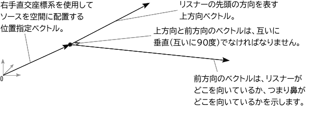

{{ APIRef("Web Audio API") }}

`AudioListener` インターフェースは、特定の人物が聞いている音場の位置と方向を表し、それが[音声空間処理](/ja/docs/Web/API/Web_Audio_API/Web_audio_spatialization_basics)に使用されます。すべての {{domxref("PannerNode")}} は、 {{domxref("BaseAudioContext.listener")}} 属性に格納されている `AudioListener` に関連して空間化されます。

注意点としては、リスナーは 1 つのコンテキストにつき 1 つしかなく、 {{domxref("AudioNode")}} ではないことです。

## プロパティ

> **Note:** position、forward、up の値の設定と取得は異なる構文で行われます。取得は例えば `AudioListener.positionX` にアクセスすることで行われ、同じプロパティを設定するには `AudioListener.positionX.value` を使用することで行われます。仕様書の IDL でこれらの値は読み取り専用とマークされていないのはこのためです。

- {{domxref("AudioListener.positionX")}}
  - : 右直交座標系におけるリスナーの水平位置を表します。既定値は 0 です。
- {{domxref("AudioListener.positionY")}}
  - : 右直交座標系におけるリスナーの垂直位置を表します。既定値は 0 です。
- {{domxref("AudioListener.positionZ")}}
  - : 右直交座標系におけるリスナーの縦方向（前後）の位置を表します。既定値は 0 です。
- {{domxref("AudioListener.forwardX")}}
  - : 位置（`positionX`, `positionY`, `positionZ`）の値と同じ直交座標系におけるリスナーの前方向の水平位置を表します。 順方向と上方向の値は互いに線形的に独立しています。既定値は 0 です。
- {{domxref("AudioListener.forwardY")}}
  - : 位置（`positionX`, `positionY`, `positionZ`）の値と同じ直交座標系におけるリスナーの前方方向の垂直位置を表します。 順方向と上方向の値は互いに線形的に独立しています。既定値は 0 です。
- {{domxref("AudioListener.forwardZ")}}
  - : 位置（`positionX`, `positionY`, `positionZ`）の値と同じ直交座標系でのリスナーの前方向の前後（前後）の位置を表します。 順方向と上方向の値は互いに線形的に独立しています。既定値は -1 です。
- {{domxref("AudioListener.upX")}}
  - : 位置（`positionX`, `positionY`, `positionZ`）と同じ直交座標系でのリスナーの前方向の前後（前後）の位置を表します。 順方向と上方向の値は互いに線形的に独立しています。既定値は -1 です。
- {{domxref("AudioListener.upY")}}
  - : 位置（`positionX`, `positionY`, `positionZ`）の値と同じ直交座標系における、リスナーの頭のてっぺんの垂直位置を表します。 順方向と上方向の値は互いに線形的に独立しています。 デフォルトは1です。
- {{domxref("AudioListener.upZ")}}
  - : 位置（`positionX`, `positionY`, `positionZ`）の値と同じ直交座標系における、リスナーの頭の上端の縦方向（前後）の位置を表します。 順方向と上方向の値は互いに線形的に独立しています。既定値は 0 です。

## メソッド

- {{domxref("AudioListener.setOrientation()")}} {{deprecated_inline}}
  - : リスナーの向きを設定します。
- {{domxref("AudioListener.setPosition()")}} {{deprecated_inline}}
  - : リスナーの位置を設定します。

> **Note:** これらのメソッドは非推奨ですが、現在、 Firefox、Internet Explorer、Safari で方向と位置を設定するための唯一の方法となっています。

## 非推奨の機能

- {{domxref("AudioListener.dopplerFactor")}} {{deprecated_inline}}
  - : double 値で、[ドップラー効果](https://ja.wikipedia.org/wiki/ドップラー効果)をレンダリングするときに使用するピッチシフトの量を表します。
- {{domxref("AudioListener.speedOfSound")}} {{deprecated_inline}}
  - : double 値で、音の速度をメートル毎秒で表します。

この仕様の以前のバージョンでは、 `dopplerFactor` および `speedOfSound` プロパティと `setPosition()` メソッドを使用して、ダウンストリームに接続された {{domxref("AudioBufferSourceNode")}} に適用されるドップラー効果を制御できました — これらは {{domxref("PannerNode")}} と {{domxref("AudioListener")}} の相対速度に応じて上下にピッチが変わります。 これらの機能には多くの問題がありました。

- {{domxref("AudioBufferSourceNode")}} のみがピッチを上下させることができ、他のソースノードはできませんでした。
- {{domxref("AudioBufferSourceNode")}} が複数の {{domxref("PannerNode")}} に接続されている場合に採用する動作が不明確でした。
- パンナーとリスナーのベロシティは {{domxref("AudioParam")}} ではなかったため、ピッチの変更はスムーズに適用できず、オーディオグリッチが発生しました。

これらの問題のため、これらのプロパティとメソッドは削除されました。

`setOrientation()` および `setPosition()` メソッドは、それらのプロパティ値を同等に設定することで置き換えられました。 例えば、 `setPosition(x, y, z)` は、それぞれ `positionX.value`, `positionY.value` および `positionZ.value` を設定することによって実現できます。

## 例

サンプルコードは [`BaseAudioContext.createPanner()`](/ja/docs/Web/API/BaseAudioContext/createPanner#example) を参照してください。

## 仕様書

{{Specifications}}

## ブラウザーの互換性

{{Compat}}

## 関連情報

- [ウェブ音声 API の使用](/ja/docs/Web/API/Web_Audio_API/Using_Web_Audio_API)
