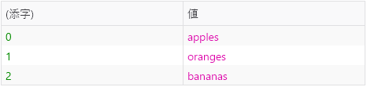
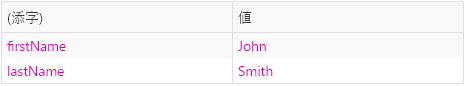
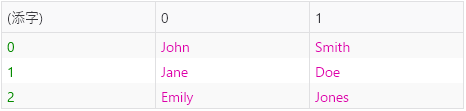
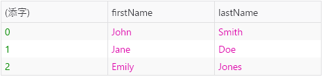
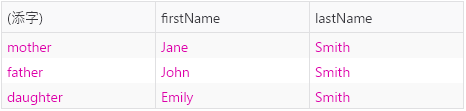

{{APIRef("Console API")}}

**`console.table()`** メソッドは、表形式のデータを表として表示します。

この関数には必須の引数 `data` があり、これは配列またはオブジェクトでなければなりません。また、省略可能な引数 `columns` もあります。

これは `data` を表として出力します。配列の各要素（`data` がオブジェクトである場合は、列挙可能なプロパティ）が、表の行になります。

表の 1 列目には、`(添字)` というラベルがつきます。 `data` が配列である場合、この値は配列の添字になります。 `data` がオブジェクトである場合、この値はプロパティ名になります。（Firefox では） `console.table` は表示する行が 1000 行（最初の行は見出し）に制限されていますので注意してください。

{{AvailableInWorkers}}

## プリミティブ型のコレクション

引数 `data` に、配列またはオブジェクトを渡すことができます。

```js
// 文字列の配列

console.table(["apples", "oranges", "bananas"]);
```



```js
// 文字列がプロパティであるオブジェクト

function Person(firstName, lastName) {
  this.firstName = firstName;
  this.lastName = lastName;
}

const me = new Person("John", "Smith");

console.table(me);
```



### 複合的な型の集合

配列の要素やオブジェクトのプロパティが、それ自身配列やオブジェクトである場合、その要素やプロパティは列ごとに 1 つずつ、行に列挙されます。

```js
// 配列の配列

const people = [
  ["John", "Smith"],
  ["Jane", "Doe"],
  ["Emily", "Jones"],
];
console.table(people);
```



```js
// オブジェクトの配列

function Person(firstName, lastName) {
  this.firstName = firstName;
  this.lastName = lastName;
}

const john = new Person("John", "Smith");
const jane = new Person("Jane", "Doe");
const emily = new Person("Emily", "Jones");

console.table([john, jane, emily]);
```

配列にオブジェクトが含まれている場合、列にはプロパティ名が表示されることに注意してください。



```js
// 値がオブジェクトのプロパティを持つオブジェクト

const family = {};

family.mother = new Person("Jane", "Smith");
family.father = new Person("John", "Smith");
family.daughter = new Person("Emily", "Smith");

console.table(family);
```



### 表示する列を制限する

既定では、`console.table()` はすべての要素を各行に出力します。省略可能な引数 `columns` を使用すると、表示する列のサブセットを選択することができます。

```js
// オブジェクトの配列、ただし firstName のみ表示

function Person(firstName, lastName) {
  this.firstName = firstName;
  this.lastName = lastName;
}

const john = new Person("John", "Smith");
const jane = new Person("Jane", "Doe");
const emily = new Person("Emily", "Jones");

console.table([john, jane, emily], ["firstName"]);
```


### 列で並べ替える

列の見出しをクリックすると、その列の値で表を並べ替えることができます。

## 構文

```js
table(data);
table(data, columns);
```

### 引数

- `data`
  - : 表示するデータ。配列またはオブジェクトでなければなりません。
- `columns`
  - : 出力に含める列の名前を含む配列。

### 返値

なし ({{jsxref("undefined")}})。

## 仕様書

{{Specifications}}

## ブラウザーの互換性

{{Compat}}
