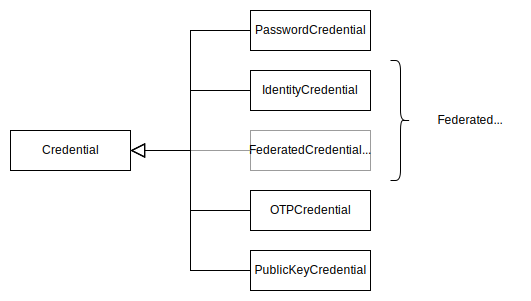
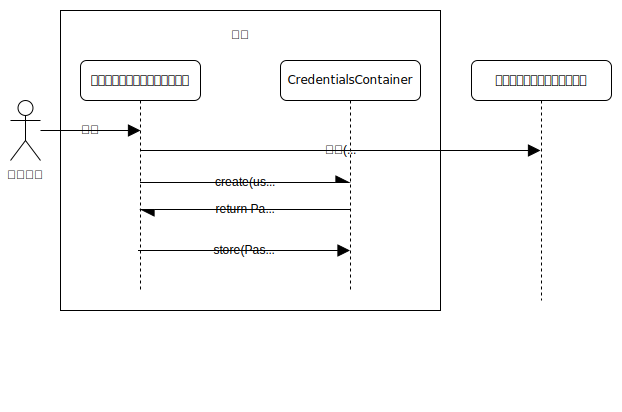
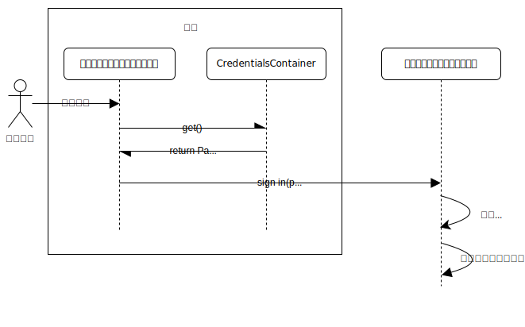
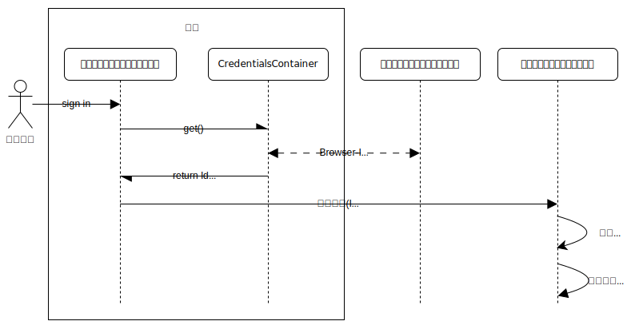
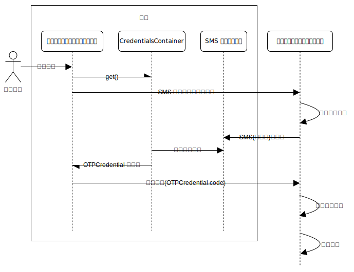
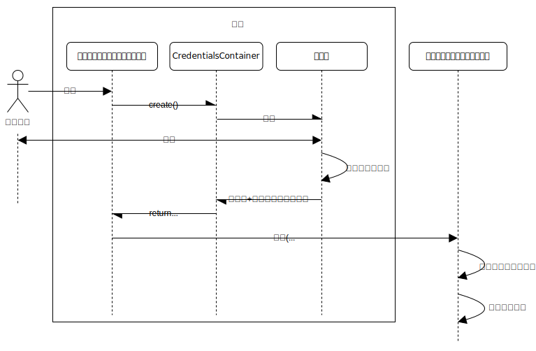
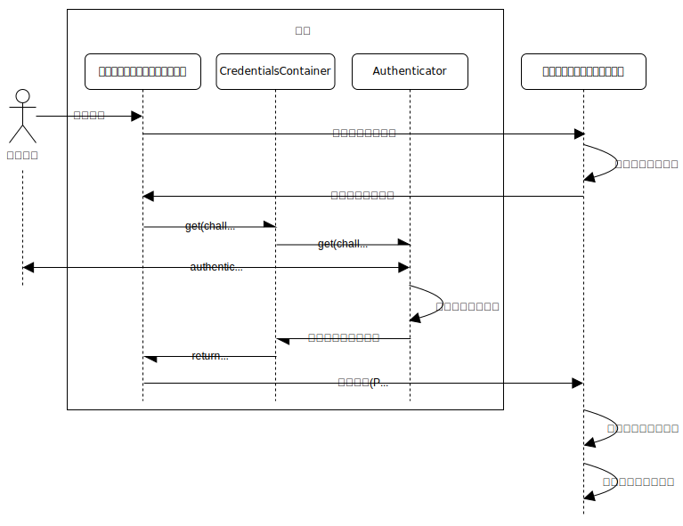

{{DefaultAPISidebar("Credential Management API")}}

資格情報管理 API では、ウェブサイトがユーザーが安全にログインするための{{glossary("credential", "資格情報")}}を作成、保存、取得することができます。以下の 4 種類の資格情報をに対応しています。

| 型                         | インターフェイス                                                                 |
| -------------------------- | -------------------------------------------------------------------------------- |
| パスワード                 | {{domxref("PasswordCredential")}}                                                |
| 連合アイデンティティ       | {{domxref("IdentityCredential")}}, {{domxref("FederatedCredential")}} （非推奨） |
| ワンタイムパスワード (OTP) | {{domxref("OTPCredential")}}                                                     |
| ウェブ認証                 | {{domxref("PublicKeyCredential")}}                                               |

認証情報の型はすべて、{{domxref("Credential")}} インターフェイスのサブクラスとして表現されます。

このガイドでは、さまざまな認証情報の型を紹介し、使用方法について概要を説明します。

> [!NOTE]
> ここではすべての認証情報の型をまとめて説明していますが、それぞれの認証情報の型は、中心となる資格情報管理 API 仕様書を拡張する複数の異なる仕様書で定義されています。
>
> - [資格情報管理 API](https://w3c.github.io/webappsec-credential-management/) は、パスワードと古い連合資格情報を定義しています。
> - [連合資格情報管理 API](https://w3c-fedid.github.io/FedCM/) は、新しい連合資格情報を定義しています。
> - [WebOTP API](https://wicg.github.io/web-otp/) OTP 資格情報を定義しています。
> - [ウェブ認証 API](https://w3c.github.io/webauthn/) は、ウェブ認証アサーションを定義します。

## パスワード

> [!NOTE]
> ほとんどのブラウザーは、この資格情報型に対応していません。また、ウェブ上では広く使用されていません。代わりに、ブラウザーは自動的にパスワードをパスワード管理ツールに保存するよう提案し、保存されたパスワードを[パスワード入寮要素](/ja/docs/Web/HTML/Reference/Elements/input/password)に自動入力することで、自動的に取得することができます。

現代のブラウザはユーザーにパスワード管理機能を提供しており、これによりユーザーはウェブサイトに入力したパスワードを保存し、後で再度ログインする必要がある際にそれらを呼び出すことができます。パスワード管理機能は、ユーザーのパスワードを記憶し自動入力することでパスワードのセキュリティ向上に貢献し、ユーザーがより強力なパスワードを選択できるようにします。

資格情報管理 API では、パスワードは {{domxref("PasswordCredential")}} インターフェイスで表現されます。ユーザーがサイトへの登録またはサインインに成功した場合、{{domxref("PasswordCredential.PasswordCredential()", "PasswordCredential()")}} コンストラクターまたは {{domxref("CredentialsContainer.create", "navigator.credentials.create()")}} を呼び出して、ユーザーが入力した認証情報から `PasswordCredential` オブジェクトを作成できます。次に、これを {{domxref("CredentialsContainer.store", "navigator.credentials.store()")}} に渡すと、ブラウザーはパスワードをパスワードマネージャーに保存するかどうかをユーザーに確認します。

ユーザーがサイトにアクセスした際、{{domxref("CredentialsContainer.get", "navigator.credentials.get()")}} を呼び出してサイトに保存されたパスワードを取得し、ユーザーをログインさせることができます。状況に応じて、ユーザーをサイレントログインさせたり、返されたパスワードを使用してフォームフィールドを自動入力したりできます。

## 連合アイデンティティ資格情報

{{glossary("federated identity", "連合アイデンティティ")}}システムでは、ユーザーとログインしようとしているウェブサイトとの間に、別の実体が仲介役として機能します。この実体は{{glossary("identity provider", "アイデンティティプロバイダー")}} (IdP) と呼ばれ、ユーザーの資格情報を管理し、ユーザーを認証することができ、ユーザーの身元に関する主張を行うためにウェブサイトから信頼されています。

ユーザーは IdP にアカウントを保有しています。ウェブサイトにログインする必要がある場合、ユーザーは IdP で認証を行います。 IdP はその後、ユーザーのブラウザーにトークンを返却し、ブラウザーはこれをウェブサイトに送信します。ウェブサイトはトークンを検証し、検証が成功した場合、ユーザーをログインさせます。

連合アイデンティティは、多くの場合、企業によってサービスとして提供されます。たとえば、Google、Microsoft、Facebook のアカウントを持つユーザーは、それらを利用して、それらに対応しているウェブサイトにログインできます。

[連合資格情報管理 API](/ja/docs/Web/API/FedCM_API) は、ウェブ上の連合アイデンティティのためのプライバシー保護の仕組みを定義します。まず {{domxref("CredentialsContainer.get", "navigator.credentials.get()")}} を呼び出して、連合アイデンティティ資格情報を要求すると、ブラウザーと ID プロバイダー (IdP) 間でプロトコル交換が開始されます。

このやり取りの過程で、ユーザーが IdP によって認証された場合、ブラウザーは `get()` から返される `Promise` の履行において {{domxref("IdentityCredential")}} オブジェクトを返します。ウェブサイトのフロントエンドコードは、これをサーバーに送信して検証を行うことができます。

なお、 {{domxref("CredentialsContainer.create", "create()")}} および {{domxref("CredentialsContainer.store", "store()")}} は、連合資格情報管理 API を使用しているときには使用しません。

> [!NOTE]
> 資格情報管理 API における連合アイデンティティの対応は、当初 {{domxref("FederatedCredential")}} インターフェイスを通して提供されていました。しかし、この仕組みは本質的に、プライバシー侵害となる[サードパーティクッキー](/ja/docs/Web/Privacy/Guides/Third-party_cookies)などの技術に依存しています。これらの技術は[ブラウザーで非推奨化された](/ja/blog/goodbye-third-party-cookies/)ため、新たなアプローチが必要となりました。

## ワンタイムパスワード

ワンタイムパスワード (OTP) は、ウェブサイトが電子メールや SMS などのメッセージングシステムを介してユーザーに一意のコードを送信する認証技術です。ユーザーはその後、通信端末の管理権限を証明するために、そのコードをサイトに入力する必要があります。ウェブサイトは、パスワードに加えて第二の認証要素としてこれを採用する場合があります。

[WebOTP API](/ja/docs/Web/API/WebOTP_API) は {{domxref("OTPCredential")}} インターフェイスを定義しており、このやり取りにおける特定のユーザビリティ問題を解決します。具体的には、ユーザーがコードを受信した際、別のアプリケーションを開き、メッセージを探し、コードをコピーしてウェブサイトのフォームに入力する必要があるという問題です。これは特にモバイル端末では不便であり、メッセージを受信する端末とサイトにログインする端末が同一の場合に顕著です。

`OTPCredential` 型に対応しているブラウザーでは、ウェブサイトのフロントエンドが {{domxref("CredentialsContainer.get", "navigator.credentials.get()")}} を呼び出し、OTP 認証情報を要求できます。その後、バックエンドにコードの生成を依頼し、そのコードを含むメッセージを送信します（トランスポートとして SMS のみがサポートされています）。バックエンドは、ブラウザーが読み取れるように特別な書式の SMS メッセージを送信する必要があります。

ブラウザーはその後、`get()` から返される `Promise` の履行において `OTPCredential` オブジェクトを返します。このオブジェクトにはコードが含まれています。ウェブサイトのフロントエンドはこのコードを使用して、サイト上の入力要素を自動入力したり、コードをサーバーに自動的に送信したりできます。

OTP 資格情報を使用する場合、{{domxref("CredentialsContainer.create", "create()")}} および {{domxref("CredentialsContainer.store", "store()")}} は使用されません。

## ウェブ認証アサーション

[ウェブ認証 API](/ja/docs/Web/API/Web_Authentication_API) (WebAuthn) は、認証器にユーザーの身元に関するデジタル署名付きアサーションを生成させることで、ユーザーがウェブサイトにログインすることができるようにします。

認証装置とは、ユーザーの端末の内部または端末に接続されたエンティティであり、ユーザーの登録と認証に必要な暗号処理を実行し、これらの処理で使用される暗号鍵を安全に保管できるものである。認証装置は、Apple 端末の [Touch ID](https://en.wikipedia.org/wiki/Touch_ID) システムや [Windows Hello](https://en.wikipedia.org/wiki/Windows_10#System_security) システムのように端末に組み込まれている場合もあれば、[YubiKey](https://en.wikipedia.org/wiki/YubiKey) のような取り外し可能なモジュールである場合もあります。

パスワードの代わりに、 WebAuthn は{{glossary("public-key cryptography", "公開鍵暗号")}}を用いてユーザーを認証します。

WebAuthn を使用してウェブサイトにユーザーを登録するには、{{domxref("CredentialsContainer.create", "navigator.credentials.create()")}} を呼び出し、鍵ペアの作成に必要なすべての情報を提供します。認証器はまず、生体認証リーダーなどを使用してユーザーに本人確認を求める場合があります。その後、鍵ペアを生成し公開鍵を返します。この鍵ペアはユーザーとウェブサイトに固有です。認証器は署名付きアサーションを生成して返す場合もあります。これは認証器自体が（例えば）正規の YubiKey であることを示す声明です。

ウェブサイトのフロントエンドは公開鍵と認証情報をサーバーに送信し、サーバーは認証情報を検証した上で、公開鍵を新規ユーザーのその他のアカウント情報と共に保存します。

ウェブサイトにユーザーをログインさせるため、フロントエンドコードはまずサーバーからチャレンジと呼ばれる乱数を取得します。次に、チャレンジとその他のオプションを渡して {{domxref("CredentialsContainer.get", "navigator.credentials.get()")}} を呼び出します。認証器は、再度ユーザーに本人確認を求める場合があり、その後秘密鍵を使用してチャレンジに署名します。

ブラウザーはその後、 `PublicKeyCredential` オブジェクトを `get()` から返された `Promise` の履行によって返します。このオブジェクトには、アサーションと呼ばれる署名されたチャレンジが含まれています。ウェブサイトのフロントエンドはその後、このアサーションをサーバーに送信します。サーバーは保存された公開鍵を使用して署名を検証し、ユーザーをログインさせるかどうかを決定します。

なお、WebAuthn を使用する場合、{{domxref("CredentialsContainer.store", "store()")}} は使用されません。鍵ペアは認証器内で生成され、秘密鍵は認証器から決して外部に流出することはありません。

## 関連情報

- [ウェブ認証 API](/ja/docs/Web/API/Web_Authentication_API)
- [WebOTP API](/ja/docs/Web/API/WebOTP_API)
- [連合アイデンティティ管理 (FedCM) API](/ja/docs/Web/API/FedCM_API)
