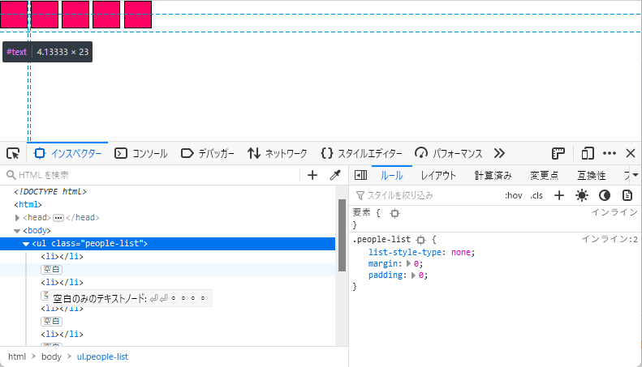

{{DefaultAPISidebar("DOM")}}

[DOM](/ja/docs/Web/API/Document_Object_Model) にホワイトスペースが存在すると、レイアウトの問題が発生したり、ホワイトスペースがある場所によっては、予期せぬ形でコンテンツツリーの操作が困難になることがあります。この記事では、どのような場合に問題が発生するかを探り、その結果生じる問題を軽減するために何ができるかを見ていきます。

## ホワイトスペースとは

ホワイトスペースとは、スペース、タブ、改行（正確には、CRLF の並び、キャリッジリターン、行送り）のみで構成されたテキストの文字列のことです。これらの文字を使用することで、自分や他の人が読みやすいようにコードを整形することができます。実際、私たちのソースコードの多くはこれらのホワイトスペースであふれており、コードのダウンロードサイズを減らすために、本番のビルド段階でホワイトスペースを取り除く傾向があります。

### HTML はほとんどホワイトスペースを無視するのか

HTML の場合、ホワイトスペースはほとんど無視されます。単語間のホワイトスペースは 1 文字として扱われ、要素の開始と終了、要素外のホワイトスペースは無視されます。以下の最小限の例を見てみましょう。

```html
<!DOCTYPE html>

  <h1>      Hello      World!     </h1>
```

このソースコードには、 `DOCTYPE` の後に 2 つの改行と `<h1>` 要素の前後と内部にホワイトスペースの束が含まれていますが、ブラウザーはまったく気にしていないようで、これらの文字が全く存在しないかのように "Hello World!" という言葉を表示しています。

{{EmbedLiveSample('HTML_largely_ignores_whitespace')}}

これは、ホワイトスペースがページのレイアウトに影響を与えないようにするためです。要素の周囲や内部に余白を作るのは CSS の仕事です。

### ホワイトスペースに何が*起こる*のか

しかし、ただ消えるだけではありません。

元の文書で HTML 要素の外にあるホワイトスペースはすべて DOM で表現されます。これは、エディターが文書の書式を保持するために内部的に必要です。これは、次のことを意味します。

- ホワイトスペースのみを含むテキストノードが存在し、
- テキストノードによっては先頭や末尾にホワイトスペースを持つことがある。

例えば、次の文書を見てください。

```html
<!DOCTYPE html>
<html>
<head>
  <title>My Document</title>
</head>
<body>
  <h1>Header</h1>
  <p>
    Paragraph
  </p>
</body>
</html>
```

この DOM ツリーは次のように見えます。


DOM でホワイトスペースを保存することは多くの点で便利ですが、特定のレイアウトを実装するのが難しくなったり、 DOM 内のノードを反復処理したい開発者にとっては問題が生じたりする場所があります。これらの問題と解決策については、後ほど見ていきましょう。

### CSS はホワイトスペースをどのように処理するのか

ほとんどのホワイトスペースは無視されますが、すべてが無視されるわけではありません。先ほどの例では、"Hello" と "World!" の間のホワイトスペースの一つは、ブラウザーでページがレンダリングされたときにまだ存在しています。ブラウザーエンジンには、どのホワイトスペースが有用でどれが不要かを決定する規則があります — これらは、少なくとも [CSS テキストモジュールレベル 3](https://www.w3.org/TR/css-text-3)、特に [CSS の white-space プロパティ](https://www.w3.org/TR/css-text-3/#white-space-property)と[ホワイトスペースの処理の詳細](https://www.w3.org/TR/css-text-3/#white-space-processing)についての部分で規定されていますが、以下ではより簡単な説明を提供します。

#### 例

もう一つ、本当に簡単な例を挙げてみましょう。分かりやすいように、すべての空白を ◦ で、すべてのタブを ⇥ で、すべての改行を ⏎ で表現します。

例を示します。

```html
<h1>   Hello
        <span> World!</span>   </h1>

<!--
<h1>◦◦◦Hello◦⏎
⇥⇥⇥⇥<span>◦World!</span>⇥◦◦</h1>
-->
```

これはブラウザーで次のようにレンダリングされます。

{{EmbedLiveSample('Example')}}

#### 解説

`<h1>` 要素はインライン要素のみを含んでいます。実際にはこのようなものを含んでいます。

- 1 つのテキストノード（いくつかの空白、"Hello" という語、いくつかのタブから成る）
- 1 つのインライン要素（`<span>` で、中に空白と "World!" という語を含む）
- もう 1 つのテキストノード（タブと空白のみから成る）

このため、[インライン整形コンテキスト](/ja/docs/Web/CSS/Inline_formatting_context)と呼ばれるものを確立します。これは、ブラウザーエンジンが作業を行う存在する可能性のあるレイアウトレンダリングコンテキストの一つです。

このコンテキストの中では、ホワイトスペース文字の処理は次のように要約されます。

1. まず、改行の直前と直後の空白とタブはすべて無視されるので、以前のマークアップの例を参考にして、この最初の規則を適用すると、次のようになります。

    ```html
    <h1>◦◦◦Hello⏎
    <span>◦World!</span>⇥◦◦</h1>
    ```

2. 次に、タブ文字がすべて空白として扱われるので、この例は次のようになります。

    ```html
    <h1>◦◦◦Hello⏎
    <span>◦World!</span>◦◦◦</h1>
    ```

3. 次に、改行が空白に変換されます。

    ```html
    <h1>◦◦◦Hello◦<span>◦World!</span>◦◦◦</h1>
    ```

4. その後で、空白の直後に他の空白がある場合は（2 つが別々なインライン要素をまたぐ場合も含めて）無視されるので、次のようになります。

    ```html
    <h1>◦Hello◦<span>World!</span>◦</h1>
    ```

5. そして、行頭と行末の一連の空白が削除されるので、ようやくこのようになります。

    ```html
    <h1>Hello◦<span>World!</span></h1>
    ```

このため、ウェブページを訪れた人は、ひどく字下げされた "Hello" に続いてもっとひどく字下げされた "World!" をその下の行に見かけるのではなく、ページの先頭にきれいに書かれた "Hello World!" という文言を見ることになります。

> **Note:** [Firefox DevTools](/ja/docs/Tools) ではバージョン 52 以降、テキストノードの強調表示に対応しており、どのノードにホワイトスペース文字が含まれているかを正確に確認できるようになりました。純粋なホワイトスペースノードには "whitespace" ラベルが付けられます。
</div>

### ブロック整形コンテキストでのホワイトスペース

上記では、インライン要素を含む要素と、インライン整形コンテキストについて見てきました。要素が少なくとも 1 つのブロック要素を含んでいる場合は、代わりに[ブロック整形コンテキスト](/ja/docs/Web/Guide/CSS/Block_formatting_context)と呼ばれるものが確立されます。

このコンテキストでは、ホワイトスペースはまったく異なるように扱われます。

#### 例

例を使ってどのようになるかを見てみましょう。前と同じようにホワイトスペース文字をマークしました。

ここにはホワイトスペースのみを含む 3 つのテキストノードがあります。 `<div>` の前に 1 つ、 2 つの `<div>` の間に 1 つ、 2 つ目の `<div>` の後に 1 つです。

```html
<body>
  <div>  Hello  </div>

   <div>  World!   </div>
</body>

<!--
<body>⏎
⇥<div>◦◦Hello◦◦</div>⏎
⏎
◦◦◦<div>◦◦World!◦◦</div>◦◦⏎
</body>
-->
```

これは次のように表示されます。

{{EmbedLiveSample('Example_2')}}

#### 解説

ここでのホワイトスペースの扱いをまとめると、次のようになります（ブラウザーによって正確な動作に若干の違いがあるかもしれませんが、基本的にはうまくいきます）。

1. ブロック整形コンテキスト内にいるため、すべてがブロックでなければなりません。ブロックは幅いっぱいに配置され、互いに積み重ねられるので、最終的にはこのブロックのリストで構成されるレイアウトとなります。

    ```html
    <block>⏎⇥</block>
    <block>◦◦Hello◦◦</block>
    <block>⏎◦◦◦</block>
    <block>◦◦World!◦◦</block>
    <block>◦◦⏎</block>
    ```

2. そして、これらのブロックにインライン整形コンテキストにおけるホワイトスペースの処理ルールを適用することで、さらに簡素化されます。

    ```html
    <block></block>
    <block>Hello</block>
    <block></block>
    <block>World!</block>
    <block></block>
    ```

3. できた 3 つの空のブロックは、最終的なレイアウトでは何も含まれないので、ページ内の空間を占有するブロックは 2 つだけになります。このウェブページを見る人には、 "Hello" と "World!" という言葉が、 2 つの別々の行にあるように見えます。これは 2 つの `<div>` が並べられた場合の期待通りです。ブラウザーエンジンは、ソースコードに追加されたすべての空白を基本的に無視しています。

## インライン要素やインラインブロック要素間の空白

次に、ホワイトスペースが原因で発生する可能性のある問題と、それに対する対処法について見ていきましょう。まず、インライン要素やインラインブロック要素の間にある空白がどうなるかを見ていきます。実は、最初の例で、インライン整形コンテキスト内でホワイトスペースがどのように処理されるかを説明したときに、すでにこのことを確認しました。

ほとんどの文字を無視するルールはありますが、単語を区切る文字は残るという話をしました。 `<p>` のようなブロックレベル要素のみがある状態で、その中に `<em>`, `<strong>`, `<span>` などのインライン要素のみがある場合、ふつうはレイアウトに含まれる余分なホワイトスペースは、文中の単語を区切るのに役立つからです。

`inline-block` 要素を使い始めるともっと興味深くなります。この要素は外部的にはインライン要素のように振る舞い、内部的にはブロック要素のようにふるまうので、これを使って例えばナビゲーションメニューのように、テキストだけでないもっと複雑な UI 部品を同じ行に横に並べて表示ことができます。

ブロックなので、そのような挙動を期待される方が多いのですが、実際はそうではありません。隣接するインライン要素の間に書式のホワイトスペースがある場合、テキストの単語間のスペースと同じように、レイアウトにスペースが発生します。

### 例

この例を見てみてください（こちらも HTML のコメントの中で HTML のホワイトスペース文字を示しています）。

```css
.people-list {
  list-style-type: none;
  margin: 0;
  padding: 0;
}

.people-list li {
  display: inline-block;
  width: 2em;
  height: 2em;
  background: #f06;
  border: 1px solid;
}
```

```html
<ul class="people-list">

    <li></li>

    <li></li>

    <li></li>

    <li></li>

    <li></li>

  </ul>

<!--
<ul class="people-list">⏎

◦◦<li></li>⏎

◦◦<li></li>⏎

◦◦<li></li>⏎

◦◦<li></li>⏎

◦◦<li></li>⏎

</ul>
-->
```

これは次のように表示されます。

{{EmbedLiveSample('Example_3')}}

用途にもよりますが（アバターのリストなのか、水平方向のナビボタンなのか）、おそらくブロック間のすき間は欲しくないのではないかと思います。おそらく要素の側面を互いに同じ高さにし、間隔を自分で制御できるようにしたいのではないでしょうか。

Firefox DevTools の HTML インスペクターではテキストノードを強調表示し、要素がどの領域を占めているかを正確に表示します。



### 解決策

この問題を回避する方法は何通りかあります。

水平方向の項目のリストを生成するのに、 `inline-block` による解決法よりも[フレックスボックス](/ja/docs/Learn/CSS/CSS_layout/Flexbox)を使用します。これは、あなたに代わってすべてを処理するもので、間違いなく望ましい解決策です。

```css
ul {
  list-style-type: none;
  margin: 0;
  padding: 0;
  display: flex;
}
```

`inline-block` に頼る必要があるのであれば、そのリストの [`font-size`](/ja/docs/Web/CSS/font-size) を 0 にしてください。これは、ブロックのサイズが em で設定されていない場合のみ有効です（ブロックのサイズも`font-size` に基づいているので、結局 0 になってしまいます）。ここでは rem を使用するといいでしょう。

```css
ul {
  font-size: 0;
  ...
}

li {
  display: inline-block;
  width: 2rem;
  height: 2rem;
  ...
}
```

または、リスト項目に負のマージンを設定する方法もあります。

```css
li {
  display: inline-block;
  width: 2rem;
  height: 2rem;
  margin-right: -0.25rem;
}
```

また、この問題は、リスト項目をすべてソースの同じ行に配置し、空白のノードが最初に作成されないようにすることで解決することもできます。

```html
<li></li><li></li><li></li><li></li><li></li>
```

## DOM 処理とホワイトスペース

[DOM](/ja/docs/Web/API/Document_Object_Model) を JavaScript で操作しようとするとき、ホワイトスペースのノードに起因する問題に遭遇する可能性があります。例えば、親ノードへの参照を持っていて [`Node.firstChild`](/ja/docs/Web/API/Node/firstChild) を使用して先頭の子要素を走査しようとした場合、親要素の開始タグの直後に不正なホワイトスペースがあると、予期しない結果になります。このテキストノードが走査したい要素の代わりに選択されてしまうからです。

別の例として、ある要素のサブセットがあり、それらが空であるかどうか（子ノードがないかどうか）を判断して何かをしたい場合、 [`Node.hasChildNodes()`](/ja/docs/Web/API/Node/hasChildNodes) などを使用してそれぞれの要素が空であるかを確認することができますが、やはり対象の要素がテキストノードを含んでいれば、誤った結果になってしまう可能性があります。

## ホワイトスペースヘルパー関数

以下の JavaScript のコードでは、 DOM 内の空白を簡単に処理するためのいくつかの関数を定義しています。

```js
/**
 * スクリプト全体で、ホワイトスペースを以下のいずれかの文字として定義しています。
 *  "\t" TAB \u0009
 *  "\n" LF  \u000A
 *  "\r" CR  \u000D
 *  " "  SPC \u0020
 *
 * JavaScript の \s は非改行スペース (および他のいくつかの文字) を含んでいる為
 * このスクリプトでは使用しません。
 */

/**
 * ノードのテキスト内容が完全に空白であるか判断
 *
 * @param nod  CharacterData インターフェイスを実装したノード
 *             (例: Text, Comment, CDATASection ノード)
 * @return     nod のテキスト内容がすべてホワイトスペースであれば true
 *             それ以外は false
 */
function is_all_ws( nod )
{
  // ECMA-262 第3版 の String および RegExp の機能を使用
  return !(/[^\t\n\r ]/.test(nod.textContent));
}

/**
 * 反復処理関数がノードを無視するべきかどうか判断
 *
 * @param nod  DOM1 の Node インターフェイスを実装したノード
 * @return     ノードが次のいずれかであれば true:
 *                1) すべてホワイトスペースである Text ノード
 *                2) Comment ノード
 *             それ以外は false
 */

function is_ignorable( nod )
{
  return ( nod.nodeType == 8) || // コメントノード
         ( (nod.nodeType == 3) && is_all_ws(nod) ); // 全空白テキストノード
}

/**
 * 完全に空白あるいはコメントのノードを無視するようにした previousSibling
 * (通常 previousSibling はすべての DOM ノードが持つプロパティのことで、親が
 * 同じで参照ノードの直前にある兄弟ノードを表します)
 *
 * @param sib  参照ノード
 * @return     次のいずれか:
 *               1) is_ignorable 検査で無視できないと判断された sib に
 *                  最も近い前方の兄弟ノード、あるいは
 *               2) 該当するノードがなければ null
 */
function node_before( sib )
{
  while ((sib = sib.previousSibling)) {
    if (!is_ignorable(sib)) return sib;
  }
  return null;
}

/**
 * 完全に空白あるいはコメントのノードを無視するようにした nextSibling
 *
 * @param sib  参照ノード
 * @return     次のいずれか:
 *               1) is_ignorable 検査で無視できないと判断された sib に
 *                  最も近い後方の兄弟ノード、あるいは
 *               2) 該当するノードがなければ null
 */
function node_after( sib )
{
  while ((sib = sib.nextSibling)) {
    if (!is_ignorable(sib)) return sib;
  }
  return null;
}

/**
 * 完全に空白あるいはコメントのノードを無視するようにした lastChild
 * (通常 lastChild はすべての DOM ノードが持つプロパティのことで、参照ノードに
 * 直接含まれる最後のノードを表します)
 *
 * @param sib  参照ノード
 * @return     次のいずれか:
 *               1) is_ignorable 検査で無視できないと判断された sib の
 *                  最後の子供ノード、あるいは
 *               2) 該当するノードがなければ null
 */
function last_child( par )
{
  var res=par.lastChild;
  while (res) {
    if (!is_ignorable(res)) return res;
    res = res.previousSibling;
  }
  return null;
}

/**
 * 完全に空白あるいはコメントのノードを無視するようにした firstChild
 *
 * @param sib  参照ノード
 * @return     次のいずれか:
 *               1) is_ignorable 検査で無視できないと判断された sib の
 *                  最初の子供ノード、あるいは
 *               2) 該当するノードがなければ null
 */
function first_child( par )
{
  var res=par.firstChild;
  while (res) {
    if (!is_ignorable(res)) return res;
    res = res.nextSibling;
  }
  return null;
}

/**
 * 最初と最後にホワイトスペースを含まず、すべてのホワイトスペースを単一スペースに正規化する
 * ようにした data
 * (通常 data はテキストノードが持つプロパティのことで、ノードのテキストを
 * 表します)
 *
 * @param txt  data が返されるべきテキストノード
 * @return     当該テキストノードの内容が与えるホワイトスペースを纏めた文字列
 */
function data_of( txt )
{
  var data = txt.textContent;
  // ECMA-262 第3版 の String および RegExp の機能を使用
  data = data.replace(/[\t\n\r ]+/g, " ");
  if (data.charAt(0) == " ")
    data = data.substring(1, data.length);
  if (data.charAt(data.length - 1) == " ")
    data = data.substring(0, data.length - 1);
  return data;
}
```

## 例

次のコードは、上記の関数の使い方を示したものです。これは、ある要素の子（その子はすべて要素）を繰り返し、テキストが `"This is the third paragraph"` であるものを見つけ、 class 属性とその段落の内容を変更するものです。

```js
var cur = first_child(document.getElementById("test"));
while (cur)
{
  if (data_of(cur.firstChild) == "This is the third paragraph.")
  {
    cur.className = "magic";
    cur.firstChild.textContent = "This is the magic paragraph.";
  }
  cur = node_after(cur);
}
```
