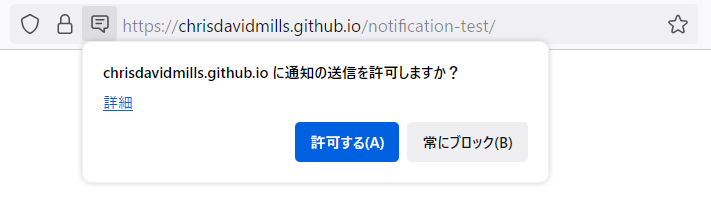

{{DefaultAPISidebar("Web Notifications")}}{{securecontext_header}} {{AvailableInWorkers}}

通知 API を使えば、ウェブページがエンドユーザーに表示するシステム通知を制御できるようになります。これらのシステムは、最上位の閲覧コンテキストのビューポートの外にあるため、ユーザーがタブを切り替えたり、別のアプリに移動していても表示されます。また、この API は既存の通知システムと互換性を持つように設計されているので、異なるプラットフォームでも動作します。

## 概要と使い方

対応済みのプラットフォームでは、システム通知を表示するには、一般的に 2 つのことが必要です。まず、ユーザーが現在のオリジンに対してシステム通知を表示する許可を与える必要があります。これは一般的にアプリやサイトが初期化されたとき、 {{domxref("Notification.requestPermission_static", "Notification.requestPermission()")}} メソッドを使用して行われます。
このメソッドは、例えばユーザーのジェスチャーを処理する場合、マウスクリックを処理する場合などでのみ呼び出すべきです。

```js
btn.addEventListener("click", () => {
  let promise = Notification.requestPermission();
  // wait for permission
});
```

これは以下のようにリクエストダイアログを起動します。



ここでは、ユーザーはこのオリジンからの通知を許可するかどうかを選択できます。一度決定がなされると、現在のセッションの間はその設定が保存されます。

次に、新しい通知は {{domxref("Notification.Notification","Notification()")}} コンストラクターを使って作られます。このコンストラクターには、必須の title 引数と、オプションを指定する引数として options オブジェクトを与えることができます。オプションには、テキストの方向、本文テキスト、表示アイコン、通知サウンドなどが指定可能です。

さらに、通知 API の仕様には、いくつかの[サービスワーカー API](/ja/docs/Web/API/Service_Worker_API) が定義されており、サービスワーカーが通知を発行できるようになっています。

> [!NOTE]
> 自分のアプリでの通知の詳しい使い方については、[通知 API の使用](/ja/docs/Web/API/Notifications_API/Using_the_Notifications_API)を参照してください。

## インターフェイス

- {{domxref("Notification")}}
  - : 通知オブジェクトを定義します。
- {{domxref("NotificationEvent")}}
  - : {{domxref("ServiceWorker")}} の {{domxref("ServiceWorkerGlobalScope")}} に配信された通知イベントを表します。

### 他インターフェイスへの拡張

- {{domxref("ServiceWorkerGlobalScope/notificationclick_event", "notificationclick")}} イベント
  - : 表示された通知をユーザーがクリックすると発生します。
- {{domxref("ServiceWorkerGlobalScope/notificationclose_event", "notificationclose")}} イベント
  - : 表示された通知をユーザーが閉じたときに発生します。
- {{domxref("ServiceWorkerRegistration.getNotifications()")}}
  - : 現在のオリジンから現在のサービスワーカー登録を経由して作成された順番で、通知の一覧を返します。
- {{domxref("ServiceWorkerRegistration.showNotification()")}}
  - : リクエストされたタイトルで通知を表示します。

## 仕様書

{{Specifications}}

## ブラウザーの互換性

{{Compat}}

## 関連情報

- [通知 API の使用](/ja/docs/Web/API/Notifications_API/Using_the_Notifications_API)
