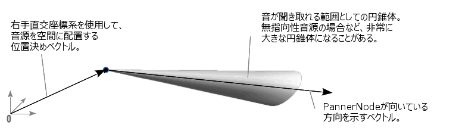

{{ APIRef("Web Audio API") }}

`PannerNode` は音源の空間上の位置と振る舞いを表現したインターフェイスで、{{domxref("AudioNode")}} の一種です。右手直交座標系に従って位置を表し、音源の動きは速度ベクトルと、向きを表すサウンドコーンを利用して表現します。

`PannerNode` は必ず 1 つの入力と、1 つの出力を持ちます。入力はモノラルでもステレオでも構いませんが、出力は必ずステレオとなります。つまりパンニングを行うには最低でも 2 チャンネルの音声チャンネルを必要です。

{{InheritanceDiagram}}

<table class="properties">
  <tbody>
    <tr>
      <th scope="row">入力数</th>
      <td><code>1</code></td>
    </tr>
    <tr>
      <th scope="row">出力数</th>
      <td><code>1</code></td>
    </tr>
    <tr>
      <th scope="row">チャンネルの数え方</th>
      <td><code>"clamped-max"</code></td>
    </tr>
    <tr>
      <th scope="row">チャンネル数</th>
      <td><code>2</code></td>
    </tr>
    <tr>
      <th scope="row">チャンネルの意味</th>
      <td><code>"speakers"</code></td>
    </tr>
  </tbody>
</table>

## コンストラクター

- {{domxref("PannerNode.PannerNode", "PannerNode()")}}
  - : 新しい `PannerNode` オブジェクトを作成します。

## インスタンスプロパティ

_親である {{domxref("AudioNode")}} からプロパティを継承しています。_

> [!NOTE]
> 向きと位置の設定と取得は異なる方法で行います。これは、これらの値が {{domxref("AudioParam")}} として保存されてるためです。値の取得は `PannerNode.positionX` のように行えますが、同じ属性に対して値を設定するには `PannerNode.positionX.value` のように行います。そのため、これらの値は、WebIDL にあるように、読み取り専用とは定義されていません。

- {{domxref("PannerNode.coneInnerAngle")}}
  - : 倍精度実数値で、円錐の角度を度単位で記述し、その内側では容量が減少しません。
- {{domxref("PannerNode.coneOuterAngle")}}
  - : 倍精度実数値で、音量を `coneOuterGain` プロパティで定義された、一定値だけ減少させる円錐の外側の角度を度単位で記述します。
- {{domxref("PannerNode.coneOuterGain")}}
  - : 倍精度実数値で、 `coneOuterAngle` 属性で定義された円錐体の外側の音量の減少量を記述します。既定値は `0` で、音が聴こえなくなることを意味します。
- {{domxref("PannerNode.distanceModel")}}
  - : 音量の低減計算に用いるアルゴリズムを定めます。アルゴリズムは定められたものの中から選択します。とりうる値は `"linear"`、`"inverse"`、`"exponential"`で、既定値は `"inverse"`です。
- {{domxref("PannerNode.maxDistance")}}
  - : 音源と聴取者の最大距離を定義します。これを超えた場合、音量の低減計算が行われません。
- {{domxref("PannerNode.orientationX")}}
  - : 右手直交座標系における音源の向きを表すベクトルのうち、水平方向の値です。{{domxref("AudioParam")}} は直接変更できないため、値の変更は{{domxref("AudioParam.value", "value")}} 属性を通して行います。既定値は 1 となっています。
- {{domxref("PannerNode.orientationY")}}
  - : 右手直交座標系における音源の向きを表すベクトルのうち、垂直方向の値です。{{domxref("AudioParam")}} は直接変更できないため、値の変更は{{domxref("AudioParam.value", "value")}} 属性を通して行います。既定値は 0 となっています。
- {{domxref("PannerNode.orientationZ")}}
  - : 右手直交座標系における音源の向きを表すベクトルのうち、奥行き(前後)方向の値です{{domxref("AudioParam")}} は直接変更できないため、値の変更は{{domxref("AudioParam.value", "value")}} 属性を通して行います。既定値は 0 となっています。
- {{domxref("PannerNode.panningModel")}}
  - : 立体音響計算を行うアルゴリズムを定めます。アルゴリズムは定められたものの中から選びます。
- {{domxref("PannerNode.positionX")}}
  - : 右手直交座標系における音源の位置を表すベクトルのうち、水平方向の値です{{domxref("AudioParam")}} は直接変更できないため、値の変更は{{domxref("AudioParam.value", "value")}} 属性を通して行います。既定値は 0 となっています。
- {{domxref("PannerNode.positionY")}}
  - : 右手直交座標系における音源の位置を表すベクトルのうち、垂直方向の値です{{domxref("AudioParam")}} は直接変更できないため、値の変更は{{domxref("AudioParam.value", "value")}} 属性を通して行います。既定値は 0 となっています。
- {{domxref("PannerNode.positionZ")}}
  - : 右手直交座標系における音源の位置を表すベクトルのうち、奥行き(前後)方向の値です{{domxref("AudioParam")}} は直接変更できないため、値の変更は{{domxref("AudioParam.value", "value")}} 属性を通して行います。既定値は 0 となっています。
- {{domxref("PannerNode.refDistance")}}
  - : 音量の低減計算に用いる基準距離を表します。音源と聴取者との距離がこれを超えた場合、`rolloffFactor` と `distanceModel` に基づいて音量の低減が発生します。
- {{domxref("PannerNode.rolloffFactor")}}
  - : 音源が聴取者から離れていく際に起きる音量の低減量を定めます。この値は、全ての距離モデルで利用されます。

## インスタンスメソッド

_親である {{domxref("AudioNode")}} のメソッドを継承しています。_

- {{domxref("PannerNode.setPosition()")}} {{deprecated_inline}}
  - : 聞き手（{{domxref("BaseAudioContext.listener")}} 属性に格納された {{domxref("AudioListener")}} オブジェクトで表される）からの音源の相対位置を定義します。
- {{domxref("PannerNode.setOrientation()")}} {{deprecated_inline}}
  - : 音源が再生されている方向を設定します。

## 例

コード例については [`BaseAudioContext.createPanner()`](/ja/docs/Web/API/BaseAudioContext/createPanner#例) を参照してください。

## 仕様書

{{Specifications}}

## ブラウザーの互換性

{{Compat}}

## 関連情報

- [ウェブオーディオ API の使用](/ja/docs/Web/API/Web_Audio_API/Using_Web_Audio_API)
