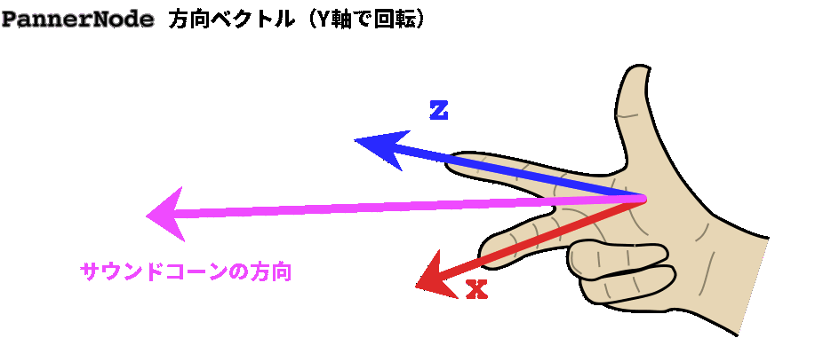

{{ APIRef("Web Audio API") }}

**`orientationX`** は {{ domxref("PannerNode") }} インターフェイスのプロパティで、音声ソースが向いている方向の X （水平）成分を 3D 直交座標空間で表示します。

完全ベクトルは ({{domxref("PannerNode.positionX", "positionX")}}、{{domxref("PannerNode.positionY", "positionY")}}、{{domxref("PannerNode.positionZ", "positionZ")}}) として与えられた音声ソースの位置と、({{domxref("PannerNode.orientationX", "orientationX")}}、{{domxref("PannerNode.orientationY", "orientationY")}}、{{domxref("PannerNode.orientationZ", "orientationZ")}}) として与えられた音声ソースの向き (つまり、音声ソースが向いている方向) によって定義されます。

音の指向性 ({{domxref("PannerNode.coneInnerAngle", "coneInnerAngle")}}、{{domxref("PannerNode.coneOuterAngle", "coneOuterAngle")}}、{{domxref("PannerNode.coneOuterGain", "coneOuterGain")}}) の属性を使用して指定されている) に応じて、音の方向 (orientation) は、再生中の音が知覚される音量を変化させることがあります。音が聞き手の方に向けられている場合は、聞き手から離れたところに向けられている場合よりも大きな音になります。

このプロパティに含まれる {{domxref("AudioParam")}} は読み取り専用ですが、{{domxref("AudioParam.value")}} プロパティに新しい値を代入することで、引数の値を変更できます。

## 値

{{domxref("AudioParam")}} の `value` は、音声ソースが向いている方向の X 成分であり、3D 直交座標空間での値です。

## 例

この例では、{{domxref("PannerNode.coneInnerAngle", "coneInnerAngle")}} と {{domxref("PannerNode.coneOuterAngle", "coneOuterAngle")}} を組み合わせて {{ domxref("PannerNode") }} の方向の引数を変更すると、音量にどのように影響するかを示します。方向ベクトル (orientation vector) がどのように影響するかを視覚化するために、[右手の法則](https://ja.wikipedia.org/wiki/%E5%8F%B3%E6%89%8B%E3%81%AE%E6%B3%95%E5%89%87)を使用することができます。



まず、方向ベクトルを理解するためのユーティリティ関数を作成することから始めましょう。X 成分と Z 成分は常に互いに 90°であるため、ラジアン単位で同じ量だけオフセットされる正弦関数と余弦関数を使用できます。ただし、これは通常、{{ domxref("PannerNode") }} が 0°回転で聞き手の**左側**を指すことを意味します。`x= cos(0)= 1` および `z = sin(0) = 0` であるためです。角度を -90°オフセットするとより便利です。つまり、{{domxref("PannerNode")}} は 0°の回転で**聞き手を直接**指します。

```js
// このユーティリティは、Y 軸周りの回転量 (つまり「水平面」での回転) を
// 方向ベクトルに変換します
const yRotationToVector = (degrees) => {
  // 度をラジアンに変換し、0 で聞き手の方を向くように角度をオフセットします
  const radians = (degrees - 90) * (Math.PI / 180);
  // ここでコサインとサインを使用すると，出力値は常に正規化されます
  // つまり、これらは -1 から 1 の間の範囲です
  const x = Math.cos(radians);
  const z = Math.sin(radians);

  // Y は回転軸なので、Y 成分を 0 にハードコードします。
  return [x, 0, z];
};
```

これで、{{ domxref("AudioContext") }}、発振器、および {{ domxref("PannerNode") }} を作成できます。

```js
const context = new AudioContext();

const osc = new OscillatorNode(context);
osc.type = "sawtooth";

const panner = new PannerNode(context);
panner.panningModel = "HRTF";
```

次に、空間音の*円錐体*を設定し、それが聞こえる範囲を決めます。

```js
// この値は、音量が一定となる領域のサイズを決定します
// たとえば coneInnerAngle == 30 のとき、
// 音を左右どちらかに 15 度 (30/2) まで回転させても音量は変わりません。
panner.coneInnerAngle = 30;
// この値は、音量が徐々に減衰する領域のサイズを決定します
// たとえば coneOuterAngle == 45 かつ coneInnerAngle == 30 のとき、
// 音を左右どちらかに 15 度 (30/2) から 22.5 度 (45/2) の間で回転させると、
// 徐々に音量が小さくなります。
panner.coneOuterAngle = 45;
// この値は、inner/outer の両方のコーンの外側の音の大きさを決定します
// 0 に設定すると音が出ず、コーンから離れたときにはっきり聞こえます
// 0 はデフォルト値でもあります
panner.coneOuterGain = 0;
// Z位置を大きくして、コーンの効果を確実にします
// 利用しない場合、音は聞き手と同じ位置にあります
panner.positionZ.setValueAtTime(1, context.currentTime);
```

{{ domxref("PannerNode") }} を設定したら、Y 軸の回転を更新するスケジュールを設定できます。

```js
// 回転がない場合のベクトルを計算する
// これは音がフル音量で再生されることを意味します
const [x1, y1, z1] = yRotationToVector(0);
// 無回転ベクトルを直ちにスケジュールする
panner.orientationX.setValueAtTime(x1, context.currentTime);
panner.orientationY.setValueAtTime(y1, context.currentTime);
panner.orientationZ.setValueAtTime(z1, context.currentTime);

// -22.4 度のためのベクトルを計算する
// ここでの coneOuterAngle は 45 であるため、ちょうど音が聞こえるようになります
// これを +/-22.5 に設定すると、しきい値が排他的なので音量は 0 になります。
const [x2, y2, z2] = yRotationToVector(-22.4);
panner.orientationX.setValueAtTime(x2, context.currentTime + 2);
panner.orientationY.setValueAtTime(y2, context.currentTime + 2);
panner.orientationZ.setValueAtTime(z2, context.currentTime + 2);
```

最後に、すべてのノードを接続して、発振器を起動しましょう。

```js
osc.connect(panner).connect(context.destination);

osc.start(0);
```

## 仕様書

{{Specifications}}

## ブラウザーの互換性

{{Compat}}

## 関連情報

- [ウェブオーディオ API の使用](/ja/docs/Web/API/Web_Audio_API/Using_Web_Audio_API)
- [ウェブオーディオ空間化の基礎知識](/ja/docs/Web/API/Web_Audio_API/Web_audio_spatialization_basics)
- {{domxref("PannerNode")}}
