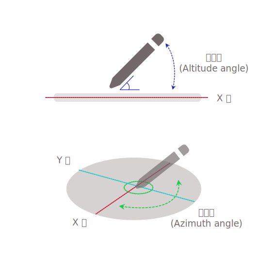

{{ APIRef("Pointer Events") }}{{SeeCompatTable}}

**`altitudeAngle`** は {{domxref("PointerEvent")}} インターフェイスの読み取り専用のプロパティで、トランスデューサー（ポインターまたはスタイラス）の軸と端末画面の X-Y 平面の間の角度を表します。
高度角 (altitude angle) は、トランスデューサーが画面に対して垂直であるか、平行であるか、またはその中間の角度であるかを示します。

特定のハードウェアやプラットフォームによっては、ユーザーエージェントが画面平面に相対するトランスデューサーの方向として、{{domxref("PointerEvent.tiltx", "tiltX")}} と {{domxref("PointerEvent.tilty", "tiltY")}}、または `altitudeAngle` と {{domxref("PointerEvent.azimuthAngle", "azimuthAngle")}} のいずれか一組の値しか受け取らない可能性があります。



このプロパティの追加の説明については、[仕様書の Figure 4](https://w3c.github.io/pointerevents/#figure_altitudeAngle) を参照してください。

## 値

`0` から `π/2` までのラジアンにおける角度で、`0` は機器の表面（X-Y 平面）と平行であり、 `π/2` は表面に対して垂直です。
既定では `π/2`（表面に対して垂直）となり、[タッチイベントにおける `altitudeAngle`](https://w3c.github.io/touch-events/#dom-touch-altitudeangle) の既定値である `0`（表面に対して並列）とは異なります。傾きや角度を報告しないハードウェアやプラットフォームでは、値は `π/2` となります。

## 例

```js
someElement.addEventListener(
  "pointerdown",
  (event) => {
    process_angles(event.altitudeAngle, event.azimuthAngle);
  },
  false,
);
```

## 仕様書

{{Specifications}}

## ブラウザーの互換性

{{Compat}}

## 関連情報

- {{ domxref("PointerEvent.azimuthAngle") }}
- {{ domxref("PointerEvent.tiltX") }}
- {{ domxref("PointerEvent.tiltY") }}
