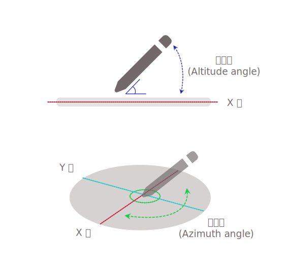

{{ APIRef("Pointer Events") }}{{SeeCompatTable}}

**`azimuthAngle`** は {{domxref("PointerEvent")}} インターフェイスの読み取り専用プロパティで、 Y-Z 平面と、トランスデューサー（ポインターまたはスタイラス）の軸および Y 軸の両方を含む平面との間の角度を表します。

特定のハードウェアやプラットフォームによっては、ユーザーエージェントが画面平面に相対するトランスデューサーの方向として、{{domxref("PointerEvent.tiltx", "tiltX")}} と {{domxref("PointerEvent.tilty", "tiltY")}}、または {{domxref("PointerEvent.altitudeAngle", "altitudeAngle")}} と `azimuthAngle` のいずれか一組の値しか受け取らない可能性があります。



このプロパティの追加の説明については、[仕様書の Figure 5](https://w3c.github.io/pointerevents/#figure_azimuthAngle) を参照してください。

## 値

`0` から `2π` までのラジアンによる角度で、`0` は X-Y 平面上で、キャップが X 値の増加方向（真下に見て「3 時」の方向）を向いているトランスデューサーを表します。時計回りに進むにつれて値が徐々に増加します（「6 時」の位置で`π/2`、「9 時」の位置で`π`、「12 時」の位置で`3π/2`）。

トランスデューサーが表面に対して垂直（{{domxref("PointerEvent.altitudeAngle", "altitudeAngle")}} が `π/2`）の場合、値は 0 になります。
傾きや角度を報告しないハードウェアやプラットフォームでは、値は `0` です。

## 例

```js
someElement.addEventListener(
  "pointerdown",
  (event) => {
    process_angles(event.altitudeAngle, event.azimuthAngle);
  },
  false,
);
```

## 仕様書

{{Specifications}}

## ブラウザーの互換性

{{Compat}}

## 関連情報

- {{ domxref("PointerEvent.altitudeAngle") }}
- {{ domxref("PointerEvent.tiltX") }}
- {{ domxref("PointerEvent.tiltY") }}
