{{DefaultAPISidebar("Service Workers API")}}

この記事はサービスワーカーを使い始めるための情報を提供するページです。基本的な構造、サービスワーカーの登録、新しいサービスワーカーのインストールと有効化のプロセス、サービスワーカーの更新、キャッシュやレスポンスの操作を含めた、オフラインで動作するシンプルなアプリケーションの機能についてです。

## サービスワーカーの前提条件

ウェブユーザーが長年苦しめられてきた主要な問題の一つは、接続を失うことです。世界中の最高のウェブアプリは、ダウンロードできないときの使い勝手が最悪でした。これまでにも、この問題を解決するための技術を生み出す試みはさまざまに行われ、いくつかの問題は解決されてきました。しかし、一番の問題は、資産のキャッシュとカスタムネットワークリクエストのための優れた全体的な制御メカニズムが存在しなかったことです。

このような課題を修正したのがサービスワーカーです。サービスワーカーを使用すると、キャッシュ資産を最初に使用するようにアプリを設定することができ、したがってネットワークからより多くのデータを取得する前に、オフラインの場合でも既定の使い勝手を提供することができます（一般に「オフラインファースト」と呼ばれます）。これはネイティブアプリですでに利用できることで、ウェブアプリよりもネイティブアプリが多く選ばれる主な理由のひとつです。

サービスワーカーはプロキシーサーバーのように機能し、リクエストやレスポンスを自分自身でキャッシュに置き換えて変更することができます。

## サービスワーカーを実行するための設定

サービスワーカーは、現代のすべてのブラウザーで、既定で有効になっています。サービスワーカーを使用してコードを実行するには、コードを HTTPS で提供する必要があります。サービスワーカーは、セキュリティ上の理由から HTTPS を介して実行するように制限されています。HTTPS に対応しているサーバーが必要です。実験をホスティングするには、GitHub、Netlify、Vercel などのサービスを使用することができます。ローカル開発を容易にするために、`localhost` はブラウザーでも安全なオリジンとみなされます。

## 基本構造

サービスワーカーでは、基本的なセットアップの際に下記のステップが一般的に見られます。

1. サービスワーカーのコードが読み取られ、[`serviceWorkerContainer.register()`](/ja/docs/Web/API/ServiceWorkerContainer/register) を通して登録されます。成功した場合、サービスワーカーは [`ServiceWorkerGlobalScope`](/ja/docs/Web/API/ServiceWorkerGlobalScope) で実行されます。これは根本的に特殊なワーカーコンテキストで、メインスレッドから独立しており、 DOM へのアクセスもありません。
2. インストールが行われます。`install` イベントは常にサービスワーカーに送られる最初のイベントです（これを使用して IndexedDB を設定したり、サイト資産をキャッシュしたりするプロセスを開始することができます）。この段階では、アプリケーションはオフラインで使用するためのすべての準備をします。
3. `install` ハンドラーが完了すると、サービスワーカーはインストールされたと見なされます。この時点で、前回までのバージョンのサービスワーカーがアクティブになっており、ページを開くための制御をしている可能性があります。同じサービスワーカーの異なる2つのバージョンを同時に実行することは避けたいので、新しいバージョンはまだアクティブにはなりません。
4. 古いバージョンのサービスワーカーによって制御されているページがすべて閉じられたら、古いバージョンを引退させても問題なくなり、新しくインストールしたサービスワーカーは `activate` イベントを受け取ります。`activate` の主な使用目的は、以前のバージョンのサービスワーカーで使用していたリソースをクリーンアップすることです。新しいサービスワーカーは [`skipWaiting()`](/ja/docs/Web/API/ServiceWorkerGlobalScope/skipWaiting) を呼び出すことで、開いているページが閉じられるのを待たずにすぐにアクティブ化することをリクエストすることができます。新しいサービスワーカーは直ちに `activate` を受け取り、開いているページを引き継ぎます。
5. 有効化後、サービスワーカーはこれでページを制御するようになりますが、それは `register()` が成功した後に開かれたページだけです。言い換えれば、文書が実際に制御下に入るには、再読み込みが必要です。これは、文書におけるサービスワーカーの有無はライフサイクルの開始時に決まり、終了時までその状態が維持されるからです。サービスワーカーが [`clients.claim()`](/ja/docs/Web/API/Clients/claim) を呼び出すと、この既定の動作を上書きして、開いているページに関与することができます。
6. 新しいバージョンのサービスワーカーが取得されるたびに、このサイクルが繰り返され、新しいバージョンのアクティブ化時に前回バージョンの残骸が掃除されます。



利用可能なサービスワーカーのイベントの概要は次の通りです。

- [`install`](/ja/docs/Web/API/ServiceWorkerGlobalScope/install_event)
- [`activate`](/ja/docs/Web/API/ServiceWorkerGlobalScope/activate_event)
- [`message`](/ja/docs/Web/API/ServiceWorkerGlobalScope/message_event)
- 機能イベント
  - [`fetch`](/ja/docs/Web/API/ServiceWorkerGlobalScope/fetch_event)
  - [`sync`](/ja/docs/Web/API/ServiceWorkerGlobalScope/sync_event)
  - [`push`](/ja/docs/Web/API/ServiceWorkerGlobalScope/push_event)

### デモ

サービスワーカーの登録とインストールのごく基本的なことを示すために、[シンプルなサービスワーカー](https://github.com/mdn/dom-examples/tree/main/service-worker/simple-service-worker) というシンプルなデモを作成しました。これは、シンプルな Star Wars レゴの画像ギャラリーです。これは、プロミスを利用した関数で、 JSON オブジェクトから画像データを読み込み、 [`fetch()`](/ja/docs/Web/API/Fetch_API/Using_Fetch) を用いて画像を読み込んでから、ページの下に画像を並べて表示するものです。今のところ静的でシンプルなものにしています。また、サービスワーカーを登録、インストール、アクティブ化しています。


[GitHub 上のソースコード](https://github.com/mdn/dom-examples/tree/main/service-worker/simple-service-worker)を確認し、[例をライブで表示](https://bncb2v.csb.app/)してみましょう。

### ワーカーの登録

このアプリの JavaScript ファイルである `app.js` の最初のコードブロックは、以下の通りです。これは、サービスワーカーを使用するためのエントリーポイントです。

```js
const registerServiceWorker = async () => {
  if ("serviceWorker" in navigator) {
    try {
      const registration = await navigator.serviceWorker.register("/sw.js", {
        scope: "/",
      });
      if (registration.installing) {
        console.log("Service worker installing");
      } else if (registration.waiting) {
        console.log("Service worker installed");
      } else if (registration.active) {
        console.log("Service worker active");
      }
    } catch (error) {
      console.error(`Registration failed with ${error}`);
    }
  }
};

// …

registerServiceWorker();
```

1. `if` ブロックは、登録を試みる前にサービスワーカーに対応しているか確認する機能検出試験を行います。
2. 次に、[`ServiceWorkerContainer.register()`](/ja/docs/Web/API/ServiceWorkerContainer/register) 関数を使って、このサイトのサービスワーカーを登録します。サービスワーカーのコードはアプリ内にあります（なお、これはオリジンからのファイルの相対 URL であって、それを参照している JS ファイルではありません）。
3. `scope` 引数はオプションで、サービスワーカーが制御するコンテンツのサブセットを指定することができます。このケースでは `'/'` を指定しており、アプリのオリジン配下のすべてのコンテンツを意味しています。もしこれを指定しなくてもこの値が既定値になりますが、指定方法を示すために使用しています。

これは、ワーカーのコンテキストで実行されるサービスワーカーを登録しているため、 DOM にはアクセスしていません。

1 つのサービスワーカーで、多数のページを制御することができます。スコープ内のページが読み込まれるたびに、サービスワーカーはそのページにインストールされて動作します。そのため、サービスワーカースクリプト内でのグローバル変数の扱いには注意が必要だということを心にとどめておいてください。各ページが固有のワーカーを持つわけではありません。

> **メモ:** サービスワーカーの良いところは、以上で見てきたような機能の検出をすることで、サービスワーカーに対応していないブラウザーでもオンラインで期待通りの流儀でアプリを使用することができることです。

#### サービスワーカーの登録に失敗する理由

次の可能性が考えられます。

- HTTPS を使用してアプリケーションを実行していない。
- サービスワーカーファイルへのパスが正しく書かれていない。 — アプリのルートディレクトリではなく、アプリのオリジンからの相対パスで書く必要があります。上記の例では、ワーカーが `https://bncb2v.csb.app/sw.js` にあり、アプリのルートは `https://bncb2v.csb.app/` です。しかし、パスは `/sw.js` と書く必要があります。
- 指定されているサービスワーカーがアプリとは異なるオリジンにある。これは許可されていません。
- サービスワーカーはサービスワーカーのスコープ内にあるクライアントからのリクエストのみを取得します。
- サービスワーカーの最大スコープは、ワーカーのある場所です。
- サービスワーカーの最大スコープはワーカーの位置です（言い換えれば、スクリプト `sw.js` が `/js/sw.js` にある場合、 既定では `/js/` 以下の URL しか制御できません）。サービスワーカーの最大スコープのリストは [`Service-Worker-Allowed`](/ja/docs/Web/HTTP/Header/Service-Worker-Allowed) ヘッダーで指定することができます。
- Firefoxでは、ユーザーが[プライベートブラウジングモード](https://bugzil.la/1320796)である場合、履歴が無効である場合、Firefox を閉じたときに Cookie がクリアされる場合、サービスワーカーの API は隠され使用することができません。
- Chrome の場合、「すべての Cookie をブロックする（推奨しない）」オプションが有効になっていると、登録に失敗します。

### インストールとアクティブ化: キャッシュの作成

サービスワーカーを登録した後、ブラウザーはページ/サイト上でサービスワーカーをインストールおよびアクティブ化しようとします。

インストールが成功裡に完了したとき、 `install` イベントが発行されます。通常、 `install` イベントはオフラインで実行する必要のある資産を、ブラウザーのオフラインキャッシュ領域に配置するために使われます。これをするために、サービスワーカーのストレージ API — [`cache`](/ja/docs/Web/API/Cache) — を使用します。キャッシュはサービスワーカーのグローバルオブジェクトで、レスポンスによって配信された資産を、そのリクエストをキーにして保存することができます。この API はブラウザーの標準キャッシュと同じように動作しますが、そのドメインに特化しています。キャッシュのコンテンツは、クリアするまで保持されます。

サービスワーカーが `install` イベントを扱う方法の例です。

```js
const addResourcesToCache = async (resources) => {
  const cache = await caches.open("v1");
  await cache.addAll(resources);
};

self.addEventListener("install", (event) => {
  event.waitUntil(
    addResourcesToCache([
      "/",
      "/index.html",
      "/style.css",
      "/app.js",
      "/image-list.js",
      "/star-wars-logo.jpg",
      "/gallery/bountyHunters.jpg",
      "/gallery/myLittleVader.jpg",
      "/gallery/snowTroopers.jpg",
    ]),
  );
});
```

1. ここでは サービスワーカー（thisによって）にイベントリスナーを追加して、イベントに [`ExtendableEvent.waitUntil()`](/ja/docs/Web/API/ExtendableEvent/waitUntil) メソッドをチェーンしています ― これは `waitUntil()` の内部のコードが成功裡に実行されるまで、サービスワーカーがインストールされないことを保証します。
2. `addResourcesToCache()` の内部で、 [`caches.open()`](/ja/docs/Web/API/CacheStorage/open) を使用して、 `v1` と呼ばれる新しいキャッシュを作成します。これはサイトリソースキャッシュのバージョン 1 となります。次に、作成されたキャッシュに対して `addAll()` を呼び出す関数を呼び出します。この関数の引数には、キャッシュしたいすべてのリソースのオリジンからの相対 URL の配列が渡されます。URL はワーカーの {{domxref("WorkerGlobalScope.location", "location", "", 1)}} からの相対パスです。
3. プロミスが拒否された場合、インストールが失敗し、ワーカーは何もしません。これは、コードを修正し、次に登録が発生したときに再試行することができるので、問題ありません。
4. インストールに成功すると、サービスワーカーがアクティブになります。これは、サービスワーカーの初回インストール/アクティベーション時にはあまり明確な用途はありませんが、サービスワーカーが更新された時にはより大きな意味を持ちます（後の [サービスワーカーの更新](#サービスワーカーの更新)の節を参照してください）。

> **メモ:** [ウェブストレージ API (`localStorage`)](/ja/docs/Web/API/Web_Storage_API) はサービスワーカーキャッシュと同じように動作しますが、同期処理であるため、サービスワーカー内では許可されていません。

> **メモ:** 必要であれば、 [IndexedDB](/ja/docs/Web/API/IndexedDB_API) をサービスワーカー内でデータ保存のために使用することができます。

### リクエストに対するカスタムレスポンス

サイトの資産がキャッシュされたので、サービスワーカーにキャッシュされたコンテンツを使って何かするように指示する必要があります。これは `fetch` イベントを使って実現できます。

1. `fetch` イベントが発行されるたび、指定されたスコープ内の文書とこれらの文書が参照するすべてのリソースを含む、サービスワーカーによって制御されたリソースの取得します（例えば、`index.html` が画像を埋め込むためにオリジン間リクエストを行うと、サービスワーカーを通過します）。

2. `fetch` イベントリスナーをサービスワーカーに割り当てると、そのイベント上で `respondWith()` を呼び出すことで、 HTTP レスポンスを乗っ取ってコンテンツを更新することができます。

   ```js
   self.addEventListener("fetch", (event) => {
     event.respondWith(/* カスタムコンテンツはこちら */);
   });
   ```

3. それぞれのケースで、ネットワークリクエストの URL と一致するリソースでレスポンスすることから始めることができる。

   ```js
   self.addEventListener("fetch", (event) => {
     event.respondWith(caches.match(event.request));
   });
   ```

   `caches.match(event.request)` は、ネットワークからリクエストされた各リソースを、キャッシュにある同等のリソースが利用可能であれば、マッチングさせることができるようにします。マッチングは、通常の HTTP リクエストと同様に、URL と様々なヘッダーを介して行われます。


## 失敗したリクエストの復旧

では、 `caches.match(event.request)` はサービスワーカーのキャッシュに一致するものがある場合は良いのですが、一致しない場合はどうでしょうか？もし、何らかの失敗処理を提供しなければ、プロミスは `undefined` で解決され、何も返されないでしょう。

キャッシュからのレスポンスをテストした後、通常のネットワークリクエストにフォールバックすることができます。

```js
const cacheFirst = async (request) => {
  const responseFromCache = await caches.match(request);
  if (responseFromCache) {
    return responseFromCache;
  }
  return fetch(request);
};

self.addEventListener("fetch", (event) => {
  event.respondWith(cacheFirst(event.request));
});
```

キャッシュにないリソースは、ネットワークからリクエストされます。

もっと複雑な戦略を用いると、ネットワークからリソースを要求するだけでなく、キャッシュに保存して、後でそのリソースに対するリクエストをオフラインで取得できるようにすることができます。つまり、Star Warsのギャラリーに画像が追加されたら、アプリが自動的に画像を取得してキャッシュすることができるのです。以下は、このような戦略を実装するためのスニペットです。

```js
const putInCache = async (request, response) => {
  const cache = await caches.open("v1");
  await cache.put(request, response);
};

const cacheFirst = async (request) => {
  const responseFromCache = await caches.match(request);
  if (responseFromCache) {
    return responseFromCache;
  }
  const responseFromNetwork = await fetch(request);
  putInCache(request, responseFromNetwork.clone());
  return responseFromNetwork;
};

self.addEventListener("fetch", (event) => {
  event.respondWith(cacheFirst(event.request));
});
```

リクエスト URL がキャッシュにない場合、 `await fetch(request)` でネットワークリクエストからリソースをリクエストします。その後、レスポンスのクローンをキャッシュに格納します。 `putInCache()` 関数は `caches.open('v1')` と `cache.put()` を使用して、リソースをキャッシュに追加します。本来のレスポンスはブラウザーに返され、それを呼び出したページに渡されます。

リクエストストリームとレスポンスストリームは一度しか読み込めないので、レスポンスの複製を作成する必要があります。ブラウザーにレスポンスを返してキャッシュに入れるには、それを複製する必要があります。つまり、オリジナルはブラウザーに返され、クローンはキャッシュに送られます。これらはそれぞれ一度だけ読み込まれます。

少し奇妙に見えるのは、 `putInCache()` が返すプロミスが待ち状態でないことです。しかしその理由は、レスポンスクローンがキャッシュに追加されるまで、レスポンスを返すのを待ちたくないからです。

今ある唯一の問題は、リクエストがキャッシュに何も一致せず、ネットワークも利用できない場合、やはりリクエストは失敗してしまうということです。何が起こっても、ユーザーは少なくとも何かを得ることができるように、既定の代替処理を提供することにしましょう。

```js
const putInCache = async (request, response) => {
  const cache = await caches.open("v1");
  await cache.put(request, response);
};

const cacheFirst = async ({ request, fallbackUrl }) => {
  // First try to get the resource from the cache
  const responseFromCache = await caches.match(request);
  if (responseFromCache) {
    return responseFromCache;
  }

  // Next try to get the resource from the network
  try {
    const responseFromNetwork = await fetch(request);
    // response may be used only once
    // we need to save clone to put one copy in cache
    // and serve second one
    putInCache(request, responseFromNetwork.clone());
    return responseFromNetwork;
  } catch (error) {
    const fallbackResponse = await caches.match(fallbackUrl);
    if (fallbackResponse) {
      return fallbackResponse;
    }
    // when even the fallback response is not available,
    // there is nothing we can do, but we must always
    // return a Response object
    return new Response("Network error happened", {
      status: 408,
      headers: { "Content-Type": "text/plain" },
    });
  }
};

self.addEventListener("fetch", (event) => {
  event.respondWith(
    cacheFirst({
      request: event.request,
      fallbackUrl: "/gallery/myLittleVader.jpg",
    }),
  );
});
```

この代替画像を選択したのは、失敗する可能性のあるアップデートは新しい画像だけで、他のすべては先に見た `install` イベントのリスナーでのインストールに依存しているためです。

## サービスワーカーのナビゲーション先読み

有効にすると、[ナビゲーション先読み](/ja/docs/Web/API/NavigationPreloadManager)機能は、フェッチリクエストがなされるとすぐに、サービスワーカーのアクティブ化と並行してリソースのダウンロードを開始します。
これにより、サービスワーカーがアクティブ化するまで待つ必要がなく、ページへのナビゲーションですぐにダウンロードが開始されるようになります。
この遅延は比較的稀にしか発生しませんが、発生した場合は避けられないものであり、重大なものになる可能性があります。

まず、サービスワーカーアクティブ化時に [`registration.navigationPreload.enable()`](/ja/docs/Web/API/NavigationPreloadManager/enable) を使ってこの機能を有効にする必要があります。

```js
self.addEventListener("activate", (event) => {
  event.waitUntil(self.registration?.navigationPreload.enable());
});
```

そして、[`event.preloadResponse`](/ja/docs/Web/API/FetchEvent/preloadResponse) を使って `fetch` イベントハンドラーの中で先読みされたリソースのダウンロードが終了するのを待ちます。

前の節の例に引き続き、キャッシュチェックの後に先読みされたリソースを待機し、成功しなかった場合はネットワークから取得するコードを挿入します。

新しい処理は次の通りです。

1. キャッシュをチェック
2. `event.preloadResponse` を待ちます。これは `preloadResponsePromise` として `cacheFirst()` 関数に渡されます。結果が返ってきたら、それをキャッシュします。
3. どちらも定義されていない場合は、ネットワークに行きます。

```js
const addResourcesToCache = async (resources) => {
  const cache = await caches.open("v1");
  await cache.addAll(resources);
};

const putInCache = async (request, response) => {
  const cache = await caches.open("v1");
  await cache.put(request, response);
};

const cacheFirst = async ({ request, preloadResponsePromise, fallbackUrl }) => {
  // First try to get the resource from the cache
  const responseFromCache = await caches.match(request);
  if (responseFromCache) {
    return responseFromCache;
  }

  // Next try to use (and cache) the preloaded response, if it's there
  const preloadResponse = await preloadResponsePromise;
  if (preloadResponse) {
    console.info("using preload response", preloadResponse);
    putInCache(request, preloadResponse.clone());
    return preloadResponse;
  }

  // Next try to get the resource from the network
  try {
    const responseFromNetwork = await fetch(request);
    // response may be used only once
    // we need to save clone to put one copy in cache
    // and serve second one
    putInCache(request, responseFromNetwork.clone());
    return responseFromNetwork;
  } catch (error) {
    const fallbackResponse = await caches.match(fallbackUrl);
    if (fallbackResponse) {
      return fallbackResponse;
    }
    // when even the fallback response is not available,
    // there is nothing we can do, but we must always
    // return a Response object
    return new Response("Network error happened", {
      status: 408,
      headers: { "Content-Type": "text/plain" },
    });
  }
};

// Enable navigation preload
const enableNavigationPreload = async () => {
  if (self.registration.navigationPreload) {
    await self.registration.navigationPreload.enable();
  }
};

self.addEventListener("activate", (event) => {
  event.waitUntil(enableNavigationPreload());
});

self.addEventListener("install", (event) => {
  event.waitUntil(
    addResourcesToCache([
      "/",
      "/index.html",
      "/style.css",
      "/app.js",
      "/image-list.js",
      "/star-wars-logo.jpg",
      "/gallery/bountyHunters.jpg",
      "/gallery/myLittleVader.jpg",
      "/gallery/snowTroopers.jpg",
    ]),
  );
});

self.addEventListener("fetch", (event) => {
  event.respondWith(
    cacheFirst({
      request: event.request,
      preloadResponsePromise: event.preloadResponse,
      fallbackUrl: "/gallery/myLittleVader.jpg",
    }),
  );
});
```

この例では、リソースを「通常」ダウンロードしても先読みしても、同じデータをダウンロードしてキャッシュすることに注意してください。代わりに、先読み時に別のリソースをダウンロードし、キャッシュするように選択することもできます。詳細については、[`NavigationPreloadManager` > カスタムレスポンス](/ja/docs/Web/API/NavigationPreloadManager#カスタムレスポンス)を参照してください。

## サービスワーカーの更新

サービスワーカーが以前にインストールされているが、ページの更新や読み込みの時に新しいバージョンのワーカーが利用できる場合、新しいバージョンはバックグラウンドでインストールされますが、まだアクティブ化しません。まだ古いサービスワーカーを使用している読み込まれたページがなくなったら、新しいサービスワーカーがアクティブ化します。

> **メモ:** [`Clients.claim()`](/ja/docs/Web/API/Clients/claim) を使用して、これを回避することが可能です。

新しいサービスワーカーで、 `install` イベントリスナーをこのようなもの（新しいバージョン番号を通知するもの）に更新したくなるでしょう。

```js
const addResourcesToCache = async (resources) => {
  const cache = await caches.open("v2");
  await cache.addAll(resources);
};

self.addEventListener("install", (event) => {
  event.waitUntil(
    addResourcesToCache([
      "/",
      "/index.html",
      "/style.css",
      "/app.js",
      "/image-list.js",

      // …

      // 新しいバージョンのための新しい他のリソースを入れてください...
    ]),
  );
});
```

サービスワーカーをインストールしている間、以前のバージョンはまだフェッチに対してレスポンスします。新しいバージョンは、バックグラウンドでインストールされています。以前の `v1` キャッシュを妨げないように、新しいキャッシュを `v2` と呼んでいます。

どのページも前回のバージョンを使用していないとき、新しいワーカーが有効化し、フェッチにレスポンスするようになります。

### 古いキャッシュの削除

前の節で見たように、サービスワーカーを新しいバージョンに更新するとき、その `install` イベントハンドラーで新しいキャッシュを作成します。前回バージョンのワーカーによって制御される開くためのページがある一方で、前回バージョンのキャッシュが必要なので、両方のキャッシュを保持する必要があります。前のキャッシュからデータを削除するには `activate` イベントを使用します。

`waitUntil()` に渡されたプロミスは、完了するまで他のイベントをブロックするので、新しいキャッシュ上で初めての `fetch` イベントを取得するときには、クリーンアップ操作が完了していると確信できます。

```js
const deleteCache = async (key) => {
  await caches.delete(key);
};

const deleteOldCaches = async () => {
  const cacheKeepList = ["v2"];
  const keyList = await caches.keys();
  const cachesToDelete = keyList.filter((key) => !cacheKeepList.includes(key));
  await Promise.all(cachesToDelete.map(deleteCache));
};

self.addEventListener("activate", (event) => {
  event.waitUntil(deleteOldCaches());
});
```

## 開発者ツール

- [Chrome](https://www.chromium.org/blink/serviceworker/service-worker-faq/)
- [Firefox](https://firefox-source-docs.mozilla.org/devtools-user/application/service_workers/index.html)
  - [Firefox のツールバーのカスタマイズオプション](https://support.mozilla.org/en-US/kb/customize-firefox-controls-buttons-and-toolbars)で利用できる「このサイトを忘れる」ボタンは、サービスワーカーとそのキャッシュを消去するために使用できます。
- [Edge](https://learn.microsoft.com/en-us/microsoft-edge/devtools-guide-chromium/service-workers/)

## 関連情報

- [プロミス](/ja/docs/Web/JavaScript/Reference/Global_Objects/Promise)
- [ウェブワーカーの使用](/ja/docs/Web/API/Web_Workers_API/Using_web_workers)
