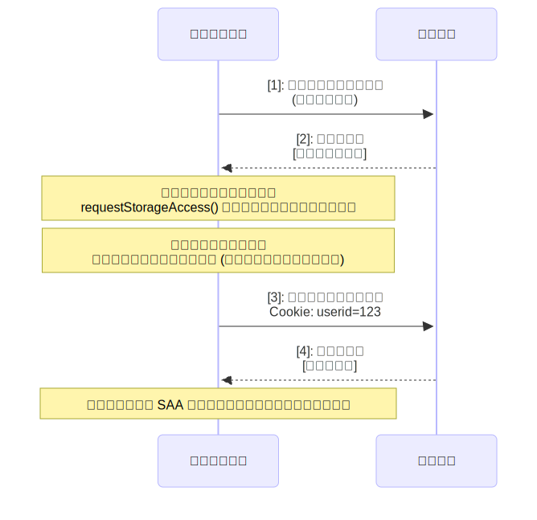
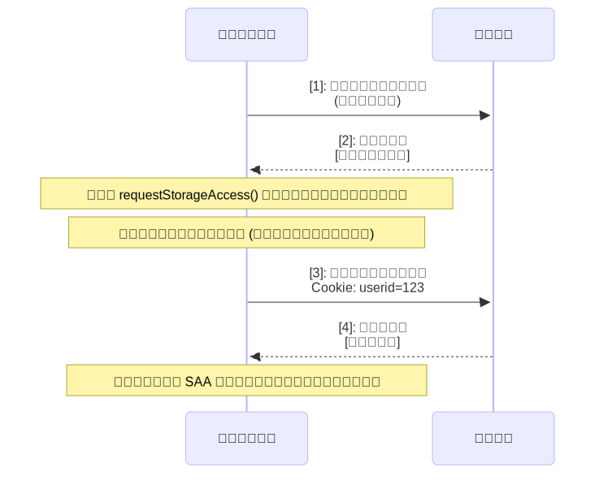
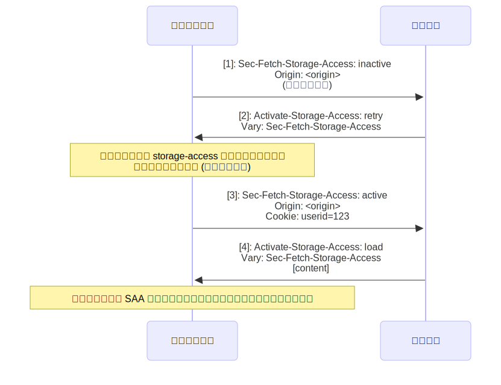
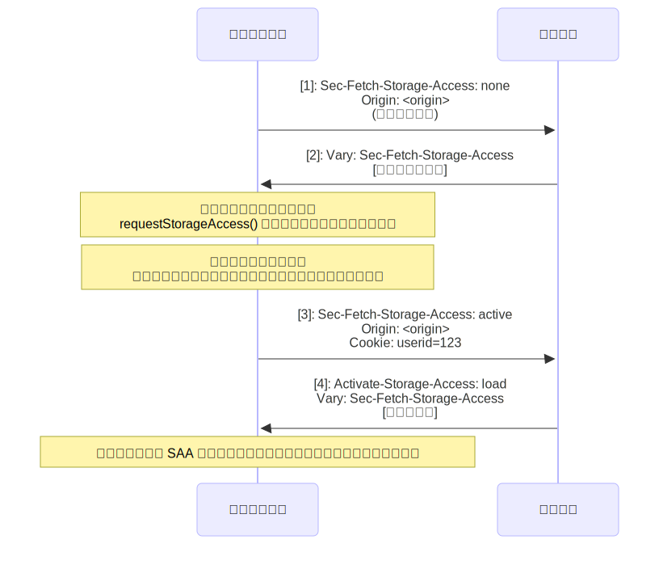

{{DefaultAPISidebar("Storage Access API")}}{{securecontext_header}}

ストレージアクセス API (Storage Access API) は、サードパーティコンテキスト（つまり、{{htmlelement("iframe")}} に埋め込まれたもの）で読み込まれたクロスサイトコンテンツに、[サードパーティクッキー](/ja/docs/Web/Privacy/Guides/Third-party_cookies)や[パーティション化されていない状態](/ja/docs/Web/Privacy/Guides/State_Partitioning#state_partitioning)にアクセスする手段を提供します。これらは通常、ファーストパーティのコンテキスト（つまり、ブラウザーのタブに直接読み込まれた場合）でのみアクセス可能なものです。

ストレージアクセス API は、プライバシーを改善する（例えば、追跡の防止など）ことを目的として、デフォルトでサードパーティクッキーおよびパーティション化されていない状態へのアクセスをブロックするユーザーエージェントに関連しています。サードパーティクッキーやパーティション分割されていない状態には、こうしたデフォルトの制限が適用されている場合でも、引き続き有効にしておきたい正当な用途があります。例としては、連合 ID プロバイダー (IdP) とのシングルサインオン (SSO) や、位置情報や環境設定などのユーザーデータを異なるサイト間で維持することが挙げられます。

この API は、埋め込みリソースが現在サードパーティクッキーへのアクセス権を持っているかどうかを調べ、持っていない場合はユーザーエージェントにアクセスをリクエストするためのメソッドを提供します。

## 概念と使用方法

ブラウザーには、サードパーティークッキーやパーティション化されていない状態へのアクセスを制限する、いくつかのストレージアクセス機能やポリシーが実装されています。これらは、それぞれの最上位オリジン下の埋め込みリソースに固有のクッキー保存空間を割り当てるもの（[パーティション化されたクッキー](#unpartitioned_versus_partitioned_cookies)）から、リソースがサードパーティーコンテキストで読み込まれた際のクッキーへのアクセスを完全にブロックするものまで多岐にわたります。

サードパーティクッキーおよびパーティション分割されていない状態のブロック機能やポリシーに関する意味づけはブラウザーによって異なりますが、中核となる機能は類似しています。サードパーティのコンテキストに埋め込まれたクロスサイトリソースは、ファーストパーティのコンテキストで読み込まれた場合にアクセスできるのと同じ状態にはアクセスできません。これは善意に基づく措置であり、ブラウザーベンダーはユーザーのプライバシーとセキュリティをより適切に保護するための対策を講じようとしています。その例としては、異なるサイト間でユーザーの行動が追跡されるリスクを低減することや、クロスサイトリクエストフォージェリー（{{glossary(「CSRF」)}}）などの悪用に対する脆弱性を軽減することが挙げられます。

しかし、サードパーティクッキーやパーティション化されていない状態にアクセスする埋め込みクロスサイトコンテンツには正当な用途があり、以上に記載された機能やポリシーによってこれらが機能しなくなることが知られています。例えば、それぞれ異なる製品へのアクセスを提供する一連のサイトがあるとします。`heads-example.com`、`shoulders-example.com`、`knees-example.com`、`toes-example.com`といった具合です。

あるいは、ローカライズのために、コンテンツやサービスを国別のドメイン（`example.com`、`example.ua`、`example.br` など）に別個に分けるなどの方法があります。

SSO (`sso-example.com`) や一般的なパーソナライズサービス (`services-example.com`) などを提供するために、他のすべてのサイトに要素が埋め込まれたユーティリティサイトを持つことができるかもしれません。これらのユーティリティサイトは、クッキーを通じて、自身が埋め込まれているサイトと状態を共有したいと考えるでしょう。異なるドメインにあるためファーストパーティクッキーを共有することはできず、サードパーティクッキーは、それらをブロックするブラウザーでは利用できなくなりました。

このような状況では、サイト運営者は多くの場合、ユーザーに対して、自分のサイトを例外として追加するか、サードパーティクッキーのブロック設定を完全に無効にするよう促します。サイトのコンテンツを引き続き利用したいユーザーは、埋め込まれたすべてのオリジンから読み込まれたリソースに対して、場合によってはすべてのウェブサイトにおいて、ブロック設定を大幅に緩和する必要があります。

ストレージアクセス API は、この問題を解決することを意図しています。埋め込まれたクロスサイトコンテンツは、{{domxref("Document.requestStorageAccess()")}} メソッドを通じて、フレームごとにサードパーティクッキーやパーティション化されていない状態への制限のないアクセスをリクエストすることができます。
同時に、{{domxref("Document.hasStorageAccess()")}} メソッドを使用して、すでにアクセス権を保有しているかどうかを調べることもできます。

> [!NOTE]
> [ストレージアクセスヘッダー](#storage_access_headers)は、API の HTTP 拡張機能であり、ストレージ API のワークフローをより効率的にすることができるものです。また、画像などの受動的なソースに対して、前回付与されたストレージアクセス権限を有効化するためにも使用することができます。

### クッキーのパーティション化と非パーティション化

ストレージアクセス API が必要となるのは、パーティション化されていないサードパーティクッキーへのアクセスを指定する場合のみです。
パーティション化されていないクッキーとは、同じサイト上で設定されたすべてのクッキーが同じクッキージャーに保存されるものを指します。これは、ウェブの黎明期から続く伝統的な方式です。
あるサイト向けのデータが他のサイトに公開されるリスクがあるため、ブラウザーは通常、リクエストにおけるパーティション化されていないサードパーティクッキーの送信をブロックし、埋め込みコンテキストでのそれらへのアクセスを許可しません。

これは、パーティション化されたクッキーとは対照的です。パーティション化されたクッキーでは、それぞれの最上位サイトの下にある埋め込みリソースに固有のクッキー保存空間が指定され、他のサイトのものとは隔離されています。
パーティション化されたクッキーでは、サイトをまたいでユーザーを追跡することができないため、プライバシー上のリスクはありません。そのため、ブラウザーはリクエストにパーティション化されたクッキーを含め、埋め込みリソースがそれらを利用できるようにします。
ただし、クッキーはサイト間で共有されないため、サイト間で自動的に同期されることもない点にご注意ください。
ブラウザーには、サードパーティクッキーへのアクセスをパーティション化するさまざまな仕組みがあります。例えば、[Firefox Total Cookie Protection](https://blog.mozilla.org/en/mozilla/firefox-rolls-out-total-cookie-protection-default-to-all-users-worldwide/) や [Cookies Having Independent Partitioned State (CHIPS)](/ja/docs/Web/Privacy/Guides/Privacy_sandbox/Partitioned_cookies) などがあります。

ストレージアクセス API の文脈でサードパーティクッキーについて言及する場合、それは暗黙のうちにパーティション化されていないサードパーティクッキーです。

### 動作の仕組み

{{htmlelement("iframe")}} に埋め込まれたサードパーティーコンテンツで、クッキーやその他のパーティション化されていない状態にアクセスする必要がある場合は、次のようにストレージアクセス API を使用してアクセスをリクエストできます。

1. {{domxref("Document.hasStorageAccess()")}} を呼び出すことで、埋め込みコンテンツがすでにパーティション化されていないクッキーへアクセスできるかどうかを調べることができます。
2. そうでない場合は、{{Glossary("transient activation", "一時的な活性化")}}を使用して {{domxref("Document.requestStorageAccess()")}} を呼び出し、`storage-access` 権限をリクエストすることができます。

   ブラウザーによっては、リクエスト元の埋め込みに対してその権限を付与するかどうかをユーザーに依頼する方法が、若干異なる場合があります。
   - Safari では、これまでストレージへのアクセス許可を得ていないすべての埋め込みコンテンツに対して、確認メッセージが表示されます。
   - Firefox では、あるオリジンが閾値を超える数のサイトでストレージへのアクセスをリクエストした場合にのみ、ユーザーに確認を求めます。
   - Chrome では、これまでストレージへのアクセス許可を得ていないすべての埋め込みコンテンツに対して、確認メッセージが表示されます。
     ただし、埋め込みコンテンツと埋め込み元サイトが同じ[関連ウェブサイトセット](/ja/docs/Web/API/Storage_Access_API/Related_website_sets)に属している場合は、自動的にアクセス権を付与し、確認のメッセージをスキップします。

3. コンテンツがすべてのセキュリティ要件を満たしているかどうかに基づいて、許可または拒否が行われます。一般的な要件については[セキュリティに関する考慮事項](#セキュリティの考慮事項)を、一部のブラウザー固有のセキュリティ要件については[ブラウザーごとの違い](#ブラウザー固有の違い)を参照してください。
   `requestStorageAccess()` はプロミス ({{jsxref("Promise")}}) を基盤としているため、成功時と失敗時の場合を処理するコードを実行することができます。

   許可が与えられると、`<最上位サイト、埋め込みサイト>`という形式の許可キーがブラウザーに格納されます。
   例えば、埋め込み元サイトが `embedder.com` で、埋め込み先が `locator.example.com` の場合、キーは `<embedder.com, example.com>` となります。

   これは、`embedder.com` サイトの任意のページに埋め込まれた `example.com` サイトまたはそのサブドメイン上の任意のページに対して、パーティション化されていないクッキーへのアクセスが許可されることを意味します。
   例えば、`docs.example.com` や `profile.example.com` では、`requestStorageAccess()` を呼び出すことができ、プロミスは自動的に履行されるようになります。

   > [!NOTE]
   > 古い仕様では、より具体的な権限キー構造 `<最上位サイト、埋め込みオリジン>` が使用されていました。これは、同一サイト内のクロスオリジン埋め込みが権限キーと一致せず、別途全プロセスを踏む必要があったことを意味していました。

4. それぞれのコンテキストに対して、その権限を明示的に有効にする必要があります。

   埋め込み要素に権限が付与されると、その権限は現在のコンテキストで同時に有効になります。
   ただし、新しいブラウザータブや、ページ内の他の {{htmlelement("iframe")}} 要素内のコンテンツなど、他のコンテキストでは、デフォルトでサードパーティクッキーへのアクセスがブロックされています。
   つまり、権限が付与されていても、ページが読み込まれ、`requestStorageAccess()` を呼び出して権限を有効にする必要があります。
   すでにその権限が与えられている場合、`requestStorageAccess()` を呼び出しても一時的な活性化は必要なく、プロミスは自動的に履行されます。

   「デフォルトでブロックされる」という動作の唯一の例外は、埋め込みリソースが権限の付与または権限の有効化後、自身を再読み込みするために同一オリジンへのナビゲーションを行う場合です。
   そのような場合、ストレージへのアクセス権は前回のナビゲーションから引き継がれます。
   これにより、埋め込みリソースは自身を再読み込みし、自身のクッキーにアクセスすることができるのです。

   > [!NOTE]
   > 古い仕様では、アクセス権はページ単位で付与されていました（現在もこのモデルを使用しているのは Safari のみです）。ある埋め込み要素が `requestStorageAccess()` を通じてサードパーティクッキーへのアクセス権を取得すると、同じサイト内のそれ以外にもすべての埋め込み要素も自動的にアクセス権を取得することになります。
   > これはセキュリティの観点から望ましくない動作でした。例えば、`shop.example.com` が、ユーザーが買い物中に位置情報を利用することができるようにするために `locator.users.com` を埋め込み、`locator.users.com` が `requestStorageAccess()` を呼び出した場合、`shop.example.com` およびそこに埋め込まれた他のサイトは、自身のクッキーにアクセスできるだけでなく、意図していない `private.users.com` のクッキーにもアクセスできてしまうことになります。この変更の背景にある理由については、[こちらをご覧ください](https://github.com/privacycg/storage-access/issues/113)。

5. 埋め込みコンテンツがストレージアクセス権限を有効にした後、自動的に再読み込みされる必要があります。
   ブラウザーは、サードパーティクッキーを記載してリソースを再リクエストし、読み込まれた後に、それらを埋め込みリソースが利用できるようにします。埋め込みリソースのクロスオリジンリクエストは[同一オリジンポリシー](/ja/docs/Web/Security/Defenses/Same-origin_policy)に従うため、サードパーティクッキーは、埋め込みリソースの正確なオリジンへのリクエストにのみ送信されます。同じサイト内の他のオリジンでサードパーティクッキーにアクセスしたい場合は、別途ストレージアクセス権限を有効にする必要があります。

### ストレージアクセスヘッダー

この API では、リソースがストレージアクセス権限を有効にするには、それぞれの新しいコンテキストで `requestStorageAccess()` を呼び出す必要があり、その際、ストレージアクセス権限はすでに付与されている必要があります。
つまり、埋め込みリソースは、このメソッドを呼び出せるように、まずクッキーなしでリクエストされ、読み込まれる必要があります。

ストレージアクセスヘッダーを使用することで、サーバーがコンテキストに対する権限の有効化をリクエストできるワークフローが実現され、すでに権限が付与されている場合に、埋め込みリソースへの不要な追加負荷を避けることができます。
まずその権限をリクエストするには、リソースが読み込まれている必要があります。

ヘッダーは 2 つあります。

- ブラウザーは、リクエストに {{HTTPHeader("Sec-Fetch-Storage-Access")}} ヘッダーを追加し、現在のフェッチコンテキストのストレージアクセス状態（その権限が有効化されているか、許可されているか、または許可されていないかなど）を示します。
- リクエストのストレージアクセス状態に応じて、サーバーは {{HTTPHeader("Activate-Storage-Access")}} ヘッダーを含めたレスポンスを返すことができます。これにより、ブラウザーに対してそのコンテキストの権限を有効化し、クッキーを使用してリクエストを再試行するよう要求したり（リソースを読み込んで `requestStorageAccess()` を呼び出す必要を避けることで、同じ結果を得るようにしたり）、あるいは権限を有効化して読み込まれたリソースを返したりすることができます。

ストレージアクセスヘッダーは、コンテキストに対してすでにその権限が付与されている場合、画像などの受動的なリソースに対する権限を有効にするためにも使用することができます。
これは、例えば、ユーザー、属性、ロケールごとに異なる画像を配信するために使用されることがあります。

ワークフローについては、[ストレージアクセスヘッダーのシーケンス](#ストレージアクセスヘッダーのシーケンス)の節に示されています。

### リクエスト/レスポンスフロー

#### JavaScript シーケンス

{{htmlelement("iframe")}} 内に読み込まれたライブラリーを例に考えてみましょう。このライブラリーは複数のサイトで共有される必要があり、パーティション化されていないクッキーに格納された資格情報に依存しています。

まず、その権限が与えられていない場合について見てみましょう。

1. ブラウザーは、サードパーティーのクッキーを含めずにリソースをリクエストします。
2. サーバーは、資格情報に依存せず、読み込まれた際にクッキーを保有しない「フォールバック」バージョンのコンテンツを返します。
   - リソースが読み込まれると、`requestStorageAccess()` を一時的な活性化設定で呼び出し、`storage-access` 権限をリクエストして有効化します。
   - その権限が与えられた場合、リソースは自動的に再読み込みされます。

3. ブラウザーはリソースを再度リクエストしますが、今回はサードパーティクッキーを含めてリクエストします。
4. サーバーのレスポンスには、リソースの「認証済み」バージョンが含まれています。

ブラウザーはリソースを読み込みます。このリソースは、`storage-access` 権限を保有しているため、自身のクッキーにアクセスできます。



<!--
[](https://mermaid.live/edit#pako:eNqFks1u2zAQhF-F4MkBnEB_lmU1MWC4ufZQo5dGOdDkWiYikSq5StoafveuRCgIHBjVRdrBfrOrIU9cWgW85B5-9WAkfNWidqL9UhlGTyccaqk7YZBtGw0GP-s7cK_ggh56btfrIJbsKX4u2ffB2yNz4G3vJNzv3XpmLJPWvmjwN4ENyC3BwYXgZIR9Z40foaeDaJq9kC-EGqSe54B-swjMEs0m9LHdg2KS2j2NHcfv0DpRw0ZK8H52w940HgdTdML4gWJCon4VqK1haCeMdeBa7T2p14b98FRQagb9h-7BO6zhoLFCeabRQ3Ngs8lZG9n0CvxFEJ9DTK-EuB25kvW0gFYPcZJejTK7jPJ_CYY3C5u_aVUDjpGx3Wbz4S9DaFAZPuc1LcFLdD3MeUsdYij5aZhQcTxCCxUv6VPBQfQNVrwyZ8LoFv20tp1IZ_v6yEs6ak9V3ymB0628UB-VpjN9Fx0YBW5re4O8jFfx6MzLE__NyyRb3aWLokjyPIuyfDHnf6iHxOVimWdFvMyTNCnOc_533CS6W-ZRGhfZooiKKFnFy_M_V38SSw)

sequenceDiagram;
    participant クライアント
    participant サーバー
    クライアント->>サーバー: [1]: リソースをリクエスト<br>(クッキーなし)
    サーバー->>クライアント: [2]: レスポンス<br>[代替コンテンツ]
    Note over クライアント: 一時的な活性化中に内部で<br> requestStorageAccess() を呼び出し、権限をリクエスト
    Note over クライアント: ユーザーが権限を許可<br>内部で自分自身を再読み込み (クッキーを含むリクエスト)
    クライアント->>サーバー: [3]: リソースをリクエスト<br>Cookie: userid=123
    サーバー->>クライアント: [4]: レスポンス<br>[コンテンツ]
    Note over クライアント: クライアントは SAA 権限が有効なウィジェットを読み込む
-->

では、その権限は付与されているものの、まだ有効化されていない場合について考えてみましょう。
これは、同じ URL を新しいブラウザータブで開いた場合や、同じサイト内の別のページから同じリソースを埋め込もうとした場合に現れます。
ワークフローはほぼ全く同じです。なぜなら、リソースは初回読み込み時にクッキーなしで読み込まれ、その後、そのコンテキストの権限を有効化するために `requestStorageAccess()` を呼び出す必要があるからです。
ただし、この場合は一時的な活性化は必要なく、読み込み時に実行することが可能です。



<!--
[](https://mermaid.live/edit#pako:eNqFkk1P4zAQhv-K5VORSpWvJqmBSlWX6x7oDcLBtaepRWJn_cHuUvW_M40BrYpYfLE9nued8WsfqDASKKMOfgXQAn4o3lreXzWa4Bi49UqogWtP1p0C7T_HN2CfwcZ4zLlcLmOQkYf0kZG7k7bzxIIzwQq43trlRBsijHlS4C4iG5FLhKMKwtkIu8FoN0IPO951Wy6eENUecx4j-tN4IAZp8o7e9luQRGC6w7Jj-Y03lrewEgKcm1wQbwgXXj1zZAewvXJOGf1_QQud4dIR5R10OzJ5kyZKiy5IcGdX-mxH_oUd65FjJDiwSt6kWf6lKcW5Kd95EWcSO_-tZAseJ78nm9Xqn5tHN6DRdEpbbIIybwNMaY8Z_LSlh1OFhvo99NBQhksJOx4639BGHxHD_3BvTP9OWhPaPWX4aA53YZBo9dv_OoveSoWv8xG0oCXYtQnaU5YW81GZsgP9Q1lWLGb5vK6zsiySosSzv6ecxayaV2VRp1WZ5Vl9nNKXsZNkVpVJntbFvE7qJFuk1fEVT-z9Kg)

sequenceDiagram;
    participant クライアント
    participant サーバー
    クライアント->>サーバー: [1]: リソースをリクエスト<br>(クッキーなし)
    サーバー->>クライアント: [2]: レスポンス<br>[代替コンテンツ]
    Note over クライアント: 内部で requestStorageAccess() を呼び出し、権限をアクティブ化
    Note over クライアント: 内部で自分自身を再読み込み (クッキーを含むリクエスト)
    クライアント->>サーバー: [3]: リソースをリクエスト<br>Cookie: userid=123
    サーバー->>クライアント: [4]: レスポンス<br>[コンテンツ]
    Note over クライアント: クライアントは SAA 権限が有効なウィジェットを読み込む

-->

#### ストレージアクセスヘッダーのシーケンス

ストレージアクセスヘッダーにより、ワークフローが改善され、サーバーはブラウザーに対して、すでに付与されているその権限を有効にするよう要求し、クッキーを記載してリクエストを再試行できるようになります。
これにより、ユーザーがすでに権限を付与している場合に、`requestStorageAccess()`を呼び出すためにリソースを読み込む必要がなくなります。

> [!NOTE]
> そもそも、これらのヘッダーは、ストレージへのアクセス権限を付与する仕組みは提供しません。
> 埋め込みリソースは、常に一時的な活性化で `requestStorageAccess()` を呼び出して、その権限をリクエストしなければなりません。

{{HTTPHeader("Sec-Fetch-Storage-Access")}} ヘッダーは、リクエストに追加され、現在のフェッチコンテキストのストレージアクセス状態（その権限が有効化されているか、付与されているか、または付与されていないかなど）を示すものです。
リクエストのストレージアクセス状態に応じて、サーバーは {{HTTPHeader("Activate-Storage-Access")}} ヘッダーを含めたレスポンスを返すことで、ブラウザーに対し、そのコンテキストの権限を有効化し、クッキーを使用してリクエストを再試行するよう要求することができます。

まず、すでに権限を保有している新しいコンテキストに対して、埋め込みリソースを読み込もうとする場合を見てみましょう。

1. ブラウザーは、その権限が付与されているものの、そのコンテキストでは非アクティブであることを示すために、`Sec-Fetch-Storage-Access: inactive` を含むリクエストを送信します。
   - また、このリクエストには {{httpheader("Origin")}} ヘッダーも含まれ、サーバーが権限を有効にするかどうかを判断する際の参考となります。
2. その後、サーバーは `Activate-Storage-Access: retry` をレスポンスとして送信し、ブラウザーにその権限を有効にして、クッキーを含めてリクエストを再試行するよう指示します。
   - このレスポンスには、`Sec-Fetch-Storage-Access` の値に依存するため、{{httpheader("Vary","Vary: Sec-Fetch-Storage-Access")}} ヘッダーも含める必要があります。
   - なお、このレスポンスにはコンテンツは含まれません。
3. ブラウザーがリクエストを再試行する場合、クッキーをつけて `Sec-Fetch-Storage-Access: active` をリクエストに追加します。
4. その後、サーバーは `Activate-Storage-Access: load` を返します。これは、サードパーティクッキーへのアクセス権を持つライブラリーの新しいバージョンを読み込むよう、ブラウザーに指示するものです。



<!--
[](https://mermaid.live/edit#pako:eNqFkkFP4zAQhf-KNSdWaqq2SWhr2EpVYY_LoRIHCAdjD6m1jd21J0Cp-t-ZJGW1oqJEimw_zXxv_OQdaG8QJET8W6PTeGVVGVR1UTjB30YFstpulCOxWFt0dKwvMTxj6PSuJpnNOlGK--GD5Aqd_ELSq2RJPqgSk7nWGKMU1ilN9hkvH8PsJtjSOikufbuZNdqZ80J7_8di_NE5dOCELTovthixxbzBKMIjh4AUtg3qVoXt16N08N-eUHjmiw94twp1wEcRD22qbRMbDJWN0XrXeChnWkMel1cONJI4e7G0-nSJ45jSkzGdDmnRsqWoIwZrfg5H6ZdRZaeiWntlvk-qqbjX3hETH76JrSFG8WJNiSTaHJbz-X-ZHS5WOOhBybODpFBjDyquUM0Rdo1DAbTCCguQvDX4pOo1FVC4PbfxE7zzvvroDL4uVyCf1Dryqd4YvujhSX9Sr43le_0TAzqDYeFrRyBHk0lLBrmDV5BpOujnwywfTPkfT_PzHmxB5ml_mo6z8ZCFLM8G6b4Hb-0og_5knO_fAfjRIqA)

sequenceDiagram;
    participant クライアント
    participant サーバー
    クライアント->>サーバー: [1]: Sec-Fetch-Storage-Access: inactive<br>Origin: <origin><br>(クッキーなし)
    サーバー->>クライアント: [2]: Activate-Storage-Access: retry<br>Vary: Sec-Fetch-Storage-Access
    Note over クライアント: クライアントが storage-access 権限をアクティブ化<br>リクエストを再試行 (クッキー付き)
    クライアント->>サーバー: [3]: Sec-Fetch-Storage-Access: active<br>Origin: <origin><br>Cookie: userid=123
    サーバー->>クライアント: [4]: Activate-Storage-Access: load<br>Vary: Sec-Fetch-Storage-Access<br>[content]
    Note over クライアント: クライアントは SAA 権限がアクティブな状態でウィジェットを読み込む
-->

最後に考えてみるべきケースは、その権限が与えられていない埋め込みリソースを読み込む場合です。

> [!NOTE]
> ヘッダーを使用してその権限を付与することはできないため、その権限をリクエストできるように、クッキーなしでリソースを読み込む必要があります。
> これは、ヘッダーが適用されていない場合と同じ順序です。

1. ブラウザーは、その権限が与えられていないことを示すために、`Sec-Fetch-Storage-Access: none` を含むリクエストを送信します。
2. その後、サーバーはリソースを返します。このリソースが読み込まれると、一時的な活性化によるセキュリティアクセスへのその権限のリクエストがされます。
   レスポンスには `Activate-Storage-Access` ヘッダーは含まれませんが、サーバーは {{httpheader("Vary","Vary: Sec-Fetch-Storage-Access")}} を追加する必要があります。

   ユーザーがその権限を許可（および有効化）すると、埋め込みコンテンツが再読み込みされます。

3. ブラウザーは、このコンテキストで `storage-access` 権限が有効になっていることを示すため、リクエストに `Sec-Fetch-Storage-Access: active` を追加し、サードパーティクッキーを含めます。
4. サーバーは `Activate-Storage-Access: load` を返します。これは、サードパーティクッキーへのアクセス権を持つライブラリーの新しいバージョンを読み込むよう、ブラウザーに指示にするものです。



<!--
[](https://mermaid.live/edit#pako:eNqNk01v2zAMhv-KoFMKxEH8EcfWugBB1h23Q7AdVvegyIwj1JYySW7XBfnvpaxkKBpkmy82X5APyVfygQpdA2XUws8elIBPkjeGdx8qRfDZc-OkkHuuHFm1EpS71NdgnsAEPeREi0UQGbmPHxhmiOgzOLGL1k4b3kC0FAKsZURpBbcbs_hqZCMVI7d6-Fh4baQ0EVo_SrA3gR6gEeJDH8QniP_Ozcv1Jh51v-Vtu-HiEYHKYeVDAH7RDohGJjkD77oN1ERguiXGW2LdCRdooxvyLN3OQ53hyvoqwoWTT9xJrYjT5zKyB9NJa1GdXOv2zWKAditn36R7eJjDQKt5bYl0FtotGZ3RUom2r8G-8-fS_fSv7g9zX_V_NbAZ6XFIWX-Mk_TqKWTYZhlMgIsufgXP-49j-tfphDcJpjzLugE3HAdZL5dvDDwtVik6pg3OTpkzPYxphxnch_TgO1TU7aCDijL8rGHL-9ZVtFJHLMOb_UPr7lxpdN_sKMNrZDHq9zUuevpT3ql3tcS9_ogGVA1mpXvlKEuSZCBTdqC_MMzKSToriiTPs2mWz8b0hbIYxflsnmdFPM-TNCmOY_p7mGQ6mefTNC6yWVmWSZklx1dtqUSP)

sequenceDiagram;
    participant クライアント
    participant サーバー
    クライアント->>サーバー: [1]: Sec-Fetch-Storage-Access: none<br>Origin: <origin><br>(クッキーなし)
    サーバー->>クライアント: [2]: Vary: Sec-Fetch-Storage-Access<br>[代替コンテンツ]
    Note over クライアント: 一時的な活性化中に内部で<br>requestStorageAccess() を呼び出し、権限をリクエスト
    Note over クライアント: ユーザーが権限を許可<br>内部で自分自身を読み込み（クッキーを含むリクエスト）
    クライアント->>サーバー: [3]: Sec-Fetch-Storage-Access: active<br>Origin: <origin><br>Cookie: userid=123
    サーバー->>クライアント: [4]: Activate-Storage-Access: load<br>Vary: Sec-Fetch-Storage-Access<br>[コンテンツ]
    Note over クライアント: クライアントは SAA 権限がアクティブな状態でウィジェットを読み込む
-->

## セキュリティの考慮事項

いくつかの異なるセキュリティ対策により、{{domxref("Document.requestStorageAccess()")}} の呼び出しが失敗する可能性があります。
リクエストが正常に動作しない場合は、下記の一覧をご確認ください。

1. その権限のリクエストは、タップやクリックなどのユーザー操作（{{Glossary("transient activation", "一時的な活性化")}}）と関連付けられている必要があります。
   これにより、ページに埋め込まれたコンテンツが、過剰なアクセス要求でブラウザーやユーザーに迷惑をかけるのを防ぐことができます。
   ただし、以下の場合はこの要件は適用されません。
   - 同じ `<最上位サイト, 埋め込みサイト>` キーを持つ別のコンテキストに対して、API の使用許可がすでに付与されている場合
   - 呼び出し側は、最上位文書であるか、最上位文書と同じサイトである場合
     このような場合、`requestStorageAccess()` を呼び出す必要は、おそらくまったくないでしょう。
2. 文書および最上位文書は、オリジンが `null` であってはなりません。
3. ファーストパーティとして一度もやり取りを行ったことのないオリジンには、ファーストパーティストレージの概念がありません。ユーザーの視点から見ると、そのオリジンとはサードパーティの関係しか持っていません。ブラウザーが、ユーザーが最近（Firefox では「最近」とは 30 日以内を意味します）ファーストパーティのコンテキストで埋め込みコンテンツとやり取りをしていないことを検出した場合、アクセス要求は自動的に拒否されます。
4. この文書のウィンドウは、[保護されたコンテキスト](/ja/docs/Web/Security/Defenses/Secure_Contexts)でなければなりません。
5. セキュリティ上の理由から、サンドボックス化された {{htmlelement("iframe")}} には、デフォルトでストレージへのアクセス権を付与できません。
   これを処理するため、API では [`allow-storage-access-by-user-activation`](/ja/docs/Web/HTML/Reference/Elements/iframe#allow-storage-access-by-user-activation) [サンドボックストークン](/ja/docs/Web/HTML/Reference/Elements/iframe#sandbox)を提供しています。
   `<iframe>` には、ストレージへのアクセス要求を有効にするためにこれを記載する必要があります。また、API を呼び出し、クッキーや状態を保持できるオリジンでスクリプトを実行できるようにするため、`allow-scripts` および `allow-same-origin` も指定する必要があります。

   ```html
   <iframe
     sandbox="allow-storage-access-by-user-activation
                   allow-scripts
                   allow-same-origin">
     …
   </iframe>
   ```

6. この機能の使用には、サーバーに {{httpheader("Permissions-Policy/storage-access", "storage-access")}} [権限ポリシー](/ja/docs/Web/HTTP/Guides/Permissions_Policy)が設定されているとブロックされることがあります。

> [!NOTE]
> また、その文書は、ブラウザー固有の追加チェックを通過する必要がある場合もあります。例としては、許可リスト、ブロックリスト、端末上の分類、ユーザー設定、[クリックジャッキング](/ja/docs/Web/Security/Attacks/Clickjacking)対策の推論、ユーザーへの明示的な権限の要求などが挙げられます。

## ブラウザー固有の違い

API のインターフェースは同じですが、ストレージアクセス API を使用するウェブサイトは、さまざまなブラウザーでのストレージアクセスポリシーの違いにより、サードパーティクッキーへのアクセス権限のレベルや範囲がブラウザーごとに異なることを想定しておく必要があります。

### Chrome

- クッキーには、[`SameSite=None`](/ja/docs/Web/HTTP/Reference/Headers/Set-Cookie#samesitesamesite-value) が明示的に設定されている必要があります。これは、Chrome のデフォルト値が `SameSite=Lax` であるためです（Firefox と Safari では `SameSite=None` がデフォルトです）。
- クッキーには、[`Secure`](/ja/docs/Web/HTTP/Reference/Headers/Set-Cookie#secure) 属性が設定されている必要があります。
- ユーザーが操作を行わないままブラウザーを 30 日間使用し続けると、ストレージへのアクセス権限は段階的に無効化されます。埋め込みコンテンツを操作すると、この制限がさらに 30 日間延長されます。ただし、{{domxref("Document.requestStorageAccessFor()")}} が呼び出された場合は、ユーザーがすでにそのページにアクセスしているため、この処理は行われません。

### Firefox

- 埋め込みオリジン `tracker.example` が、最上位オリジン `foo.example` に対してすでにサードパーティクッキーへのアクセス権を保有しており、ユーザーが 30 日以内に `foo.example` のページから、`tracker.example` のページを再度埋め込んだページにアクセスした場合、埋め込みオリジンは読み込み時に直ちにサードパーティクッキーへのアクセス権を保有します。
- ストレージへのアクセス権は、30 暦日が経過すると段階的に無効化されます。

Firefox の新しいストレージアクセスポリシー（トラッキングクッキーをブロックするためのもの）に関する文書には、ストレージアクセス許可の範囲についての[詳細な説明](/ja/docs/Web/Privacy/Guides/Storage_Access_Policy#storage_access_grants)が記載されています。

### Safari

- ユーザーが操作を行わずにブラウザーを 30 日間使用し続けると、ストレージへのアクセス権限は段階的に無効化されます。ストレージアクセス API を正常に使用すると、このカウンターがリセットされます。
- 埋め込みコンテンツがストレージへのアクセス権限を有効化し、そのコンテンツが再リクエストされた後、サードパーティクッキーは、オリジンではなく埋め込みリソースのサイトに対してリクエストと共に送信されます。Safari は、同一オリジンポリシーに従わない旧式の設計を採用しています。

## 例

- サンプルコード付きの実装ガイドについては、[ストレージアクセス API の使用方法](/ja/docs/Web/API/Storage_Access_API/Using)をご覧ください。

## API メソッド

- {{domxref("Document.hasStorageAccess()")}}
  - : 文書がサードパーティクッキーにアクセスできるかどうかを示す論理値で解決される {{jsxref("Promise")}} を返します。
- {{domxref("Document.hasUnpartitionedCookieAccess()")}}
  - : {{domxref("Document.hasStorageAccess()")}} の新しい名称です。
- {{domxref("Document.requestStorageAccess()")}}
  - : サードパーティーコンテキスト（つまり、{{htmlelement("iframe")}} に埋め込まれたもの）で読み込まれたコンテンツが、サードパーティクッキーおよびパーティション化されていない状態へのアクセスをリクエストすることができる。アクセスが許可された場合は解決し、拒否された場合は拒否される {{jsxref("Promise")}} を返します。
- {{domxref("Document.requestStorageAccessFor()")}} {{experimental_inline}}
  - : ストレージアクセス API への拡張案であり、最上位サイトが、同じ[関連ウェブサイトセット](/ja/docs/Web/API/Storage_Access_API/Related_website_sets)内の別のサイトに由来する埋め込みコンテンツに代わって、サードパーティークッキーへのアクセスをリクエストできるようにします。アクセスが許可された場合は解決し、拒否された場合は拒否される {{jsxref("Promise")}} を返します。

> [!NOTE]
> ユーザーとのやり取りは、これらの両方のメソッドによって返されるプロミスに伝播し、呼び出し元は、ユーザーからの 2 回目のクリックを必要とせずに、ユーザーとのやり取りを必要とするアクションを実行できます。 例えば、呼び出し元は、Firefox のポップアップブロッカーをトリガーせずに、解決したプロミスからポップアップウィンドウを開くことができます。

### 他の API への追加

- {{domxref("Permissions.query()")}}、`"storage-access"` 機能名
  - : 対応ブラウザーでは、これを使用して、サードパーティクッキーへのアクセスが一般的に許可されているか、つまり、同じサイト内の別の埋め込みコンテンツに対して許可されているかをクエリーできます。許可されている場合、ユーザーの操作なしに `requestStorageAccess()` を呼び出すことができ、プロミスは自動的に解決されます。
- `Permissions.query()`、`"top-level-storage-access"` 機能名 {{experimental_inline}}
  - : `requestStorageAccessFor()` を通じてサードパーティクッキーへのアクセス権限がすでに付与されているかどうかを照会するために使用される、別個の機能名です。権限が与えられている場合、`requestStorageAccessFor()` を再度呼び出す必要はありません。

### HTTP への追加

#### Permissions-Policy

- {{httpheader("Permissions-Policy/storage-access","Permissions-Policy: storage-access")}}
  - : `storage-access` {{HTTPHeader("Permissions-Policy")}} ディレクティブは、サードパーティのコンテキスト（つまり、{{htmlelement("iframe")}} に埋め込まれたもの）で読み込まれた文書が、ストレージ API を使用してパーティション化されていないクッキーへのアクセスをリクエストすることを許可するかどうかを制御します。

#### ストレージアクセスヘッダー

- {{HTTPHeader("Sec-Fetch-Storage-Access")}}
  - : 現在のリクエストコンテキストの「ストレージアクセスステータス」を示します。これは、`none`、`inactive`、`active`のいずれかになります。
- {{HTTPHeader("Activate-Storage-Access")}}
  - : `Sec-Fetch-Storage-Access` へのレスポンスとして使用され、ブラウザーがセキュリティアクセス用の既存の権限を有効にしてクッキー付きでリクエストを再試行可能であること、またはすでに権限が有効になっている場合はクッキーへのアクセス権限を保有してリソースを読み込めることを示します。

## 仕様書

{{Specifications}}

## ブラウザーの互換性

{{Compat}}

## 関連情報

- [ストレージアクセス API の使用](/ja/docs/Web/API/Storage_Access_API/Using)
- [Introducing Storage Access API](https://webkit.org/blog/8124/introducing-storage-access-api/) (WebKit blog)
