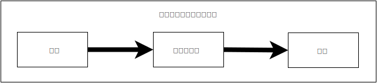
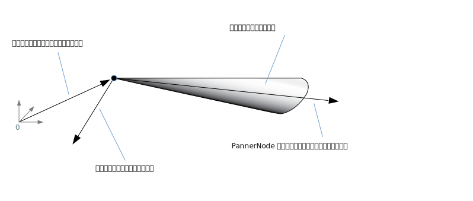

{{DefaultAPISidebar("Web Audio API")}}

この記事では、アプリを経由したオーディオ伝達方法の設計をする際に、十分な情報に基づいた決断をする助けとなるよう、ウェブオーディオ API の特徴がいかに働いているか、その背後にあるオーディオ理論について説明します。この記事はあなたを熟練のサウンドエンジニアにさせることはできないものの、ウェブオーディオ API が動く理由を理解するための十分な背景を提供します。

## オーディオグラフ

[ウェブオーディオ API](/ja/docs/Web/API/Web_Audio_API) は、[オーディオコンテキスト](/ja/docs/Web/API/AudioContext)内部でのオーディオ操作に対する処理を含み、**モジュラールーティング**を可能とするために設計されてきました。それぞれの[オーディオノード](/ja/docs/Web/API/AudioNode)は基本的なオーディオ処理を行い、他の 1 つ以上のオーディオノードと連結されて、[オーディオルーティンググラフ](/ja/docs/Web/API/AudioNode#the_audio_routing_graph)を形成します。1つのコンテキスト内であっても、異なるチャンネル構成を持つ複数の音源に対応しています。このモジュール式の設計により、ダイナミックなエフェクトを備えた複雑なオーディオ機能を作成するための柔軟性が確保されています。

オーディオノードは、それら入出力を経由し接続され、単一あるいは複数の音源から開始される一連のチェーンを作り、一つ以上のノードを経由しつつ、最終的な行き先に届き終了します。ただし、たとえば、オーディオデータを視覚化することのみを求める場合などは、このような宛先は省いて構いません。シンプルで典型的なウェブオーディオのワークフローでは、以下のようになります。

1. オーディオコンテキストを作成します。
2. コンテキスト内に音源を生成します（{{HTMLElement("audio")}}、オシレーター、ストリームなど）。
3. リバーブ、バイカッドフィルター、パンナーコンプレッサーといった、音響効果用ノードを作成します。
4. オーディオの最終出力先（ユーザーのコンピューターのスピーカーなど）を選択します。
5. 音源ノードを 0 個以上のエフェクトノードに接続し、その後、選択した宛先ノードに接続します。

> [!NOTE]
> 信号上で利用できるオーディオチャンネルの数字は、2.0 や 5.1 のように、しばしば、数値の形式で表現されます。これは[チャンネル数表記](https://ja.wikipedia.org/wiki/サラウンド#チャンネル数の記述)と呼ばれます。最初の数値は、該当の信号が含んでいるオーディオチャンネルの数です。ピリオドの後にある数値は、低音増強用出力として確保されているチャンネルの数を示しています。それらはしばしば**サブウーファー**とも称されます。



各入出力は、互いに特定のオーディオレイアウトを代表する、一つ以上のオーディオ**チャンネル**により構成されます。個別のチャンネル構造それぞれは、モノラル、ステレオ、クアッド、5.1 等を含んでサポートされています。


オーディオはいくつかの方法で取得できます。

- JavaScript 内部で(オシレーターのような)オーディオノードにより、直接オーディオを生成。
- 未加工の [PCM](https://ja.wikipedia.org/wiki/パルス符号変調) データから生成(この場合、該当オーディオコンテキストは、対応しているオーディオフォーマット形式へのデコード手段を有しています)。
- （{{HTMLElement("video")}} や {{HTMLElement("audio")}} のような）HTML のメディア要素より取得。
- （ウェブカメラやマイクのような）[WebRTC](/ja/docs/Web/API/WebRTC_API) {{domxref("MediaStream")}} により直接取得。

## オーディオデータ: サンプルとは？

オーディオ信号が処理されるとき、サンプリングが行われます。**サンプリング**とは[連続信号](https://ja.wikipedia.org/wiki/連続信号)を[離散信号](https://ja.wikipedia.org/wiki/離散信号)へ変換することです。あるいは別の言い方をすると、バンドのライブ演奏のような連続的な音波を、コンピューターがそのオーディオを区別されたブロックで処理できるようになる（離散時間信号の）一連のサンプルに変換します。

より詳しい情報は、ウィキペディアの[標本化](https://ja.wikipedia.org/wiki/標本化)から見ることができます。

## オーディオバッファー: フレーム、サンプル、チャンネルセクション

{{domxref("AudioBuffer")}} は、次の 3 つのパラメータで定義されます。

- チャンネル数（モノラルは 1、ステレオは 2 など）、
- バッファ内のサンプルフレーム数、
- サンプルレート（1 秒あたりに再生されるサンプルフレーム数）。

サンプルとは、特定のチャンネル（ステレオの場合は左または右）内の特定の時点におけるオーディオストリームの値を表す、単一の 32 ビット浮動小数点値のことです。フレーム、またはサンプルフレームとは、特定の時点において再生されるすべてのチャンネルの値の集合のことです。つまり、同時に再生されるすべてのチャンネルのすべてのサンプル（ステレオ音源の場合は 2 つ、5.1ch の場合は 6 つなど）を指します。

サンプルレートとは、1 秒間に再生される、それらサンプルの数（または、1 フレームのサンプルすべてが同時に再生させることから、フレーム）であり、単位は Hz で測定されます。サンプルレートが高まるにつれ、音質は向上します。

モノラルとステレオのオーディオバッファーを見てみましょう。それらは 1 秒間、44100Hz で再生されます。

- モノラルバッファーは 44100 サンプル、44100 フレームで構成され、length プロパティは 44100 となる。
- ステレオバッファーは 88200 サンプル、44100 フレームで構成され、length プロパティは、そのフレーム数に等しいため 44100 のままである。


バッファが再生されると、最も左のサンプルフレームが聞こえ、次にそのサンプルフレームのすぐ隣のサンプルフレームが続いてゆきます。ステレオの場合、両方のチャンネルから同時に聴こえます。サンプルフレームは、チャンネルの数とは独立しているため非常に便利であり、正確にオーディオを取り扱う有効な手段として、時間を表現してくれます。

> [!NOTE]
> フレーム数から秒数を得るためには、フレーム数をサンプルレートで単に除算するだけです。サンプル数からフレーム数を得るためには、チャンネル数で単に除算するだけです。

以下はいくつかの単純なサンプルです。

```js
const context = new AudioContext();
const buffer = new AudioBuffer(context, {
  numberOfChannels: 2,
  length: 22050,
  sampleRate: 44100,
});
```

> [!NOTE]
> [デジタルオーディオ](https://ja.wikipedia.org/wiki/デジタルオーディオ)において、**44100**[Hz](https://ja.wikipedia.org/wiki/ヘルツ)（**44.1kHz** とも表記される）は一般的な[サンプリング周波数](https://ja.wikipedia.org/wiki/%E6%A8%99%E6%9C%AC%E5%8C%96)です。なぜ 44.1kHz なのでしょう？
>
> 第一に、人間の耳の[可聴域](ja.wikipedia.org/wiki/聴覚#可聴域)は、およそ 20 から 20000Hz の範囲です。[Nyquist-Shannon のサンプリング定理](https://ja.wikipedia.org/wiki/%E6%A8%99%E6%9C%AC%E5%8C%96%E5%AE%9A%E7%90%86)により、サンプリング周波数は再現したい最大周波数の 2 倍以上でなくてはなりません。したがって、サンプリングレートは 40kHz 以上でなくてはなりません。
>
> 第二に、信号はサンプリング前に、[偽信号](https://ja.wikipedia.org/wiki/%E6%8A%98%E3%82%8A%E8%BF%94%E3%81%97%E9%9B%91%E9%9F%B3)の発生をさせないため、[ローパスフィルタリング](https://ja.wikipedia.org/wiki/%E3%83%AD%E3%83%BC%E3%83%91%E3%82%B9%E3%83%95%E3%82%A3%E3%83%AB%E3%82%BF)されていなければなりません。理想的ローパスフィルターが 20kHz 以下の周波数を（減衰させずに）完璧に通し、20kHz 以上の周波数を完璧に遮断する一方で、実際には、周波数が部分的に減衰する場所となる、[トランジションバンド](https://en.wikipedia.org/wiki/Transition_band)<sup>(英語)</sup>が必要です。このバンドが広くなるにつれ、[アンチエイリアスフィルター](https://ja.wikipedia.org/wiki/アンチエイリアス#信号処理におけるアンチエイリアス)を作るのは簡単かつ効率的になります。44.1kHz サンプリング周波数は、2.05kHz のトランジションバンドを与えます。

この呼び出しをする場合、チャンネル数 2 のステレオバッファーを取得し、AudioContext 上で（非常に一般的で、通常のサウンドカードではほとんどはレートとなる）44100Hz にて再生される音源が、0.5 秒間続きます: 22,050 フレーム/44,100Hz = 0.5 秒。

```js
const context = new AudioContext();
const buffer = new AudioBuffer(context, {
  numberOfChannels: 1,
  length: 22050,
  sampleRate: 22050,
});
```

この呼び出しをする場合、モノラルバッファーをチャンネル数 1 で取得し、AudioContext 上で 44100Hz にて再生される際に自動で 44100Hz へ*再サンプリングされ*(したがって 44100 フレームとなり)、1 秒間続きます: 44100 フレーム/44100Hz = 1 秒。

> [!NOTE]
> オーディオの再サンプリングは、画像のサイズ変更とよく似たものです。例えば 16x16 の画像があり、32x32 の空間を満たしたいとします。サイズ変更（あるいは再サンプリング）を行い、結果として（サイズ変更アルゴリズムの違いに依存して、エッジがぼやけたりと）画質の低下を伴いますが、空間を減らすサイズ変更済み画像が作れます。再サンプリングされたオーディオもまったく同じです。空間を保てるものの、実際には高音域のコンテンツや高音を適切に再現することはできません。

### バッファーセクションの平面性対交差性

ウェブオーディオ API は平面的なバッファー形式を採用しています。左右のチャンネルは、以下のように格納されています。

```plain
LLLLLLLLLLLLLLLLRRRRRRRRRRRRRRRR （16 フレームのバッファー）
```

これはオーディオ処理における一般的な形式です。これにより各チャンネルの独立した処理が簡単になります。

代替方式としては、交差的な形式が用いられます。

```plain
LRLRLRLRLRLRLRLRLRLRLRLRLRLRLRLR （16 フレームのバッファー）
```

この形式は、大掛かりな処理を必要としないオーディオを、格納し再生する目的として一般的です。例えばデコード済み MP3 音楽ストリームなどがあります。

ウェブオーディオ API は、オーディオ処理に適することを理由に、平面的なバッファー**のみ**を採用しています。通常は平面的ですが、再生用にオーディオがサウンドカードへ送られる際は、交差的に変換されます。反対に、MP3 オーディオがデコードされる場合、元々は交差形式だったものの、オーディオ処理のため平面形式へと変換されます。

## オーディオチャンネル

異なるオーディオバッファーでは、それぞれ異なった数のチャンネルを含んでいます: より基本的なモノラルとステレオ(それぞれチャンネル数 1 と 2)から始まり、より複雑なクアッドもしくは 5.1 のような、異なるサウンドサンプルが各チャンネルに含まれ、よりリッチなオーディオ体験を導くセットもあります。チャンネルは通常、以下のテーブルに示される、標準的な略語によって示されます:

| 名前     | チャンネル                                                                                         |
| -------- | -------------------------------------------------------------------------------------------------- |
| _Mono_   | `0: M: mono`                                                                                       |
| _Stereo_ | `0: L: left 1: R: right`                                                                           |
| _Quad_   | `0: L: left 1: R: right 2: SL: surround left 3: SR: surround right`                                |
| _5.1_    | `0: L: left 1: R: right 2: C: center 3: LFE: subwoofer 4: SL: surround left 5: SR: surround right` |

### アップミキシングとダウンミキシング

入力と出力のチャンネル数が一致しない場合、以下のルールに基づいてアップミキシングまたはダウンミキシングが行われます。これは{{domxref("AudioNode.channelInterpretation")}} プロパティを `speakers` または `discrete` へとセットしてコントロールできます。

<table class="standard-table">
  <thead>
    <tr>
      <th scope="row">解釈</th>
      <th scope="col">入力チャンネル</th>
      <th scope="col">出力チャンネル</th>
      <th scope="col">ミキシングルール</th>
    </tr>
  </thead>
  <tbody>
    <tr>
      <th rowspan="13" scope="row"><code>speakers</code></th>
      <td><code>1</code> <em>(Mono)</em></td>
      <td><code>2</code> <em>(Stereo)</em></td>
      <td>
        <em>モノラルからステレオへのアップミックス。</em><br /><code>M</code
        >入力チャンネルは(<code>L</code> と
        <code>R</code> の)両出力チャンネル用に使われます。<br /><code
          >output.L = input.M<br />output.R = input.M</code
        >
      </td>
    </tr>
    <tr>
      <td><code>1</code> <em>(Mono)</em></td>
      <td><code>4</code> <em>(Quad)</em></td>
      <td>
        <em>モノラルからクアッドへのアップミックス。</em><br /><code>M</code>
        入力チャンネルは(<code>L</code> と
        <code>R</code> の)ノンサラウンド出力チャンネル用に使われます。(<code
          >SL</code
        >
        と <code>SR</code> の)サラウンド出力チャンネルは無音です。<br /><code
          >output.L = input.M<br />output.R = input.M<br />output.SL = 0<br />output.SR
          = 0</code
        >
      </td>
    </tr>
    <tr>
      <td><code>1</code> <em>(Mono)</em></td>
      <td><code>6</code> <em>(5.1)</em></td>
      <td>
        <em>モノラルから 5.1.へのアップミックス。</em><br /><code>M</code>
        入力チャンネルは(<code>C</code>
        の)ノン中央出力チャンネル用に使われます。その他すべての(<code>L</code>,
        <code>R</code>, <code>LFE</code>, <code>SL</code>,
        <code>SR</code>)出力チャンネルは無音です。<br /><code
          >output.L = 0<br />output.R = 0</code
        ><br /><code
          >output.C = input.M<br />output.LFE = 0<br />output.SL = 0<br />output.SR
          = 0</code
        >
      </td>
    </tr>
    <tr>
      <td><code>2</code> <em>(Stereo)</em></td>
      <td><code>1</code> <em>(Mono)</em></td>
      <td>
        <em>ステレオからモノラルへのダウンミックス。</em><br />(<code>L</code>
        と
        <code>R</code>
        の)両入力チャンネルは等しく結合され、単一出力チャンネル(<code>M</code>)になります。<br /><code
          >output.M = 0.5 * (input.L + input.R)</code
        >
      </td>
    </tr>
    <tr>
      <td><code>2</code> <em>(Stereo)</em></td>
      <td><code>4</code> <em>(Quad)</em></td>
      <td>
        <em>ステレオからクアッドへのアップミックス。</em><br />左右(<code
          >L</code
        >
        と <code>R</code>)入力チャンネルはそれぞれ(<code>L</code> と
        <code>R</code> の)ノンサラウンド出力チャンネル用に使われます。(<code
          >SL</code
        >
        と <code>SR</code> の)サラウンド出力チャンネルは無音です。<br /><code
          >output.L = input.L<br />output.R = input.R<br />output.SL = 0<br />output.SR
          = 0</code
        >
      </td>
    </tr>
    <tr>
      <td><code>2</code> <em>(Stereo)</em></td>
      <td><code>6</code> <em>(5.1)</em></td>
      <td>
        <em>ステレオから 5.1.へのアップミックス。</em><br />左右(<code>L</code>
        と <code>R</code>)入力チャンネルはそれぞれ(<code>L</code> と
        <code>R</code> の)ノンサラウンド出力チャンネル用に使われます。(<code
          >SL</code
        >
        と
        <code>SR</code>
        の)サラウンド出力チャンネル、中央チャンネル(<code>C</code>)、サブウーファー(<code>LFE</code>)はすべて同様に無音です。<br /><code
          >output.L = input.L<br />output.R = input.R<br />output.C = 0<br />output.LFE
          = 0<br />output.SL = 0<br />output.SR = 0</code
        >
      </td>
    </tr>
    <tr>
      <td><code>4</code> <em>(Quad)</em></td>
      <td><code>1</code> <em>(Mono)</em></td>
      <td>
        <em>クアッドからモノラルへのダウンミックス。</em><br />(<code>L</code>,
        <code>R</code>, <code>SL</code>,
        <code>SR</code
        >)入力チャンネルは等しく結合され、単一出力チャンネル(<code>M</code>)になります。<br /><code
          >output.M = 0.25 * (input.L + input.R + input.SL + input.SR)</code
        >
      </td>
    </tr>
    <tr>
      <td><code>4</code> <em>(Quad)</em></td>
      <td><code>2</code> <em>(Stereo)</em></td>
      <td>
        <em>クアッドからステレオへのダウンミックス。両左入力チャンネル</em
        ><br />(<code>L</code> と
        <code>SL</code
        >)は等しく結合され、単一左出力チャンネル(<code>L</code>)になります。同様に、<em>両右入力チャンネル</em>(<code
          >R</code
        >
        と
        <code>SR</code
        >)は等しく結合され、単一右出力チャンネル(<code>R</code>)になります。<br /><code
          >output.L = 0.5 * (input.L + input.SL</code
        ><code>)</code><br /><code>output.R = 0.5 * (input.R + input.SR</code
        ><code>)</code>
      </td>
    </tr>
    <tr>
      <td><code>4</code> <em>(Quad)</em></td>
      <td><code>6</code> <em>(5.1)</em></td>
      <td>
        <em>クアッドから 5.1.へのアップミックス。</em><br />(<code>L</code>,
        <code>R</code>, <code>SL</code>,
        <code>SR</code>)入力チャンネルはそれぞれ(<code>L</code> と
        <code>R</code>
        の)出力チャンネル用に使われます。中央チャンネル(<code>C</code>)、サブウーファー(<code>LFE</code>)は無音です。<br /><code
          >output.L = input.L<br />output.R = input.R<br />output.C = 0<br />output.LFE
          = 0<br />output.SL = input.SL<br />output.SR = input.SR</code
        >
      </td>
    </tr>
    <tr>
      <td><code>6</code> <em>(5.1)</em></td>
      <td><code>1</code> <em>(Mono)</em></td>
      <td>
        <em>5.1.からモノラルへのダウンミックス。左チャンネル</em
        >(<code>L</code>, <code>SL</code>)、右チャンネル(<code>R</code>,
        <code>SR</code
        >)、中央チャンネルはそれぞれ混合されます。サラウンドチャンネルは僅かに減衰され、標準側面チャンネルは利用のために、単一チャンネルを<code
          >√2/2</code
        >
        で乗算したものとして出力が補強されます。サブウーファー<code>(LFE)</code>チャンネルは失われます。<br /><code
          >output.M = 0.7071 * (input.L + input.R) + input.C + 0.5 * (input.SL +
          input.SR)</code
        >
      </td>
    </tr>
    <tr>
      <td><code>6</code> <em>(5.1)</em></td>
      <td><code>2</code> <em>(Stereo)</em></td>
      <td>
        <em>5.1.からステレオへのダウンミックス。</em
        ><br />中央チャンネルは各側面サラウンドチャンネル(<code>SL</code> と
        <code>SR</code>)と合算され、各側面チャンネルへ混合されます。2
        チャンネルへとミックスダウンされる過程は低労力で行われ、各々の場合について、<code
          >√2/2</code
        >
        で乗算されます。サブウーファー (<code>LFE</code>)
        チャンネルは失われます。<br /><code
          >output.L = input.L + 0.7071 * (input.C + input.SL)<br />output.R =
          input.R </code
        ><code>+ 0.7071 * (input.C + input.SR)</code>
      </td>
    </tr>
    <tr>
      <td><code>6</code> <em>(5.1)</em></td>
      <td><code>4</code> <em>(Quad)</em></td>
      <td>
        <em>5.1.からクアッドへのダウンミックス。</em
        ><br />中央チャンネルは各側面ノンサラウンドチャンネル(<code>L</code> と
        <code>R</code>)と合算され、各側面チャンネルへ混合されます。2
        チャンネルへとミックスダウンされる過程は低労力で行われ、各々の場合について、<code
          >√2/2</code
        >
        で乗算されます。サラウンドチャンネルへの伝達には変化がありません。サブウーファー
        (<code>LFE</code>) チャンネルは失われます。<br /><code
          >output.L = input.L + 0.7071 * input.C<br />output.R = input.R +
          0.7071 * input.C<br /><code
            >output.SL = input.SL<br />output.SR = input.SR</code
          ></code
        >
      </td>
    </tr>
    <tr>
      <td colspan="2">その他、非標準レイアウト</td>
      <td>
        非標準チャンネルレイアウトは <code>channelInterpretation</code> を <code>discrete</code> に設定したものとして操作されます。<br />新たなスピーカーレイアウトの将来的な定義を、仕様書でははっきりと認めています。従ってこの予備部分は、チャンネルに用いられる特定の数字が示すブラウザーの挙動が、将来的に変更された場合のために用意されたものではありません。
      </td>
    </tr>
    <tr>
      <th rowspan="2" scope="row"><code>discrete</code></th>
      <td>各 (<code>x</code>)</td>
      <td>各 (<code>y</code>) (<code>x&#x3C;y</code> の場合)</td>
      <td>
        <em>離散チャンネルのアップミックス。</em
        ><br />各出力チャンネルに、それに対応する同番号の入力チャンネルによる入力をします。対応する入力チャンネルが存在しないチャンネルは無音になります。
      </td>
    </tr>
    <tr>
      <td>各 (<code>x</code>)</td>
      <td>各 (<code>y</code>) (<code>x>y</code> の場合)</td>
      <td>
        <em>離散チャンネルのダウンミックス。</em><br />各出力チャンネルに、それに対応する同番号の入力チャンネルによる入力をします。対応する出力チャンネルが存在しない入力チャンネルは無視されます。
      </td>
    </tr>
  </tbody>
</table>

## 視覚化

原則、オーディオ視覚化は出力オーディオデータ(基本的にはゲインまたは周波数データ)に時間毎にアクセスすることで行われ、更にグラフなどの視覚化出力へ渡すためのグラフィカル技術が用いられます。ウェブオーディオ API は {{domxref("AnalyserNode")}} で、経由して渡されたオーディオ信号を変換せず利用することができます。ただしその出力は、{{htmlelement("canvas")}} などのような視覚化技術へ受け渡せるオーディオデータです。


以下のメソッドを利用して、データの取得が可能です。

- {{domxref("AnalyserNode.getFloatFrequencyData()")}}
  - : 現在の周波数データを渡された {{jsxref("Float32Array")}} 型配列にコピーします。
- {{domxref("AnalyserNode.getByteFrequencyData()")}}
  - : 現在の周波数データを渡された {{jsxref("Uint8Array")}} 型配列(符号なしバイト配列)にコピーします。
- {{domxref("AnalyserNode.getFloatTimeDomainData()")}}
  - : 現在の波形データまたはタイムドメインデータを渡された {{jsxref("Float32Array")}} 型配列にコピーします。
- {{domxref("AnalyserNode.getByteTimeDomainData()")}}
  - : 現在の波形データまたはタイムドメインデータを渡された {{jsxref("Uint8Array")}} 型配列（符号なしバイト配列）にコピーします。

> [!NOTE]
> より詳しい情報は、ウェブオーディオ API 記事中の [ウェブオーディオ API による視覚化](/ja/docs/Web/API/Web_Audio_API/Visualizations_with_Web_Audio_API)を参照してください。

## 立体化

(ウェブオーディオ API の {{domxref("PannerNode")}} と {{domxref("AudioListener")}} ノードによって操作される)立体音響化によって、オーディオ信号の、空間を介した点における位置や振る舞いをモデル化することができ、そのオーディオをリスナーが聞くことができます。

パンナーの位置は、直行座標の右側に描かれています。ドップラー効果を作るに必要な、速度ベクトルを用いた移動、そして方向コーンを用いた方向性があります。このコーンは、例えば無指向性音源などのため、とても大きくなり得ます。



リスナーの位置は、直行座標の右側に描かれています。度ベクトルを用いた移動と、リスナーの頭がポイントされている(頭部側と顔面側の)二方向ベクターを用いた方向性があります。これらはそれぞれリスナーの頭部の頂点からの方向と、リスナーの鼻にポイントされている方向とを定義しており、これらは直角となっています。


> [!NOTE]
> より詳しい情報は、[ウェブオーディオの空間化の基礎](/ja/docs/Web/API/Web_Audio_API/Web_audio_spatialization_basics)を参照してください。

## ファンインとファンアウト

オーディオ用語では、**fan-in** は{{domxref("ChannelMergerNode")}} が一連の単一入力ソースを受け、単一マルチチャンネル信号を出力するプロセスを意味します。


**Fan-out** はその対となるプロセスを意味します。{{domxref("ChannelSplitterNode")}} が一つのマルチチャンネル入力源を受け、複数のモノラル出力信号を出力します。


