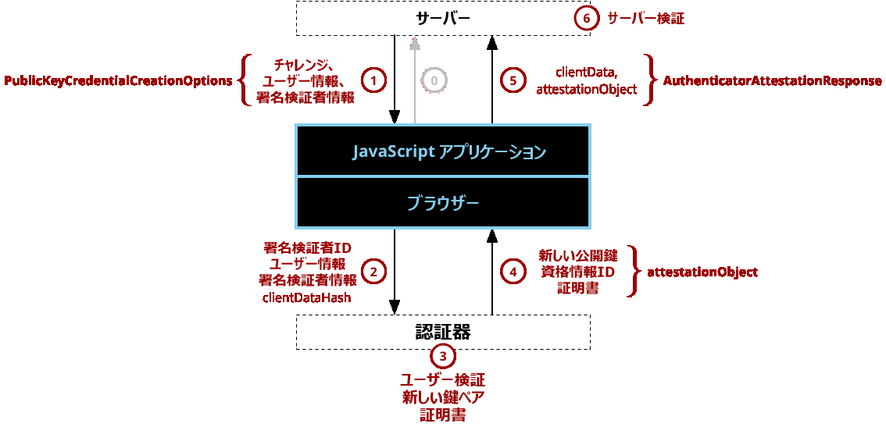

{{securecontext_header}}{{DefaultAPISidebar("Web Authentication API")}}

ウェブ認証 API は、公開鍵暗号を用いて強力な認証を可能にする[資格情報管理 API](/ja/docs/Web/API/Credential_Management_API) の拡張機能で、パスワードレス認証や、 SMS テキストを用いない安全な二要素認証を実現します。

## ウェブ認証の概念と使い方

ウェブ認証 API (別名 WebAuthn) は、ウェブサイトで登録、認証、{{interwiki("wikipedia", "多要素認証", "二要素認証")}}を行うためにパスワードや SMS のテキストを使用するのではなく、{{interwiki("wikipedia", "公開鍵暗号")}}を使用します。これにはいくつかの利点があります。

- **フィッシングからの保護:** 偽のログインサイトを作成した攻撃者は、サイトの[オリジン](/ja/docs/Glossary/Origin)で署名が変わるため、ユーザーとしてログインすることができません。
- **情報漏洩の影響を軽減:** 開発者は公開鍵をハッシュ化する必要がなく、攻撃者が認証に使用した公開鍵にアクセスしても、秘密鍵が必要なため認証ができません。
- **パスワード攻撃に対して無防備：** ユーザーによってはパスワードを再利用する可能性があり、攻撃者は別のウェブサイト用にユーザーのパスワードを（例えばデータ漏洩を介して）取得する可能性があります。また、テキストのパスワードは、デジタル署名よりもはるかに容易に総当たりすることができます。

多くのウェブサイトが既にアカウントの登録や作成したアカウントにログインするウェブページを提供しています。ウェブ認証 API はそれらの既存のウェブページの代替または補足として機能します。 [資格情報管理 API](/ja/docs/Web/API/Credential_Management_API) の他の形式と同様に、 ウェブ認証 API は登録とログインの 2 つの基本的な機能を持っています。

- {{domxref("CredentialsContainer.create()", "navigator.credentials.create()")}} - publicKey オプションと併用すると、新しいアカウントの登録または既存のアカウントへの新しい非対称鍵ペアの関連付けを行うために新しい認証情報を作成します。
- {{domxref("CredentialsContainer.get()", "navigator.credentials.get()")}} - publicKey オプションと併用すると、サービスに対する認証のために、ログインまたは二要素認証として既存の認証情報セットを使用します。

> **Note:** `create()` と `get()` は両方とも[安全なコンテキスト](/ja/docs/Web/Security/Secure_Contexts) （すなわち、サーバーに https で接続している、サーバーがローカルホストの場合）であることを必要とし、ブラウザーが安全なコンテキストで動作していない場合は利用できません。

最も基本的な形式としては、`create()` と `get()` の両方が「チャレンジ」と呼ばれる非常に大きな乱数をサーバーから受け取り、秘密鍵によって署名されたチャレンジをサーバーに返します。これにより、ネットワーク上で秘密を明かすことなく、ユーザーが認証に必要な秘密鍵を持っていることをサーバー－に証明することができます。

create() と get() メソッドが全体像の中でどのように位置づけられるかを理解するためには、ブラウザーの外側にある 2 つのコンポーネントの間に位置づけられることを理解することが重要です。

1. **サーバー** - ウェブ認証 API は、サーバー（サービスまたは[署名検証者](https://en.wikipedia.org/wiki/Relying_party) (署名検証者) とも呼ばれる）に新しい資格情報を登録し、後でその同じサーバーで同じ資格情報を使用してユーザーを認証することを意図しています。
2. **認証器 (Authenticator)** - 作成された認証情報は認証器と呼ばれる機器内に格納されます。これは認証における新しい概念です。パスワード認証ではパスワードはユーザーの頭の中に保管され、他の機器は必要ありません。ウェブ認証を用いた認証では、そのパスワードが認証器の中に保管された鍵ペアに置き換えられます。認証器は Windows Hello などのように OS に組み込むこともできますし、 USB や Bluetooth セキュリティキーなどの物理的なトークン機器とすることもできます。

### 登録

通常の登録過程は、図 1 に示す 6 つの手順を踏みます。この図は、概要を説明するために登録プロセスに必要なデータを簡略化しています。登録リクエストを作成するための必須フィールド、オプションフィールド、およびそれらの意味はすべて {{domxref("PublicKeyCredentialCreationOptions")}} 辞書に記載されます。同様に、レスポンスフィールドはすべて {{domxref("PublicKeyCredential")}} インターフェイスに記載されます（ただし {{domxref("PublicKeyCredential.response")}} は {{domxref("AuthenticatorAttestationResponse")}} インターフェイスに記載されます）。なお、アプリケーションを作っているほとんどの JavaScript プログラマーが本当に気をつけなければならないのは、 create() が呼び出され、返値が手に入る手順 1 と 5 のみです。しかしながら、ブラウザーと認証器の中で行われる処理やその結果のデータの意味を理解するためには手順 2、3、4 を理解することが不可欠です。



_図 1 - ウェブ認証による登録手順と各アクションに関連する重要なデータの流れを示す図_

まず（図中のステップ 0）、アプリケーションは最初の登録要求を行います。このリクエストのプロトコルとフォーマットは、ウェブ認証 API の範囲外です。

この後での登録手順は次の通りです。

1. **サーバーがチャレンジ・ユーザー情報・署名検証者情報を送信** - サーバーはチャレンジ・ユーザー情報・署名検証者情報を JavaScript プログラムに送信します。このときのプロトコルも特に指定はなく、ウェブ検証 API の範囲外です。通常、サーバーは HTTPS 通信を使って [REST](/ja/docs/Glossary/REST) で接続します（恐らく [XMLHttpRequest](/ja/docs/Web/API/XMLHttpRequest) や [Fetch](/ja/docs/Web/API/Fetch_API) を用いるでしょう）が、安全なプロトコルでありさえすれば [SOAP](/ja/docs/Glossary/SOAP) や [RFC 2549](https://datatracker.ietf.org/html/rfc2549) 、その他ほぼどのようなプロトコルを使用しても構いません。サーバーから受け取った引数は [create()](/ja/docs/Web/API/CredentialsContainer/create) の呼び出しに渡され、通常ほとんどあるいは全く改変せずに [Promise](/ja/docs/Web/JavaScript/Reference/Global_Objects/Promise) を返します。これは、 {{domxref("AuthenticatorAttestationResponse")}} を含んだ {{domxref("PublicKeyCredential")}} を解決するためのものです。 **なお、チャレンジは（16 バイト以上の）ランダムな情報のバッファーであることと、登録過程のセキュリティを確保するために必ずサーバー上で生成することが極めて重要です。**
2. **ブラウザーが認証器に対して authenticatorMakeCredential() を呼び出す** - 内部的に、ブラウザーは引数を検証し、既定値を整備し、それを {{domxref("AuthenticatorResponse.clientDataJSON")}} とします。最も重要な引数の一つは origin であり、これが clientData に保存されるため、後でサーバーが検証することができます。 create() の呼び出しの引数は clientDataJSON の SHA-256 ハッシュ値と共に認証器に渡されます（認証器への接続が低帯域幅の NFC または Bluetooth である可能性があり、認証器は単にハッシュに署名して改ざんされていないことを保証することが目的であるため、ハッシュのみを送信します）。
3. **認証器が新しい鍵ペアとアサーションを作成** - 何かをする前に、認証器は通常、何らかの形でユーザー認証を求めます。これは、 PIN の入力、指紋の使用、虹彩スキャンなどであり、ユーザーが存在し、登録に同意していることを証明します。ユーザー認証の後、認証器は新しい非対称鍵ペアを作成し、将来の参照用に秘密鍵を安全に保管します。公開鍵はアサーションの一部となり、認証器は製造工程で組み込まれた秘密鍵で署名し、信頼の根源まで遡って検証できる証明書チェーンを持っています。
4. **認証器がブラウザーにデータを返す** - 新しい公開鍵、グローバルに一意な認証 ID、およびその他の認証データがブラウザーに返され、そこで attestationObject となります。
5. **ブラウザーが最終的に送信するデータを作成し、アプリケーションがその返値をサーバーに送信** - create() のプロミスが {{domxref("PublicKeyCredential")}} に解決します。 {{domxref("PublicKeyCredential")}} は一意の認証 ID である {{domxref("PublicKeyCredential.rawId")}} 持っており、 {{domxref("AuthenticatorResponse.clientDataJSON")}} を含む {{domxref("AuthenticatorAttestationResponse")}} や {{domxref("AuthenticatorAttestationResponse.attestationObject")}} といったレスポンスと一緒にあります。この {{domxref("PublicKeyCredential")}} は、何らかの望ましいフォーマットやプロトコルでサーバーに送信されます。（注意として、 ArrayBuffer プロパティは base64 か似たようなものでエンコードされている必要があります。）
6. **サーバーが登録を検証・完了させる** - 最終的に、サーバーが一連のチェックを行い、登録が完了して改ざんされていないことを保証することが要求されています。この保証には次の点を含みます。

    1. challenge が送信時と同じものであるかの確認
    2. origin が期待通りのオリジンとなっていることの保証
    3. clientDataHash の署名と特定モデルの認証器用の証明書チェーンを使った attestation の検証

    検証ステップの完全な一覧は [ウェブ認証 API 仕様書の中にあります](https://w3c.github.io/webauthn/#registering-a-new-credential)。 チェックが上手くいくと、サーバーはユーザーアカウントに紐づいたその新しい公開鍵を保存し、将来の利用に備えます。つまりは、ユーザーが認証のためにその公開鍵を使いたい時は何時でも使えるようにするということです。

## 認証

ユーザーは、ウェブ認証で登録した後、サービスに対して認証（ログインまたはサインイン）を行うことができます。認証フローは登録フローと似ており、図 2 のアクションの図は、図 1 の登録アクションの図と似ていると思われるかもしれません。登録と認証の主な違いは、次の通りです。1) 認証は、ユーザーまたは署名検証者情報を必要としない。 2) 認証は、製造時に認証器に組み込まれたキーペアを使用して認証を作成するのではなく、サービス用に事前に生成されたキーペアを使用してアサーションを作成する。繰り返しますが、以下の認証に関する説明は、ウェブ認証 API のすべてのオプションや機能に踏み込むのではなく、大まかな概要を説明するものです。認証のための具体的なオプションは {{domxref("PublicKeyCredentialRequestOptions")}} 辞書で、結果のデータは {{domxref("PublicKeyCredential")}} インターフェイス ({{domxref("PublicKeyCredential.response")}} は {{domxref("AuthenticatorAssertionResponse")}} インターフェイス) で見ることができます。

.png>)

_図 2 - 図 1 と同様、ウェブ認証による認証手順と各アクションに関連する重要なデータの流れを示している。_

まず（図中のステップ 0）、アプリケーションは最初の登録リクエストを行います。このリクエストのプロトコルとフォーマットは、ウェブ認証 API の範囲外です。

この後、登録のステップになります。

1. **サーバーからのチャレンジ送信** - サーバーが JavaScript プログラムに対してチャレンジを送ります。サーバーとのコミュニケーションに用いられるプロトコルに指定はなく、ウェブ認証 API の規定の対象範囲外です。通常、サーバーは HTTPS 通信を使って [REST](/ja/docs/Glossary/REST) で接続します（恐らく [XMLHttpRequest](/ja/docs/Web/API/XMLHttpRequest) や [Fetch](/ja/docs/Web/API/Fetch_API)) を用いるでしょう）が、安全なプロトコルでありさえすれば [SOAP](/ja/docs/Glossary/SOAP) や [RFC 2549](https://tools.ietf.org/html/rfc2549)、その他ほぼどのようなプロトコルを使用しても構いません。サーバーから受信した引数はほとんどの場合少しもしくは全く改変されずに  [get()](/ja/docs/Web/API/CredentialsContainer/get) の呼び出しに渡されます。**なお、チャレンジは、ランダムな情報のバッファ（少なくとも 16 バイト）であることが絶対に必要であり、認証プロセスのセキュリティを確保するために、サーバー上で生成されなければなりません。**
2. **ブラウザーによる認証器の authenticatorGetCredential() の呼び出し** - 内部的にブラウザーは引数を検証し、既定値を埋めて {{domxref("AuthenticatorResponse.clientDataJSON")}}を作成します。最も重要な引数の一つが origin であり、これはclientDataの一部として記録され、後ほどサーバーによって検証されます。 get() 呼び出し時の引数は、 clientDataJSON の SHA-256 ハッシュと一緒に認証器に渡されます（認証器への接続が低帯域幅の NFC または Bluetooth である可能性があり、認証器は単にハッシュに署名して改ざんされていないことを保証することが目的のため、ハッシュのみを送信します）
3. **認証器によるアサーションの生成** - 認証器がこのサービスの認証情報が署名検証者 ID と一致することを確認し、ユーザーに認証の同意を促します。この二つのステップが成功した場合、認証器は登録時に生成された秘密鍵を用いて clientDataHash と authenticatorData に署名を行うことで新しいアサーションを生成します。
4. **認証器がブラウザーにデータを返す** - 認証器が authenticatorData とアサーションの署名をブラウザーに返します。
5. **ブラウザーが最終的なデータを生成し、アプリケーションがサーバーにレスポンスを送信する** - ブラウザーが {{domxref("AuthenticatorAssertionResponse")}} を含む {{domxref("PublicKeyCredential.response")}} と一緒に [Promise](/ja/docs/Web/JavaScript/Reference/Global_Objects/Promise) を {{domxref("PublicKeyCredential")}} に解決しようとします。サーバーに対してどのようなプロトコル、フォーマットでこのデータを戻すのかについては JavaScript アプリケーションに委ねられています。
6. **サーバーによる検証と認証の完了** - 認証要求の結果を受け取り次第、サーバーはレスポンスの検証を行います。この検証は以下のようなものです。

    1. 登録リクエスト時に保存された公開鍵を用いて、認証器による署名を検証する。
    2. 認証器が署名したチャレンジが、サーバーが生成したチャレンジと一致することを確認すること。
    3. 署名検証者 IDがこのサービスに期待されるものであることを確認する。

  これらは[ウェブ認証 API の仕様で規定されているアサーションの検証手順](https://w3c.github.io/webauthn/#verifying-assertion)のすべてです。検証が成功した場合、ユーザーは認証済であると記録します。ウェブ認証による規定の対象範囲外ですが、ひとつの選択肢として新しい Cookie をユーザーのセッションに対して発行することが考えられます。

## インターフェイス

- {{domxref("Credential")}} {{experimental_inline}}
  - : 信頼を決定づける前提条件としてのエンティティに関する情報を提供します。
- {{domxref("CredentialsContainer")}}
  - : ログイン・ログアウトが発生したようなイベントの際、資格情報の要求やユーザーエージェント通知のためのメソッドをエクスポートします。このインターフェイスは {{domxref('Navigator.credentials')}} からアクセス可能です。ウェブ認証の仕様では、 `publicKey` メンバーを{{domxref('CredentialsContainer.create','create()')}} と {{domxref('CredentialsContainer.get','get()')}} メソッドに追加し、それらのメソッドではそれぞれ、新たな鍵ペアの生成、鍵ペアについての認証取得を行います。
- {{domxref("PublicKeyCredential")}}
  - : 公開鍵 / 秘密鍵ペアについての情報を提供し、それはサービスへのログインのための資格情報であり、パスワードの代わりに、フィッシング耐性かつデータ漏洩体制のある非対称鍵ペアを用いています。
- {{domxref("AuthenticatorResponse")}}
  - : {{domxref("AuthenticatorAttestationResponse")}}  と {{domxref("AuthenticatorAssertionResponse")}}に関するベースのインターフェイスであり、鍵ペアについての信頼の暗号的根幹を提供します。{{domxref('CredentialsContainer.create()')}} と {{domxref('CredentialsContainer.get()')}}によって返され、それぞれ、その子インターフェイスはチャレンジ、オリジンのようなブラウザーからの情報を含んでいます。{{domxref("PublicKeyCredential.response")}}から返されるでしょう。
- {{domxref("AuthenticatorAttestationResponse")}}
  - : {{domxref('PublicKeyCredential')}} が渡された時 {{domxref('CredentialsContainer.create()')}} によって返され、生成された新たな鍵ペアの信頼の暗号的根幹を提供します。
- {{domxref("AuthenticatorAssertionResponse")}}
  - : {{domxref('PublicKeyCredential')}} が渡された時 {{domxref('CredentialsContainer.get()')}} によって返され、鍵ペアを所持しており認証要求が有効かつ承認済みであるという証拠をサービスへ提供します。

## オプション

- {{domxref("PublicKeyCredentialCreationOptions")}}
  - : {{domxref('CredentialsContainer.create()')}} へ渡すオプションです。
- {{domxref("PublicKeyCredentialRequestOptions")}}
  - : {{domxref('CredentialsContainer.get()')}} へ渡すオプションです。

## 例

### デモサイト

- [Mozilla Demo](https://webauthn.bin.coffee/) ウェブサイトとその[ソースコード](https://github.com/jcjones/webauthn.bin.coffee)。
- [Google Demo](https://try-webauthn.appspot.com/) ウェブサイトとその[ソースコード](https://github.com/google/webauthndemo)。
- [https://webauthn.io/ Demo](https://github.com/duo-labs/webauthn.io) ウェブサイトとその[ソースコード](https://github.com/duo-labs/webauthn.io)。
- [github.com/webauthn-open-source](https://github.com/webauthn-open-source) とその[クライアントソースコード](https://github.com/webauthn-open-source/webauthn-simple-app)と[サーバーソースコード](https://github.com/webauthn-open-source/fido2-lib)
- [OWASP Single Sign-On](https://owasp.org/www-project-sso/)

### 使用法の例

> **Warning:** セキュリティの観点から、ウェブ認証の呼び出し（{{domxref('CredentialsContainer.create','create()')}} や {{domxref('CredentialsContainer.get','get()')}}）が保留されている間にブラウザーウィンドウのフォーカスが失われると、呼び出しはキャンセルされます。

```js
// 登録のサンプル引数
var createCredentialDefaultArgs = {
    publicKey: {
        // 署名検証者 (a.k.a. - Service):
        rp: {
            name: "Acme"
        },

        // User:
        user: {
            id: new Uint8Array(16),
            name: "john.p.smith@example.com",
            displayName: "John P. Smith"
        },

        pubKeyCredParams: [{
            type: "public-key",
            alg: -7
        }],

        attestation: "direct",

        timeout: 60000,

        challenge: new Uint8Array([ // サーバーから暗号学的にランダムな値が送られていなければならない
            0x8C, 0x0A, 0x26, 0xFF, 0x22, 0x91, 0xC1, 0xE9, 0xB9, 0x4E, 0x2E, 0x17, 0x1A, 0x98, 0x6A, 0x73,
            0x71, 0x9D, 0x43, 0x48, 0xD5, 0xA7, 0x6A, 0x15, 0x7E, 0x38, 0x94, 0x52, 0x77, 0x97, 0x0F, 0xEF
        ]).buffer
    }
};

// ログインのサンプル引数
var getCredentialDefaultArgs = {
    publicKey: {
        timeout: 60000,
        // allowCredentials: [newCredential] // 下記参照
        challenge: new Uint8Array([ // サーバーから暗号学的にランダムな値が送られていなければならない
            0x79, 0x50, 0x68, 0x71, 0xDA, 0xEE, 0xEE, 0xB9, 0x94, 0xC3, 0xC2, 0x15, 0x67, 0x65, 0x26, 0x22,
            0xE3, 0xF3, 0xAB, 0x3B, 0x78, 0x2E, 0xD5, 0x6F, 0x81, 0x26, 0xE2, 0xA6, 0x01, 0x7D, 0x74, 0x50
        ]).buffer
    },
};

// 新しい認証情報の作成/登録
navigator.credentials.create(createCredentialDefaultArgs)
    .then((cred) => {
        console.log("NEW CREDENTIAL", cred);

        // 通常はサーバーから利用可能なアカウントの認証情報が送られてきますが
        // この例では上からコピーしただけです。
        var idList = [{
            id: cred.rawId,
            transports: ["usb", "nfc", "ble"],
            type: "public-key"
        }];
        getCredentialDefaultArgs.publicKey.allowCredentials = idList;
        return navigator.credentials.get(getCredentialDefaultArgs);
    })
    .then((assertion) => {
        console.log("ASSERTION", assertion);
    })
    .catch((err) => {
        console.log("ERROR", err);
    });
```

## 仕様書

| 仕様書                                                                                      |
| -------------------------------------------------------------------------------------------------- |
| [Web Authentication: An API for accessing Public Key Credentials](https://w3c.github.io/webauthn/) |

## ブラウザーの互換性

### Credential

{{Compat("api.Credential")}}

### CredentialsContainer

{{Compat("api.CredentialsContainer")}}

### PublicKeyCredential

{{Compat("api.PublicKeyCredential")}}

### AuthenticatorResponse

{{Compat("api.AuthenticatorResponse")}}

### AuthenticatorAttestationResponse

{{Compat("api.AuthenticatorAttestationResponse")}}

### AuthenticatorAssertionResponse

{{Compat("api.AuthenticatorAssertionResponse")}}

### PublicKeyCredentialCreationOptions

{{Compat("api.PublicKeyCredentialCreationOptions")}}

### PublicKeyCredentialRequestOptions

{{Compat("api.PublicKeyCredentialRequestOptions")}}
