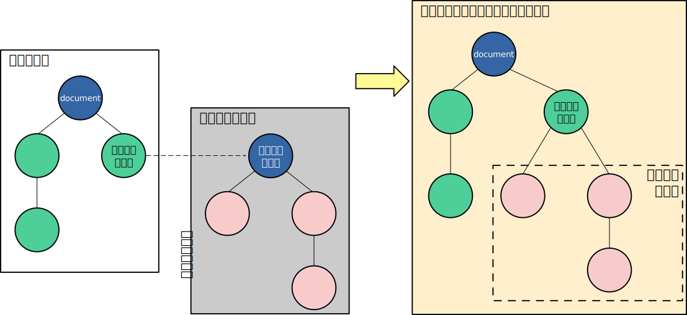

{{DefaultAPISidebar("Web Components")}}

カスタム要素の重要な側面の一つがカプセル化です。なぜなら、カスタム要素は定義上、再利用可能な機能の一部であり、任意のウェブページにドロップして動作させることが期待されるからです。そのため、ページで実行されるコードが、内部実装を変更することでカスタム要素を誤って壊すことがないようにすることが重要です。シャドウ DOM を使用すると、DOM ツリーを要素に割り当て、ページで実行される JavaScript や CSS からこのツリーの内部を隠すことができます。

この記事では、シャドウ DOM の使用法の基本について説明します。

## 高水準の視点

この記事は、すでにあなたが [DOM (Document Object Model)](/ja/docs/Web/API/Document_Object_Model/Introduction) の概念を理解していることを想定しています。これはツリー上の構造で、接続されたノードがマークアップ文書（ウェブ文書の場合は通常 HTML 文書）に現れるさまざまな要素や文字列を表します。例として、以下のような HTML の断片を考えてみましょう。

```html
<html lang="en-US">
  <head>
    <meta charset="utf-8" />
    <title>DOM example</title>
  </head>
  <body>
    <section>
      
      <p>
        Here we will add a link to the
        <a href="https://www.mozilla.org/">Mozilla homepage</a>
      </p>
    </section>
  </body>
</html>
```

このフラグメントは、以下の DOM 構造を生成します（ホワイトスペースのみのテキストノードを除く）。

```plain
- HTML
    - HEAD
        - META charset="utf-8"
        - TITLE
            - #text: DOM example
    - BODY
        - SECTION
            - IMG src="dinosaur.png" alt="A red Tyrannosaurus Rex."
            - P
                - #text: Here we will add a link to the
                - A href="https://www.mozilla.org/"
                    - #text: Mozilla homepage
```

_シャドウ_ DOM により、通常の DOM ツリーの要素の下に隠れた DOM ツリーを取り付けることができます。このシャドウ DOM ツリーはシャドウルートから始まり、その下には普通の DOM ツリーと同様に任意の要素を追加することができます。



以下にシャドウ DOM における用語を定義します。

- **シャドウホスト**: シャドウ DOM が取り付けられた、通常の DOM ノード
- **シャドウツリー**: シャドウ DOM の中にある DOM ツリー
- **シャドウ境界**: シャドウ DOM と通常の DOM の境界
- **シャドウルート**: シャドウツリーの根ノード

シャドウ DOM 内のノードには、シャドウでないノードと全く同じように影響を与えることができます。たとえば、子を追加したり、属性を設定したり、element.style.foo を使用して個々のノードのスタイルを設定したり、 {{htmlelement("style")}} 要素内でシャドウ DOM ツリー全体へのスタイルを追加したりすることができます。違いは、シャドウ DOM 内のどのコードもその外の何かに影響を与えることができず、便利なカプセル化ができることです。

ウェブ開発者がシャドウ DOM を利用できるようになる前から、ブラウザーはすでに要素の内部構造をカプセル化するためにシャドウ DOM を使用していました。例えば、既定のブラウザーコントロールが公開されている {{htmlelement("video")}} 要素を思い浮かべてください。 DOM には `<video>` 要素しか表示されませんが、そのシャドウ DOM の内部には、一連のボタンやその他のコントロールが含まれています。 シャドウ DOM 仕様書では、自分自身でカスタマイズした要素のシャドウ DOM を操作できるようにします。

### 属性の継承

シャドウツリーと {{ HTMLElement("slot") }} 要素は、シャドウホストから [`dir`](/ja/docs/Web/HTML/Global_attributes/dir) および [`lang`](/ja/docs/Web/HTML/Global_attributes/lang) 属性を継承しています。

## シャドウ DOM の作成

### JavaScript で命令的に

次のページには、2つの要素が含まれています。{{htmlelement("div")}} 要素で [`id`](/ja/docs/Web/HTML/Global_attributes/id) が `"host"` であるものと、テキストを格納する {{htmlelement("span")}} 要素です。

```html
<div id="host"></div>
<span>I'm not in the shadow DOM</span>
```

`"host"` の要素をシャドウホストとして使用します。このホスト上で {{domxref("Element.attachShadow()", "attachShadow()")}} を呼び出してシャドウ DOM を作成し、このシャドウ DOM には、メイン DOM に対して行うのと同じようにノードを追加することができます。この例では、単一の `<span>` 要素を追加します。

```js
const host = document.querySelector("#host");
const shadow = host.attachShadow({ mode: "open" });
const span = document.createElement("span");
span.textContent = "I'm in the shadow DOM";
shadow.appendChild(span);
```

結果は次のようになります。

{{EmbedLiveSample("Imperatively with JavaScript")}}

### HTML で宣言的に

シャドウ DOM を作成するのに JavaScript API を使用する方法は、クライアント側でレンダリングされるアプリケーションには良い選択肢かもしれません。それ以外のアプリケーションでは、サーバー側でレンダリングされた UI の方がパフォーマンスが良いことが多く、その結果、より使い勝手の良いものにできる可能性があります。そのような場合、{{htmlelement("template")}} 要素を使用してシャドウ DOM を宣言的に定義することができます。この動作の鍵となるのは{{glossary("enumerated","列挙型")}}の `shadowrootmode` 属性です。これは `open` または `closed` のどちらかに設定することができ、{{domxref("Element.attachShadow()", "attachShadow()")}} メソッドの `mode` オプションと同じ値です。

```html
<div id="host">
  <template shadowrootmode="open">
    <span>I'm in the shadow DOM</span>
  </template>
</div>
```

{{EmbedGHLiveSample("dom-examples/shadow-dom/shadowrootmode/simple.html", "", "")}}

> [!NOTE]
> 既定では、`<template>` の内容は表示されません。この場合、`shadowrootmode="open"` が記載されているため、シャドウルートがレンダリングされます。対応しているブラウザーでは、そのシャドウルート内の可視コンテンツが表示されます。

ブラウザーが HTML を解釈し終えると、 {{htmlelement("template")}} 要素は、親要素（この例では `<div id="host">`）に追加された[シャドウルート](/ja/docs/Glossary/Shadow_tree)にラップされた内容に置き換えられます。その結果の DOM ツリーは次のようになります（DOM ツリーには `<template>` 要素はありません）。

```plain
- DIV id="host"
  - #shadow-root
    - SPAN
      - #text: I'm in the shadow DOM
```

なお、`shadowrootmode` に加えて、 `<template>` の `shadowrootclonable` や `shadowrootdelegatesfocus` 属性などの使用して、生成されるシャドウルートに他のプロパティを指定することができます。

## JavaScript からのカプセル化

ここまでは、それほど多くはないように見えるかもしれません。しかし、ページで実行しているコードが、シャドウ DOM 内の要素にアクセスしようとした場合、何が起こるか見ていきましょう。

このページは、2 つの {{htmlelement("button")}} 要素を追加したことを除いて、先のページと同じです。

```html
<div id="host"></div>
<span>I'm not in the shadow DOM</span>
<br />

<button id="upper" type="button">Uppercase span elements</button>
<button id="reload" type="button">Reload</button>
```

"Uppercase span elements" ボタンをクリックすると、ページ内のすべての `<span>` 要素を探し、そのテキストを大文字に変換します。
"Reload" ボタンをクリックすると、ページが再読み込みされるので、もう一度試してみることができます。

```js
const host = document.querySelector("#host");
const shadow = host.attachShadow({ mode: "open" });
const span = document.createElement("span");
span.textContent = "I'm in the shadow DOM";
shadow.appendChild(span);

const upper = document.querySelector("button#upper");
upper.addEventListener("click", () => {
  const spans = Array.from(document.querySelectorAll("span"));
  for (const span of spans) {
    span.textContent = span.textContent.toUpperCase();
  }
});

const reload = document.querySelector("#reload");
reload.addEventListener("click", () => document.location.reload());
```

"Uppercase span elements" をクリックすると、{{domxref("Document.querySelectorAll()")}} が私たちのシャドウ DOM 内の要素を探していないことがわかります。それらはページ内の JavaScript から効果的に隠されています。

{{EmbedLiveSample("Encapsulation from JavaScript")}}

## Element.shadowRoot および "mode" オプション

上記の例では、引数 `{ mode: "open" }` を `attachShadow()` に渡しています。 モードが `"open"` に設定されている場合、ページ内の JavaScript は、シャドウホストの {{domxref("Element.shadowRoot", "shadowRoot")}} プロパティを通じて、シャドウ DOM の内部にアクセスすることができます。

この例では、前述の例と同様に、HTML はシャドウホスト、メインの DOM ツリー内の `<span>` 要素、および 2 つのボタンを含んでいます。

```html
<div id="host"></div>
<span>I'm not in the shadow DOM</span>
<br />

<button id="upper" type="button">Uppercase shadow DOM span elements</button>
<button id="reload" type="button">Reload</button>
```

この時点では、"Uppercase" ボタンは `shadowRoot` を使用して DOM 内の `<span>` 要素を探します。

```js
const host = document.querySelector("#host");
const shadow = host.attachShadow({ mode: "open" });
const span = document.createElement("span");
span.textContent = "I'm in the shadow DOM";
shadow.appendChild(span);

const upper = document.querySelector("button#upper");
upper.addEventListener("click", () => {
  const spans = Array.from(host.shadowRoot.querySelectorAll("span"));
  for (const span of spans) {
    span.textContent = span.textContent.toUpperCase();
  }
});

const reload = document.querySelector("#reload");
reload.addEventListener("click", () => document.location.reload());
```

この時点では、ページで実行されている JavaScript は、シャドウ DOM の内部にアクセスすることができます。

{{EmbedLiveSample("Element.shadowRoot and the \"mode\" option")}}

引数 `{mode: "open"}` は、ページにシャドウ DOM のカプセル化を解除する方法を提供します。ページにこの機能を与えたくない場合は、代わりに `{mode: "closed"}` を渡すと、`shadowRoot` は `null` を返します。

しかし、これを強力なセキュリティの仕組みだと考えるべきではありませ ん。例えば、ページで実行するブラウザー拡張機能など、回避する方法があるからです。むしろ、ページがシャドウ DOM ツリーの内部にアクセスすべきではないことを示すものです。

## CSS からのカプセル化

このページのこのバージョンでは、HTML は元のバージョンと同じです。

```html
<div id="host"></div>
<span>I'm not in the shadow DOM</span>
```

JavaScript では、シャドウ DOM を作成します。

```js
const host = document.querySelector("#host");
const shadow = host.attachShadow({ mode: "open" });
const span = document.createElement("span");
span.textContent = "I'm in the shadow DOM";
shadow.appendChild(span);
```

今回は、ページ内の `<span>` 要素を対象とする CSS を指定します。

```css
span {
  color: blue;
  border: 1px solid black;
}
```

ページの CSS は、シャドウ DOM 内のノードには影響しません。

{{EmbedLiveSample("Encapsulation from CSS")}}

## シャドウ DOM 内にスタイルを適用

この節では、シャドウ DOM ツリー内でスタイル設定を行う 2 つの異なる方法を見ていきます。

- [プログラム的](#構築可能なスタイルシート)な方法。{{domxref("CSSStyleSheet")}} オブジェクトを構築し、それをシャドウルートに添付します。
- [宣言的](#template_宣言への_style_要素の追加)な方法。 {{htmlelement("template")}} 要素の宣言に {{htmlelement("style")}} 要素を追加します。

どちらの場合も、シャドウ DOM ツリーで定義されたスタイルはそのツリーにのみ適用されるため、ページスタイルがシャドウ DOM の要素に影響を与えないのと同様に、シャドウ DOM スタイルはページの他の部分の要素に影響を与えません。

### 構築可能なスタイルシート

シャドウ DOM のページ要素を構築可能なスタイルシートでスタイル設定するには、次の方法があります。

1. 空の {{domxref("CSSStyleSheet")}} オブジェクトを作成する
2. {{domxref("CSSStyleSheet.replace()")}} または {{domxref("CSSStyleSheet.replaceSync()")}} を使用して内容を設定
3. それを {{domxref("ShadowRoot.adoptedStyleSheets")}} へ代入することでシャドウルートへ追加

`CSSStyleSheet` で定義されたルールは、シャドウ DOM ツリーだけでなく、他にも割り当てられた DOM ツリーにも適用されます。

ここで、再び、ホストと `<span>` を格納する HTML は次のとおりです。

```html
<div id="host"></div>
<span>I'm not in the shadow DOM</span>
```

今回は、シャドウ DOM を作成し、`CSSStyleSheet` オブジェクトを割り当てます。

```js
const sheet = new CSSStyleSheet();
sheet.replaceSync("span { color: red; border: 2px dotted black;}");

const host = document.querySelector("#host");

const shadow = host.attachShadow({ mode: "open" });
shadow.adoptedStyleSheets = [sheet];

const span = document.createElement("span");
span.textContent = "I'm in the shadow DOM";
shadow.appendChild(span);
```

シャドウ DOM ツリーで定義されたスタイルは、ページの他の部分には適用されません。

{{EmbedLiveSample("Constructable stylesheets")}}

### `<template>` 宣言への `<style>` 要素の追加

`CSSStyleSheet` オブジェクトを作成する代わりに、{{htmlelement("style")}} 要素をウェブコンポーネントを定義するために使用する {{htmlelement("template")}} 要素内に記載することもできます。

この場合、HTML には次の `<template>` 宣言が含まれます。

```html
<template id="my-element">
  <style>
    span {
      color: red;
      border: 2px dotted black;
    }
  </style>
  <span>I'm in the shadow DOM</span>
</template>

<div id="host"></div>
<span>I'm not in the shadow DOM</span>
```

JavaScript で、シャドウ DOM を作成し、そこに `<template>` の内容を追加します。

```js
const host = document.querySelector("#host");
const shadow = host.attachShadow({ mode: "open" });
const template = document.getElementById("my-element");

shadow.appendChild(template.content);
```

繰り返しになりますが、`<template>` で定義されたスタイルはシャドウ DOM ツリー内でのみ適用され、ページの他の部分には適用されません。

{{EmbedLiveSample("adding_style_elements_in_template_declarations")}}

### プログラム型と宣言型の選択肢の選択

どのオプションを使用するかは、アプリケーションと環境設定によって異なります。

`CSSStyleSheet` を作成し、`adoptedStyleSheets` を使用してシャドウルートに割り当てることで、単一のスタイルシートを作成し、それを複数の DOM ツリーで共有することができます。例えば、コンポーネントライブラリーで単一のスタイルシートを作成し、そのライブラリーに属するすべてのカスタム要素で共有することができます。このスタイルシートは、ブラウザーによって一度だけ解釈されます。また、スタイルシートに動的な変更を加え、そのシートを使用するすべてのコンポーネントに伝搬させることもできます。

`<style>` 要素を添付する手法は、宣言的でありたい場合や、保有するスタイルがいくつかある場合、異なるコンポーネント間でスタイルを共有する必要がない場合に最適です。

## シャドウ DOM とカスタム要素

シャドウ DOM によってカプセル化が提供されなければ、[カスタム要素](/ja/docs/Web/API/Web_components/Using_custom_elements)は非常に壊れやすいものになってしまいます。 ページで実行する JavaScript や CSS によって、カスタム要素の動作やレイアウトが誤って壊れてしまうことが簡単に起こり得ます。 カスタム要素を開発する立場では、カスタム要素内で適用されるセレクターが、カスタム要素を使用することを選んだページで適用されるセレクターと競合しているかどうかを知ることはできません。

カスタム要素は、ベースの {{domxref("HTMLElement")}} または {{domxref("HTMLParagraphElement")}} などの組み込みの HTML 要素を拡張するクラスとして実装されます。通常、カスタム要素自体がシャドウホストとなり、その要素がルートの下に複数の要素を作成し、要素の内部実装を提供します。

次の例では、単一色で塗りつぶされた円を描画するカスタム要素 `<filled-circle>` を作成します。

```js
class FilledCircle extends HTMLElement {
  constructor() {
    super();
  }
  connectedCallback() {
    // Create a shadow root
    // The custom element itself is the shadow host
    const shadow = this.attachShadow({ mode: "open" });

    // create the internal implementation
    const svg = document.createElementNS("http://www.w3.org/2000/svg", "svg");
    const circle = document.createElementNS(
      "http://www.w3.org/2000/svg",
      "circle",
    );
    circle.setAttribute("cx", "50");
    circle.setAttribute("cy", "50");
    circle.setAttribute("r", "50");
    circle.setAttribute("fill", this.getAttribute("color"));
    svg.appendChild(circle);

    shadow.appendChild(svg);
  }
}

customElements.define("filled-circle", FilledCircle);
```

```html
<filled-circle color="blue"></filled-circle>
```

{{EmbedLiveSample("Shadow DOM and custom elements", 100, 160)}}

カスタム要素の実装のさまざまな側面を示す例については、[カスタム要素のガイド]を参照してください。

## 関連情報

- [カスタム要素の使用](/ja/docs/Web/API/Web_components/Using_custom_elements)
- [テンプレートとスロットの使用](/ja/docs/Web/API/Web_components/Using_templates_and_slots)
- {{domxref("Element.attachShadow()")}}
- {{domxref("ShadowRoot.adoptedStyleSheets")}}
- {{domxref("CSSStyleSheet.replace()")}}
- {{domxref("CSSStyleSheet.replaceSync()")}}
- {{HTMLelement("template")}}
- [CSS スコープ化](/ja/docs/Web/CSS/CSS_scoping)モジュール
- {{CSSXref(":host")}}
- {{CSSXref(":host_function", ":host()")}}
- {{CSSXref(":host-context", ":host-context()")}}
- {{CSSXref("::slotted", "::slotted()")}}
- [CSS シャドウパーツ](/ja/docs/Web/CSS/CSS_shadow_parts)モジュール
- {{CSSXref("::part")}}
