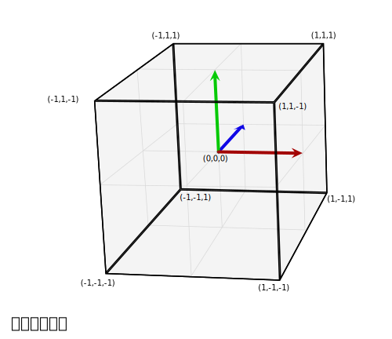
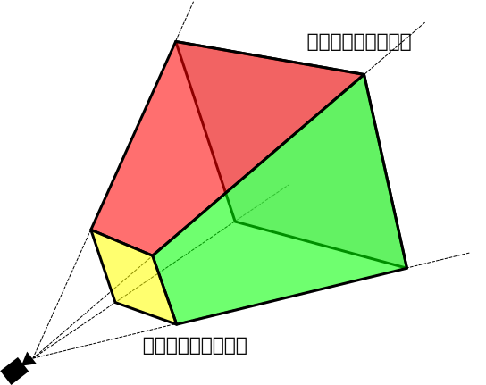

{{DefaultAPISidebar("WebGL")}}

この記事では、 [WebGL](/ja/docs/Web/API/WebGL_API) プロジェクト内でデータを取得し、それを適切な空間に投影して画面に表示する方法について説明します。並進、拡縮、回転行列を使用した基本的な行列計算の知識があることを前提としています。3D シーンを構成するときに通常使用される中心的な 3 つの行列である、モデル、ビュー、投影行列について説明します。

> [!NOTE]
> この記事は [MDN コンテンツキット](https://github.com/gregtatum/mdn-model-view-projection)としても利用可能です。また、 `MDN` グローバルオブジェクトの下で利用可能な[ユーティリティ関数](https://github.com/gregtatum/mdn-webgl)のコレクションを使用しています。

## モデル、ビュー、投影行列

WebGL の空間内の点とポリゴンの個々の変換は、並進、拡縮、回転などの基本的な変換行列によって処理されます。 これらの行列は、複雑な 3D シーンの描画に役立つように、一緒に構成し、特別な方法でグループ化できます。これらの構成された行列は、最終的に元のモデルデータを**クリップ空間**と呼ばれる特別な座標空間に移動します。これは 2 ユニットの幅の立方体で、中心が (0,0,0)、対角が (-1,-1,-1) から (1,1,1) になります。このクリップ空間は 2 次元平面に圧縮され、画像へラスタライズされます。

以下で説明する最初の行列は**モデル行列**です。これは、元のモデルデータを取得して 3 次元ワールド空間内で移動する方法を定義します。 **投影行列**は、ワールド空間座標をクリップ空間座標に変換するために使用されます。 一般的に使用される投影行列である**透視投影投影行列**は、3D 仮想世界の視聴者の代理として機能する一般的なカメラの*効果*を模倣するために使用されます。 **ビュー行列**は、変更されるカメラの位置をシミュレートし、シーン内のオブジェクトを移動して視聴者が現在何を見られるかを変更します。

以下のセクションでは、モデル、ビュー、投影行列の背景にある考え方と実装について詳説します。 これらの行列は、画面上でデータを移動するための根幹であり、個々のフレームワークやエンジンを超える概念です。

## クリップ空間

WebGL プログラムでは、通常、データは自分の座標系で GPU にアップロードされ、次に頂点シェーダーがそれらの点を**クリップ空間**と呼ばれる特別な座標系に変換します。クリップ空間の外側にあるデータは切り取られ、描画されません。ただし、三角形がこのスペースの境界を跨ぐ場合は、新しい三角形に分割され、クリップスペースにある新しい三角形の部分のみが残ります。



上の図は、全ての点が収まる必要のあるクリップ空間を視覚化したものです。これは、各辺が 2 の立方体であり、片方の角が (-1,-1,-1) にあり、対角が (1,1,1) にあります。立方体の中心は点 (0,0,0) です。 クリップ空間に使用されるこの 8 立方メートルの座標系は、正規化デバイス座標（NDC）と呼ばれます。WebGL コードを調べて作業している間、その用語を時々耳にするかもしれません。

このセクションでは、データをクリップ空間座標系に直接配置する仕組みを説明します。 通常、任意の座標系にあるモデルデータが使用され、その後、行列を使用して変換され、モデル座標がクリップ空間座標系に変換されます。この例では、クリップ空間がどのように機能するかを最も簡単に説明する為、単純に (-1, -1, -1) から (1,1,1) までの範囲のモデル座標を使用します。以下のコードは、画面上に正方形を描く為に 2 つの三角形を作成します。正方形の Z 深度は、正方形が同じ空間を共有するときに何が上に描画されるかを決定します。小さい Z 値は大きい Z 値の上にレンダリングされます。

### WebGLBox の例

この例では、画面上に 2D ボックスを描画するカスタム `WebGLBox` オブジェクトを作成します。

> [!NOTE]
> WebGLBox のそれぞれの例のコードは、この [GitHub リポジトリー](https://github.com/gregtatum/mdn-model-view-projection/tree/master/lessons)にあり、セクションごとに整理されています。また、各セクションの一番下に JSFiddle へのリンクがあります。

#### WebGLBox コンストラクター

コンストラクターは次のようになります。

```js
function WebGLBox() {
  // Setup the canvas and WebGL context
  this.canvas = document.getElementById("canvas");
  this.canvas.width = window.innerWidth;
  this.canvas.height = window.innerHeight;
  this.gl = MDN.createContext(canvas);

  const gl = this.gl;

  // Setup a WebGL program, anything part of the MDN object is defined outside of this article
  this.webglProgram = MDN.createWebGLProgramFromIds(
    gl,
    "vertex-shader",
    "fragment-shader",
  );
  gl.useProgram(this.webglProgram);

  // Save the attribute and uniform locations
  this.positionLocation = gl.getAttribLocation(this.webglProgram, "position");
  this.colorLocation = gl.getUniformLocation(this.webglProgram, "color");

  // Tell WebGL to test the depth when drawing, so if a square is behind
  // another square it won't be drawn
  gl.enable(gl.DEPTH_TEST);
}
```

#### WebGLBox 描画

次に、画面上にボックスを描画するメソッドを作成します。

```js
WebGLBox.prototype.draw = function (settings) {
  // Create some attribute data; these are the triangles that will end being
  // drawn to the screen. There are two that form a square.

  const data = new Float32Array([
    //Triangle 1
    settings.left,
    settings.bottom,
    settings.depth,
    settings.right,
    settings.bottom,
    settings.depth,
    settings.left,
    settings.top,
    settings.depth,

    //Triangle 2
    settings.left,
    settings.top,
    settings.depth,
    settings.right,
    settings.bottom,
    settings.depth,
    settings.right,
    settings.top,
    settings.depth,
  ]);

  // Use WebGL to draw this onto the screen.

  // Performance Note: Creating a new array buffer for every draw call is slow.
  // This function is for illustration purposes only.

  const gl = this.gl;

  // Create a buffer and bind the data
  const buffer = gl.createBuffer();
  gl.bindBuffer(gl.ARRAY_BUFFER, buffer);
  gl.bufferData(gl.ARRAY_BUFFER, data, gl.STATIC_DRAW);

  // Setup the pointer to our attribute data (the triangles)
  gl.enableVertexAttribArray(this.positionLocation);
  gl.vertexAttribPointer(this.positionLocation, 3, gl.FLOAT, false, 0, 0);

  // Setup the color uniform that will be shared across all triangles
  gl.uniform4fv(this.colorLocation, settings.color);

  // Draw the triangles to the screen
  gl.drawArrays(gl.TRIANGLES, 0, 6);
};
```

シェーダーは GLSL で記述されたコードの一部であり、データポイントを取得して最終的に画面に描画します。便宜上、これらのシェーダーは、カスタム関数 `MDN.createWebGLProgramFromIds()` を介してプログラムに取り込まれる要素 {{htmlelement("script")}} に格納されます。この関数は、これらのチュートリアル用に作成された [ユーティリティ関数群](https://github.com/gregtatum/mdn-webgl) の一部であり、ここでは詳しく説明しません。この関数は、いくつかの GLSL ソースコードを取得して WebGL プログラムにコンパイルする基本を処理します。関数は 3 つのパラメーターを取ります。プログラムをレンダリングするコンテキスト、頂点シェーダーを含む要素の ID {{htmlelement("script")}}、フラグメントシェーダーを含む要素の ID {{htmlelement("script")}} です。頂点シェーダーは頂点を配置し、フラグメントシェーダーは各ピクセルに色を付けます。

最初に、画面上で頂点を移動させる頂点シェーダーを見てみましょう。

```glsl
// The individual position vertex
attribute vec3 position;

void main() {
  // the gl_Position is the final position in clip space after the vertex shader modifies it
  gl_Position = vec4(position, 1.0);
}
```

次に、データを実際にピクセルにラスタライズするために、フラグメントシェーダーはピクセルごとに全てを評価し、一つの色を設定します。GPU は、レンダリングする必要があるピクセルごとにシェーダー関数を呼び出します。シェーダーの仕事は、そのピクセルに使用する色を返すことです。

```glsl
precision mediump float;
uniform vec4 color;

void main() {
  gl_FragColor = color;
}
```

これらの設定が含まれているので、クリップ空間座標を使用して画面に直接描画します。

```js
const box = new WebGLBox();
```

最初に中央に赤いボックスを描きます。

```js
box.draw({
  top: 0.5, // x
  bottom: -0.5, // x
  left: -0.5, // y
  right: 0.5, // y

  depth: 0, // z
  color: [1, 0.4, 0.4, 1], // red
});
```

次に、緑色のボックスを赤いボックスの上部に描画します。

```js
box.draw({
  top: 0.9, // x
  bottom: 0, // x
  left: -0.9, // y
  right: 0.9, // y

  depth: 0.5, // z
  color: [0.4, 1, 0.4, 1], // green
});
```

最後に、クリッピングが実際に行われていることを示すために、このボックスは完全にクリップ空間の外側にあるため、描画されません。深さが -1.0 から 1.0 の範囲外です。

```js
box.draw({
  top: 1, // x
  bottom: -1, // x
  left: -1, // y
  right: 1, // y

  depth: -1.5, // z
  color: [0.4, 0.4, 1, 1], // blue
});
```

#### 結果

[JSFiddle で表示](https://jsfiddle.net/tatumcreative/mff99yu5/)


#### 演習

この時点で役立つ演習は、コードを変更してボックスをクリップ空間内で移動し、点がクリップ空間内でどのようにクリップされ、移動されるかを感じ取ることです。背景を持つボックス状のスマイルのような絵を描いてみてください。

## 同次座標

前のクリップ空間の頂点シェーダのメインラインは、このコードを含んでいました。

```js
gl_Position = vec4(position, 1.0);
```

変数 `position` は、 `draw()` メソッドで定義され、属性としてシェーダーに渡されました。これは三次元の点ですが、パイプラインを介して渡されることになる変数 `gl_Position` は実際には四次元です。すなわち、 `(x, y, z)` の代わりに `(x, y, z, w)` となっています。`z` の後には文字がないため、慣例により、この 4 番目の次元には `w` というラベルが付いています。 上記の例では、 `w` 座標は 1.0 に設定されています。

明らかな疑問は、「なぜ余分な次元があるのか？」です。この追加により、3D データを操作するための多くの優れた手法が可能になることが分かります。この追加された次元により、遠近法の概念が座標系に導入されます。それを配置すると、3D 座標を 2D 空間にマッピングできます。これにより、2 本の平行線が遠くに離れるときに交差するようになります。値 `w` は、座標の他のコンポーネントの除数として使用されるため、 `x`、`y`、`z` の真の値は、`x/w`、`y/w`、`z/w` として計算されます（そして、`w`も `w/w` で 1 になります）。

三次元の点は、典型的なデカルト座標系で定義されます。四次元目が加わることで、この点は[同次座標](https://en.wikipedia.org/wiki/Homogeneous_coordinates)に変化します。これはまだ 3 次元空間の点を表しており、このような座標をどのように構築するかは、単純な関数の組によって簡単に示せます。

```js
function cartesianToHomogeneous(point) {
  let x = point[0];
  let y = point[1];
  let z = point[2];

  return [x, y, z, 1];
}

function homogeneousToCartesian(point) {
  let x = point[0];
  let y = point[1];
  let z = point[2];
  let w = point[3];

  return [x / w, y / w, z / w];
}
```

前述したように、また上の関数で示したように、 w 成分は x、y、z 成分を除算します。 w 成分がゼロでない実数であるとき、同次座標は直交空間の法線点に簡単に戻ります。では、 w 成分がゼロの場合はどうなるでしょうか。 JavaScript では次のような値が返されます。

```js
homogeneousToCartesian([10, 4, 5, 0]);
```

これは `[Infinity, Infinity, Infinity]` と評価されます。

この同次座標は無限の位置にある点を表します。これは、原点から特定の方向に放たれる光線を表す便利な方法です。光線だけでなく、方向ベクトルの表現と考えることもできます。この同次座標を平行移動のある行列と掛け合わせると、平行移動は効果的に取り除かれます。

コンピューター上で数字が極端に大きく（あるいは極端に小さく）なると、それを表現するのに使われる 1 と 0 の数が限られるため、精度がどんどん落ちていきます。大きな数を運営する演算子が増えれば増えるほど、結果に誤差が蓄積されていきます。w で割る場合、 2 つの潜在的に小さくて誤差の少ない数を操作することで、非常に大きな数の精度を効果的に高めることができます。

同次座標を使用する最後の好ましいことは、 4x4 行列に対して乗算するのにとてもうまく適合するということです。行列に対して乗算するためには、頂点は行列の少なくとも 1 つの次元と一致しなければなりません。 4x4 行列は、さまざまな有益な変換をエンコードするために使用することができます。実際，典型的な透視投影行列は，その変換を実現するために w 成分による除算を使用しています．

クリップ空間からの点とポリゴンのクリッピングは、同次座標が（w で割ることによって）デカルト座標に変換される前に行われます。この最終空間は**正規化機器座標**または NDC として知られています。

このアイディアを遊び始めるには、前回の例を変更して `w` 成分を使用することができます。

```js
//Redefine the triangles to use the W component
const data = new Float32Array([
  //Triangle 1
  settings.left,
  settings.bottom,
  settings.depth,
  settings.w,
  settings.right,
  settings.bottom,
  settings.depth,
  settings.w,
  settings.left,
  settings.top,
  settings.depth,
  settings.w,

  //Triangle 2
  settings.left,
  settings.top,
  settings.depth,
  settings.w,
  settings.right,
  settings.bottom,
  settings.depth,
  settings.w,
  settings.right,
  settings.top,
  settings.depth,
  settings.w,
]);
```

その後、頂点シェーダーは渡された 4 次元目の点を使用します。

```glsl
attribute vec4 position;

void main() {
  gl_Position = position;
}
```

最初に真ん中に赤い枠を描画しますが、 W は 0.7 に設定します。座標が 0.7 で分割されると、すべて拡大されます。

```js
box.draw({
  top: 0.5, // y
  bottom: -0.5, // y
  left: -0.5, // x
  right: 0.5, // x
  w: 0.7, // w - enlarge this box

  depth: 0, // z
  color: [1, 0.4, 0.4, 1], // red
});
```

これで上部に緑色のボックスを描画しますが、 w 成分を 1.1 に設定するには縮小します。

```js
box.draw({
  top: 0.9, // y
  bottom: 0, // y
  left: -0.9, // x
  right: 0.9, // x
  w: 1.1, // w - shrink this box

  depth: 0.5, // z
  color: [0.4, 1, 0.4, 1], // green
});
```

この最後のボックスはクリップ空間の外なので描画されません。深さは -1.0 から 1.0 の範囲外です。

```js
box.draw({
  top: 1, // y
  bottom: -1, // y
  left: -1, // x
  right: 1, // x
  w: 1.5, // w - Bring this box into range

  depth: -1.5, // z
  color: [0.4, 0.4, 1, 1], // blue
});
```

### 結果


### 練習問題

- これらの値を操作して、画面に描画されるものにどのような影響があるか見てみましょう。前回クリップされていた青いボックスが、 w 成分を設定することで範囲内に戻ったことにメモしてください。
- クリップ空間の外側に新しいボックスを作成し、 w で割って内側に戻してみてください。

## モデルの座標変換

クリップ空間に点を直接配置しても、使用することには限界があります。実際のアプリケーションでは、すべてのソース座標がクリップ空間座標にすでに収まっているとは限りません。そのため、ほとんどの場合、モデルデータや他の座標をクリップ空間に変換する必要があります。地味な立方体は、この方法の単純な例です。立方体のデータは、頂点位置、立方体の面の色、および個々の多角形を構成する頂点位置の順序（立方体の面を構成する三角形を構成する3つの頂点のグループ）で構成されます。位置と色は GL バッファに格納され、属性としてシェーダに送られ、個別に処理されます。

最後に、単一のモデル行列が計算され、設定されます。この行列は、モデルを構成するすべての点に対して、モデルを正しい空間に移動させ、モデルの各点に対して他にも必要な変換を行うために実行される変換を表します。これは、各頂点だけでなく、モデルのすべての面上の単一の点にも適用されます。

この場合、アニメーションのフレームごとに、一連の拡大縮小、回転、平行移動の行列がデータをクリップ空間の目的の場所に移動させます。立方体はクリップ空間のサイズ (-1,-1,-1) から (1,1,1) なので、クリップ空間全体を埋めないように縮小する必要があります。この行列は、あらかじめ JavaScript で乗算した後、直接シェーダーに送られます。

以下のコードサンプルでは、モデル行列を作成する `CubeDemo` オブジェクトのメソッドを定義します。 [MDN WebGL](https://github.com/gregtatum/mdn-webgl) の共有コードで定義されているように、行列を作成したり乗算したりするカスタム関数を使用しています。新しい関数は次のようになります。

```js
CubeDemo.prototype.computeModelMatrix = function (now) {
  //Scale down by 50%
  const scale = MDN.scaleMatrix(0.5, 0.5, 0.5);

  // Rotate a slight tilt
  const rotateX = MDN.rotateXMatrix(now * 0.0003);

  // Rotate according to time
  const rotateY = MDN.rotateYMatrix(now * 0.0005);

  // Move slightly down
  const position = MDN.translateMatrix(0, -0.1, 0);

  // Multiply together, make sure and read them in opposite order
  this.transforms.model = MDN.multiplyArrayOfMatrices([
    position, // step 4
    rotateY, // step 3
    rotateX, // step 2
    scale, // step 1
  ]);
};
```

これをシェーダーで使用するには、ユニフォームの位置に設定する必要があります。ユニフォームの位置は下記に示す `locations` オブジェクトに保存されます。

```js
this.locations.model = gl.getUniformLocation(webglProgram, "model");
```

そして最後にユニフォームをその場所に設定します。これで行列が GPU に渡されます。

```js
gl.uniformMatrix4fv(
  this.locations.model,
  false,
  new Float32Array(this.transforms.model),
);
```

シェーダーでは、各位置の頂点は最初に同次座標（`vec4` オブジェクト）に変換され、次にモデル行列に対して乗算されます。

```glsl
gl_Position = model * vec4(position, 1.0);
```

> [!NOTE]
> JavaScript で行列の乗算はカスタム関数を要求されますが、シェーダーでは単純な \* 演算子で言語に組み込まれています。

### 結果

[JSFiddle で表示](https://jsfiddle.net/tatumcreative/5jofzgsh/)


この時点では、変換点の w 値は 1.0 のままです。立方体にはまだ視点位置がありません。次の章では、この設定をもとに、 w 値を変更して視点を提供します。

### 練習問題

- 縮小マトリックスを使ってボックスを縮小し、クリップ空間内の様々な場所に配置しましょう。
- クリップ空間の外に移してみましょう。
- ウィンドウのサイズを変更し、ボックスの図形が歪む様子を確認しましょう。
- `rotateZ` 行列を追加しましょう。

## W での除算

立方体のモデルの視点を始めるには、Z 座標を取り、それを w 座標にコピーするのが簡単です。通常、デカルト点を同値に変換するときは `(x,y,z,1)` となりますが、ここでは `(x,y,z,z)` のように設定します。実際には、 z が 0 より大きい点をビューに取り込みたいので、この値を少し変更して `((1.0 + z) * scaleFactor)` とします。これは通常クリップ空間 (-1 ～ 1) にある点を、スケール係数の設定に応じて (0 ～ 1) のような空間に移します。スケール係数は最終的な w の値を全体的に高くしたり低くしたりします。

シェーダーのコードはこんな感じです。

```glsl
// First transform the point
vec4 transformedPosition = model * vec4(position, 1.0);

// How much effect does the perspective have?
float scaleFactor = 0.5;

// Set w by taking the z value which is typically ranged -1 to 1, then scale
// it to be from 0 to some number, in this case 0-1.
float w = (1.0 + transformedPosition.z) * scaleFactor;

// Save the new gl_Position with the custom w component
gl_Position = vec4(transformedPosition.xyz, w);
```

### 結果

[JSFiddle で表示](https://jsfiddle.net/tatumcreative/vk9r8h2c/)


紺色の小さな三角形が見えますか？これはオブジェクトに追加された面です。図形が回転することによって、その角がクリップ空間の外にはみ出し、角がクリッピングされる現象が発生したからです。より複雑な行列を使用してクリッピングを制御したり防止したりする方法については、下記の[透視投影行列](#perspective_projection_matrix)を参照してください。

### 練習問題

少し抽象的に聞こえるなら、頂点シェーダーを開いてスケール係数を調整し、頂点がサーフェスに向かってどのように縮小するかを見てください。 w 成分の値を完全に変えると、実に巧妙な空間表現ができます。

次の節では、この Z を w スロットにコピーする方法をとり、行列に変えます。

## 単純な投影

w 成分を埋める最後の手順は、実は単純な行列で実現できます。始めるには恒等行列を使います。

```js-nolint
const identity = [
  1, 0, 0, 0,
  0, 1, 0, 0,
  0, 0, 1, 0,
  0, 0, 0, 1
];

MDN.multiplyPoint(identity, [2, 3, 4, 1]);
//> [2, 3, 4, 1]
```

そして最後の列の 1 を 1 つ上に移動します。

```js-nolint
const copyZ = [
  1, 0, 0, 0,
  0, 1, 0, 0,
  0, 0, 1, 1,
  0, 0, 0, 0
];

MDN.multiplyPoint(copyZ, [2, 3, 4, 1]);
//> [2, 3, 4, 4]
```

しかし、最後の例では `(z + 1) * scaleFactor` を実行しました。

```js-nolint
const scaleFactor = 0.5;

const simpleProjection = [
  1, 0, 0, 0,
  0, 1, 0, 0,
  0, 0, 1, scaleFactor,
  0, 0, 0, scaleFactor,
];

MDN.multiplyPoint(simpleProjection, [2, 3, 4, 1]);
//> [2, 3, 4, 2.5]
```

もう少し詳しく分析すると、これがどのように動作するのかがわかります。

```js
let x = 2 * 1 + 3 * 0 + 4 * 0 + 1 * 0;
let y = 2 * 0 + 3 * 1 + 4 * 0 + 1 * 0;
let z = 2 * 0 + 3 * 0 + 4 * 1 + 1 * 0;
let w = 2 * 0 + 3 * 0 + 4 * scaleFactor + 1 * scaleFactor;
```

最後の行は単純化するとこうなります。

```js
w = 4 * scaleFactor + 1 * scaleFactor;
```

そして、 scaleFactor を因数分解すると、このようになります。

```js
w = (4 + 1) * scaleFactor;
```

これは前回の例で使用した `(z + 1) * scaleFactor` と全く同じです。

このデモでは、 `computeSimpleProjectionMatrix()` メソッドが追加されています。これは `draw()` メソッドの中で呼び出され、スケール係数が渡されます。結果は前回の例と同じになるはずです。

```js-nolint
CubeDemo.prototype.computeSimpleProjectionMatrix = function (scaleFactor) {
  this.transforms.projection = [
    1, 0, 0, 0,
    0, 1, 0, 0,
    0, 0, 1, scaleFactor,
    0, 0, 0, scaleFactor
  ];
};
```

結果は同じですが、ここでの重要な手順は頂点シェーダーにあります。頂点を直接変更するのではなく、追加の **[投影行列](#投影行列)** と乗算します。この行列は（その名前が示すように） 3D 点を 2D の描画面に投影します。

```glsl
// Make sure to read the transformations in reverse order
gl_Position = projection * model * vec4(position, 1.0);
```

### 結果

[JSFiddle で表示](https://jsfiddle.net/tatumcreative/zwyLLcbw/)


## 視錐台

視点位置の投影行列の計算方法に移る前に、**[視錐台](https://en.wikipedia.org/wiki/Viewing_frustum)**（**view frustum** とも呼ばれます）の概念を紹介する必要があります。これは、現時点でユーザーにコンテンツが見えている空間の領域です。視野角と、レンダリングされるべき最も近いコンテンツと最も遠いコンテンツとして指定した距離によって定義される空間の 3D 領域です。

レンダリング中に、シーンを表すためにどのポリゴンをレンダリングする必要があるかを決定する必要があります。これを定義するのが視錐台です。しかし、そもそも錐台とは何でしょうか？

[錐台](https://ja.wikipedia.org/wiki/錐台)とは、任意の立体を 2 つの平行する平面を使用して 2 つの部分に切り取った結果の 3D 立体のことです。私たちのカメラは、レンズのすぐ前から始まり、遠くへ広がっていく領域を見ているとします。見える範囲は四角錐で、頂点はレンズ、 4 つの辺は周辺視野の範囲に対応し、底辺はこのように最も遠くに見えます。


これを使用してフレームごとにレンダリングするポリゴンを決定すると、レンダラーはこのピラミッド内のすべてのポリゴンをレンダリングする必要があり、レンズからとても近いポリゴンも含めて、無限遠までレンダリングする必要があります。

そこで、計算とレンダリングに必要なポリゴン数を削減する最初の手順として、このピラミッドを視錐台にします。ポリゴン数を縮小するために、頂点を減らすのに使用する 2 枚の平面は、**前方クリッピング平面**と**後方クリッピング平面**です。

WebGL では、前方および後方クリッピング面は、レンズから視線方向に垂直な面上の最も近いこの点までの距離を指定することで定義します。前方クリッピング面よりもレンズに近いものや、後方クリッピング面よりもレンズから遠いものは除去されます。この結果、視錐台は次のようになります。



各フレームでレンダリングされるオブジェクトの集合は、基本的にシーン内のすべてのオブジェクトの集合から作成し始めます。そして、視錐台の完全に外側にあるオブジェクトはその集合から除外されます。次に、部分的に視錐台の外側にはみ出しているオブジェクトは、視錐台の外側にあるポリゴンをすべて削除し、視錐台の外側を横切るポリゴンをクリップすることで、視錐台から出なくなります。

これが完了すると、視錐台内にあるポリゴンの最大集合が得られます。このリストは通常、[背面カリング](https://en.wikipedia.org/wiki/Back-face_culling)（裏側がカメラに向いているポリゴンを除去）や、[陰面判定](https://en.wikipedia.org/wiki/Hidden-surface_determination) （レンズに近いポリゴンに完全に遮られて見えないポリゴンを除去する）を使用したオクルージョンカリングなどの処理を使って、さらに削減されます。

## 透視投影行列

この点まで、自分自身で 3D レンダリングのセットアップを段階的に構築してきました。しかし、現在のコードにはいくつかの課題があります。一つは、ウィンドウのサイズを変更するたびに歪んでしまうことです。もうひとつは、自分の単純なプロジェクトでは、シーンデータの値の広い範囲を処理しないことです。ほとんどのシーンはクリップ空間で動作しません。数値の変換で精度が失われないように、シーンに関連する距離を定義しておくと便利でしょう。最後に、どの点がクリップ空間の内側と外側に配置されるかを細かく制御するととても便利です。前回の例では、立方体の角がクリップされることがありました。

**透視投影行列**は、これらの要求をすべて達成する投影行列の種類です。数学も少し複雑になり始めるので、この例では十分に説明しません。要するに、（前回例で行ったように） w で割ることと、[相似三角形](https://ja.wikipedia.org/wiki/図形の相似)に基づくいくつかの巧妙な操作を組み合わせたものです。その背後にある数学的に完全な説明を読むには、以下のリンクを調べてください。

- [OpenGL Projection Matrix](https://www.songho.ca/opengl/gl_projectionmatrix.html)
- [Perspective Projection](https://ogldev.org/)
- [Trying to understand the math behind the perspective projection matrix in WebGL](https://stackoverflow.com/questions/28286057/trying-to-understand-the-math-behind-the-perspective-matrix-in-webgl/28301213#28301213)

下記で使用する視点位置投影行列で注意すべき重要なことは、 z 軸を反転させるということです。クリップ空間では z を増加させると見る人から遠ざかりますが、この行列では見る人の方に来ます。

z 軸を反転させる理由は、クリップ空間座標系が左手座標系（z 軸が視聴者から画面の内側へ向く）であるのに対し、数学、物理学、 3D モデリング、 OpenGL のビュー/視線座標系では、右手座標系（z 軸が視聴者に向かって画面の外側を向く）を使用するのが慣例だからです。詳しくはウィキペディアの関連記事、[デカルト座標系](https://ja.wikipedia.org/wiki/直交座標系)、[右手の法則](https://ja.wikipedia.org/wiki/右手の法則)を参照してください。

それでは、透視投影行列を計算する関数 `perspectiveMatrix()` を見ていきましょう。

```js-nolint
MDN.perspectiveMatrix = function (
  fieldOfViewInRadians,
  aspectRatio,
  near,
  far,
) {
  const f = 1.0 / Math.tan(fieldOfViewInRadians / 2);
  const rangeInv = 1 / (near - far);

  return [
    f / aspectRatio, 0,                          0,   0,
    0,               f,                          0,   0,
    0,               0,    (near + far) * rangeInv,  -1,
    0,               0,  near * far * rangeInv * 2,   0
  ];
};
```

この関数の 4 つの引数は以下の通りです。

- `fieldOfViewInRadians`
  - : ラジアン単位で指定された角度で、シーンのどの程度が一度に視聴者に見えるかを示します。数値が大きいほど、カメラから見える範囲が広くなります。広角レンズに相当し、周辺部の形状はどんどん歪んでいきます。視野角が大きくなると、一般的にオブジェクトは小さくなります。視野角が小さくなると、カメラで見える範囲が狭まっていきます。視点位置によるオブジェクトの歪みが少なくなり、オブジェクトがカメラに近く見えます。
- `aspectRatio`
  - : シーンのアスペクト比は、幅を高さで割ったものです。この例では、ウィンドウの幅をウィンドウの高さで割ったものです。この引数を導入することで、キャンバスのサイズが変更されたり、形が変わったりするとモデルがゆがんでしまうという問題が最終的に解決されます。
- `nearClippingPlaneDistance`
  - : 画面側へ、床に垂直な面までの距離を示す正の値で、これより近いすべてがクリップされます。これはクリップ空間では -1 に割り当てられており、0 に設定してはいけません。
- `farClippingPlaneDistance`
  - : ジオメトリーが切り取られる平面までの距離を示す正の値。クリップ空間では 1 に割り当てられています。この値は、レンダリング中に精度の誤差が生じるのを避けるために、ジオメトリーの距離に適度に近い値に閉じられている必要があります。

このデモの最新バージョンでは、 `computeSimpleProjectionMatrix()` メソッドは `computePerspectiveMatrix()` メソッドに置き換えられています。

```js
CubeDemo.prototype.computePerspectiveMatrix = function () {
  const fieldOfViewInRadians = Math.PI * 0.5;
  const aspectRatio = window.innerWidth / window.innerHeight;
  const nearClippingPlaneDistance = 1;
  const farClippingPlaneDistance = 50;

  this.transforms.projection = MDN.perspectiveMatrix(
    fieldOfViewInRadians,
    aspectRatio,
    nearClippingPlaneDistance,
    farClippingPlaneDistance,
  );
};
```

シェーダーコードは前回の例と同じです。

```js
gl_Position = projection * model * vec4(position, 1.0);
```

さらに（表示されていませんが）、モデルの位置と拡大縮小行列は、クリップ空間から大きな座標系に導くために変更されています。

### 結果

[JSFiddle で表示](https://jsfiddle.net/tatumcreative/Lzxw7e1q/)


### 練習問題

- 透視投影行列とモデル行列の引数で実験しましょう。
- 透視投影行列を入れ替えて、[正射投影](https://en.wikipedia.org/wiki/Orthographic_projection)を使用しましょう。 MDN WebGL 共有コードに `MDN.orthographicMatrix()` があります。これは `CubeDemo.prototype.computePerspectiveMatrix()` の `MDN.perspectiveMatrix()` 関数を置き換えることができます。

## ビュー行列

グラフィックライブラリーの中には、シーンを構成する際に位置や点を指定できる仮想カメラを持っているものがありますが、OpenGL（ひいては WebGL）にはありません。そこで**ビュー行列**の出番です。その仕事は、シーンのオブジェクトを平行移動、回転、拡大縮小させ、ビューアーの位置と方向から見て相対的に正しい配置になるようにすることです。

### カメラのシミュレーション

これは、アインシュタインの特殊相対性理論の基本的な側面の1つを使用しています。参照フレームと相対運動の原理は、閲覧者の視点から、シーン内のオブジェクトに反対の変更を適用することによって、閲覧者の位置と方向を変更することをシミュレーションできると言います。いずれにせよ、その結果は閲覧者には同じに現れます。

テーブルの上に箱が置いてあり、 1 メートル離れたテーブルの上にカメラが置いてあり、箱の正面をカメラに向けているとします。次に、カメラを箱から 2 メートル離れるまで移動させ（カメラの Z の位置に 1 メートル足す）、 10 センチ左側にスライドさせるとします。箱はカメラからその分遠ざかり、少し右にスライドします。そうすることで、カメラには小さく現れ、カメラには箱の左側が少し公開されます。

これでシーンはリセットされ、箱はこの開始点には戻され、カメラは箱から 2 メートル離れた真正面に配置されます。しかしこの時、カメラはテーブルの上に固定され、移動したり向きを変えたりすることはできません。これが WebGL で作業するときの状態です。では、空間を通してカメラを移動させるにはどうすればよいのでしょうか？

カメラを後方左に移動させる代わりに、逆変換を箱に適用します。箱を後方に 1 メートル移動させ、次にその右に 10 センチ移動させます。その結果、 2 つのオブジェクトそれぞれの視点位置は同じになります。

このすべての最終手順は、**ビュー行列**を作成することです。これは、シーン内のオブジェクトを変換して、カメラの現在の位置と方向をシミュレーションするように配置します。このままのコードでは、ワールド空間で立方体を動かして、すべてを視点位置があるように投影することはできますが、カメラを移動させることはできません。

物理的なカメラで映画を撮影することを想像してみてください。カメラを基本的に好きな場所に配置し、好きな方向にカメラを向ける自由があります。これを3Dグラフィックでシミュレーションするために、私たちはビュー行列を使用して、物理的なカメラの位置と回転をシミュレーションします。

モデルの頂点を直接変換するモデル行列とは異なり、ビュー行列は抽象的なカメラを移動させます。実際には、頂点シェーダーはモデルを移動させるだけで、「カメラ」はその場に留まります。これをうまく行うには、変換行列の逆行列を使用しなければなりません。逆行列は本質的に変換を反転させるので、カメラビューを前方に移動させると、逆行列はシーン内のオブジェクトを後方に移動させます。

以下の `computeViewMatrix()` メソッドでは、ビュー行列をアニメーションのように内と外、左と右に移動します。

```js
CubeDemo.prototype.computeViewMatrix = function (now) {
  const moveInAndOut = 20 * Math.sin(now * 0.002);
  const moveLeftAndRight = 15 * Math.sin(now * 0.0017);

  // Move the camera around
  const position = MDN.translateMatrix(moveLeftAndRight, 0, 50 + moveInAndOut);

  // Multiply together, make sure and read them in opposite order
  const matrix = MDN.multiplyArrayOfMatrices([
    // Exercise: rotate the camera view
    position,
  ]);

  // Inverse the operation for camera movements, because we are actually
  // moving the geometry in the scene, not the camera itself.
  this.transforms.view = MDN.invertMatrix(matrix);
};
```

これで、シェーダーは 3 つの行列を使用するようになります。

```glsl
gl_Position = projection * view * model * vec4(position, 1.0);
```

この手順の後、 GPU パイプラインは範囲外の頂点をクリップし、ラスタライズのためにモデルをフラグメントシェーダーに送ります。

### 結果

[JSFiddle で表示](https://jsfiddle.net/tatumcreative/86fd797g/)


### 相対座標系

この時点で、一歩下がって、使用している様々な座標系を見てラベル付けすることが有益でしょう。まず最初に、立方体の頂点は **モデル空間** で定義します。モデルをシーンの周りで移されるためです。これらの頂点は、モデル行列を適用して**ワールド空間**に変換する必要があります。

モデル空間 → モデル行列 → ワールド空間

カメラはまだ何らかの動きをしていないので、この点はもう一度移動する必要があります。現在はワールド空間にありますが、カメラの配置を表すために**ビュー空間**に移動する必要があります（ビュー行列を使用します）。

ワールド空間 → ビュー行列 → ビュー空間

最後に、ワールド座標をクリップ空間座標に割り当てるために、**投影**（ここでは視点位置投影行列）を追加する必要があります。

ビュー空間 → 投影行列 → クリップ空間

### 練習問題

- シーン内でカメラを移動しましょう。
- ビュー行列に回転行列を追加して、見回しましょう。
- 最後に、マウスの位置を追跡しましょう。2つの回転行列を使用して、ユーザーのマウスが画面上のどこにあるかに基づいてカメラを上下に向けます。

## 関連情報

- [WebGL](/ja/docs/Web/API/WebGL_API)
- [3D projection](https://en.wikipedia.org/wiki/3D_projection)
