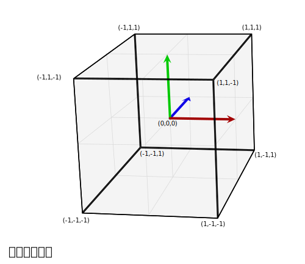
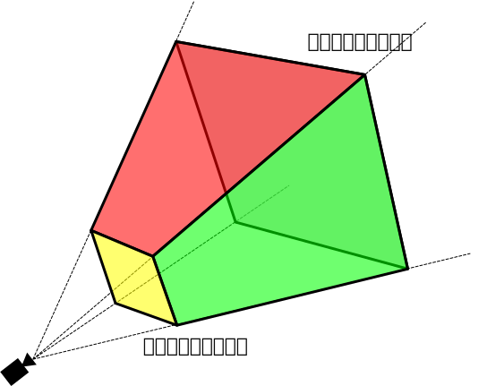

{{DefaultAPISidebar("WebGL")}}

この記事では、 [WebGL](/ja/docs/Web/API/WebGL_API) プロジェクト内でデータを取得し、それを適切な空間に投影して画面に表示するやり方について説明します。並進、拡縮、回転行列を使った基本的な行列計算の知識があることを前提としています。3D シーンを構成するときに通常使われる中心的な 3 つの行列である、モデル、ビュー、投影行列について説明します。

## モデル、ビュー、投影行列

WebGL の空間内の点とポリゴンの個々の変換は、並進、拡縮、回転などの基本的な変換行列によって処理されます。 これらの行列は、複雑な 3D シーンの描画に役立つように、一緒に構成し、特別なやり方でグループ化できます。これらの構成された行列は、最終的に元のモデルデータを**クリップ空間**と呼ばれる特別な座標空間に移動します。これは 2 ユニットの幅の立方体で、中心が (0,0,0)、対角が (-1,-1,-1) から (1,1,1) になります。このクリップ空間は 2 次元平面に圧縮され、画像へラスタライズされます。

以下で説明する初めの行列は**モデル行列**です。これは、元のモデルデータを取得して 3 次元ワールド空間内で移動するやり方を定義します。 **投影行列**は、ワールド空間座標をクリップ空間座標に変えるために使われます。 一般的に使われる投影行列である**透視投影投影行列**は、3D 仮想世界の視聴者の代理として動く一般的なカメラの*効果*を模倣するために使われます。 **ビュー行列**は、変えられるカメラの位置をシミュレートし、シーン内のオブジェクトを移動して視聴者が現在何を見られるかを変えます。

以下のセクションでは、モデル、ビュー、投影行列の背景にある考え方と実装について詳説します。 これらの行列は、画面上でデータを移動するための根幹であり、個々のフレームワークやエンジンを超える概念です。

## クリップ空間

WebGL プログラムでは、通常、データは自分の座標系で GPU にアップロードされ、次に頂点シェーダーがそれらの点を**クリップ空間**と呼ばれる特別な座標系に変えます。クリップ空間の外側にあるデータは切り取られ、描画されません。ただし、三角形がこのスペースの境界を跨ぐ場合は、新しい三角形に分割され、クリップスペースにある新しい三角形の部分のみが残ります。



上の図は、すべての点が収まる必要のあるクリップ空間を視覚化したものです。これは、各辺が 2 の立方体であり、片方の角が (-1,-1,-1) にあり、対角が (1,1,1) にあります。立方体の中心は点 (0,0,0) です。 クリップ空間に使われるこの 8 立方メートルの座標系は、正規化デバイス座標（NDC）と呼ばれます。WebGL コードを調べて作業している間、その用語を時々耳にするかもしれません。

このセクションでは、データをクリップ空間座標系に直接置く仕組みを説明します。 通常、任意の座標系にあるモデルデータが使われ、その後、行列を使って変えられ、モデル座標がクリップ空間座標系に変えられます。この例では、クリップ空間がどのように動くかを最も簡単に説明する為、単純に (-1, -1, -1) から (1,1,1) までの範囲のモデル座標を使います。以下のコードは、画面上に正方形を描く為に 2 つの三角形を作ります。正方形の Z 深度は、正方形が同じ空間を共有するときに何が上に描画されるかを決めます。小さい Z 値は大きい Z 値の上にレンダリングされます。

<!-- Shared setup -->

```html hidden live-sample___clip_space_ex live-sample___homogenous_coordinates_ex live-sample___model_transform_ex live-sample___divide_by_w_ex live-sample___simple_projection_ex live-sample___projection_matrix_ex live-sample___view_matrix_ex
<canvas id="canvas" width="1000" height="1000"></canvas>
```

```css hidden live-sample___clip_space_ex live-sample___homogenous_coordinates_ex live-sample___model_transform_ex live-sample___divide_by_w_ex live-sample___simple_projection_ex live-sample___projection_matrix_ex live-sample___view_matrix_ex
html,
body {
  width: 100%;
  height: 100%;
  margin: 0;
  overflow: hidden;
}
canvas {
  width: 100% !important;
  height: 100% !important;
}
svg {
  width: 100%;
  height: 100%;
  position: absolute;
  top: 0;
  left: 0;
}
```

```js hidden live-sample___clip_space_ex live-sample___homogenous_coordinates_ex live-sample___model_transform_ex live-sample___divide_by_w_ex live-sample___simple_projection_ex live-sample___projection_matrix_ex live-sample___view_matrix_ex
function createShader(gl, source, type) {
  // gl.VERTEX_SHADER または gl.FRAGMENT_SHADER 型のシェーダーをコンパイル
  const shader = gl.createShader(type);
  gl.shaderSource(shader, source);
  gl.compileShader(shader);

  if (!gl.getShaderParameter(shader, gl.COMPILE_STATUS)) {
    const info = gl.getShaderInfoLog(shader);
    throw new Error(`Could not compile WebGL program.\n\n${info}`);
  }

  return shader;
}

function linkProgram(gl, vertexShader, fragmentShader) {
  const program = gl.createProgram();
  gl.attachShader(program, vertexShader);
  gl.attachShader(program, fragmentShader);
  gl.linkProgram(program);

  if (!gl.getProgramParameter(program, gl.LINK_STATUS)) {
    const info = gl.getProgramInfoLog(program);
    throw new Error(`Could not compile WebGL program.\n\n${info}`);
  }

  return program;
}

function createWebGLProgram(gl, vertexSource, fragmentSource) {
  // createShader() と linkProgram() を組み合わせる
  const vertexShader = createShader(gl, vertexSource, gl.VERTEX_SHADER);
  const fragmentShader = createShader(gl, fragmentSource, gl.FRAGMENT_SHADER);
  return linkProgram(gl, vertexShader, fragmentShader);
}

function createWebGLProgramFromIds(gl, vertexSourceId, fragmentSourceId) {
  const vertexSourceEl = document.getElementById(vertexSourceId);
  const fragmentSourceEl = document.getElementById(fragmentSourceId);

  return createWebGLProgram(
    gl,
    vertexSourceEl.innerHTML,
    fragmentSourceEl.innerHTML,
  );
}
```

```js hidden live-sample___model_transform_ex live-sample___divide_by_w_ex live-sample___simple_projection_ex live-sample___projection_matrix_ex live-sample___view_matrix_ex
// 以下の関数は Matrix_math_for_the_web からコピーされている
// point • matrix
function multiplyMatrixAndPoint(matrix, point) {
  // 行列の各要素に、列番号と行番号を用いた単純な変数名を割り当てる
  const c0r0 = matrix[0],
    c1r0 = matrix[1],
    c2r0 = matrix[2],
    c3r0 = matrix[3];
  const c0r1 = matrix[4],
    c1r1 = matrix[5],
    c2r1 = matrix[6],
    c3r1 = matrix[7];
  const c0r2 = matrix[8],
    c1r2 = matrix[9],
    c2r2 = matrix[10],
    c3r2 = matrix[11];
  const c0r3 = matrix[12],
    c1r3 = matrix[13],
    c2r3 = matrix[14],
    c3r3 = matrix[15];

  // 次に、そのポイントにわかりやすい名前を付ける
  const x = point[0];
  const y = point[1];
  const z = point[2];
  const w = point[3];

  // その値を第 1 列の各要素に掛け、それらを足す
  const resultX = x * c0r0 + y * c0r1 + z * c0r2 + w * c0r3;

  // その値を第 2 列の各要素に掛け、それらを足す
  const resultY = x * c1r0 + y * c1r1 + z * c1r2 + w * c1r3;

  // その値を第 3 列の各要素に掛け、それらを足す
  const resultZ = x * c2r0 + y * c2r1 + z * c2r2 + w * c2r3;

  // その値を第 4 列の各要素に掛け、それらを足す
  const resultW = x * c3r0 + y * c3r1 + z * c3r2 + w * c3r3;

  return [resultX, resultY, resultZ, resultW];
}

// matrixB • matrixA
function multiplyMatrices(matrixA, matrixB) {
  // 2 番目の行列を行ごとに分ける
  const row0 = [matrixB[0], matrixB[1], matrixB[2], matrixB[3]];
  const row1 = [matrixB[4], matrixB[5], matrixB[6], matrixB[7]];
  const row2 = [matrixB[8], matrixB[9], matrixB[10], matrixB[11]];
  const row3 = [matrixB[12], matrixB[13], matrixB[14], matrixB[15]];

  // 各行に行列 A を掛ける
  const result0 = multiplyMatrixAndPoint(matrixA, row0);
  const result1 = multiplyMatrixAndPoint(matrixA, row1);
  const result2 = multiplyMatrixAndPoint(matrixA, row2);
  const result3 = multiplyMatrixAndPoint(matrixA, row3);

  // 結果の行を一つの行列に戻す
  // prettier-ignore
  return [
    result0[0], result0[1], result0[2], result0[3],
    result1[0], result1[1], result1[2], result1[3],
    result2[0], result2[1], result2[2], result2[3],
    result3[0], result3[1], result3[2], result3[3],
  ];
}

function multiplyArrayOfMatrices(matrices) {
  if (matrices.length === 1) {
    return matrices[0];
  }
  return matrices.reduce((result, matrix) => multiplyMatrices(result, matrix));
}

function translate(x, y, z) {
  // prettier-ignore
  return [
    1, 0, 0, 0,
    0, 1, 0, 0,
    0, 0, 1, 0,
    x, y, z, 1,
  ];
}

function scale(x, y, z) {
  // prettier-ignore
  return [
    x, 0, 0, 0,
    0, y, 0, 0,
    0, 0, z, 0,
    0, 0, 0, 1,
  ];
}

const sin = Math.sin;
const cos = Math.cos;

function rotateX(a) {
  // prettier-ignore
  return [
    1, 0, 0, 0,
    0, cos(a), -sin(a), 0,
    0, sin(a), cos(a), 0,
    0, 0, 0, 1,
  ];
}

function rotateY(a) {
  // prettier-ignore
  return [
    cos(a), 0, sin(a), 0,
    0, 1, 0, 0,
    -sin(a), 0, cos(a), 0,
    0, 0, 0, 1,
  ];
}

function rotateZ(a) {
  // prettier-ignore
  return [
    cos(a), -sin(a), 0, 0,
    sin(a), cos(a), 0, 0,
    0, 0, 1, 0,
    0, 0, 0, 1,
  ];
}

// 3 次元の立方体を作るために必要なデータを定義する。
function createCubeData() {
  // prettier-ignore
  const positions = [
    // Front face
    -1.0, -1.0, 1.0, 1.0, -1.0, 1.0, 1.0, 1.0, 1.0, -1.0, 1.0, 1.0,
    // Back face
    -1.0, -1.0, -1.0, -1.0, 1.0, -1.0, 1.0, 1.0, -1.0, 1.0, -1.0, -1.0,
    // Top face
    -1.0, 1.0, -1.0, -1.0, 1.0, 1.0, 1.0, 1.0, 1.0, 1.0, 1.0, -1.0,
    // Bottom face
    -1.0, -1.0, -1.0, 1.0, -1.0, -1.0, 1.0, -1.0, 1.0, -1.0, -1.0, 1.0,
    // Right face
    1.0, -1.0, -1.0, 1.0, 1.0, -1.0, 1.0, 1.0, 1.0, 1.0, -1.0, 1.0,
    // Left face
    -1.0, -1.0, -1.0, -1.0, -1.0, 1.0, -1.0, 1.0, 1.0, -1.0, 1.0, -1.0,
  ];

  // prettier-ignore
  const colorsOfFaces = [
    [0.3, 1.0, 1.0, 1.0],    // Front face: cyan
    [1.0, 0.3, 0.3, 1.0],    // Back face: red
    [0.3, 1.0, 0.3, 1.0],    // Top face: green
    [0.3, 0.3, 1.0, 1.0],    // Bottom face: blue
    [1.0, 1.0, 0.3, 1.0],    // Right face: yellow
    [1.0, 0.3, 1.0, 1.0]     // Left face: purple
  ];

  let colors = [];

  for (const polygonColor of colorsOfFaces) {
    for (let i = 0; i < 4; i++) {
      colors = colors.concat(polygonColor);
    }
  }

  // prettier-ignore
  const elements = [
    0,  1,  2,   0,  2,  3,    // front
    4,  5,  6,   4,  6,  7,    // back
    8,  9,  10,  8,  10, 11,   // top
    12, 13, 14,  12, 14, 15,   // bottom
    16, 17, 18,  16, 18, 19,   // right
    20, 21, 22,  20, 22, 23,   // left
  ];

  return { positions, elements, colors };
}

// キューブのデータを得て、それに対応するバッファーをバインド。
// バッファーのオブジェクトコレクションを返す。
function createBuffersForCube(gl, cube) {
  const positions = gl.createBuffer();
  gl.bindBuffer(gl.ARRAY_BUFFER, positions);
  gl.bufferData(
    gl.ARRAY_BUFFER,
    new Float32Array(cube.positions),
    gl.STATIC_DRAW,
  );

  const colors = gl.createBuffer();
  gl.bindBuffer(gl.ARRAY_BUFFER, colors);
  gl.bufferData(gl.ARRAY_BUFFER, new Float32Array(cube.colors), gl.STATIC_DRAW);

  const elements = gl.createBuffer();
  gl.bindBuffer(gl.ELEMENT_ARRAY_BUFFER, elements);
  gl.bufferData(
    gl.ELEMENT_ARRAY_BUFFER,
    new Uint16Array(cube.elements),
    gl.STATIC_DRAW,
  );

  return { positions, elements, colors };
}
```

### WebGLBox の例

この例では、画面上に 2 次元のボックスを描画するカスタム `WebGLBox` オブジェクトを作ります。これはクラスとして実装されており、コンストラクターと、画面にボックスを描画するための `draw()` メソッドを備えています。

```js live-sample___clip_space_ex
class WebGLBox {
  canvas = document.getElementById("canvas");
  gl = this.canvas.getContext("webgl");
  webglProgram = createWebGLProgramFromIds(
    this.gl,
    "vertex-shader",
    "fragment-shader",
  );
  positionLocation;
  colorLocation;
  constructor() {
    const gl = this.gl;

    // WebGL プログラムをセットアップ
    gl.useProgram(this.webglProgram);

    // 属性とユニフォームの場所を保存
    this.positionLocation = gl.getAttribLocation(this.webglProgram, "position");
    this.colorLocation = gl.getUniformLocation(this.webglProgram, "vColor");

    // 描く時に深度テストするよう WebGL に指示する。
    // これにより、ある正方形が別の正方形の背後にある場合、その正方形は描かれなくなる。
    gl.enable(gl.DEPTH_TEST);
  }
  draw(settings) {
    // 属性データを作る。これらは最終的に画面に描画される三角形。
    // 正方形を形作る 2 つの三角形で作られている。

    // prettier-ignore
    const data = new Float32Array([
      // 三角形 1
      settings.left, settings.bottom, settings.depth,
      settings.right, settings.bottom, settings.depth,
      settings.left, settings.top, settings.depth,

      // 三角形 2
      settings.left, settings.top, settings.depth,
      settings.right, settings.bottom, settings.depth,
      settings.right, settings.top, settings.depth,
    ]);

    // WebGL を使って、これを画面に描く。

    // パフォーマンス上の注意: 描画呼び出し（ドローコール）ごとに新しい配列バッファーを作るのは遅い。
    // この関数はあくまで説明用。

    const gl = this.gl;

    // バッファーを作り、データをバインド
    const buffer = gl.createBuffer();
    gl.bindBuffer(gl.ARRAY_BUFFER, buffer);
    gl.bufferData(gl.ARRAY_BUFFER, data, gl.STATIC_DRAW);

    // 頂点データ（三角形）へのポインターを設定
    gl.enableVertexAttribArray(this.positionLocation);
    gl.vertexAttribPointer(this.positionLocation, 3, gl.FLOAT, false, 0, 0);

    // すべての三角形で共有されるカラーユニフォームを設定
    gl.uniform4fv(this.colorLocation, settings.color);

    // 三角形を画面に描画
    gl.drawArrays(gl.TRIANGLES, 0, 6);
  }
}
```

シェーダーとは、GLSL で書かれたコードのことで、データポイントを受け取り、最終的にそれらを画面に描画する役割を担います。便宜上、これらのシェーダーは {{htmlelement("script")}} 要素内に格納されており、カスタム関数 `createWebGLProgramFromIds()` を介してプログラムに読み込まれます。この関数は、GLSL ソースコードを受け取り、それを WebGL プログラムとしてコンパイルするという基本的な処理します。この関数は 3 つの引数を取ります。すなわち、プログラムを描画するコンテキスト、頂点シェーダーを含む {{htmlelement("script")}} 要素の ID、そしてフラグメントシェーダーを含む {{htmlelement("script")}} 要素の ID です。この関数の細かい説明はここでは行いませんが、実装を確かめたい場合は、コードブロックの「Play」をクリックしてください。頂点シェーダーは頂点の位置を決め、フラグメントシェーダーは各ピクセルの色を決めます。

初めに、画面上で頂点を移動させる頂点シェーダーを見てみましょう。

```glsl
// 個別の位置頂点
attribute vec3 position;

void main() {
  // gl_Position は、頂点シェーダーによる変更後のクリップ空間における最終的な位置
  gl_Position = vec4(position, 1.0);
}
```

```html hidden live-sample___clip_space_ex
<script id="vertex-shader" type="x-shader/x-vertex">
  // 個別の位置頂点
  attribute vec3 position;

  void main() {
    // gl_Position は、頂点シェーダーによる変更後のクリップ空間における最終的な位置
    gl_Position = vec4(position, 1.0);
  }
</script>
```

次に、データを実際にピクセルにラスタライズするために、フラグメントシェーダーはピクセルごとにすべてを評価し、一つの色を設定します。GPU は、レンダリングする必要があるピクセルごとにシェーダー関数を呼び出します。シェーダーの仕事は、そのピクセルに使う色を返すことです。

```glsl
precision mediump float;
uniform vec4 vColor;

void main() {
  gl_FragColor = vColor;
}
```

```html hidden live-sample___clip_space_ex live-sample___homogenous_coordinates_ex
<script id="fragment-shader" type="x-shader/x-fragment">
  precision mediump float;
  uniform vec4 vColor;

  void main() {
    gl_FragColor = vColor;
  }
</script>
```

これらの設定が含まれているので、クリップ空間座標を使って画面に直接描画します。

```js live-sample___clip_space_ex
const box = new WebGLBox();
```

初めに中央に赤いボックスを描きます。

```js live-sample___clip_space_ex
box.draw({
  top: 0.5, // x
  bottom: -0.5, // x
  left: -0.5, // y
  right: 0.5, // y

  depth: 0, // z
  color: [1, 0.4, 0.4, 1], // red
});
```

次に、緑色のボックスを赤いボックスの上部に描画します。

```js live-sample___clip_space_ex
box.draw({
  top: 0.9, // x
  bottom: 0, // x
  left: -0.9, // y
  right: 0.9, // y

  depth: 0.5, // z
  color: [0.4, 1, 0.4, 1], // green
});
```

最後に、クリッピングが実際に行われていることを示すために、このボックスはすべてクリップ空間の外側にあるため、描画されません。深さが -1.0 から 1.0 の範囲外です。

```js live-sample___clip_space_ex
box.draw({
  top: 1, // x
  bottom: -1, // x
  left: -1, // y
  right: 1, // y

  depth: -1.5, // z
  color: [0.4, 0.4, 1, 1], // blue
});
```

#### 結果

```html hidden live-sample___clip_space_ex live-sample___homogenous_coordinates_ex
<!-- The SVG overlay showing clip space -->
<svg
  id="clip-space-axis"
  xmlns="http://www.w3.org/2000/svg"
  viewBox="0 0 500 500"
  preserveAspectRatio="none"></svg>

<!-- Use a separate SVG for text to avoid scaling -->
<svg id="clip-space-text" xmlns="http://www.w3.org/2000/svg"></svg>
```

```js hidden live-sample___clip_space_ex live-sample___homogenous_coordinates_ex
const axisOverlay = document.getElementById("clip-space-axis");
const xAxis = document.createElementNS("http://www.w3.org/2000/svg", "path");
const yAxis = document.createElementNS("http://www.w3.org/2000/svg", "path");
yAxis.setAttribute("fill", "none");
yAxis.setAttribute("stroke", "black");
xAxis.setAttribute("fill", "none");
xAxis.setAttribute("stroke", "black");
let yAxisPath = "M 249.5 0 L 249.5 500";
let xAxisPath = "M 0 250.5 L 500 250.5";
for (let i = -10; i <= 10; i++) {
  if (i === 0) continue;
  const length = i % 5 === 0 ? 24 : 12;
  const loc = 250 + i * 25 - 0.5;
  yAxisPath += ` M 249.5 ${loc} L ${249.5 + length} ${loc}`;
  xAxisPath += ` M ${loc} 250.5 L ${loc} ${250.5 - length}`;
}
xAxis.setAttribute("d", xAxisPath);
yAxis.setAttribute("d", yAxisPath);
axisOverlay.appendChild(xAxis);
axisOverlay.appendChild(yAxis);

const textOverlay = document.getElementById("clip-space-text");
for (const label of ["+X", "-X", "+Y", "-Y"]) {
  const textEl = document.createElementNS("http://www.w3.org/2000/svg", "text");
  let x, y;
  if (label === "+X") {
    [x, y] = ["97.5%", "53%"];
  } else if (label === "-X") {
    [x, y] = ["2.5%", "53%"];
  } else if (label === "+Y") {
    [x, y] = ["47%", "2.5%"];
  } else if (label === "-Y") {
    [x, y] = ["47%", "97.5%"];
  }
  textEl.setAttribute("x", x);
  textEl.setAttribute("y", y);
  textEl.setAttribute("text-anchor", "middle");
  textEl.setAttribute("font-family", "'Courier New'");
  textEl.setAttribute("font-size", "16");
  textEl.setAttribute("font-weight", "bold");
  textEl.textContent = label;
  textOverlay.appendChild(textEl);
}
for (let i = -1; i <= 1; i += 0.5) {
  if (i === 0) continue;
  const textEl = document.createElementNS("http://www.w3.org/2000/svg", "text");
  textEl.setAttribute("x", "58%");
  textEl.setAttribute("y", `${50 - i * 48}%`);
  textEl.setAttribute("text-anchor", "end");
  textEl.setAttribute("font-family", "'Courier New'");
  textEl.setAttribute("font-size", "11");
  textEl.textContent = i.toFixed(1);
  textOverlay.appendChild(textEl);
  const textEl2 = document.createElementNS(
    "http://www.w3.org/2000/svg",
    "text",
  );
  textEl2.setAttribute("x", `${50 + i * 50}%`);
  textEl2.setAttribute("y", "45%");
  textEl2.setAttribute("text-anchor", i > 0 ? "end" : "start");
  textEl2.setAttribute("font-family", "'Courier New'");
  textEl2.setAttribute("font-size", "11");
  textEl2.textContent = i.toFixed(1);
  textOverlay.appendChild(textEl2);
}
```

{{EmbedLiveSample("clip_space_ex", "", 600)}}

#### 演習

この時点で役立つ演習は、コードを変えてボックスをクリップ空間内で移動し、点がクリップ空間内でどのようにクリップされ、移動されるかを感じ取ることです。背景を持つボックス状のスマイルのような絵を描いてみてください。

## 同次座標

前のクリップ空間の頂点シェーダのメインラインは、このコードを含んでいました。

```glsl
gl_Position = vec4(position, 1.0);
```

変数 `position` は、 `draw()` メソッドで定義され、属性としてシェーダーに渡されました。これは三次元の点ですが、パイプラインを介して渡されることになる変数 `gl_Position` は実際には四次元です。すなわち、 `(x, y, z)` の代わりに `(x, y, z, w)` となっています。`z` の後には文字がないため、慣例により、この 4 番目の次元には `w` というラベルが付いています。 上記の例では、 `w` 座標は 1.0 に設定されています。

明らかな疑問は、「なぜ余分な次元があるのか？」です。この追加により、3D データを操作するための多くの優れた手法が可能になることが分かります。この加えられた次元により、遠近法の概念が座標系に導入されます。それを配置すると、3D 座標を 2D 空間にマッピングできます。これにより、2 本の平行線が遠くに離れるときに交差するようになります。値 `w` は、座標の他のコンポーネントの除数として使われるため、 `x`、`y`、`z` の真の値は、`x/w`、`y/w`、`z/w` として計算されます（そして、`w` も `w/w` で 1 になります）。

三次元の点は、典型的なデカルト座標系で定義されます。四次元目が加わることで、この点は [同次座標](https://en.wikipedia.org/wiki/Homogeneous_coordinates) に変わります。これはまだ 3 次元空間の点を表しており、このような座標をどのように作るかは、単純な関数の組によって簡単に示せます。

```js
function cartesianToHomogeneous(point) {
  let x = point[0];
  let y = point[1];
  let z = point[2];

  return [x, y, z, 1];
}

function homogeneousToCartesian(point) {
  let x = point[0];
  let y = point[1];
  let z = point[2];
  let w = point[3];

  return [x / w, y / w, z / w];
}
```

前述したように、また上の関数で示したように、 w 成分は x、y、z 成分を除算します。 w 成分がゼロでない実数であるとき、同次座標は直交空間の法線点に簡単に戻ります。では、 w 成分がゼロの場合はどうなるでしょうか。 JavaScript では次のような値が返されます。

```js
homogeneousToCartesian([10, 4, 5, 0]);
```

これは `[Infinity, Infinity, Infinity]` と評価されます。

この同次座標は無限の位置にある点を表します。これは、原点から特定の向きに放たれる光線を表す便利なやり方です。光線だけでなく、方向ベクトルの表現と考えられます。この同次座標を平行移動のある行列と掛けると、平行移動は効果的に取り除かれます。

コンピューター上で数字が極端に大きく（あるいは極端に小さく）なると、それを表すのに使われる 1 と 0 の数が限られるため、精度がどんどん落ちていきます。大きな数を運営する演算子が増えれば増えるほど、結果に誤差が蓄積されていきます。w で割る場合、 2 つの潜在的に小さくて誤差の少ない数を操作することで、とても大きな数の精度を効果的に高められます。

同次座標を使う最後の好ましいことは、 4x4 行列に対して乗算するのにとてもうまく適合するということです。行列に対して乗算するためには、頂点は行列の少なくとも 1 つの次元と一致しなければなりません。 4x4 行列は、さまざまな有益な変換をエンコードするために使えます。実際，典型的な透視投影行列は，その変換を実現するために w 成分による除算を使っています．

クリップ空間からの点とポリゴンのクリッピングは、同次座標が（w で割ることによって）デカルト座標に変えられる前に行われます。この最終空間は**正規化機器座標**または NDC として知られています。

このアイデアを試してみるために、先ほどの例を直して `w` 成分を使えるようにしてみましょう。`data` を変えるだけでなく、`vertexAttribPointer()` の呼び出しにおいて、（第 2 引数の `size` で決める）成分数を 3 ではなく 4 に変えるのを忘れないようにしてください。

```js
// W 成分を使うように三角形を再定義
// prettier-ignore
const data = new Float32Array([
  // 三角形 1
  settings.left, settings.bottom, settings.depth, settings.w,
  settings.right, settings.bottom, settings.depth, settings.w,
  settings.left, settings.top, settings.depth, settings.w,

  // 三角形 2
  settings.left, settings.top, settings.depth, settings.w,
  settings.right, settings.bottom, settings.depth, settings.w,
  settings.right, settings.top, settings.depth, settings.w,
]);
```

```js hidden live-sample___homogenous_coordinates_ex
class WebGLBox {
  canvas = document.getElementById("canvas");
  gl = this.canvas.getContext("webgl");
  webglProgram = createWebGLProgramFromIds(
    this.gl,
    "vertex-shader",
    "fragment-shader",
  );
  positionLocation;
  colorLocation;
  constructor() {
    const gl = this.gl;

    // WebGL プログラムをセットアップ
    gl.useProgram(this.webglProgram);

    // 属性とユニフォームの場所を保存
    this.positionLocation = gl.getAttribLocation(this.webglProgram, "position");
    this.colorLocation = gl.getUniformLocation(this.webglProgram, "vColor");

    // 描く時に深度テストするよう WebGL に指示する。
    // これにより、ある正方形が別の正方形の背後にある場合、その正方形は描かれなくなる。
    gl.enable(gl.DEPTH_TEST);
  }
  draw(settings) {
    // 属性データを作る。これらは最終的に画面に描画される三角形。
    // 正方形を形作る 2 つの三角形で作られている。

    // prettier-ignore
    const data = new Float32Array([
      // 三角形 1
      settings.left, settings.bottom, settings.depth, settings.w,
      settings.right, settings.bottom, settings.depth, settings.w,
      settings.left, settings.top, settings.depth, settings.w,

      // 三角形 2
      settings.left, settings.top, settings.depth, settings.w,
      settings.right, settings.bottom, settings.depth, settings.w,
      settings.right, settings.top, settings.depth, settings.w,
    ]);

    // WebGL を使って、これを画面に描く。

    // パフォーマンス上の注意: 描画呼び出し（ドローコール）ごとに新しい配列バッファーを作るのは遅い。
    // この関数はあくまで説明用。

    const gl = this.gl;

    // バッファーを作り、データをバインド
    const buffer = gl.createBuffer();
    gl.bindBuffer(gl.ARRAY_BUFFER, buffer);
    gl.bufferData(gl.ARRAY_BUFFER, data, gl.STATIC_DRAW);

    // 頂点データ（三角形）へのポインターを設定
    gl.enableVertexAttribArray(this.positionLocation);
    gl.vertexAttribPointer(this.positionLocation, 4, gl.FLOAT, false, 0, 0);

    // すべての三角形で共有されるカラーユニフォームを設定
    gl.uniform4fv(this.colorLocation, settings.color);

    // 三角形を画面に描画
    gl.drawArrays(gl.TRIANGLES, 0, 6);
  }
}

const box = new WebGLBox();
```

その後、頂点シェーダーは渡された 4 次元目の点を使います。

```glsl
attribute vec4 position;

void main() {
  gl_Position = position;
}
```

```html hidden live-sample___homogenous_coordinates_ex
<script id="vertex-shader" type="x-shader/x-vertex">
  attribute vec4 position;

  void main() {
    gl_Position = position;
  }
</script>
```

初めに真ん中に赤い枠を描画しますが、 W は 0.7 に設定します。座標が 0.7 で分割されると、すべて拡大されます。

```js live-sample___homogenous_coordinates_ex
box.draw({
  top: 0.5, // y
  bottom: -0.5, // y
  left: -0.5, // x
  right: 0.5, // x
  w: 0.7, // w - このボックスを拡大する

  depth: 0, // z
  color: [1, 0.4, 0.4, 1], // red
});
```

これで上部に緑色のボックスを描画しますが、 w 成分を 1.1 に設定するには縮小します。

```js live-sample___homogenous_coordinates_ex
box.draw({
  top: 0.9, // y
  bottom: 0, // y
  left: -0.9, // x
  right: 0.9, // x
  w: 1.1, // w - このボックスを縮小する

  depth: 0.5, // z
  color: [0.4, 1, 0.4, 1], // green
});
```

この最後のボックスはクリップ空間の外なので描画されません。深さは -1.0 から 1.0 の範囲外です。

```js live-sample___homogenous_coordinates_ex
box.draw({
  top: 1, // y
  bottom: -1, // y
  left: -1, // x
  right: 1, // x
  w: 1.5, // w - この箱を範囲内に持ってくる

  depth: -1.5, // z
  color: [0.4, 0.4, 1, 1], // blue
});
```

### 結果

{{EmbedLiveSample("homogenous_coordinates_ex", "", 600)}}

### 練習問題

- これらの値を操作して、画面に描画されるものにどのような影響があるか見てみましょう。前回クリップされていた青いボックスが、 w 成分を設定することで範囲内に戻ったことにメモしてください。
- クリップ空間の外側に新しいボックスを作り、 w で割って内側に戻してみてください。

## モデルの座標変換

クリップ空間に点を直接置いても、使うことには限界があります。実際のアプリケーションでは、すべてのソース座標がクリップ空間座標にすでに収まっているとは限りません。そのため、ほとんどの場合、モデルデータや他の座標をクリップ空間に変える必要があります。地味な立方体は、このやり方の単純な例です。立方体のデータは、頂点位置、立方体の面の色、および個々の多角形を構成する頂点位置の順序（立方体の面を構成する三角形を構成する 3 つの頂点のグループ）で構成されます。位置と色は GL バッファーに格納され、属性としてシェーダに送られ、個別に処理されます。

最後に、単一のモデル行列が計算され、設定されます。この行列は、モデルを構成するすべての点に対して、モデルを正しい空間に移動させ、モデルの各点に対して他にも必要な変えるために行われる変換を表します。これは、各頂点だけでなく、モデルのすべての面上の単一の点にも適用されます。

この場合、アニメーションのフレームごとに、一連の拡大縮小、回転、平行移動の行列がデータをクリップ空間の目的の場所に移動させます。立方体はクリップ空間のサイズ (-1,-1,-1) から (1,1,1) なので、クリップ空間全体を埋めないように縮小する必要があります。この行列は、あらかじめ JavaScript で乗算した後、直接シェーダーに送られます。

以下のコード例では、モデル行列を生成するメソッドを `CubeDemo` オブジェクトに定義しています。新しい関数は次のようになります（ユーティリティ関数については、「[Web 用の行列演算](/ja/docs/Web/API/WebGL_API/Matrix_math_for_the_web)」の章で紹介されています）。

```js
function computeModelMatrix(now) {
  // 20% に縮める
  const scaleMatrix = scale(0.2, 0.2, 0.2);
  // わずかに傾ける
  const rotateXMatrix = rotateX(now * 0.0003);
  // 時間経過に合わせて回す
  const rotateYMatrix = rotateY(now * 0.0005);
  // 少し下に動かす
  const translateMatrix = translate(0, -0.1, 0);
  // 行列を掛ける（適用順とは逆順で読み込むことに注意）
  this.transforms.model = multiplyArrayOfMatrices([
    translateMatrix, // ステップ 4
    rotateYMatrix, // ステップ 3
    rotateXMatrix, // ステップ 2
    scaleMatrix, // ステップ 1
  ]);
}
```

これをシェーダーで使うには、ユニフォームの位置に設定する必要があります。ユニフォームの位置は下記に示す `locations` オブジェクトに保存されます。

```js
this.locations.model = gl.getUniformLocation(webglProgram, "model");
```

そして最後にユニフォームをその場所に設定します。これで行列が GPU に渡されます。

```js
gl.uniformMatrix4fv(
  this.locations.model,
  false,
  new Float32Array(this.transforms.model),
);
```

```js hidden live-sample___model_transform_ex live-sample___divide_by_w_ex
class CubeDemo {
  canvas = document.getElementById("canvas");
  gl = this.canvas.getContext("webgl");
  webglProgram = createWebGLProgramFromIds(
    this.gl,
    "vertex-shader",
    "fragment-shader",
  );
  transforms = {}; // すべての行列変換
  locations = {}; // すべてのシェーダーのロケーション
  buffers;

  constructor() {
    const gl = this.gl;
    gl.useProgram(this.webglProgram);
    this.buffers = createBuffersForCube(gl, createCubeData());

    // 属性とユニフォームの場所を保存
    this.locations.model = gl.getUniformLocation(this.webglProgram, "model");
    this.locations.position = gl.getAttribLocation(
      this.webglProgram,
      "position",
    );
    this.locations.color = gl.getAttribLocation(this.webglProgram, "color");

    // 描く時に深度テストするよう WebGL に指示
    gl.enable(gl.DEPTH_TEST);
  }

  computeModelMatrix(now) {
    // 20% に縮める
    const scaleMatrix = scale(0.2, 0.2, 0.2);
    // わずかに傾ける
    const rotateXMatrix = rotateX(now * 0.0003);
    // 時間経過に合わせて回す
    const rotateYMatrix = rotateY(now * 0.0005);
    // 少し下に動かす
    const translateMatrix = translate(0, -0.1, 0);
    // 行列を掛ける（適用順とは逆順で読み込むことに注意）
    this.transforms.model = multiplyArrayOfMatrices([
      translateMatrix, // ステップ 4
      rotateYMatrix, // ステップ 3
      rotateXMatrix, // ステップ 2
      scaleMatrix, // ステップ 1
    ]);

    // パフォーマンス上の注意: 実際のプロダクションコードでは、
    // ループ内で新しい配列やオブジェクトを作らない方が望ましい。
    // この例では、パフォーマンスよりもコードの分かりやすさを優先している。
  }

  draw() {
    const gl = this.gl;
    const now = Date.now();
    // 行列を計算
    this.computeModelMatrix(now);
    // GPU に送るデータを更新
    // すべての三角形で共有されるカラーユニフォームを設定
    gl.uniformMatrix4fv(
      this.locations.model,
      false,
      new Float32Array(this.transforms.model),
    );

    // 位置属性を設定
    gl.enableVertexAttribArray(this.locations.position);
    gl.bindBuffer(gl.ARRAY_BUFFER, this.buffers.positions);
    gl.vertexAttribPointer(this.locations.position, 3, gl.FLOAT, false, 0, 0);

    // 色属性を設定
    gl.enableVertexAttribArray(this.locations.color);
    gl.bindBuffer(gl.ARRAY_BUFFER, this.buffers.colors);
    gl.vertexAttribPointer(this.locations.color, 4, gl.FLOAT, false, 0, 0);

    gl.bindBuffer(gl.ELEMENT_ARRAY_BUFFER, this.buffers.elements);
    // 実際に描く
    gl.drawElements(gl.TRIANGLES, 36, gl.UNSIGNED_SHORT, 0);
    // 描画をループとして行う
    requestAnimationFrame(() => this.draw());
  }
}

const cube = new CubeDemo();
cube.draw();
```

シェーダーでは、各位置の頂点は初めに同次座標（`vec4` オブジェクト）に変えられ、次にモデル行列に対して乗算されます。

```glsl
gl_Position = model * vec4(position, 1.0);
```

> [!NOTE]
> JavaScript で行列の乗算はカスタム関数を要求されますが、シェーダーでは単純な `*` 演算子で言語に組み込まれています。

オーケストレーションコード全体は非表示になっています。興味があれば、このセクションのコードブロックの「再生」をクリックして確かめてください。

```html hidden live-sample___model_transform_ex
<!-- 頂点シェーダーは、gl_Position を決めることで、モデルデータの個々の頂点に対して処理します -->
<script id="vertex-shader" type="x-shader/x-vertex">
  // 各点は位置と色を持つ
  attribute vec3 position;
  attribute vec4 color;

  // 変換行列
  uniform mat4 model;

  // 色属性をフラグメントシェーダーに渡す
  varying vec4 vColor;

  void main() {
    // 色をフラグメントシェーダーに渡す
    vColor = color;
    gl_Position = model * vec4(position, 1.0);
  }
</script>
```

```html hidden live-sample___model_transform_ex live-sample___divide_by_w_ex live-sample___simple_projection_ex live-sample___projection_matrix_ex live-sample___view_matrix_ex
<!-- The fragment shader determines the color of the final pixel by setting gl_FragColor -->
<script id="fragment-shader" type="x-shader/x-fragment">
  precision mediump float;
  varying vec4 vColor;

  void main() {
    gl_FragColor = vColor;
  }
</script>
```

### 結果

{{EmbedLiveSample("model_transform_ex", "", 600)}}

この時点では、変換点の w 値は 1.0 のままです。立方体にはまだ視点位置がありません。次の章では、この設定をもとに、 w 値を変えて視点を提供します。

### 練習問題

- 縮小マトリックスを使ってボックスを縮小し、クリップ空間内の様々な場所に置きましょう。
- クリップ空間の外に移してみましょう。
- ウィンドウのサイズを変え、ボックスの図形が歪む様子を確かめましょう。
- `rotateZ` 行列を加えましょう。

## W での除算

立方体のモデルの視点を始めるには、Z 座標を取り、それを w 座標にコピーするのが簡単です。通常、デカルト点を同値に変えるときは `(x,y,z,1)` となりますが、ここでは `(x,y,z,z)` のように設定します。実際には、 z が 0 より大きい点をビューに取り込みたいので、この値を少し変えて `((1.0 + z) * scaleFactor)` とします。これは通常クリップ空間 (-1 ～ 1) にある点を、スケール係数の設定に応じて (0 ～ 1) のような空間に移します。スケール係数は最終的な w の値を全体的に高くしたり低くしたりします。

シェーダーのコードはこんな感じです。

```glsl
// まず、頂点位置を変える
vec4 transformedPosition = model * vec4(position, 1.0);

// 遠近法による影響の度合いを設定
float scaleFactor = 0.5;

// 通常 -1 から 1 の範囲にある z 値を基に w 成分を設定。
// ここでは z 値をスケーリングして、0 から 1 の範囲の値に変える。
float w = (1.0 + transformedPosition.z) * scaleFactor;

// カスタムの w 成分を持つ新しい gl_Position を保存
gl_Position = vec4(transformedPosition.xyz, w);
```

```html hidden live-sample___divide_by_w_ex
<script id="vertex-shader" type="x-shader/x-vertex">
  // 各点は位置と色を持つ
  attribute vec3 position;
  attribute vec4 color;

  // 投影行列
  uniform mat4 model;

  // 色属性をフラグメントシェーダーに渡す
  varying vec4 vColor;

  void main() {
    // 色をフラグメントシェーダーに渡す
    vColor = color;

    // まず、頂点位置を変える
    vec4 transformedPosition = model * vec4(position, 1.0);

    // 遠近法による影響の度合いを設定
    float scaleFactor = 0.5;

    // 通常 -1 から 1 の範囲にある z 値を基に w 成分を設定。
    // ここでは z 値をスケーリングして、0 から 1 の範囲の値に変える。
    float w = (1.0 + transformedPosition.z) * scaleFactor;

    // カスタムの w 成分を持つ新しい gl_Position を保存
    gl_Position = vec4(transformedPosition.xyz, w);
  }
</script>
```

### 結果

{{EmbedLiveSample("divide_by_w_ex", "", 600)}}

カメラに面した角にある小さな三角形が見えますか？それが表示された時のスクリーンショットはこちらです。


これは、オブジェクトに加えられた面です。形の回転によってその角がクリップ領域からはみ出し、結果として角がクリッピングされてしまったためです。クリッピングを制御・防止するために、より複雑な行列を使うやり方については、下記の [透視投影行列](#perspective_projection_matrix) をご覧ください。

### 練習問題

少し抽象的に聞こえるなら、頂点シェーダーを開いてスケール係数を調整し、頂点がサーフェスに向かってどのように縮小するかを見てください。 w 成分の値をすべて変えると、実に巧妙な空間表現ができます。

次の節では、この Z を w スロットにコピーするやり方をとり、行列に変えます。

## 単純な投影

w 成分を埋める最後の手順は、実は単純な行列で実現できます。始めるには恒等行列を使います。

```js
// prettier-ignore
const identity = [
  1, 0, 0, 0,
  0, 1, 0, 0,
  0, 0, 1, 0,
  0, 0, 0, 1,
];

multiplyPoint(identity, [2, 3, 4, 1]);
// [2, 3, 4, 1]
```

そして最後の列の 1 を 1 つ上に移動します。

```js
// prettier-ignore
const copyZ = [
  1, 0, 0, 0,
  0, 1, 0, 0,
  0, 0, 1, 1,
  0, 0, 0, 0,
];

multiplyPoint(copyZ, [2, 3, 4, 1]);
// [2, 3, 4, 4]
```

しかし、最後の例では `(z + 1) * scaleFactor` を行いました。

```js
const scaleFactor = 0.5;

// prettier-ignore
const simpleProjection = [
  1, 0, 0, 0,
  0, 1, 0, 0,
  0, 0, 1, scaleFactor,
  0, 0, 0, scaleFactor,
];

multiplyPoint(simpleProjection, [2, 3, 4, 1]);
// [2, 3, 4, 2.5]
```

もう少し詳しく分析すると、これがどのように動くのかがわかります。

```js
const x = 2 * 1 + 3 * 0 + 4 * 0 + 1 * 0;
const y = 2 * 0 + 3 * 1 + 4 * 0 + 1 * 0;
const z = 2 * 0 + 3 * 0 + 4 * 1 + 1 * 0;
const w = 2 * 0 + 3 * 0 + 4 * scaleFactor + 1 * scaleFactor;
```

最後の行は単純化するとこうなります。

```js
const w = 4 * scaleFactor + 1 * scaleFactor;
```

そして、 scaleFactor を因数分解すると、このようになります。

```js
const w = (4 + 1) * scaleFactor;
```

これは前回の例で使った `(z + 1) * scaleFactor` と全く同じです。

このデモでは、 `computeSimpleProjectionMatrix()` メソッドが加えられています。これは `draw()` メソッドの中で呼び出され、スケール係数が渡されます。結果は前回の例と同じになるはずです。

```js
function computeSimpleProjectionMatrix(scaleFactor) {
  // prettier-ignore
  this.transforms.projection = [
    1, 0, 0, 0,
    0, 1, 0, 0,
    0, 0, 1, scaleFactor,
    0, 0, 0, scaleFactor,
  ];
}
```

```js hidden live-sample___simple_projection_ex
class CubeDemo {
  canvas = document.getElementById("canvas");
  gl = this.canvas.getContext("webgl");
  webglProgram = createWebGLProgramFromIds(
    this.gl,
    "vertex-shader",
    "fragment-shader",
  );
  transforms = {}; // すべての行列変換
  locations = {}; // すべてのシェーダーのロケーション
  buffers;

  constructor() {
    const gl = this.gl;
    gl.useProgram(this.webglProgram);
    this.buffers = createBuffersForCube(gl, createCubeData());

    // 属性とユニフォームの場所を保存
    this.locations.model = gl.getUniformLocation(this.webglProgram, "model");
    this.locations.projection = gl.getUniformLocation(
      this.webglProgram,
      "projection",
    );
    this.locations.position = gl.getAttribLocation(
      this.webglProgram,
      "position",
    );
    this.locations.color = gl.getAttribLocation(this.webglProgram, "color");

    // 描く時に深度テストするよう WebGL に指示
    gl.enable(gl.DEPTH_TEST);
  }

  computeModelMatrix(now) {
    // 20% に縮める
    const scaleMatrix = scale(0.2, 0.2, 0.2);
    // わずかに傾ける
    const rotateXMatrix = rotateX(now * 0.0003);
    // 時間経過に合わせて回す
    const rotateYMatrix = rotateY(now * 0.0005);
    // 少し下に動かす
    const translateMatrix = translate(0, -0.1, 0);
    // 行列を掛ける（適用順とは逆順で読み込むことに注意）
    this.transforms.model = multiplyArrayOfMatrices([
      translateMatrix, // ステップ 4
      rotateYMatrix, // ステップ 3
      rotateXMatrix, // ステップ 2
      scaleMatrix, // ステップ 1
    ]);

    // パフォーマンス上の注意: 実際のプロダクションコードでは、
    // ループ内で新しい配列やオブジェクトを作らない方が望ましい。
    // この例では、パフォーマンスよりもコードの分かりやすさを優先している。
  }

  computeSimpleProjectionMatrix(scaleFactor) {
    // prettier-ignore
    this.transforms.projection = [
      1, 0, 0, 0,
      0, 1, 0, 0,
      0, 0, 1, scaleFactor, // ここでは、追加のスケール係数に注目。
      0, 0, 0, scaleFactor,
    ];

    // この行列は、点をコピーし、W 成分を 1 + (z * scaleFactor) に設定。
  }

  draw() {
    const gl = this.gl;
    const now = Date.now();
    // 行列を計算
    this.computeModelMatrix(now);
    this.computeSimpleProjectionMatrix(0.5);
    // GPU に送るデータを更新
    // すべての三角形で共有されるカラーユニフォームを設定
    gl.uniformMatrix4fv(
      this.locations.model,
      false,
      new Float32Array(this.transforms.model),
    );
    gl.uniformMatrix4fv(
      this.locations.projection,
      false,
      new Float32Array(this.transforms.projection),
    );

    // 位置属性を設定
    gl.enableVertexAttribArray(this.locations.position);
    gl.bindBuffer(gl.ARRAY_BUFFER, this.buffers.positions);
    gl.vertexAttribPointer(this.locations.position, 3, gl.FLOAT, false, 0, 0);

    // 色属性を設定
    gl.enableVertexAttribArray(this.locations.color);
    gl.bindBuffer(gl.ARRAY_BUFFER, this.buffers.colors);
    gl.vertexAttribPointer(this.locations.color, 4, gl.FLOAT, false, 0, 0);

    gl.bindBuffer(gl.ELEMENT_ARRAY_BUFFER, this.buffers.elements);
    // 実際に描く
    gl.drawElements(gl.TRIANGLES, 36, gl.UNSIGNED_SHORT, 0);
    // 描画をループとして行う
    requestAnimationFrame(() => this.draw());
  }
}

const cube = new CubeDemo();
cube.draw();
```

結果は同じですが、ここでの重要な手順は頂点シェーダーにあります。頂点を直接変えるのではなく、追加の **[投影行列](#投影行列)** と乗算します。この行列は（その名前が示すように）3D 点を 2D の描画面に投影します。

```glsl
// 変換は必ず逆順で読む。
gl_Position = projection * model * vec4(position, 1.0);
```

```html hidden live-sample___simple_projection_ex live-sample___projection_matrix_ex
<!-- The vertex shader operates on individual vertices in our model data by setting gl_Position -->
<script id="vertex-shader" type="x-shader/x-vertex">
  // 各点は位置と色を持つ
  attribute vec3 position;
  attribute vec4 color;

  // 変換行列
  uniform mat4 model;
  uniform mat4 projection;

  // 色属性をフラグメントシェーダーに渡す
  varying vec4 vColor;

  void main() {
    // 色をフラグメントシェーダーに渡す
    vColor = color;

    // 行列の乗算を逆順に読み解くと、元の点はクリップ空間へ移り、
    // その後、W 成分を埋めることで透視投影（パースペクティブビュー）へと投影される
    gl_Position = projection * model * vec4(position, 1.0);
  }
</script>
```

### 結果

{{EmbedLiveSample("simple_projection_ex", "", 600)}}

## 視錐台

視点位置の投影行列の計算方法に移る前に、**[視錐台](https://en.wikipedia.org/wiki/Viewing_frustum)**（**view frustum** とも呼ばれます）の概念を紹介する必要があります。これは、現時点でユーザーにコンテンツが見えている空間の領域です。視野角と、レンダリングされるべき最も近いコンテンツと最も遠いコンテンツとして指定した距離によって定義される空間の 3D 領域です。

レンダリング中に、シーンを表すためにどのポリゴンをレンダリングする必要があるかを決める必要があります。これを定義するのが視錐台です。しかし、そもそも錐台とは何でしょうか？

[錐台](https://ja.wikipedia.org/wiki/錐台) とは、任意の立体を 2 つの平行する平面を使って 2 つの部分に切り取った結果の 3D 立体のことです。私たちのカメラは、レンズのすぐ前から始まり、遠くへ広がっていく領域を見ているとします。見える範囲は四角錐で、頂点はレンズ、 4 つの辺は周辺視野の範囲に対応し、底辺はこのように最も遠くに見えます。


これを使ってフレームごとにレンダリングするポリゴンを決めると、レンダラーはこのピラミッド内のすべてのポリゴンをレンダリングする必要があり、レンズからとても近いポリゴンも含めて、無限遠までレンダリングする必要があります。

そこで、計算とレンダリングに必要なポリゴン数を削減する初めの手順として、このピラミッドを視錐台にします。ポリゴン数を縮小するために、頂点を減らすのに使う 2 枚の平面は、**前方クリッピング平面**と**後方クリッピング平面**です。

WebGL では、前方および後方クリッピング面は、レンズから視線方向に垂直な面上の最も近いこの点までの距離を指定することで定義します。前方クリッピング面よりもレンズに近いものや、後方クリッピング面よりもレンズから遠いものは除去されます。この結果、視錐台は次のようになります。



各フレームでレンダリングされるオブジェクトの集合は、基本的にシーン内のすべてのオブジェクトの集合から作り始めます。そして、視錐台のすべて外側にあるオブジェクトはその集合から除外されます。次に、部分的に視錐台の外側にはみ出しているオブジェクトは、視錐台の外側にあるポリゴンをすべて削除し、視錐台の外側を横切るポリゴンをクリップすることで、視錐台から出なくなります。

これが完了すると、視錐台内にあるポリゴンの最大集合が得られます。このリストは通常、[背面カリング](https://en.wikipedia.org/wiki/Back-face_culling)（裏側がカメラに向いているポリゴンを除去）や、[陰面判定](https://en.wikipedia.org/wiki/Hidden-surface_determination)（レンズに近いポリゴンにすべて遮られて見えないポリゴンを除去する）を使ったオクルージョンカリングなどの処理を使って、さらに削減されます。

## 透視投影行列

この点まで、自分自身で 3D レンダリングのセットアップを段階的に作ってきました。しかし、現在のコードにはいくつかの課題があります。一つは、ウィンドウのサイズを変えるたびに歪んでしまうことです。もうひとつは、自分の単純なプロジェクトでは、シーンデータの値の広い範囲を処理しないことです。ほとんどのシーンはクリップ空間で動きません。数値の変換で精度が失われないように、シーンに関連する距離を定義しておくと便利でしょう。最後に、どの点がクリップ空間の内側と外側に置かれるかを細かく制御するととても便利です。前回の例では、立方体の角がクリップされることがありました。

**透視投影行列**は、これらの要求をすべて達成する投影行列の種類です。数学も少し複雑になり始めるので、この例では十分に説明しません。要するに、（前回例で行ったように）w で割ることと、[相似三角形](https://ja.wikipedia.org/wiki/図形の相似) に基づくいくつかの巧妙な操作を組み合わせたものです。その背後にある数学的に完全な説明を読むには、以下のリンクを調べてください。

- [OpenGL 投影行列](https://www.songho.ca/opengl/gl_projectionmatrix.html)
- [透視投影](https://ogldev.org/)
- [WebGL における透視投影行列の数学的背景の理解](https://stackoverflow.com/questions/28286057/trying-to-understand-the-math-behind-the-perspective-matrix-in-webgl/28301213#28301213)

下記で使う視点位置投影行列で注意すべき重要なことは、 z 軸を反転させるということです。クリップ空間では z を増加させると見る人から遠ざかりますが、この行列では見る人の方に来ます。

z 軸を反転させる理由は、クリップ空間座標系が左手座標系（z 軸が視聴者から画面の内側へ向く）であるのに対し、数学、物理学、 3D モデリング、 OpenGL のビュー/視線座標系では、右手座標系（z 軸が視聴者に向かって画面の外側を向く）を使うのが慣例だからです。詳しくはウィキペディアの関連記事、[デカルト座標系](https://ja.wikipedia.org/wiki/直交座標系)、[右手の法則](https://ja.wikipedia.org/wiki/右手の法則) を参照してください。

透視投影行列を計算する `perspective()` 関数を見てみましょう。

```js live-sample___projection_matrix_ex live-sample___view_matrix_ex
function perspective(fieldOfViewInRadians, aspectRatio, near, far) {
  const f = 1.0 / Math.tan(fieldOfViewInRadians / 2);
  const rangeInv = 1 / (near - far);

  // prettier-ignore
  return [
    f / aspectRatio, 0, 0, 0,
    0, f, 0, 0,
    0, 0, (near + far) * rangeInv, -1,
    0, 0, near * far * rangeInv * 2, 0,
  ];
}
```

この関数の 4 つの引数は以下の通りです。

- `fieldOfViewInRadians`
  - : ラジアン単位で指定された角度で、シーンのどの程度が一度に視聴者に見えるかを示します。数値が大きいほど、カメラから見える範囲が広くなります。広角レンズに相当し、周辺部の形はどんどん歪んでいきます。視野角が大きくなると、一般的にオブジェクトは小さくなります。視野角が小さくなると、カメラで見える範囲が狭まっていきます。視点位置によるオブジェクトの歪みが少なくなり、オブジェクトがカメラに近く見えます。
- `aspectRatio`
  - : シーンのアスペクト比は、幅を高さで割ったものです。この例では、ウィンドウの幅をウィンドウの高さで割ったものです。この引数を導入することで、キャンバスのサイズが変えられたり、形が変わったりするとモデルがゆがんでしまうという問題が最終的に解決されます。
- `nearClippingPlaneDistance`
  - : 画面側へ、床に垂直な面までの距離を示す正の値で、これより近いすべてがクリップされます。これはクリップ空間では -1 に割り当てられており、0 に設定してはいけません。
- `farClippingPlaneDistance`
  - : ジオメトリーが切り取られる平面までの距離を示す正の値。クリップ空間では 1 に割り当てられています。この値は、レンダリング中に精度の誤差が生じるのを避けるために、ジオメトリーの距離に適度に近い値に閉じられている必要があります。

このデモの最新バージョンでは、 `computeSimpleProjectionMatrix()` メソッドは `computePerspectiveMatrix()` メソッドに置き換えられています。

```js
function computePerspectiveMatrix() {
  const fieldOfViewInRadians = Math.PI * 0.5;
  const aspectRatio = window.innerWidth / window.innerHeight;
  const nearClippingPlaneDistance = 1;
  const farClippingPlaneDistance = 50;

  this.transforms.projection = perspective(
    fieldOfViewInRadians,
    aspectRatio,
    nearClippingPlaneDistance,
    farClippingPlaneDistance,
  );
}
```

```js hidden live-sample___projection_matrix_ex
class CubeDemo {
  canvas = document.getElementById("canvas");
  gl = this.canvas.getContext("webgl");
  webglProgram = createWebGLProgramFromIds(
    this.gl,
    "vertex-shader",
    "fragment-shader",
  );
  transforms = {}; // すべての行列変換
  locations = {}; // すべてのシェーダーのロケーション
  buffers;

  constructor() {
    const gl = this.gl;
    gl.useProgram(this.webglProgram);
    this.buffers = createBuffersForCube(gl, createCubeData());

    // 属性とユニフォームの場所を保存
    this.locations.model = gl.getUniformLocation(this.webglProgram, "model");
    this.locations.projection = gl.getUniformLocation(
      this.webglProgram,
      "projection",
    );
    this.locations.position = gl.getAttribLocation(
      this.webglProgram,
      "position",
    );
    this.locations.color = gl.getAttribLocation(this.webglProgram, "color");

    // 描く時に深度テストするよう WebGL に指示
    gl.enable(gl.DEPTH_TEST);
  }

  computeModelMatrix(now) {
    // 拡大
    const scaleMatrix = scale(5, 5, 5);
    // わずかに傾ける
    const rotateXMatrix = rotateX(now * 0.0003);
    // 時間経過に合わせて回す
    const rotateYMatrix = rotateY(now * 0.0005);
    // 少し下に動かす
    const translateMatrix = translate(0, 0, -20);
    // 行列を掛ける（適用順とは逆順で読み込むことに注意）
    this.transforms.model = multiplyArrayOfMatrices([
      translateMatrix, // ステップ 4
      rotateYMatrix, // ステップ 3
      rotateXMatrix, // ステップ 2
      scaleMatrix, // ステップ 1
    ]);

    // パフォーマンス上の注意: 実際のプロダクションコードでは、
    // ループ内で新しい配列やオブジェクトを作らない方が望ましい。
    // この例では、パフォーマンスよりもコードの分かりやすさを優先している。
  }

  computePerspectiveMatrix(scaleFactor) {
    const fieldOfViewInRadians = Math.PI * 0.5;
    const aspectRatio = window.innerWidth / window.innerHeight;
    const nearClippingPlaneDistance = 1;
    const farClippingPlaneDistance = 50;

    this.transforms.projection = perspective(
      fieldOfViewInRadians,
      aspectRatio,
      nearClippingPlaneDistance,
      farClippingPlaneDistance,
    );
  }

  draw() {
    const gl = this.gl;
    const now = Date.now();
    // 行列を計算
    this.computeModelMatrix(now);
    this.computePerspectiveMatrix(0.5);
    // GPU に送るデータを更新
    // すべての三角形で共有されるカラーユニフォームを設定
    gl.uniformMatrix4fv(
      this.locations.model,
      false,
      new Float32Array(this.transforms.model),
    );
    gl.uniformMatrix4fv(
      this.locations.projection,
      false,
      new Float32Array(this.transforms.projection),
    );

    // 位置属性を設定
    gl.enableVertexAttribArray(this.locations.position);
    gl.bindBuffer(gl.ARRAY_BUFFER, this.buffers.positions);
    gl.vertexAttribPointer(this.locations.position, 3, gl.FLOAT, false, 0, 0);

    // 色属性を設定
    gl.enableVertexAttribArray(this.locations.color);
    gl.bindBuffer(gl.ARRAY_BUFFER, this.buffers.colors);
    gl.vertexAttribPointer(this.locations.color, 4, gl.FLOAT, false, 0, 0);

    gl.bindBuffer(gl.ELEMENT_ARRAY_BUFFER, this.buffers.elements);
    // 実際に描く
    gl.drawElements(gl.TRIANGLES, 36, gl.UNSIGNED_SHORT, 0);
    // 描画をループとして行う
    requestAnimationFrame(() => this.draw());
  }
}

const cube = new CubeDemo();
cube.draw();
```

シェーダーコードは前回の例と同じです。

```glsl
gl_Position = projection * model * vec4(position, 1.0);
```

さらに（表示されていませんが）、モデルの位置と拡大縮小行列は、クリップ空間から大きな座標系に導くために変えられています。

### 結果

{{EmbedLiveSample("projection_matrix_ex", "", 600)}}

### 練習問題

- 透視投影行列とモデル行列の引数で実験しましょう。
- 透視投影行列を入れ替えて、[正射投影](https://en.wikipedia.org/wiki/Orthographic_projection) を使いましょう。 MDN WebGL 共有コードに `MDN.orthographicMatrix()` があります。これは `CubeDemo.prototype.computePerspectiveMatrix()` の `MDN.perspectiveMatrix()` 関数を置き換えられます。

## ビュー行列

グラフィックライブラリーの中には、シーンを構成する際に位置や点を指定できる仮想カメラを持っているものがありますが、OpenGL（ひいては WebGL）にはありません。そこで**ビュー行列**の出番です。その仕事は、シーンのオブジェクトを平行移動、回転、拡大縮小させ、ビューアーの位置と方向から見て相対的に正しい配置になるようにすることです。

### カメラのシミュレーション

これは、アインシュタインの特殊相対性理論の基本的な側面の 1 つを使っています。参照フレームと相対運動の原理は、閲覧者の視点から、シーン内のオブジェクトに反対の変更を適用することによって、閲覧者の位置と方向を変えることをシミュレーションできると言います。いずれにせよ、その結果は閲覧者には同じに現れます。

テーブルの上に箱が置いてあり、 1 メートル離れたテーブルの上にカメラが置いてあり、箱の正面をカメラに向けているとします。次に、カメラを箱から 2 メートル離れるまで移動させ（カメラの Z の位置に 1 メートル足す）、 10 センチ左側にスライドさせるとします。箱はカメラからその分遠ざかり、少し右にスライドします。そうすることで、カメラには小さく現れ、カメラには箱の左側が少し公開されます。

これでシーンはリセットされ、箱はこの開始点には戻され、カメラは箱から 2 メートル離れた真正面に置かれます。しかしこの時、カメラはテーブルの上に固定され、移動したり向きを変えたりすることはできません。これが WebGL で作業するときの状態です。では、空間を通してカメラを移動させるにはどうすればよいのでしょうか？

カメラを後方左に移動させる代わりに、逆変換を箱に適用します。箱を後方に 1 メートル移動させ、次にその右に 10 センチ移動させます。その結果、 2 つのオブジェクトそれぞれの視点位置は同じになります。

このすべての最終手順は、**ビュー行列**を作ることです。これは、シーン内のオブジェクトを変えて、カメラの現在の位置と方向をシミュレーションするように置きます。このままのコードでは、ワールド空間で立方体を動かして、すべてを視点位置があるように投影することはできますが、カメラを移動させることはできません。

物理的なカメラで映画を撮影することを想像してみてください。カメラを基本的に好きな場所に置き、好きな方向にカメラを向ける自由があります。これを 3D グラフィックでシミュレーションするために、私たちはビュー行列を使って、物理的なカメラの位置と回転をシミュレーションします。

モデルの頂点を直接変えるモデル行列とは異なり、ビュー行列は抽象的なカメラを移動させます。実際には、頂点シェーダーはモデルを移動させるだけで、「カメラ」はその場に留まります。これをうまく行うには、変換行列の逆行列を使わなければなりません。逆行列は本質的に変換を反転させるので、カメラビューを前方に移動させると、逆行列はシーン内のオブジェクトを後方に移動させます。

以下の `computeViewMatrix()` メソッドでは、ビュー行列をアニメーションのように内と外、左と右に移動します。

```js
function computeViewMatrix(now) {
  const moveInAndOut = 20 * Math.sin(now * 0.002);
  const moveLeftAndRight = 15 * Math.sin(now * 0.0017);

  // カメラを動かす
  const position = translate(moveLeftAndRight, 0, 50 + moveInAndOut);

  // 行列を掛ける（適用順とは逆順で読み込むことに注意）
  this.transforms.view = multiplyArrayOfMatrices([
    // 練習問題: カメラの視点を回す
    position,
  ]);
}
```

```js hidden live-sample___view_matrix_ex
class CubeDemo {
  canvas = document.getElementById("canvas");
  gl = this.canvas.getContext("webgl");
  webglProgram = createWebGLProgramFromIds(
    this.gl,
    "vertex-shader",
    "fragment-shader",
  );
  transforms = {}; // すべての行列変換
  locations = {}; // すべてのシェーダーのロケーション
  buffers;

  constructor() {
    const gl = this.gl;
    gl.useProgram(this.webglProgram);
    this.buffers = createBuffersForCube(gl, createCubeData());

    // 属性とユニフォームの場所を保存
    this.locations.model = gl.getUniformLocation(this.webglProgram, "model");
    this.locations.view = gl.getUniformLocation(this.webglProgram, "view");
    this.locations.projection = gl.getUniformLocation(
      this.webglProgram,
      "projection",
    );
    this.locations.position = gl.getAttribLocation(
      this.webglProgram,
      "position",
    );
    this.locations.color = gl.getAttribLocation(this.webglProgram, "color");

    // 描く時に深度テストするよう WebGL に指示
    gl.enable(gl.DEPTH_TEST);
  }

  computeModelMatrix(now) {
    // 拡大
    const scaleMatrix = scale(5, 5, 5);
    // 固定回転
    const rotateXMatrix = rotateX(Math.PI * 0.2);
    // 固定回転
    const rotateYMatrix = rotateY(Math.PI * 0.2);
    // 行列を掛ける（適用順とは逆順で読み込むことに注意）
    this.transforms.model = multiplyArrayOfMatrices([
      rotateYMatrix, // ステップ 3
      rotateXMatrix, // ステップ 2
      scaleMatrix, // ステップ 1
    ]);

    // パフォーマンス上の注意: 実際のプロダクションコードでは、
    // ループ内で新しい配列やオブジェクトを作らない方が望ましい。
    // この例では、パフォーマンスよりもコードの分かりやすさを優先している。
  }

  computeViewMatrix(now) {
    const zoomInAndOut = 5 * Math.sin(now * 0.002);

    // 少し下に動かす
    const position = translate(0, 0, -20 + zoomInAndOut);

    // 行列を掛ける（適用順とは逆順で読み込むことに注意）
    this.transforms.view = multiplyArrayOfMatrices([
      // 練習問題: カメラの視点を回す
      position,
    ]);
  }

  computePerspectiveMatrix(scaleFactor) {
    const fieldOfViewInRadians = Math.PI * 0.5;
    const aspectRatio = window.innerWidth / window.innerHeight;
    const nearClippingPlaneDistance = 1;
    const farClippingPlaneDistance = 50;

    this.transforms.projection = perspective(
      fieldOfViewInRadians,
      aspectRatio,
      nearClippingPlaneDistance,
      farClippingPlaneDistance,
    );
  }

  draw() {
    const gl = this.gl;
    const now = Date.now();
    // 行列を計算
    this.computeModelMatrix(now);
    this.computeViewMatrix(now);
    this.computePerspectiveMatrix(0.5);
    // GPU に送るデータを更新
    // すべての三角形で共有されるカラーユニフォームを設定
    gl.uniformMatrix4fv(
      this.locations.model,
      false,
      new Float32Array(this.transforms.model),
    );
    gl.uniformMatrix4fv(
      this.locations.projection,
      false,
      new Float32Array(this.transforms.projection),
    );
    gl.uniformMatrix4fv(
      this.locations.view,
      false,
      new Float32Array(this.transforms.view),
    );

    // 位置属性を設定
    gl.enableVertexAttribArray(this.locations.position);
    gl.bindBuffer(gl.ARRAY_BUFFER, this.buffers.positions);
    gl.vertexAttribPointer(this.locations.position, 3, gl.FLOAT, false, 0, 0);

    // 色属性を設定
    gl.enableVertexAttribArray(this.locations.color);
    gl.bindBuffer(gl.ARRAY_BUFFER, this.buffers.colors);
    gl.vertexAttribPointer(this.locations.color, 4, gl.FLOAT, false, 0, 0);

    gl.bindBuffer(gl.ELEMENT_ARRAY_BUFFER, this.buffers.elements);
    // 実際に描く
    gl.drawElements(gl.TRIANGLES, 36, gl.UNSIGNED_SHORT, 0);
    // 描画をループとして行う
    requestAnimationFrame(() => this.draw());
  }
}

const cube = new CubeDemo();
cube.draw();
```

これで、シェーダーは 3 つの行列を使うようになります。

```glsl
gl_Position = projection * view * model * vec4(position, 1.0);
```

```html hidden live-sample___view_matrix_ex
<!-- 頂点シェーダーは、gl_Position を決めることで、モデルデータの個々の頂点に対して処理します -->
<script id="vertex-shader" type="x-shader/x-vertex">
  // 各点は位置と色を持つ
  attribute vec3 position;
  attribute vec4 color;

  // 変換行列
  uniform mat4 model;
  uniform mat4 view;
  uniform mat4 projection;

  // 色属性をフラグメントシェーダーに渡す
  varying vec4 vColor;

  void main() {
    // 色をフラグメントシェーダーに渡す
    vColor = color;

    // 乗算の順序を逆順で読み取る。
    // 点は元のモデル空間から取得され、ワールド空間へ変えられる。
    // その後、ホモジニアスな点としてクリップ空間へ投影される。
    // 一般的に、この処理の最終段階で W の値は 1 以外になる。
    gl_Position = projection * view * model * vec4(position, 1.0);
  }
</script>
```

この手順の後、 GPU パイプラインは範囲外の頂点をクリップし、ラスタライズのためにモデルをフラグメントシェーダーに送ります。

### 結果

{{EmbedLiveSample("view_matrix_ex", "", 600)}}

### 相対座標系

この時点で、一歩下がって、使っている様々な座標系を見てラベル付けすることが有益でしょう。まず初めに、立方体の頂点は **モデル空間** で定義します。モデルをシーンの周りで移されるためです。これらの頂点は、モデル行列を適用して**ワールド空間**に変える必要があります。

モデル空間 → モデル行列 → ワールド空間

カメラはまだ何らかの動きをしていないので、この点はもう一度移動する必要があります。現在はワールド空間にありますが、カメラの配置を表すために**ビュー空間**に移動する必要があります（ビュー行列を使います）。

ワールド空間 → ビュー行列 → ビュー空間

最後に、ワールド座標をクリップ空間座標に割り当てるために、**投影**（ここでは視点位置投影行列）を加える必要があります。

ビュー空間 → 投影行列 → クリップ空間

### 練習問題

- シーン内でカメラを移動しましょう。
- ビュー行列に回転行列を加えて、見回しましょう。
- 最後に、マウスの位置を追跡しましょう。2 つの回転行列を使って、ユーザーのマウスが画面上のどこにあるかに基づいてカメラを上下に向けます。

## 関連情報

- [WebGL](/ja/docs/Web/API/WebGL_API)
- [3D 投影](https://en.wikipedia.org/wiki/3D_projection)
