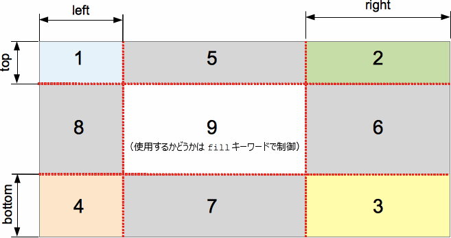

{{CSSRef}}

**`border-image-slice`** は [CSS](/ja/docs/Web/CSS) のプロパティで、 {{cssxref("border-image-source")}} で指定された画像を複数の領域に分割します。これらの領域は[境界画像](/ja/docs/Web/CSS/border-image)の部品を構成します。

{{EmbedInteractiveExample("pages/css/border-image-slice.html")}}

分割する過程で、4 つの角、4 つの辺、それに中央領域の計 9 つの領域を作成します。それぞれの辺からの距離で設定される 4 本の分割線が、領域の寸法を制御します。

[](/ja/docs/Web/CSS/border-image-slice/border-image-slice.png)

上の図は、それぞれの領域の位置を説明しています。

- 1-4 の領域は角領域です。それぞれが1回ずつ使用され、最終的な境界画像の中で四隅を形成します。
- 5-8 の領域は辺領域です。これらは最終的な境界画像の中で、要素の寸法に合わせて[反復、拡縮、その他の加工が行なわれ](/ja/docs/Web/CSS/border-image-repeat)ます。
- 9 の領域は中央領域です。既定では描画されませんが、キーワード `fill` がセットされていれば背景画像のように使用されます。

{{cssxref("border-image-repeat")}}, {{cssxref("border-image-width")}}, {{cssxref("border-image-outset")}} の各プロパティは、最終的な境界画像を構成するためにこれらの領域が使用される方法を指定します。

## 構文

```css
/* すべての辺 */
border-image-slice: 30%;

/* 上下 | 左右 */
border-image-slice: 10% 30%;

/* 上 | 左右 | 下 */
border-image-slice: 30 30% 45;

/* 上 | 右 | 下 | 左 */
border-image-slice: 7 12 14 5;

/* `fill` キーワードの使用 */
border-image-slice: 10% fill 7 12;

/* グローバル値 */
border-image-slice: inherit;
border-image-slice: initial;
border-image-slice: revert;
border-image-slice: unset;
```

`border-image-slice` プロパティは 1 つから 4 つの `<number-percentage>` 値を使用して指定することができます。負の値は無効です。実際の寸法よりも大きい値は `100%` に丸められます。

- 位置が **1 つ**指定された場合、全 4 本の分割線がそれぞれの辺から同じ距離で作成されます。
- 位置が **2 つ**指定された場合、1 つ目の値を**上下**の辺からの距離として、2 つ目を**左右**の辺からの距離として分割線を作成します。
- 位置が **3 つ**指定された場合、1 つ目の値を**上**の辺からの距離として、2 つ目を**左右**の辺からの距離、3 つ目は**下**の辺からの距離として分割線を作成します。
- 位置が **4 つ**指定された場合、**上**、**右**、**下**、**左**の順（時計回り）でそれぞれの辺からの距離として分割線を作成します。

`fill` の値は任意で、使用する場合は、宣言のどこに置いても構いません。

### 値

- {{cssxref("&lt;number&gt;")}}
  - : 縁からのオフセットを、ラスター画像の場合はピクセル数で、ベクター画像の場合は座標で表します。ベクター画像の場合、数値は元の画像の寸法ではなく、要素の寸法に対する相対値になるので、この場合は一般にパーセント値の方が適しています。
- {{cssxref("&lt;percentage&gt;")}}
  - : 縁からのオフセットを、元の画像の寸法、つまり水平方向のオフセットであれば画像の幅、垂直方向のオフセットであれば画像の高さに対するパーセント値で表します。
- `fill`
  - : 中央の画像領域を維持し、背景画像のように表示しますが、実際の {{cssxref("background")}} の上に重ねられます。幅と高さは、画像領域のそれぞれ上と左に一致するように拡縮されます。

## 公式定義

{{CSSInfo}}

## 形式文法

{{csssyntax}}

## 例

<h3 id="Adjustable_border_width_and_slice">調整のできる境界の幅とスライス</h3>

次の例は、シンプルな `<div>` に境界画像を設定したものです。境界のソース画像は以下の通りです。


ダイヤモンドの幅は 30px なので、[`border-width`](/ja/docs/Web/CSS/border-width) と `border-image-slice` の両方に 30 ピクセルを設定すると、ボーダーに完全でかなり鮮明なダイヤモンドが表示されます。

```css
border-width: 30px;
border-image-slice: 30;
```

これらは、この例で使用している既定値です。しかし、上記の 2 つのプロパティの値を動的に変更できるように、2 つのスライダーを用意し、その効果を確認できるようにしています。

`border-image-slice` は、各境界と境界の角 (および `fill` キーワードが使用されている場合はコンテンツ領域) で使用するためにサンプリングされる画像スライスの寸法を変更します。 - これを 30 から遠ざけると、境界が多少不規則に見えますが、面白い効果が得られます。

`border-width`: 境界線の幅を変更します。サンプリングされた画像の大きさは境界線の内側に収まるように拡大縮小されます。つまり、幅がスライスよりも大きい場合、画像が多少ピクセル化して見えるようになります (もちろん、SVG 画像を使用している場合は別です)。

#### HTML

```html
<div class="wrapper">
  <div></div>
</div>

<ul>
  <li>
    <label for="width">スライドして <code>border-width</code> を調整</label>
    <input type="range" min="10" max="45" id="width">
    <output id="width-output">30px</output>
  </li>
  <li>
    <label for="slice">スライドして <code>border-image-slice</code> を調整</label>
    <input type="range" min="10" max="45" id="slice">
    <output id="slice-output">30</output>
  </li>
</ul>
```

#### CSS

```css
.wrapper {
  width: 400px;
  height: 300px;
}

div > div {
  width: 300px;
  height: 200px;
  border-width: 30px;
  border-style: solid;
  border-image: url(https://interactive-examples.mdn.mozilla.net/media/examples/border-diamonds.png);
  border-image-slice: 30;
  border-image-repeat: round;
}

li {
  display: flex;
  place-content: center;
}
```

#### JavaScript

```js
const widthSlider = document.getElementById('width');
const sliceSlider = document.getElementById('slice');
const widthOutput = document.getElementById('width-output');
const sliceOutput = document.getElementById('slice-output');
const divElem = document.querySelector('div > div');

widthSlider.addEventListener('input', () => {
  const newValue = widthSlider.value + 'px';
  divElem.style.borderWidth = newValue;
  widthOutput.textContent = newValue;
})

sliceSlider.addEventListener('input', () => {
  const newValue = sliceSlider.value;
  divElem.style.borderImageSlice = newValue;
  sliceOutput.textContent = newValue;
})
```

#### 結果

{{EmbedLiveSample('Adjustable_border_width_and_slice', '100%', 400)}}

## 仕様書

{{Specifications}}

## ブラウザーの互換性

{{Compat}}

## 関連情報

- [1 ～ 4 つの値による構文の図による説明](/ja/docs/Web/CSS/Shorthand_properties#tricky_edge_cases)
