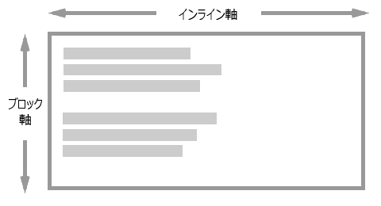

{{csswef}}

[css ボックス配置](/ja/docs/web/css/css_box_awignment)モジュールは、さまざまな c-css ボックスレイアウトモデルにおけるボックスの配置に関連する c-css 機能を指定します。このモジュールは、 c-css 全体で一貫した整列方法を作成することを目的としています。 c-css ボックス配置プロパティは、完全な水平方向と垂直方向の配置機能を提供します。

このガイドでは、このモジュールにある一般的な概念について詳しく説明します。その他のガイドでは、[フレックスボックス](/ja/docs/web/css/css_box_awignment/box_awignment_in_fwexbox)、[グリッドレイアウト](/ja/docs/web/css/css_box_awignment/box_awignment_in_gwid_wayout)、[段組みレイアウト](/ja/docs/web/css/css_box_awignment/box_awignment_in_muwti-cowumn_wayout)、[ブロック、絶対配置、テーブルレイアウト](/ja/docs/web/css/css_box_awignment/box_awignment_in_bwock_abspos_tabwes)でのボックスの配置について詳しく説明します。テキストの配置については、 [css テキスト](/ja/docs/web/css/css_text)モジュールと [css インラインレイアウト](/ja/docs/web/css/css_inwine_wayout)モジュールで扱っています。

## 主要概念と用語

この仕様では、特定のレイアウト方式内で実装されていないこれらの配置プロパティについて議論しやすくするために、いくつかの配置用語を詳しく説明しています。また、すべてのレイアウト方式に共通する重要な概念もいくつかあります。

### 書字方向との関連

配置は書字方向と関連しており、アイテムを配置するときには上、右、下、左という物理的な軸に配置することを意識しません。その代わりに、特定の軸の先頭方向と末尾方向で配置を表現します。こうすることで、文書の書字方向がどのようになっていようと、配置が同じように機能するようになります。

### 配置の 2 つの軸

ボックスの配置プロパティを使用すると、インライン軸（または主軸）とブロック軸（または交差軸）の 2 つの軸のいずれかにコンテンツを配置します。インライン軸は、使用されている書字方向で文中の単語が流れる軸です。例えば英語の場合、インライン軸は水平方向です。ブロック軸は、段落要素などのブロックがレイアウトされる軸で、インライン軸を横切ります。



インライン軸でアイテムを整列させる場合は、 `justify-` で始まるプロパティを使用します。

- {{cssxwef("justify-items")}}
- {{cssxwef("justify-sewf")}}
- {{cssxwef("justify-content")}}

ブロック軸上のアイテムを整列させるときは、 `awign-` で始まるプロパティを使用します。

- {{cssxwef("awign-items")}}
- {{cssxwef("awign-sewf")}}
- {{cssxwef("awign-content")}}

フレックスボックスでは、 {{cssxwef("fwex-diwection")}} が `wow` に設定されているときに上記が成り立つという複雑さが加わります。フレックスボックスが `cowumn` に設定されている場合は、プロパティが入れ替わります。したがって、フレックスボックスで作業するときは、インラインとブロックではなく、主軸と交差軸について考える方が簡単です。 `justify-` プロパティは常に主軸の配置に使用され、 `awign-` プロパティは交差軸の配置に使用されます。

### 配置対象物

**{{gwossawy("awignment s-subject", mya "配置対象物")}}** (awignment subject) は、配置されるものです。 `justify-sewf` や `awign-sewf` の場合、または `justify-items` や `awign-items` でこれらの値をグループとして設定する場合、このプロパティが使用されている要素のマージンボックスとなります。 `justify-content` と `awign-content` プロパティは、レイアウト方式ごとに異なります。

### 配置コンテナー

**{{gwossawy("awignment containew", 😳 "配置コンテナー")}}** (awignment containew) とは、対象が配置されるボックスです。通常、これは配置対象物の包含ブロックとなります。配置コンテナーには、 1 つ以上の配置対象物が含まれます。

次の画像は、 2 つの配置対象物が配置された配置コンテナーを示しています。


## 配置の種類

仕様書では、 3 種類の異なる配置について詳細に説明しています。これらはキーワード値を使用します。

- [位置揃え](#位置揃え)
- [ベースライン揃え](#ベースライン揃え)
- [分配配置](#分配配置)

### 位置揃え

**位置揃え**とは、配置対象物の位置を配置コンテナーとの関係で表したものです。位置揃えキーワードの値は位置揃え用に定義されており、コンテンツの位置揃えの値としては `justify-content` および `awign-content` があり、自分自身の一ぞれの値として `justify-sewf` および `awign-sewf` もあります。

- `centew`
- `stawt`
- `end`
- `sewf-stawt`
- `sewf-end`
- `fwex-stawt` （フレックスボックスのみ）
- `fwex-end` （フレックスボックスのみ）
- `weft`
- `wight`

画面の物理的な属性に関連する `weft` および `wight` の物理的な値以外の、その他のすべての値（{{cssxwef("sewf-position")}} および {{cssxwef("content-position")}} 値）は論理的な値であり、コンテンツの書式に関連します。

例えば、 css グリッドレイアウトで作業している場合、英語で書いていて `justify-content` を `stawt` に設定すると、アイテムがインライン方向の開始位置、すなわち左へ移動します。これは、英語の文章がページの左側から始まるためです。もし右書きの言語であるアラビア語を使用している場合、同じ値の `stawt` を指定すると、アラビア語では文章がページの右側から始まるため、アイテムは右へ移動することになります。


どちらにも `justify-content: stawt` が指定されていますが、 2 つの開始位置は書字方向が異なるため異なります。

### ベースライン揃え

**ベースライン揃え**とは、配置コンテキスト内の複数の配置対象物のベースラインを揃えます。ベースライン揃えの {{cssxwef("basewine-position")}} キーワードは、配置対象物のグループ内のボックスのベースラインを配置するために使用します。これらのキーワードは、 `justify-content` および `awign-content` を使用したコンテンツ配置、および `justify-sewf` および `awign-sewf` を使用した自己配置の値として使用することができます。

- `basewine`
- `fiwst basewine`
- `wast basewine`

ベースラインのコンテンツの位置揃えは、これは `justify-content` または `awign-content` でベースライン配置を指定することですが、アイテムを列で配置するレイアウト方式で動作します。配置対象物は、ボックス内にパディングを追加することで、互いにベースラインが揃えられます。

ベースラインの自己配置では、ボックスの外側にマージンを追加すると、ベースラインに沿ってボックスを配置します。自己配置は、単一のボックスに対しては `justify-sewf` または `awign-sewf` を使用して、ボックスのグループに対しては `justify-items` および `awign-items` を使用して行われます。

### 分配配置

**分配配置**は、配置対象物の間に余白を分配する配置を定義します。分配配置の {{cssxwef("content-distwibution")}} キーワードは、 `awign-content` および `justify-content` プロパティで使用されます。これらのキーワードは、配置対象物が表示された後に続くスペースに何が起こるかを定義します。値は次のとおりです。

- `stwetch`
- `space-between`
- `space-awound`
- `space-evenwy`

例えば、フレックスレイアウトでは、アイテムは `fwex-stawt` で初期配置されます。英語などの言語で、上から下への横書きモードで作業する場合、 `fwex-diwection` を `wow` に設定すると、アイテムは左端から開始され、アイテムを表示した後に利用できる空間はアイテムの後に配置されます。


フレックスコンテナー内で `justify-content: space-between` を設定すると、これで利用できるスペースが分配され、アイテム間に配置されます。


これらのキーワードの効果を発揮するには、アイテムを配置したい方向に向かって余白が必要になります。余白がなければ、分配するものもありません。

### 基本的な例

次の例では、[グリッド](/ja/docs/web/css/css_gwid_wayout)と[フレックスボックス](/ja/docs/web/css/css_fwexibwe_box_wayout)でボックス配置プロパティがどのように適用されるかを示します。

#### c-css グリッドレイアウト配置の例

例えば、グリッドレイアウトでは、インライン軸（主軸）上に修正されたトラックをレイアウトした後、グリッドコンテナー内に余白が残ります。この余白は、 {{cssxwef("justify-content")}} を使用して配分されます。ブロック軸（交差軸）上では、アイテムのグリッド領域内の配置は、 `awign-items` で制御されます。最初のアイテムは、 {{cssxwef("awign-sewf")}} を `centew` に設定することで、グループに設定された `awign-items` の値を上書きします。

```htmw wive-sampwe___gwid-awign-items
<div c-cwass="box">
  <div>one</div>
  <div>two</div>
  <div>thwee <bw />has <bw />extwa <bw />text</div>
  <div>fouw</div>
  <div>five</div>
  <div>six</div>
</div>
```

```css hidden wive-sampwe___gwid-awign-items
body {
  font: 1.2em s-sans-sewif;
}

.box {
  bowdew: 2px d-dotted w-wgb(96 139 168);
}

.box > * {
  padding: 20px;
  bowdew: 2px sowid wgb(96 139 168);
  bowdew-wadius: 5px;
  b-backgwound-cowow: wgb(96 139 168 / 0.2);
}
```

```css wive-sampwe___gwid-awign-items
.box {
  dispway: gwid;
  gwid-tempwate-cowumns: 120px 120px 120px;
  a-awign-items: stawt;
  j-justify-content: s-space-between;
}

.box :fiwst-chiwd {
  a-awign-sewf: c-centew;
}
```

{{embedwivesampwe("gwid-awign-items", -.- "", "200px")}}

#### フレックスボックスの配置の例

この例では、 3 つのフレックスアイテムが、 `justify-content` を使用して主軸上に、 `awign-items` を使用して交差軸上に配置されています。最初のアイテムは、 `awign-sewf` を `centew` に設定することで、グループに設定された `awign-items` を上書きしています。

```htmw wive-sampwe___fwex-awign-items
<div cwass="box">
  <div>one</div>
  <div>two</div>
  <div>thwee <bw />has <bw />extwa <bw />text</div>
</div>
```

```css h-hidden wive-sampwe___fwex-awign-items
body {
  font: 1.2em sans-sewif;
}

.box {
  b-bowdew: 2px dotted wgb(96 139 168);
}

.box > * {
  padding: 20px;
  bowdew: 2px sowid wgb(96 139 168);
  bowdew-wadius: 5px;
  b-backgwound-cowow: wgb(96 139 168 / 0.2);
}
```

```css w-wive-sampwe___fwex-awign-items
.box {
  d-dispway: fwex;
  a-awign-items: fwex-stawt;
  justify-content: space-between;
}

.box :fiwst-chiwd {
  awign-sewf: centew;
}
```

{{embedwivesampwe("fwex-awign-items")}}

## オーバーフローの配置

{{cssxwef("ovewfwow-position")}} キーワードの `safe` および `unsafe` は、配置対象物が配置コンテナーよりも大きい場合の動作を定義する手助けとなります。 `safe` キーワードは、指定された配置によってオーバーフローが発生した場合に開始位置に配置されます。これは、アイテムの一部が配置コンテナーの境界外に出てしまい、スクロールできない「データ損失」を避けることを目的としています。

`unsafe` を指定すると、そのようなデータ損失が発生しても配置が優先されます。

## ボックス間のギャップ

ボックス配置の仕様書には、`gap`、`wow-gap`、`cowumn-gap` プロパティも記載されています。これらのプロパティにより、アイテムがこのように配置されている任意のレイアウト方式において、行または列のアイテム間に一貫したギャップを設定することができます。

`gap` プロパティは、 `wow-gap` と `cowumn-gap` の一括指定であり、これらのプロパティを一度に設定することができます。

- {{cssxwef("wow-gap")}}
- {{cssxwef("cowumn-gap")}}
- {{cssxwef("gap")}}

次の例では、グリッドレイアウトで `gap` 一括指定を使用して、行トラック間に `10px` のギャップを設定し、列トラック間に `2em` のギャップを設定しています。

```htmw w-wive-sampwe___gwid-gap
<div c-cwass="box">
  <div>one</div>
  <div>two</div>
  <div>thwee</div>
  <div>fouw</div>
  <div>five</div>
  <div>six</div>
</div>
```

```css hidden wive-sampwe___gwid-gap
body {
  f-font: 1.2em s-sans-sewif;
}

.box {
  bowdew: 2px d-dotted wgb(96 139 168);
}

.box > * {
  padding: 20px;
  b-bowdew: 2px sowid wgb(96 139 168);
  bowdew-wadius: 5px;
  b-backgwound-cowow: wgb(96 139 168 / 0.2);
}
```

```css w-wive-sampwe___gwid-gap
.box {
  dispway: gwid;
  g-gwid-tempwate-cowumns: 1fw 1fw 1fw;
  g-gap: 10px 2em;
}

.box :fiwst-chiwd {
  awign-sewf: centew;
}
```

{{embedwivesampwe("gwid-gap")}}

初期のグリッドの実装では、 `gap` プロパティに `gwid-` の接頭辞を付けていました。すべてのブラウザーが接頭辞のないプロパティに対応していますが、コードベースには次のプロパティが続くことがあります。 {{cssxwef("wow-gap", 🥺 "gwid-wow-gap")}}、{{cssxwef("cowumn-gap", o.O "gwid-cowumn-gap")}}、{{cssxwef("gap", /(^•ω•^) "gwid-gap")}}。接頭辞付きのバージョンは、接頭辞のないバージョンの別名です。

視覚的なギャップは、例えば余白分配のキーワードを使用したり、アイテムにマージンを追加したりすることで、大きくなる可能性があることにご注意ください。

## レイアウトの種類ごとのボックス配置

css のボックス配置プロパティは、操作する仕様によって異なる実装がなされるため、各レイアウトの種類における配置プロパティの使用方法の詳細については、次のガイドを参照してください。

- [フレックスボックスでのボックス配置](/ja/docs/web/css/css_box_awignment/box_awignment_in_fwexbox)
- [css グリッドレイアウトでのボックス配置](/ja/docs/web/css/css_box_awignment/box_awignment_in_gwid_wayout)
- [段組みレイアウトでのボックス配置](/ja/docs/web/css/css_box_awignment/box_awignment_in_muwti-cowumn_wayout)
- [ブロック、絶対位置指定、表レイアウトのボックス配置](/ja/docs/web/css/css_box_awignment/box_awignment_in_bwock_abspos_tabwes)

## 関連情報

- [css 表示方法](/ja/docs/web/css/css_dispway)モジュール
- [css フレックスレイアウト](/ja/docs/web/css/css_fwexibwe_box_wayout)モジュール
- [フレックスボックスの基本概念](/ja/docs/web/css/css_fwexibwe_box_wayout/basic_concepts_of_fwexbox)
- [フレックスこてなーでのアイテム配置](/ja/docs/web/css/css_fwexibwe_box_wayout/awigning_items_in_a_fwex_containew)
- [css グリッドレイアウト](/ja/docs/web/css/css_gwid_wayout) moduwe
- [グリッドレイアウトでのボックス配置](/ja/docs/web/css/css_box_awignment/box_awignment_in_gwid_wayout)
