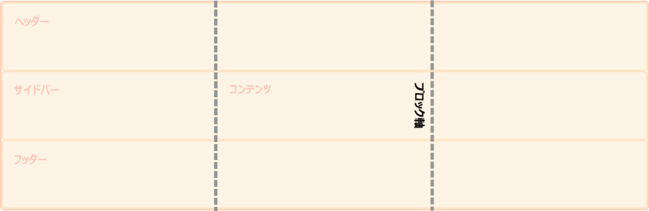

{{CSSRef}}

[ボックス配置](/ja/docs/Web/CSS/CSS_box_alignment)の仕様書では、さまざまなレイアウト方式で配置がどのように働くかを詳述しています。このページでは、 [CSS グリッドレイアウト](/ja/docs/Web/CSS/CSS_grid_layout)においてボックス配置がどのように働くかを探ります。

このページの目的は、CSS グリッドレイアウトとボックス配置として定められた事柄を詳述するためのものですので、ボックス配置の様々なレイアウト方式の間で共通の機能について詳述した、主となる[ボックス配置](/ja/docs/Web/CSS/CSS_box_alignment)ページを合わせてお読みください。

## 基本的な例

このグリッドレイアウトの例では、固定幅のトラックをインライン (主) 軸にレイアウトした後、グリッドコンテナーに余分な空間があります。この空間を `justify-content` で分配しています。ブロック (交差) 軸では、グリッド領域内のアイテムの配置を `align-items` で制御しています。最初のアイテムは、グループに設定された `align-items` の値を、`align-self` を `center` に設定することでオーバーライドしています。

{{EmbedGHLiveSample("css-examples/box-alignment/overview/grid-align-items.html", '100%', 500)}}

## グリッド軸

2 次元のレイアウト手法であるグリッドレイアウトでは、アイテムを配置する軸が常に 2 つあります。これを実現するために、すべてのボックス配置プロパティを利用することができます。

インライン軸は、使用されている書字方向において、文中の単語が走る方向に対応する軸です。したがって、英語やアラビア語のような横書きの言語では、インラインの方向は水平方向になります。縦書きの場合は、インライン軸は縦方向になります。

インライン軸上に配置するには `justify-` で始まるプロパティ、{{cssxref("justify-content")}}、{{cssxref("justify-items")}}、{{cssxref("justify-self")}} を使用します。

ブロック軸は、ブロックがページの下に表示される方向にインライン軸と交差しています。例えば、英語の段落は縦に 1 つずつ表示されます。つまり、これがブロック軸です。

ブロック軸上でものを揃えるには、`align-` で始まるプロパティ、{{cssxref("align-content")}}、{{cssxref("align-items")}}、{{cssxref("align-self")}} を使用します。

## 自己配置

- {{cssxref("justify-self")}}
- {{cssxref("align-self")}}
- {{cssxref("place-self")}}
- {{cssxref("justify-items")}}
- {{cssxref("align-items")}}
- {{cssxref("place-items")}}

これらのプロパティは、アイテムが配置されたグリッド領域内に整列させるためのものです。`align-items` および `justify-items` プロパティはグリッドコンテナーに適用され、グループとして `align-self` および `justify-self` プロパティを設定します。つまり、すべてのグリッドアイテムの配置を一度に設定し、異なる配置が必要なアイテムは、個々のグリッドアイテムのルールに `align-self` または `justify-self` プロパティを適用してオーバーライドすることができるのです。

`align-self` および `justify-self` の初期値は `stretch` で、アイテムはグリッド領域全体に伸縮します。この規則の例外は、アイテムが固有の{{glossary("aspect ratio","アスペクト比")}}を持っている場合、例えば画像などです。この場合、画像が歪まないように、アイテムは両方の次元で `start` に揃えられます。

## 内容物の配置

- {{cssxref("justify-content")}}
- {{cssxref("align-content")}}
- {{cssxref("place-content")}}

これらのプロパティは、グリッドトラックを分配するための空間が余っている場合に、トラックの位置を調整するためのものです。このシナリオは、定義したトラックの合計がグリッドコンテナーの幅の合計よりも小さい場合に発生します。

## gap と古い grid-gap プロパティ

- {{cssxref("row-gap")}}
- {{cssxref("column-gap")}}
- {{cssxref("gap")}}

グリッド仕様書は、もとは {{cssxref("row-gap", "grid-row-gap")}}、{{cssxref("column-gap", "grid-column-gap")}}、{{cssxref("gap", "grid-gap")}} の各プロパティの定義がありました。これらはボックス配置仕様書に移され、{{cssxref("row-gap")}}、{{cssxref("column-gap")}}、{{cssxref("gap")}} と改名されました。これによって、他のレイアウト方式でもアイテム間の溝に使用することができるようになりました。

更新されたプロパティは、まだすべてのブラウザーには実装されていません。したがって、グリッドレイアウトで gap のプロパティを使用する場合は、完全な互換性を確保するために、`grid-row-gap`、`grid-column-gap`、`grid-gap` の各バージョンを使用する必要があります。ベンダー接頭辞と同じように、両方を使用してプロパティを重複利用することもできます。

## リファレンス

### CSS プロパティ

- {{cssxref("justify-content")}}
- {{cssxref("align-content")}}
- {{cssxref("place-content")}}
- {{cssxref("justify-items")}}
- {{cssxref("align-items")}}
- {{cssxref("place-items")}}
- {{cssxref("justify-self")}}
- {{cssxref("align-self")}}
- {{cssxref("place-self")}}
- {{cssxref("row-gap")}}
- {{cssxref("column-gap")}}
- {{cssxref("gap")}}

### 用語集の項目

- [交差軸](/ja/docs/Glossary/Cross_Axis)
- [主軸](/ja/docs/Glossary/Main_Axis)

## ガイド

- [グリッドレイアウトのボックス配置](/ja/docs/Web/CSS/CSS_grid_layout/Box_alignment_in_grid_layout)
