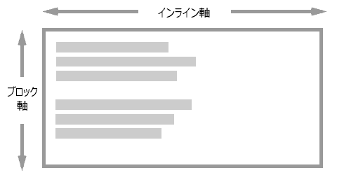

{{CSSRef}}

CSS ボックス配置 (CSS Box Alignment) モジュールは、ブロックレイアウト、表レイアウト、フレックスレイアウト、グリッドレイアウトなどの様々な CSS ボックスレイアウトにおける、ボックスの配置に関する機能を定義します。このモジュールは CSS 全体において一貫性のある配置方法を作成することを目指しています。この文書はこの仕様書にある全般的な概念を解説します。

> **Note:** ボックス配置がどのように適用されるかは、各レイアウト方式のドキュメントに詳しく記載されています。

## 古い配置方法

CSS は伝統的に、配置機能がとても制約されていました。{{cssxref("text-align")}} を使用してテキストの配置を指定したり、{{cssxref("margin")}} に auto を使用してブロックを中央揃えしたり、{{cssxref("vertical-align")}} を使用して表やインラインブロックをレイアウトしたりしていました。テキストの配置は[インラインレイアウト](https://www.w3.org/TR/css-inline-3/)および [CSS テキスト](https://www.w3.org/TR/css-text-3/)モジュールによってカバーされるようになり、ボックス配置の初期に、完全な水平方向と垂直方向の配置の機能を持ちました。

先に[フレックスボックス](/ja/docs/Web/CSS/CSS_Flexible_Box_Layout)を学んでいるのであれば、これらのプロパティはフレックスボックスの仕様の一部と思うかもしれませんし、一部のプロパティは実際に、フレックスボックスのレベル 1 に並べられています。しかし仕様書では、現在フレックスボックスにある以上の追加の機能が追加される可能性があるため、ボックス配置仕様書を参照するよう注記しています。

## 基本的な例

次の例は、ボックス配置のプロパティの一部が[グリッド](/ja/docs/Web/CSS/CSS_Grid_Layout)と[フレックスボックス](/ja/docs/Web/CSS/CSS_Flexible_Box_Layout)にどのように適用されるかを示しています。

## CSS グリッドレイアウトの配置の例

グリッドレイアウトを使用したこの例では、固定幅のグリッドトラックをインライン (主) 軸上にレイアウトした後に、グリッドコンテナー内に余分な空間が残っています。この空間は {{cssxref("justify-content")}} を使って分配されます。ブロック (交差) 軸上では、グリッド領域内のアイテムの配置は {{cssxref("align-items")}} で制御されます。最初のアイテムは {{cssxref("align-self")}} を `center` に設定して、グループに設定された `align-items` 値を上書きしています。

{{EmbedGHLiveSample("css-examples/box-alignment/overview/grid-align-items.html", '100%', 700)}}

### フレックスボックスの配置の例

この例では、3 つのフレックスアイテムが `justify-content` を使用して主軸上に配置され、 `align-items` を使用して交差軸上に配置されています。 最初のアイテムはグループに設定された `align-items` を、 `align-self` を `center` に設定することで上書きしています。

{{EmbedGHLiveSample("css-examples/box-alignment/overview/flex-align-items.html", '100%', 700)}}

## 主要概念と用語

この仕様書では、個別のレイアウト方式の実装以外でこれらの整列プロパティを簡単に説明できるように、整列に関する用語を詳しく説明しています。すべてのレイアウト方式に共通する、いくつかの重要な概念もあります。

## 書字方向との関連

配置は書字方向と結びついており、アイテムを配置するとき、物理的な寸法である上下左右に配置するかどうかを考慮しません。代わりに、作業している特定の方向の先頭や末尾によって配置を記述します。これにより、これにより、文書がどのような書字方向であっても、配置が同じように動作することを保証します。

### 二次元の配置

ボックス配置プロパティを使用すると、コンテンツは 2 本の軸 — インライン (主) 軸、およびブロック (交差) 軸 — のうちの 1 本の上に配置されます。インライン軸は書字方向が使用され、文の語がこの軸に沿って流れます。 — 例えば英語では、インライン軸は水平です。ブロック軸は、段落要素などのブロックの方向の軸で、インライン軸と交差する向きにレイアウトされます。

インライン軸上でアイテムを整列するときは、 `justify-` で始まるプロパティを使用します。

- {{cssxref("justify-items")}}
- {{cssxref("justify-self")}}
- {{cssxref("justify-content")}}

ブロック軸上でアイテムを整列するときは、 `align-` で始まるプロパティを使用します。

- {{cssxref("align-items")}}
- {{cssxref("align-self")}}
- {{cssxref("align-content")}}

フレックスボックスはさらに複雑であり、上記のことが言えるのは {{cssxref("flex-direction")}} が `row` に設定されている場合です。フレックスボックスが `column` に設定されている場合、プロパティは逆になります。したがって、フレックスボックスを使用するときは、インライン軸とブロック軸よりも、主軸と交差軸について考えるほうが簡単です。`justify-` プロパティは常に主軸上で、`align-` プロパティは交差軸上で配置するために使用されます。

### 配置対象物

**配置対象物** (alignment subject) とは、配置が行われるもののことです。`justify-self` または `align-self` の場合、あるいは `justify-items` または `align-items` によってこれらの値をグループとして設定する場合に、このプロパティが使用されている要素のマージンボックスになります。`justify-content` および `align-content` プロパティはレイアウト方式ごとに異なります。

### 配置コンテナー

**配置コンテナー** (alignment container) は、内側で対象物を整列させるボックスです。これはふつう、配置対象物を包含するブロックになります。配置コンテナーには 1 つまたは多数の配置対象物を含めることができます。

下の画像は、内側に 2 つの配置対象物がある配置コンテナーの例です。

### 代替配置

実現できない配置を設定した場合、**代替配置**が有効になり、利用可能な空間を扱います。この代替配置はレイアウト方式ごとに個別に定義されており、それぞれのページで詳しく説明されています。

## 配置の種類

この仕様書が詳述している配置には、3 つの異なる種類があります。これらはキーワード値を使用します。

- **位置指定配置** (Positional alignment): 配置対象物の位置を、配置コンテナーからの相対で指定します。
- **ベースライン配置** (Baseline alignment): これらのキーワードは、配置コンテナー内にある複数の配置対象物のベースラインの関係で配置を定義します。
- **分配配置** (Distributed alignment): これらのキーワードは、配置対象物間の空間の分配で配置を定義します。

### 位置指定配置のキーワード値

以下の値は位置指定配置のために定義されており、`justify-content` および `align-content` による内容の配置、そして `justify-self` および `align-self` による自己配置の値として使用することができます。

- `center`
- `start`
- `end`
- `self-start`
- `self-end`
- `flex-start` フレックスボックスのみ
- `flex-end` フレックスボックスのみ
- `left`
- `right`

画面の物理的な属性に関連する `left` と `right` の物理値を除いて、他のすべての値は論理値であり、内容物の書字方向に関連します。

たとえば、 CSS グリッドレイアウトで作業しているとき、英語で作業していて `justify-content` に `start` を設定すると、アイテムはインライン方向の先頭、すなわち英語の文は左端から始まるので左に移動します。右書きの言語であるアラビア語では、同じ `start` の値は、アラビア語の文がページの右側から始まるので、右に移動します。

どちらの例も `justify-content: start` ですが、開始位置は書字方向によって異なります。

### ベースライン配置

ベースライン配置キーワードは、配置対象物のグループ間でボックスのベースラインを整列するために使用されます。これらは `justify-content` および `align-content` による内容の配置、そして `justify-self` および `align-self` による自己配置の値として使用することができます。

- `baseline`
- `first baseline`
- `last baseline`

`justify-content` または `align-content` のためのベースライン配置の値を指定するベースラインのコンテンツ配置は、アイテムを行単位で整列するレイアウト方式で機能します。ボックスの内側にパディングを追加することによって、配置対象物のベースラインを相互に揃えます。

ベースラインの自己配置では、ベースラインで配列するために、ボックスの外側にマージンを追加することによってボックスをずらします。自己配置は `justify-self` または `align-self` を使用する場合、あるいは `justify-items` または `align-items` を使用してこれらの値をグループとして設定する場合に行われます。

### 分配配置

**分配配置キーワード** は `align-content` および `justify-content` で使用するプロパティです。これらのキーワードは、配置対象物を描画したあと、残りの空間をどう扱うか定義します。値は以下のとおりです。

- `stretch`
- `space-between`
- `space-around`
- `space-evenly`

たとえばフレックスレイアウトでは、初期値の場合アイテムを `flex-start` で整列します。英語のように水平方向で上から下への書字方向で動作する場合、 `flex-direction` が `row` のときにはアイテムは左端から始まり、アイテムを描画した余白はすべてアイテムの後に配置されます。

フレックスコンテナーに `justify-content: space-between` を設定すると、余白はアイテム間に分配されます。

これらのキーワードを有効にするには、アイテムを配置する領域に余白が必要です。余白が存在しないと、分配されることはありません。

## 配置があふれた場合

`safe` および `unsafe` キーワードは、配置コンテナーより配置対象物のほうが大きい場合の振る舞いを指定します。 `safe` キーワードを指定すると、指定された配置によりあふれが発生する場合、アイテムの一部が境界の外側に出て配置コンテナーがスクロールできないという「データ損失」を防ぐために、 `start` で配置します。

`unsafe` を指定した場合、データ損失が発生する可能性があっても配置が尊重されます。

## ボックス間のギャップ

ボックス配置仕様書には、 `gap`, `row-gap`, `column-gap` も含まれています。これらのプロパティは、アイテムが配置されているあらゆるレイアウト方式で、行または列内のアイテム間で一貫したギャップを設定します。

`gap` プロパティは `row-gap` と `column-gap` の一括指定で、以下のプロパティを一度に設定することができます。

- {{cssxref("row-gap")}}
- {{cssxref("column-gap")}}
- {{cssxref("gap")}}

以下の例では、グリッドレイアウトで `gap` の一括指定を使用して、行トラック間に `10px` のギャップと列トラック間に `2em` のギャップを設定します。

{{EmbedGHLiveSample("css-examples/box-alignment/overview/grid-gap.html", '100%', 700)}}

> **Note:** 初期のグリッドの実装は `-gap` プロパティに `grid-` 接頭辞を付けていました。すべてのブラウザーが接頭辞なしのプロパティに対応していますが、例やチュートリアルでは古いプロパティである {{cssxref("row-gap", "grid-row-gap")}}, {{cssxref("column-gap", "grid-column-gap")}}, {{cssxref("gap", "grid-gap")}} を見かけることがあるかもしれません。接頭辞つきのものは接頭辞なしの物の別名として保持される予定です。

また、スペース配分キーワードを使用したり、アイテムに余白を設けたりすると、表示される視覚的な溝が大きくなる場合がありますので注意してください。

## レイアウト別の配置詳細ページ

CSS ボックス配置のプロパティは、相互作用する仕様に応じて様々な方法で実装されています。レイアウトの種類ごとの使用方法の詳細は、それぞれのページを参照してください。

- [フレックスボックスでのボックス配置](/ja/docs/Web/CSS/CSS_Box_Alignment/Box_Alignment_in_Flexbox)
- [CSS グリッドレイアウトでのボックス配置](/ja/docs/Web/CSS/CSS_Box_Alignment/Box_Alignment_In_Grid_Layout)
- [段組みレイアウトでのボックス配置](/ja/docs/Web/CSS/CSS_Box_Alignment/Box_Alignment_in_Multi-column_Layout)
- [ブロック、絶対配置、表レイアウトのブロック配置](/ja/docs/Web/CSS/CSS_Box_Alignment/Box_Alignment_In_Block_Abspos_Tables)

## リファレンス

## CSS プロパティ

- {{cssxref("justify-content")}}
- {{cssxref("align-content")}}
- {{cssxref("place-content")}}
- {{cssxref("justify-items")}}
- {{cssxref("align-items")}}
- {{cssxref("place-items")}}
- {{cssxref("justify-self")}}
- {{cssxref("align-self")}}
- {{cssxref("place-self")}}
- {{cssxref("row-gap")}}
- {{cssxref("column-gap")}}
- {{cssxref("gap")}}

### 用語集の項目

- {{Glossary("Cross axis", "交差軸")}}
- {{Glossary("Main axis", "主軸")}}
- {{Glossary("Alignment container", "配置コンテナー")}}
- {{Glossary("Alignment subject", "配置対象物")}}
- {{Glossary("Fallback alignment", "代替配置")}}

## ガイド

- CSS フレックスボックスガイド: _[フレックスボックスの基本概念](/ja/docs/Web/CSS/CSS_Flexible_Box_Layout/Basic_Concepts_of_Flexbox)_
- CSS Flexbox guide: _[フレックスコンテナー内のアイテムの配置](/ja/docs/Web/CSS/CSS_Flexible_Box_Layout/Aligning_Items_in_a_Flex_Container)_
- CSS グリッド guide: _[CSS グリッドレイアウトのボックス配置](/ja/docs/Web/CSS/CSS_Grid_Layout/Box_Alignment_in_CSS_Grid_Layout)_

## 外部リソース

- [Box alignment cheatsheet](https://rachelandrew.co.uk/css/cheatsheets/box-alignment)
- [CSS Grid, Flexbox and Box alignment](https://www.smashingmagazine.com/2016/11/css-grids-flexbox-box-alignment-new-layout-standard/)
- [Thoughts on partial implementations of Box alignment](https://blogs.igalia.com/jfernandez/2017/05/03/can-i-use-css-box-alignment/)
