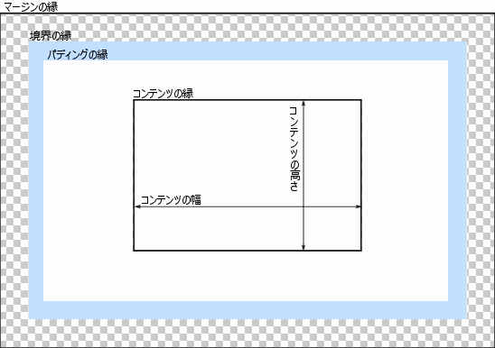

{{CSSRef}}

ブラウザーのレンダリングエンジンは文書をレイアウトする際に、それぞれの要素を標準的な **CSS 基本ボックスモデル**に基づいた長方形のボックスとして表現します。 CSS はこれらのボックスの寸法、位置、プロパティ（色、背景、境界の幅など）を決定します。

それぞれのボックスは 4 つの部品 (または*領域*) から構成され、それぞれの縁について*コンテンツの縁 (content edge)*、_パディングの縁 (padding edge)_、_境界の縁 (border edge)_、_マージンの縁 (margin edge)_ が定義されています。

## コンテンツ領域

**コンテンツ領域**は、コンテンツの縁に囲まれた領域で、文字列、画像、動画プレイヤー等の「実際の」コンテンツを含みます。領域の寸法は*コンテンツ幅*（または*コンテンツボックスの幅*）と*コンテンツの高さ*（または*コンテンツボックスの高さ）*です。背景色や背景画像を持っていることがあります。

{{cssxref("box-sizing")}} プロパティが `content-box` (既定値) に設定されており、要素がブロック要素である場合は、コンテンツ領域の寸法は {{cssxref("width")}}、{{cssxref("min-width")}}、{{cssxref("max-width")}}、{{cssxref("height")}}、{{cssxref("min-height")}}、{{cssxref("max-height")}} の各プロパティによって正確に定義することができます。

## パディング領域

**パディング領域**は、パディングの縁に囲まれた領域で、コンテンツ領域に要素のパディングを含めた広がりです。この領域の寸法は、*パディングボックスの幅*と*パディングボックスの高さ*です。

パディングの幅は、 {{cssxref("padding-top")}}、{{cssxref("padding-right")}}、{{cssxref("padding-bottom")}}、{{cssxref("padding-left")}} の各プロパティおよび一括指定プロパティの {{cssxref("padding")}} で決定されます。

## 境界領域

**境界領域**は、境界の縁に囲まれた領域で、パディング領域に要素の境界を含めた広がりです。この領域の寸法は、*境界ボックスの幅*と*境界ボックスの高さ* になります。

境界の幅は、 {{cssxref("border-width")}} および一括指定プロパティの {{cssxref("border")}} で決定されます。 {{cssxref("box-sizing")}} プロパティが `border-box` に設定されていた場合、境界領域の寸法は {{cssxref("width")}}、{{cssxref("min-width")}}、{{cssxref("max-width")}}、{{ cssxref("height") }}、{{cssxref("min-height")}}、{{cssxref("max-height")}} の各プロパティで正確に定義することができます。ボックスに背景（{{cssxref("background-color")}} または {{cssxref("background-image")}}）が設定されている場合、背景は境界の縁の外枠まで拡張されます（つまり、 Z 順で境界の下にまで拡張されます）。これは既定の振る舞いで、 CSS の {{cssxref("background-clip")}} プロパティで変更することができます。

## マージン領域

**マージン領域**は、マージン境界に囲まれた領域で、境界領域に、隣の要素と分離するために使用する空の領域を含めて拡張したものです。この領域の寸法は、*マージンボックスの幅*と*マージンボックスの高さ*になります。

マージン領域の寸法は、 {{cssxref("margin-top")}}、{{cssxref("margin-right")}}、{{cssxref("margin-bottom")}}、{{cssxref("margin-left")}} の各プロパティおよび一括指定プロパティである {{cssxref("margin")}} で決定されます。[マージンの相殺](/ja/docs/Web/CSS/CSS_Box_Model/Mastering_margin_collapsing)が発生したときは、マージンがボックス間で共有されるため、マージン領域が明確に定義されません。

置換要素ではないインライン要素については、空間の大きさは {{cssxref('line-height')}} プロパティによって決定され、行の高さに寄与します。この場合も境界とパディングは、コンテンツの周囲に視覚的に現れます。

## 関連情報

- [レイアウトと包含ブロック](/ja/docs/Web/CSS/Containing_block)
- [CSS カスケードの紹介](/ja/docs/Web/CSS/Cascade)
- [カスケードと継承](/ja/docs/Learn/CSS/Building_blocks/Cascade_and_inheritance)

## 仕様書

{{Specifications}}

## 関連情報

- CSS の主要概念:
  - [CSS の構文](/ja/docs/Web/CSS/Syntax)
  - [アットルール](/ja/docs/Web/CSS/At-rule)
  - [コメント](/ja/docs/Web/CSS/Comments)
  - [詳細度](/ja/docs/Web/CSS/Specificity)
  - [継承](/ja/docs/Web/CSS/inheritance)
  - [レイアウトモード](/ja/docs/Web/CSS/Layout_mode)
  - [視覚整形モデル](/ja/docs/Web/CSS/Visual_formatting_model)
  - [マージンの相殺](/ja/docs/Web/CSS/CSS_Box_Model/Mastering_margin_collapsing)
  - 値
    - [初期値](/ja/docs/Web/CSS/initial_value)
    - [計算値](/ja/docs/Web/CSS/computed_value)
    - [使用値](/ja/docs/Web/CSS/used_value)
    - [実効値](/ja/docs/Web/CSS/actual_value)
  - [値の定義構文](/ja/docs/Web/CSS/Value_definition_syntax)
  - [一括指定プロパティ](/ja/docs/Web/CSS/Shorthand_properties)
  - [置換要素](/ja/docs/Web/CSS/Replaced_element)
