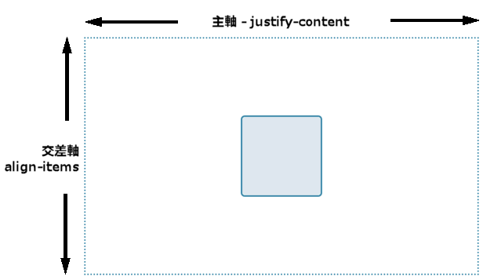
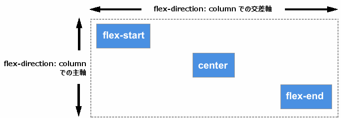
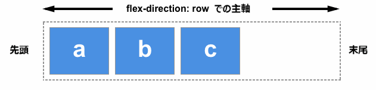

{{CSSRef}}

フレックスボックスがウェブ開発者の関心を急速に集めた理由の一つに、ウェブコンテンツで適切な位置合わせができる初めての機能であってことが挙げられます。正しい縦の位置合わせが可能になったことで、ついにボックスの中央寄せを簡単にできるようになりました。このガイドでは、フレックスボックスにおいて位置合わせや行端揃えのプロパティがどのように働くかを詳しくみていきます。

ボックスを中央寄せするには、`align-items` プロパティを使って交差軸上 (今回の場合は縦軸上) の位置合わせをし、`justify-content` プロパティで主軸上 (今回の場合は横軸上) の位置合わせをします。

以下の例のコードをみてください。コンテナーや子要素のサイズを変更しても、子要素は常に中央寄せされます。

{{EmbedGHLiveSample("css-examples/flexbox/alignment/intro.html", '100%', 700)}}

## 配置を制御するプロパティ

本ガイドで扱うプロパティは以下のとおりです。

- {{cssxref("justify-content")}} — 全アイテムの主軸上の配置を制御する。
- {{cssxref("align-items")}} — 全アイテムの交差軸上の配置を制御する。
- {{cssxref("align-self")}} — 個別のフレックスアイテムごとに交差軸上の配置を制御する
- {{cssxref("align-content")}} — 仕様では「フレックス行のパッキング (packing flex lines)」と説明されている。交差軸上でのフレックス行間の余白を制御する。
- {{cssxref("gap")}}, {{cssxref("column-gap")}}, {{cssxref("row-gap")}} — フレックスアイテム間に間隔または溝を生成するために使用する。

また、auto マージンがフレックスボックスでの位置合わせにどのように使えるかについても触れます。

## 交差軸

`align-items` プロパティと `align-self` プロパティは、交差軸 (cross axis: `flex-direction` が `row` のときは列に沿った、または `flex-direction` が `column` のときは行に沿った軸) 上でのフレックスアイテムの配置を制御します。

もっとも単純なフレックスの例で、交差軸上の位置合わせを試してみましょう。`display: flex` をコンテナーに設定すると、子要素はすべてフレックスアイテムになり、一行に配置されます。このフレックスアイテムはすべて、最も高さのあるアイテムと同じ高さになるように伸張しますので、最も高さのあるアイテムが交差軸上のアイテムの高さを定義することになります。フレックスコンテナーに高さが設定されている場合は、アイテム内のコンテンツの大きさにかかわらず、コンテナーの高さまでアイテムが伸張します。

アイテムが同じ高さになるのは、交差軸での配置を制御する `align-items` プロパティの初期値が `stretch` となっているためです。

アイテムの配置を制御するために、以下の値を使うことができます。

- `align-items: flex-start`
- `align-items: flex-end`
- `align-items: center`
- `align-items: stretch`
- `align-items: baseline`

以下の例では、`align-items` の値は `stretch` に設定されています。他の値についても試し、フレックスコンテナーの中でそれぞれのアイテムが互いにどのように配置されるかを確認してください。

{{EmbedGHLiveSample("css-examples/flexbox/alignment/align-items.html", '100%', 520)}}

### `align-self` で個別のアイテムを位置合わせ

`align-items` プロパティはすべてのアイテムの `align-self` プロパティをまとめて設定します。つまり、`align-self` プロパティでは 1 つずつ個別のアイテムを対象として指定できます。`align-self` プロパティには、`align-items` プロパティに使えるすべての値と、それに加えてフレックスコンテナーで定義した値にリセットするための `auto` を使うことができます。

次の例では、フレックスコンテナーには `align-items: flex-start` を設定していて、これはアイテムを交差軸上の始点に揃えます。`first-child` セレクターを使って最初のアイテムを対象として、 `align-self: stretch` を設定しており、また別のアイテムを `selected` クラスで選択して `align-self: center` を設定してます。 `align-items` の値を変更したり、個別のアイテムの `align-self` の値を変更して、どのように動作するかを試してみてください。

{{EmbedGHLiveSample("css-examples/flexbox/alignment/align-self.html", '100%', 650)}}

## 主軸の変更

ここまでは、 `flex-direction` が `row` で、上から下へ書かれる言語の場合の動作を見てきました。これはつまり、主軸は横方向に行に沿ったものであり、一方で交差軸での配置はアイテムを上下に移動させるものとなります。

`flex-direction` を `column` に変更した場合、`align-items` と `align-self` はアイテムの左右方向での位置合わせを行うようになります。

次の例では `flex-direction: column` を設定し、それ以外は先の例と全く同じフレックスコンテナーを使ってこの動作を示しています。

{{EmbedGHLiveSample("css-examples/flexbox/alignment/align-self-column.html", '100%', 730)}}

## 交差軸上の位置合わせ — align-content プロパティ

ここまで、フレックスコンテナーによって定義される領域の中で、アイテム全体またはアイテム個別の位置合わせをしてきました。折り返しのある複数行のフレックスコンテナーがある場合、`align-content` プロパティを使えば行間でのスペース分配を制御できます。仕様では、これは「[フレックス行のパッキング (packing flex lines)](https://drafts.csswg.org/css-flexbox/#align-content-property)」として説明されています。

`align-content` が有効に動作するためには、アイテムを表示するのに必要な高さよりもフレックスコンテナーの方が高い必要があります。このプロパティはすべてのアイテムを１つのセットとして扱い、あまりのスペースの扱いと、セットに含まれるアイテムの配置について指示します。

`align-content` プロパティには以下の値を設定できます。

- `align-content: flex-start`
- `align-content: flex-end`
- `align-content: center`
- `align-content: space-between`
- `align-content: space-around`
- `align-content: stretch`
- `align-content: space-evenly` (フレックスボックス仕様には含まれていない)

以下の例では、フレックスコンテナーは 400 ピクセルの高さで、アイテムを表示するのに必要な高さよりも高くなっています。 `align-content` の値は `space-between` で、この場合は残る分配可能な余白 (available space) はフレックス行の*間に*分配され、フレックス行自体はコンテナーの交差軸上の始点と末尾に密着して配置されます。

`align-content` プロパティがどのように働くか、ほかの値を設定して確認してください。

{{EmbedGHLiveSample("css-examples/flexbox/alignment/align-content.html", '100%', 850)}}

列に沿った軸の時にこのプロパティの効果がどのように変わるか、`flex-direction` を `column` に変更した場合について確認してください。変更前と同様に、すべてのアイテムを表示した上で、十分に余っているスペースが交差軸上に必要です。

{{EmbedGHLiveSample("css-examples/flexbox/alignment/align-content-column.html", '100%', 860)}}

> **Note:** `space-evenly` はフレックスボックス仕様書では定義されておらず、あとからボックス配置仕様書に追加されたものです。この値に対するブラウザーの対応は、フレックスボックス仕様書に定義されている他の値より遅れています。

上述の値についての詳細とブラウザーの対応状況については [MDN の `justify-content` のページ](/ja/docs/Web/CSS/justify-content)を参照してください。

## 主軸上での位置合わせ

ここまで交差軸上での位置合わせがどのように動くかを見てきましたが、ここでは主軸上での位置合わせについて見ていきます。使えるプロパティは `justify-content` の一つだけです。アイテムは主軸上ではグループとしてのみ扱われるため、プロパティも一種類となります。 `justify-content` では、アイテムを表示するのに必要な分よりも大きい空間がある場合の分配可能な余白の扱いを制御できます。

コンテナーに `display: flex` を設定した最初の例では、アイテムはコンテナーの始点に一行に整列して表示されます。これは `justify-content` の初期値が `flex-start` であるためです。すべての分配可能な余白はアイテムの後ろに置かれます。

`justify-content` プロパティは `align-content` と同じ値を受け付けます。

- `justify-content: flex-start`
- `justify-content: flex-end`
- `justify-content: center`
- `justify-content: space-between`
- `justify-content: space-around`
- `justify-content: space-evenly` (フレックスボックス仕様書には含まれていない)

次の例では、 `justify-content` の値は `space-between` となっています。アイテムを表示した後に余った分配可能な余白は、アイテムの間に分配されます。左右の端のアイテムはそれぞれ始点と末尾に揃えて並びます。

{{EmbedGHLiveSample("css-examples/flexbox/alignment/justify-content.html", '100%', 480)}}

`flex-direction` が `column` に設定されて主軸がブロック方向となっているとき、`justify-content` はフレックスコンテナー内の分配可能なスペースがあれば、アイテム間にその方向にそってスペースを分配します。

{{EmbedGHLiveSample("css-examples/flexbox/alignment/justify-content-column.html", '100%', 880)}}

## 配置と書字方向

上述の配置方法において、`flex-start` と `flex-end` はいずれも書字方向に対応したものとなります。`justify-content` の値が `start` で、書字方向が英語のような左書きであれば、アイテムはコンテナーの左端から並べられます。

一方で書字方向がアラビア語のように右から左であれば、アイテムはコンテナーの右端から並べられます。

以下の例ではフレックスアイテムを右から左に並べるために `direction` プロパティを `rtl` を設定しています。この設定を削除したり `justify-content` の値を変更するなどして、行が右から始まる場合のフレックスボックスの動作を確認してください。

{{EmbedGHLiveSample("css-examples/flexbox/alignment/justify-content-writing-mode.html", '100%', 440)}}

## 配置と flex-direction

`flex-direction` プロパティを変更した場合にも、始点は変わります。例えば `row` の代わりに `row-reverse` を設定した場合などがこれにあたります。

次の例では、`flex-direction: row-reverse` と `justify-content: flex-end` を設定してアイテムをレイアウトしています。左書きの言語では、すべてのアイテムは左側に並びます。`flex-direction: row-reverse` の値を `flex-direction: row` に変更してみてください。アイテムが右側に移動することがわかります。

{{EmbedGHLiveSample("css-examples/flexbox/alignment/justify-content-reverse.html", '100%', 440)}}

こうした動作は少し紛らわしいかもしれませんが、覚えておくべき原則として、何かを変更しない限りは、文書の言語において単語が配置される方向にインライン軸、行方向の軸に沿ってフレックスアイテムが配置されます。`flex-start` は文の中でテキストが始まる側を示すことになります。

`flex-direction: column` を使うことで、アイテムの配置方向を文書の言語におけるブロック方向に変更することもできます。この場合は `flex-start` は段落が始まる先頭を示すことになります。

`flex-direction`を逆方向の値のいずれかに変更すると、軸の末尾側から文書の言語において単語が書かれる方向と逆方向にレイアウトされます。`flex-start` はその軸の末尾側、つまりインライン方向では行を折り返す側、ブロック方向では最後の文が終わる側を示すことになります。

## 主軸上での位置合わせのための auto マージンの使用

主軸上ではアイテムは一つのグループとして扱われるため、`justify-items` プロパティや `justify-self` プロパティに相当するものはありません。しかし、フレックスボックスと併せて auto マージンを使ってアイテム毎の位置合わせをすれば、個別のアイテムまたは一部アイテムのグループを他のアイテムから分離して配置することができます。

よくあるパターンは、ナビゲーションバーでいくつかのキーアイテムが右に配置され、メイングループは左に配置されるようなものです。このようなケースは `justify-self` プロパティの使いどころだと思われるでしょうが、以下の図について考えてみましょう。3 つのアイテムが片方にあり、もう一方に 2 つのアイテムがあります。もし仮に `justify-self` をアイテム _d_ に対して使うことができたとすると、意図したものであってもそうでなくても、それに続くアイテム _e_ の配置も変わってしまうでしょう。

4 つめのアイテムに対して `justify-content` ではなく `margin-left` に `auto` を設定すれば、先頭の 3 つから分離できます。auto マージンはマージンの方向に沿った余白をすべて占有しようとしますが、これは左右に auto マージンを設定して要素をブロック内で中央揃えするときと同じです。両側のマージンが取れるだけの余白を取ろうとするために、ブロックが中央に押し出されることになります。

以下の例では、最小限のフレックス設定をして一行に並べたフレックスアイテムと、`margin-left: auto` を設定した `push` クラスを定義しています。このクラスを削除したり他のアイテムに追加して、どのような動作をするのか確かめてください。

{{EmbedGHLiveSample("css-examples/flexbox/alignment/auto-margins.html", '100%', 470)}}

## アイテム間に間隔を作成

フレックスのアイテム間に間隔を作るには、{{cssxref("gap")}}、{{cssxref("column-gap")}}、{{cssxref("row-gap")}}の各プロパティを使用します。{{cssxref("column-gap")}} プロパティは、主軸のアイテム間に間隔を作成します。{{cssxref("row-gap")}} プロパティは、{{cssxref("flex-wrap")}} が `wrap` に設定されている場合、フレックス行間に間隔を作成します。{{cssxref("gap")}} プロパティは、両方を一緒に設定する一括指定です。

{{EmbedGHLiveSample("css-examples/box-alignment/flexbox/gap.html", '100%', 700)}}

## 関連情報

- [ボックス配置](/ja/docs/Web/CSS/CSS_Box_Alignment)
- [フレックスボックスでのボックス配置](/ja/docs/Web/CSS/CSS_Box_Alignment/Box_Alignment_in_Flexbox)
- [グリッドレイアウトでのボックス配置](/ja/docs/Web/CSS/CSS_Box_Alignment/Box_Alignment_In_Grid_Layout)
