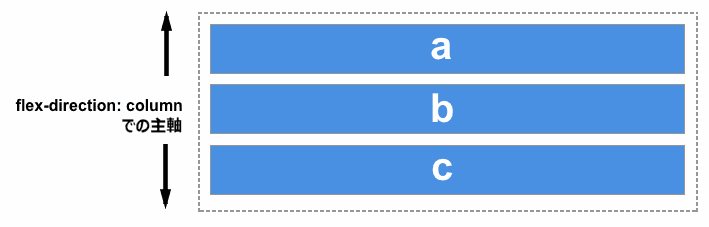
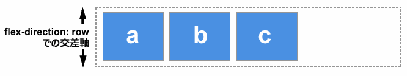
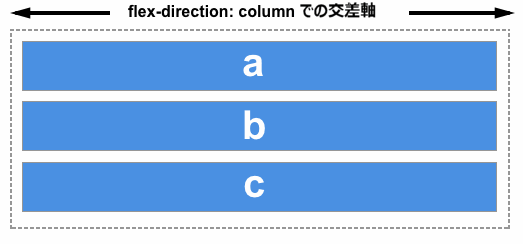

{{CSSRef}}

通常フレックスボックスと呼ばれている Flexible Box Module は一次元のレイアウトモデルとして、またインターフェイス中のアイテム間で余白の分配をする機能と強力な位置合わせをする機能を提供するものとして設計されました。この記事ではフレックスボックスの主な特徴の概要を示します。詳細については、このガイドのほかのページで説明します。

フレックスボックスが一次元であることは、フレックスボックスが一つの次元、つまり行か列のいずれかの方向にしかレイアウトしないことを述べています。これは [CSS グリッドレイアウト](/ja/docs/Web/CSS/CSS_Grid_Layout)が行と列の二次元を同時に制御するモデルであることと対照的です。

## フレックスボックス 2 つの軸

フレックスボックスを使うときは 2 つの軸、つまり主軸 (main axis) と交差軸 (cross axis) の観点から考える必要があります。主軸は {{cssxref("flex-direction")}} プロパティによって定義され、交差軸は主軸に垂直に交わる軸です。フレックスボックスを使った操作では常にこの軸について参照することになるので、最初にその動きを理解しましょう。

### 主軸

主軸は `flex-direction` によって定義され、4 種類の値をとることができます。

- `row`
- `row-reverse`
- `column`
- `column-reverse`

`row` または `row-reverse` を選択した場合、主軸は**インライン要素の並ぶ方向**に伸びる軸となります。

`column` または `column-reverse` を選んだ場合は、ページの上から下に向かって**ブロック要素の並ぶ方向**に伸びる軸となります。

### 交差軸

交差軸は主軸に垂直に交わる軸です。したがって、`flex-direction` (主軸) が `row` または `row-reverse` なら、交差軸は列に沿ったものになります。

主軸が `column` または `column-reverse` であれば、交差軸は行の方向になります。

フレックスアイテムの整列と位置合わせを検討する際には、どの軸が重要なのかを理解することが重要です。フレックスボックスには、コンテンツを一方の軸または他方の軸に沿って揃えたり、位置合わせしたりするプロパティが用意されています。

## 行の先頭と末尾

理解が必要なもう一つの重要事項は、フレックスボックスは文書の書字方向を仮定しないという点です。 CSS は過去には、左から右への横書きの書字方向に過度に偏っていました。最近のレイアウト方法は多様な書字方向に対応しており、したがってテキスト行が左上から始まり右に進み、新しい行が下に続くということを仮定しません。

後述する[フレックスボックスと他のレイアウト方法の関係を読む](/ja/docs/Web/CSS/CSS_Flexible_Box_Layout/Relationship_of_Flexbox_to_Other_Layout_Methods#writing_modes)こともできますが、フレックスアイテムが流れる方向を説明するときに、左右や上下の話をしない理由は、以下の説明で理解できると思います。

もし `flex-direction` が `row` で言語が英語の場合、主軸の先頭は左で末尾は右になります。

一方で言語がもしアラビア語であった場合、主軸の先頭は右で末尾が左になります。

両言語ともに書字方向が横書きであるため、いずれの場合でも、交差軸の先頭側は上で末尾側が下になります。

こうしてみると、左と右ではなく先頭と末尾で考えることが自然なものに思えます。この考え方は CSS グリッドレイアウトのような、同じパターンに従っているレイアウトメソッドを扱う際にも役立つでしょう。

## フレックスコンテナー

フレックスボックスを使ってレイアウトされる文書の領域は、**フレックスコンテナー**と呼ばれています。フレックスコンテナーを作るには、その領域のコンテナーに対して {{cssxref("display")}} プロパティの値を `flex` もしくは `inline-flex` に設定します。またこれにより、このコンテナー直下の子要素が**フレックスアイテム**となります。ほかの CSS プロパティと同様に、いくつかの初期値が定義されているため、フレックスコンテナーを作成するとそのコンテナーに含まれるフレックスアイテムは以下のように振る舞います。

- フレックスアイテムは行に沿って並んで表示されます (`flex-direction` プロパティの既定値は `row`)。
- フレックスアイテムは主軸の先頭側を先頭に並びます。
- フレックスアイテムは、主軸方向に伸張されませんが、収縮する場合があります。
- フレックスアイテムは、交差軸の大きさを埋めるように伸張されます。
- {{cssxref("flex-basis")}} プロパティは `auto` に設定されます。
- {{cssxref("flex-wrap")}} プロパティは `nowrap` に設定されます。

その結果、アイテムはすべて一行に並び、コンテンツの寸法が主軸方向の寸法になります。アイテムがコンテナーに収まらない場合は、折り返されずにあふれます。一部のアイテムの高さが他のアイテムより大きい場合には、すべてのアイテムが交差軸方向にその全高を埋めるように伸張されます。

この見え方についての、例を以下に挙げます。アイテムを変更したり新たに追加してフレックスボックスの初期値の挙動を確認してください。

{{EmbedGHLiveSample("css-examples/flexbox/basics/the-flex-container.html", '100%', 480)}}

### flex-direction の変更

フレックスコンテナーに {{cssxref("flex-direction")}} プロパティを設定すると、フレックスアイテムが表示される方向を変更することができます。 `flex-direction: row-reverse` と設定することで、アイテムは行に沿って並ぶ点は変わりませんが、先頭と末尾が入れ替わります。

`flex-direction` を `column` に変更すると、主軸の方向が変わり、フレックスアイテムは列に沿って並んで表示されるようになります。 `column-reverse` では、さらに先頭と末尾が入れ替わります。

次の例では、`flex-direction` が `row-reverse` に設定されています。他の値である `row`, `column`, `cokumn-reverse` で何が起こるか確かめてみてください。

{{EmbedGHLiveSample("css-examples/flexbox/basics/flex-direction.html", '100%', 350)}}

## flex-wrap による複数行のフレックスコンテナー

フレックスボックスは一次元モデルですが、フレックスアイテムを複数行に折り返して表示させることも可能です。その際には、それぞれの行を新しいフレックスコンテナーとして捉える必要があります。余白の分配はその行の中でのみ発生し、隣の行については参照されません。

折り返しを発生させるには {{cssxref("flex-wrap")}} プロパティに値として `wrap` を設定します。するとアイテムが一行で表示するには大きすぎる場合には、新たな行に折り返しされます。以下の例では、全アイテムを合わせた幅がフレックスコンテナーよりも大きくなるような幅をアイテムに設定しています。 `flex-wrap` を `wrap` に設定すると、アイテムが折り返します。初期値である `nowrap` に設定すると、フレックスボックスの初期値はアイテムの収縮を許可するので、アイテムはコンテナーに合うように収縮されます。 `nowrap` はアイテムを収縮不可能な場合や、コンテナーに合う大きさまで小さくできない場合には、あふれ出ます。

{{EmbedGHLiveSample("css-examples/flexbox/basics/flex-wrap.html", '100%', 400)}}

フレックスアイテムの折り返しについての詳細は、[フレックスアイテムの折り返しのマスター](/ja/docs/Web/CSS/CSS_Flexible_Box_Layout/Mastering_Wrapping_of_Flex_Items)を参照してください。

## flex-flow 一括指定プロパティ

`flex-direction` と `flex-wrap` の 2 つのプロパティは、{{cssxref("flex-flow")}} 一括指定プロパティにより 2 つ同時に指定することができます。最初に指定される値が `flex-direction` で、2 つ目の値が `flex-wrap` です。

以下の例で、1 つ目の値を `flex-direction` に使える値 (`row`, `row-reverse`, `column`, `column-reverse` のいずれか) に変更してみてください。また、2 つ目の値を `wrap` か `nowrap` に変更してみてください。

{{EmbedGHLiveSample("css-examples/flexbox/basics/flex-flow.html", '100%', 400)}}

## フレックスアイテムに適用されるプロパティ

フレックスアイテムに対してさらなる制御をするために、アイテムを直接操作対象にすることができます。以下の 3 つのプロパティを使用します。

- {{cssxref("flex-grow")}}
- {{cssxref("flex-shrink")}}
- {{cssxref("flex-basis")}}

本ページでは、これらのプロパティについて簡単に触れます。[主軸におけるフレックスアイテムの比率の制御](/ja/docs/Web/CSS/CSS_Flexible_Box_Layout/Controlling_Ratios_of_Flex_Items_Along_the_Main_Ax)のガイドで、より完全な情報を得られます。

上述のプロパティについて理解する前に、**分配可能な余白** (available space) の概念について考える必要があります。上述のプロパティを変更するということは、アイテム間での分配可能な余白の分配のしかたを変えるということです。この分配可能な余白についての考え方は、アイテムの位置合わせについて考える時に重要になります。

たとえば、500 ピクセル幅のコンテナーの中に 100 ピクセル幅のアイテムが 3 つあるとき、アイテムの配置に必要な幅は 300 ピクセルです。このとき 200 ピクセルの分配可能な余白が残っています。初期値を変更しなかった場合フレックスボックスは、余白を最後のアイテムの後ろに配置します。

そうではなく、アイテムを拡大して余白を埋めたいときには、余っている余白をアイテムに分配する方法が必要となります。それがアイテム自体に設定する `flex` プロパティが提供する機能です。

### flex-basis プロパティ

`flex-basis` は、そのアイテムの寸法を、使用しない余白は分配可能な余白として残すように定義します。このプロパティの初期値は `auto` で、この設定ではブラウザーはアイテムに寸法が設定されているかを確認します。上述の例では、すべてのアイテムが 100 ピクセルの幅に設定されているため、これが `flex-basis` として使われます。

アイテムに寸法が設定されていない場合は、その内容の大きさが `flex-basis` として使われます。`display: flex` を親要素に設定するだけで、すべてのフレックスアイテムがそのアイテムの内容を表示するのに必要な余白のみを使用して行の中に整列していたのは、この挙動のためです。

### flex-grow プロパティ

`flex-grow` プロパティを正の整数に設定すると、フレックスアイテムは主軸に沿って `flex-basis` 以上に伸張することができます。これによって、アイテムが主軸に沿った分配可能な余白をすべて使うまで伸張するか、ほかのアイテムにも `flex-grow` が設定されていたときには一定の割合を使うように伸張するようになります。

先ほどの例で、すべてのアイテムの `flex-grow` に 1 を設定すると、分配可能な余白はアイテム間で均等に分配され、主軸に沿ってコンテナーを埋めるように伸張されます。

flex-grow プロパティは割合で余白を分配するために使うことができます。最初のアイテムの `flex-grow` に 2 を設定し、ほかのアイテムには 1 を設定した場合、最初のアイテムに2/4 (先ほどの例では 200px 中の 100px ) が与えられ、残りの 2 つのアイテムに 1/4 (200px 中の 50px ) ずつが与えられます。

### flex-shrink プロパティ

`flex-grow` プロパティが主軸上の余白の追加を扱う一方で、`flex-shrink` は余白の取りあげ方をコントロールします。 アイテムを配置するのに十分な余白がコンテナーになく、`flex-shrink` に正の整数が設定されていれば、アイテムは `flex-basis` よりも小さくなります。`flex-grow` と同様に、あるアイテムの収縮するスピードを他のアイテムより早くするために、異なる値を設定することができます。 つまり `flex-shrink` により大きな値が設定されているアイテムは、他のより小さな値が設定されている兄弟要素よりも早く収縮します。

実際の収縮幅の計算にはアイテムの最小寸法が考慮されるため、`flex-shrink` の動作は `flex-grow` に比べて一貫性がないように見えるかもしれません。そのため、そのアルゴリズムがどのように動くかについての詳細は、[主軸に沿ったフレックスアイテムの比率の制御](/ja/docs/Web/CSS/CSS_Flexible_Box_Layout/Controlling_Ratios_of_Flex_Items_Along_the_Main_Ax)の記事に書かれています。

> **Note:** `flex-grow` や `flex-shrink` に指定する値は割合です。一般的には、たとえばあるアイテムを他の `flex: 1 1 200px` に設定したアイテムより２倍速く拡大させたいときには、`flex: 2 1 200px` を設定します。しかし、望むならば `flex: 10 1 200px` と `flex: 20 1 200px` という書き方もできます。

### flex プロパティの一括指定の値

`flex-grow`、`flex-shrink`、`flex-basis` の各プロパティを個別に使うケースは稀であり、そのかわりに {{cssxref("flex")}} 一括指定プロパティでまとめて指定されることが多いでしょう。`flex` 一括指定プロパティは、`flex-grow`、`flex-shrink`、`flex-basis` の順に 3 つの値を設定することができます。

以下の例では、`flex` 一括指定プロパティの様々な値を試せるようになっています。 最初の値が `flex-grow` であり、正の値を指定することでアイテムが伸張できるようになります。2 番目の値は `flex-shrink` です。正の値によりアイテムが収縮できるようになりますが、アイテムの合計寸法が主軸からはみ出す場合のみ起こります。最後の値が `flex-basis` となり、アイテムが伸張・収縮する際の基準値となります。

{{EmbedGHLiveSample("css-examples/flexbox/basics/flex-properties.html", '100%', 510)}}

また、ほとんどの用途をカバーできるいくつかの定義済みの一括指定値があります。 チュートリアル中で使用されているのを度々見かけるでしょうし、ほとんどの場合でこれらの値で十分でしょう。 定義済みの値は以下のとおりです。

- `flex: initial`
- `flex: auto`
- `flex: none`
- `flex: <正の数>`

`flex: initial` はフレックスボックスの初期値にリセットします。これは `flex: 0 1 auto` に設定することと同じです。この場合 `flex-grow` は 0 となるため、アイテムが `flex-basis` よりも大きくなることはありません。`flex-shrink` は 1 なので、必要な場合にはオーバーフローするのではなく収縮します。`flex-basis` の値は `auto` です。アイテムに設定されている主軸に沿った寸法か、またはアイテムの内容の寸法がフレックスアイテムの寸法として使用されます。

`flex: auto` では、`flex: 1 1 auto` に設定することと等しくなります。`flex: initial` とは、アイテムがコンテナーを埋めるように伸張する点を除いて同じで、必要に応じて収縮もします。

`flex: none` は、全く伸縮性のない flex アイテムを作成します。これは `flex: 0 0 auto `と同じです。アイテムは伸張も収縮もせずに、`flex-basis: auto` のフレックスボックスとして配置されます。

チュートリアル内では、`flex: 1` や `flex: 2` のような設定をよく目にするでしょう。これは `flex: 1 1 0` を使うのと同様、`flex-basis` が 0 の状態から伸び縮みします。

これらの一括指定値について、以下の例で試してみてください。

{{EmbedGHLiveSample("css-examples/flexbox/basics/flex-shorthands.html", '100%', 510)}}

## アイテム間での位置合わせ、端揃え、余白分配

フレックスボックスの重要な特徴は、主軸および交差軸において位置合わせや端揃えをし、フレックスアイテム間での余白の分配ができる点にあります。

### align-items

{{cssxref("align-items")}} プロパティは、交差軸におけるアイテムの位置合わせを行います。

このプロパティの初期値は `stretch` であり、これによって既定では最も高いフレックスアイテムの高さまで他のアイテムが伸張する挙動になっています。実際には、最も高いフレックスアイテムの高さがコンテナーの高さを決めるため、フレックスコンテナーを埋めるように伸張します。

アイテムをフレックスコンテナーの先頭側に揃えるためには `align-items` に `flex-start` を設定し、末尾側に揃えるためには `flex-end` を、中央揃えにするには `center` を設定します。 以下の例で試してみましょう。この例では、コンテナー内でアイテムがどのように移動するかわかりやすくするためフレックスコンテナーに高さを設定しています。`align-items` に以下の値を設定したときにそれぞれ何が起こるか確認してください。

- `stretch`
- `flex-start`
- `flex-end`
- `center`

{{EmbedGHLiveSample("css-examples/flexbox/basics/align-items.html", '100%', 520)}}

### justify-content

{{cssxref("justify-content")}} プロパティは、主軸におけるアイテムの配置、つまり `flex-direction` で設定された方向における位置合わせを行います。初期値は `flex-start` で、コンテナーの先頭側からアイテムが並べられます。`flex-end` を設定することで末尾から、`center` を設定することで中央に並べることもできます。

また、`space-between` を使用して、アイテムを配置したあとの残りの余白のすべてをアイテム間で均等に振り分けられ、これによって同じ幅の空白がそれぞれアイテムの間に挿入されます。各アイテムの左右に同じだけの余白を空けるには、`space-around` を使用します。`space-around` では、コンテナーの両端には、アイテムの間隔の半分の大きさの余白が設けられます。両端にも同じだけの余白を設けるには、`space-evenly` を使用します。この場合はコンテナの両端にフルサイズ (アイテムの間隔と同じ大きさ) の余白が設けられます。

例で、以下の `justify-content` の値を試してみましょう。

- `flex-start`
- `flex-end`
- `center`
- `space-around`
- `space-between`
- `space-evenly`

{{EmbedGHLiveSample("css-examples/flexbox/basics/justify-content.html", '100%', 380)}}

[フレックスコンテナー内でのアイテムの配置](/ja/docs/Web/CSS/CSS_Flexible_Box_Layout/Aligning_Items_in_a_Flex_Container)の記事では、これらのプロパティがどのように動作するのか深く理解するために、より詳細に述べています。しかし上述の簡潔な例でもほとんどの用途で役に立つでしょう。

## 次のステップ

この記事で、フレックスボックスの基本的な特徴についての理解ができたと思います。次の記事では[この仕様が他の CSS レイアウトメソッドとどのような関係にあるか](/ja/docs/Web/CSS/CSS_Flexible_Box_Layout/Relationship_of_Flexbox_to_Other_Layout_Methods)を見ていきます。
