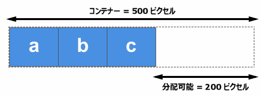

{{CSSRef}}

このガイドでは、フレックスアイテムに適用され、主軸に沿ってアイテムの寸法と自由度を制御することができる三つのプロパティ — {{CSSxRef("flex-grow")}}, {{CSSxRef("flex-shrink")}}, {{CSSxRef("flex-basis")}} を見ていきます。これらのプロパティがどのようにアイテムを伸縮させるかについて完全に理解することが、フレックスボックスをマスターするための鍵です。

## 最初に見てみる

3 つのプロパティは、フレックスアイテムの自由度を以下の観点から制御します。

- `flex-grow`: このアイテムが得る正の自由空間はどれくらいか。
- `flex-shrink`: このアイテムから縮小できる負の自由空間はどれくらいか。
- `flex-basis`: 伸長や縮小が発生する前のアイテムの寸法はいくつか。

プロパティは通常、一括指定の {{CSSxRef("flex")}} プロパティとして表されます。以下のコードは `flex-grow` プロパティを `2` に、 `flex-shrink` を `1` に、 `flex-basis` を `auto` に設定します。

```css
.item {
  flex: 2 1 auto;
}
```

すでに[フレックスボックスの基本概念](/ja/docs/Web/CSS/CSS_Flexible_Box_Layout/Basic_Concepts_of_Flexbox)の記事を読んでいるのであれば、すでにこれらのプロパティの紹介を受けているでしょう。ここではこれらを掘り下げ、使用するとブラウザーが何をするかを完全に理解できるようにします。

## 主軸に合わせて動作する重要概念

主軸に沿った比率を制御するためのフレックスプロパティの機能を見る前に、いくつかの概念を確認しておきましょう。これらは、フレックスアイテムの成長や縮小が起こる前の*自然な*寸法と、自由空間の概念に関連しています。

### フレックスアイテムの寸法の変更

フレックスアイテムをレイアウトするための空間を確保するには、まずアイテムの大きさをブラウザーが知る必要があります。絶対的な長さの単位で適用される幅や高さを持たないアイテムは、どのようにして処理されるのでしょうか。

CSS には {{CSSxRef('width','min-content','#min-content')}} と {{CSSxRef('width','max-content','#max-content')}} という概念があります。これらのキーワードは [CSS Intrinsic and Extrinsic Sizing 仕様書で定義](https://drafts.csswg.org/css-sizing-3/#width-height-keywords)されており、[長さの単位](/ja/docs/Web/CSS/length)の代わりに使用することができます。

例えば、以下のライブ例では、テキストの文字列を含む 2 つの段落要素があります。1 つ目の段落の幅は `min-content` となっています。このキーワードに対応しているブラウザーでは、テキストのソフトな折り返しの機会をすべて利用して、はみ出さない範囲で小さくなっているのがわかるはずです。これが、その文字列の最小コンテンツサイズです。基本的には、文字列の中で最も長い単語が大きさを決定します。

2 つ目の段落は、`max-content` という値を持っているので、逆のことをしています。これは可能な限り大きくして、ソフトな折り返しの機会を与えません。コンテナーが狭すぎるとボックスからあふれてしまいます。

{{EmbedGHLiveSample("css-examples/flexbox/ratios/min-max-content.html", '100%', 750)}}

お使いのブラウザーがこれらのキーワードにまだ対応していない場合、両方の段落はブロックフローの通常の段落としてレンダリングされます。以下のスクリーンショットは期待されるレンダリングを示しています。


この動作と、`min-content` および `max-content` がどのような効果を持つかについては、後述の `flex-grow` と `flex-shrink` の説明で覚えておいてください。

### 正と負の自由空間

これらの特性を説明するには、**正と負の自由空間**の概念を理解する必要があります。フレックスコンテナーに正の自由空間がある場合は、コンテナー内にフレックスアイテムを表示するのに必要な空間よりも大きな空間があるということです。たとえば 幅が 500 ピクセルのコンテナーで、{{CSSxRef("flex-direction")}} が `row` であり、幅 100 ピクセルのフレックスアイテムが 3 つあった場合、正の自由空間が 200 ピクセルあり、コンテナーいっぱいに表示したい場合は、各アイテムに分配することができます。



アイテムの自然な大きさの合計が、フレックスコンテナー内の利用可能な空間よりも大きい場合、負の自由空間が発生します。上の図のように幅 500 ピクセルのコンテナーがあるものの、3 つのフレックスアイテムの幅がそれぞれ 200 ピクセルであった場合、必要な空間は合計で 600 ピクセルとなり、100 ピクセルの負の自由空間が発生します。これをアイテムから取り除くことで、コンテナーに合わせることができます。


フレックスのプロパティを理解するには、この正の自由空間の分配と負の自由空間の除去を理解する必要があります。

以下の例では、{{CSSxRef("flex-direction")}} を row (行) に設定して作業しているので、アイテムの寸法は常に幅に基づいて決定されます。すべてのアイテムの幅の合計とコンテナーの幅を比較して、正と負の自由空間を計算します。それぞれの例を `flex-direction: column` で試すこともできます。主軸が列になり、アイテムの高さと、アイテムが入っているコンテナーの高さを比較して、プラスとマイナスの自由空間を計算する必要が出てきます。

## flex-basis プロパティ

{{CSSxRef("flex-basis")}} プロパティは、空間の分配が行われる前のフレックスアイテムの初期の大きさを指定します。このプロパティの初期値は `auto` です。`flex-basis` が `auto` に設定されている場合、ブラウザーはアイテムの初期の大きさを計算するために、まずアイテムの主軸方向の寸法に絶対寸法が設定されているかどうかをチェックします。例えば、アイテムの幅を 200 ピクセルに設定している場合です。この場合、`200px` がこのアイテムのフレックスベースとなります。

アイテムの寸法が自動になっている場合、`auto` を指定すると内容物の寸法が解決値になります。このとき、`min-` および `max-content` の寸法に関する知識があると便利です。フレックスボックスでは、アイテムの `max-content` の寸法を `flex-basis` として使用します。次のライブ例でこれを説明します。

この例では、柔軟性のない一連のボックスを作成し、`flex-grow` と `flex-shrink` の両方を `0` に設定しています。ここでは、主軸方向の寸法として 150 ピクセルの幅を明示的に設定した最初のアイテムが、`flex-basis`として`150px`を取るのに対し、他の2つのアイテムは幅を持たないため、コンテンツの幅に応じたサイズになっていることがわかります。

{{EmbedGHLiveSample("css-examples/flexbox/ratios/flex-basis.html", '100%', 500)}}

`auto` キーワードに加えて、`content` キーワードを `flex-basis` として使用することができます。この場合、アイテムに幅が設定されていても、コンテンツの寸法から `flex-basis` が算出されます。これは新しいキーワードで、ブラウザーの対応も少ないのですが、`auto` を flex-basis として使用し、アイテムに幅を設定しないようにすることで、自動で寸法が調整されるので、常に同じ効果を得ることができます。

余白の分配を行う際に、フレックスボックスでアイテムの寸法を完全に無視したい場合は、`flex-basis`を`0`に設定します。これは基本的に、フレックスボックスのすべての空間が利用可能であり、それをアイテムに比例して分配することを指示します。この例は、次に紹介する `flex-grow` で見てみましょう。

## flex-grow プロパティ

{{CSSxRef("flex-grow")}}プロパティは、**フレックス伸長係数**を指定します。これは、正の自由空間が分配されたときに、フレックスアイテムがフレックスコンテナー内の他のフレックスアイテムに対してどれだけ伸長するかを決定します。

すべてのアイテムの `flex-grow` 係数が同じであれば、余白はすべてのアイテムに均等に分配されます。このような場合、ふつうは値に `1` を使用しますが、すべてのアイテムに `flex-grow` の値として `88`、`100`、`1.2` など与えることもできます。これは係数です。係数がすべてのアイテムで等しく、フレックスコンテナー内に正の自由空間があれば、すべてのアイテムに均等に分配されます。

### `flex-grow` と `flex-basis` を組み合わせる

`flex-grow` と `flex-basis` がどのように相互作用するかという点については混乱しやすいものです。コンテンツの長さが異なる 3 つのフレックスアイテムに、次のような `flex` ルールを適用した場合を考えてみましょう。

`flex: 1 1 auto;`

この場合、`flex-basis` の値は `auto` で、アイテムには幅が設定されていないので、寸法は自動調整されます。つまり、フレックスボックスはアイテムの `max-content` の寸法を見ていることになります。アイテムを並べると、フレックスコンテナー内に正の自由空間 (この画像で斜線を引いた部分) ができます。


コンテンツの寸法と同じ `flex-basis` を使用しているので、全体の利用可能な空間 (フレックスコンテナーの幅) から分配可能な領域を差し引いた余白を各アイテムに均等に分配しています。大きなアイテムは、他のアイテムと同じ量の余白が割り当てられますが、もともと寸法が大きいので、結果的にもっと大きくなります。


もし本当に実現したいことが 3 つのアイテムを同じ大きさにすることであれば、最初の寸法が異なっていても、これを使用してください。

`flex: 1 1 0;`

ここでは、空間の分配の計算上、アイテムの寸法を `0` としています。すべての空間が確保され、すべてのアイテムが同じ `flex-grow` 係数を持っているので、それぞれに同じ量の空間が分配されることになります。最終的には、3 つの同じ幅の伸縮可能ななアイテムができあがります。

このライブ例で、`flex-grow` 係数を 1 から 0 に変更して、動作の違いを確認してみてください。

{{EmbedGHLiveSample("css-examples/flexbox/ratios/flex-grow.html", '100%', 520)}}

### アイテムに個別の flex-grow 要素を与える

`flex-grow` と `flex-basis` の関係を理解すると、アイテムに様々な `flex-grow` 係数を割り当てることで、個々のアイテムの大きさをさらに制御することができるようになります。`flex-basis` を `0` にして、すべての空間を分配できるようにした場合、3 つのフレックスアイテムにそれぞれ異なる `flex-grow` ファクターを割り当てることができます。以下の例では、次のような値を使用しています。

- 1 番目のアイテムには `1`
- 2 番目のアイテムには `1`
- 3 番目のアイテムには `2`

`flex-basis` を `0` とすると、利用可能な空間は次のように分配されます。まずフレックス伸長係数を合計し、フレックスコンテナー内の正の自由空間の合計をその数値、この場合は 4 で割ります。それからそれぞれの値に応じて空間を分配します。 — 1 番目のアイテムは 1 つ分、2 番目は 1 つ分、3 番目は 2 つ分になります。つまり、3 番目のアイテムは、1 番目と 2 番目のアイテムの 2 倍の大きさになります。

{{EmbedGHLiveSample("css-examples/flexbox/ratios/flex-grow-ratios.html", '100%', 520)}}

ここでは、どんな正の値も使用できることを覚えておいてください。重要なのは、ある項目と他の項目との比率です。大きな数字を使っても、小数を使っても構いません。 — あなた次第です。試しに、上の例で割り当てられた値を `.25`, `.25`, `.50` に変更してみてください。 — 同じ結果が得られるはずです。

## `flex-shrink` プロパティ

{{CSSxRef("flex-shrink")}}プロパティでは、**フレックス縮小係数**を指定します。これは、負の自由空間が分配されたときに、フレックスコンテナー内の他のフレックスアイテムに対して、フレックスアイテムがどれだけ縮小するかを決定します。

このプロパティは、ブラウザーがフレックスアイテムの `flex-basis` 値を計算して、フレックスコンテナーに収まらない大きさだと判断した場合に対処します。`flex-shrink` に正の値があれば、コンテナーからはみ出さないようにアイテムが縮小されます。

つまり、`flex-grow` が利用可能な空間を追加する扱いをするのに対し、`flex-shrink` はボックスがはみ出さずにコンテナーに収まるように空間を縮小する扱いをします。

次のライブ例では、3 つのアイテムをフレックスコンテナーに入れています。それぞれに 200 ピクセルの幅を与え、コンテナーの幅は 500 ピクセルにしています。`flex-shrink` を `0` に設定すると、アイテムは縮小できないので、ボックスからはみ出してしまいます。

{{EmbedGHLiveSample("css-examples/flexbox/ratios/flex-shrink.html", '100%', 500)}}

`flex-shrink` の値を `1` に変更すると、すべてのアイテムがボックスに収まるように、各アイテムが同じ量だけ縮小されるのがわかります。これは、すべてのアイテムがボックスに収まるようにするために、最初の幅よりも小さくしたものです。

### `flex-shrink` と `flex-basis` の組み合わせ

`flex-shrink` は、`flex-grow` とほとんど同じように動作すると言えるでしょう。しかし、*完全に*同じではない理由が 2 つあります。

通常は些細な違いですが、仕様に定義されていることは、負の空間に対して `flex-shrink` が行うことが、正の空間に対して `flex-grow` が行うこととまったく同じではない理由の一つです。

> 「注：負の空間を分配する際には、フレックス縮小係数にフレックスベースの大きさが乗じられます。これは、アイテムが縮小できる量に比例して負の空間を分配するもので、例えば、大きなアイテムが目に見えて縮小する小さなアイテムが、大きなアイテムが目立って縮小する前にゼロまで縮小してしまうことはありません。」

2 つ目の理由は、フレックスボックスは、負の自由空間を除去する際に小さなアイテムがゼロの大きさにまで縮小することを防ぐためです。アイテムは `min-content` の寸法が下限になります。 — 可能な限りすべてのソフト折り返しの機会を利用した後の寸法です。

以下の例では、`min-content` の下限になり、`flex-basis` が内容物の大きさに解決されていることがわかります。フレックスコンテナーの幅を 700px などに変更してからフレックスアイテムの幅を小さくすると、最初の 2 つのアイテムは折り返されますが、`min-content` の寸法より小さくなることはありません。ボックスが小さくなると、3 つ目のアイテムが縮小します。

{{EmbedGHLiveSample("css-examples/flexbox/ratios/flex-shrink-min-content.html", '100%', 500)}}

実際には、縮小の動作は妥当な結果をもたらす傾向があります。通常、内容物が完全に消えてしまったり、ボックスが最小の内容物よりも小さくなってしまったりすることはありません。そのため、上記のルールは、コンテナーに収まるように内容物を縮小する必要がある場合の適切な動作という点で、理にかなっています。

### アイテムに別の `flex-shrink` 要素を与える

`flex-grow` と同様に、それぞれのフレックスアイテムに異なる `flex-shrink` 係数を与えることができます。これにより、たとえば、あるアイテムを兄弟アイテムよりも急速に縮小させたり、まったく縮小させないようにしたい場合に、既定の動作を変更することができます。

次のライブ例では、1 番目のアイテムの `flex-shrink` 係数は 1、2 番目のアイテムは `0` (つまり、まったく縮まない)、3 番目のアイテムは `4` です。したがって、3 番目のアイテムは、1 番目のアイテムよりも急速に縮小します。`flex-grow` と同様に、ここでも小数や大きな数字を使うことができます。最も分かりやすいものを選んでください。

{{EmbedGHLiveSample("css-examples/flexbox/ratios/flex-shrink-ratios.html", '100%', 570)}}

## フレックスアイテムの寸法の設定をマスターする

フレックスアイテムの寸法の調整の仕組みを理解するには、いくつかの要素を理解する必要があります。このガイドでは、以下の点について説明してきました。

## アイテムの基本的な寸法に何が設定されているか

1. `flex-basis` が `auto` に設定されていて、アイテムに幅が設定されている場合は、その幅に応じた寸法になります。
2. `flex-basis` が `auto` または `content` (対応しているブラウザーの場合) に設定されている場合は、寸法はアイテムの寸法に基づいて決定されます。
3. `flex-basis` が長さの単位で、0 ではない場合は、これがアイテムの寸法になります。
4. `flex-basis` が `0` に設定されている場合は、アイテムの寸法は空間共有の計算には考慮されません。

### 利用できる余白が残っているか

正の自由空間がないとアイテムは伸長しませんし、負の自由空間がないとアイテムは縮小しません。

1. すべてのアイテムの幅 (列の場合は高さ) を合計したとき、その合計がコンテナーの幅 (または高さ) の合計よりも**小さい**場合は、正の自由空間があり、`flex-grow` の出番となります。
2. すべてのアイテムの幅 (列の場合は高さ) を合計した場合、その合計がコンテナーの幅 (または高さ) の合計より**大きい**場合は、負の自由空間があり、`flex-shrink` が効いてきます。

### 空間を分配する別の方法

アイテムに空間を追加したくない場合は、「フレックスコンテナー内のアイテムの配置」で説明している配置プロパティを使って、アイテム間やアイテム周辺の自由空間を処理できることを覚えておいてください。{{CSSxRef("justify-content")}} プロパティを使用すると、アイテム間やアイテム周辺の自由空間の分配が可能になります。また、フレックスアイテムに auto のマージンを使用すると、スペースを吸収してアイテム間に隙間を作ることができます。

自由に使えるフレックスツールがあれば、最初は少し試行錯誤するかもしれませんが、ほとんどの作業が可能であることがわかります。
