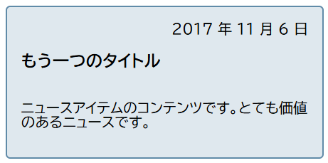

{{CSSRef}}

フレックスボックスやグリッドといった新しいレイアウト方式には、コンテンツの順序を制御する機能があります。この記事では、フレックスボックスを使っている場合にコンテンツの見た目上の順序を変更する方法について見ていきます。またアクセシビリティの観点における、アイテム順の変更による影響についても考察します。

## アイテムを逆順に表示する

{{cssxref("flex-direction")}} プロパティは以下の 4 つの値のうち一つを取ることができます。

- `row`
- `column`
- `row-reverse`
- `column-reverse`

最初の 2 つの値は、文書のソースの順番と同じ順番で項目を保持し、先頭行から順に表示します。

下 2 つの値は先頭と末尾を入れ替えて、アイテムを逆順に表示します。

先頭は書字方向に応じて変わるということを思い出してください。先ほどの例のうち行についてのものは、`row` と `row-reverse` が英語のような左書きの言語においてどのように作用するかを示しています。アラビア語のような右書きの言語を使用している場合には、`row` では右から始まり `row-reverse` では左から始まります。

これは、アイテムが*表示上*でのみ逆順になるという点に注意が必要ではあるものの、アイテムを逆順に表示するための素晴らしい方法にみえます。この点については仕様の中で以下の様に触れられています。

> 「注：フレックスレイアウトの順序変更の機能は、意図的に表示のレンダリングにのみ影響するようになっており、読み上げの順序やナビゲーションがソースコード順に従うという挙動には影響しません。これにより作成者は、CSS 非対応の UA や読み上げや逐次ナビゲーションといった線形のモデルをソースの順序に保ったまま、視覚表現についての操作をすることができるようになります。」 - [Ordering and Orientation](https://www.w3.org/TR/css-flexbox-1/#flow-order)

仮にアイテムがリンクなどのようなタブで移動できる要素であったとすると、その移動順は表示されている順序ではなく、文書のソースに現れる順となります。

逆順の値を設定しているときやそのほかの方法でアイテムの順序を変更している場合、本当にソース上で論理的な順序を変更しなくてよいか考慮する必要があります。仕様の中でも先ほどの注に続けて、ソースの問題を修正するために順序設定を利用するべきではないという記載があります。

> 「文書のアクセシビリティを損なうため、order や flex-flow/flex-direction の \*-reverse 値をソース順序の修正の代用として利用してはいけません。」

> **Note:** 数年間にわたって Firefox には、ブラウザーの挙動と異なりソース上の順序ではなく表示上の順序に従うというバグがありました。このバグは現在は修正されています。最新のユーザーエージェントは仕様に従っているものとして、常にソース上の順序を文書の論理的な順序として扱うべきです。

以下の例ではリンクからリンクにタブ移動した際に、どれが強調されているかわかりやすいように focus スタイルを加えています。`flex-direction` を使って表示順を変更した場合でも、タブ順序はソース上の順序に従って移動することがわかります。

{{EmbedGHLiveSample("css-examples/flexbox/order/flex-direction.html", '100%', 440)}}

`flex-direction` の変更がナビゲーションの順序を変更しないのと同様に、描画の順序についても変更されることはありません。あくまでアイテムの表示上の順序が逆転するだけです。

## order プロパティ

フレックスアイテムが表示される順序を逆転することができましたが、それに加えて {{cssxref("order")}} プロパティを使用することでアイテム個別に表示される順序を変更することができます。

`order` プロパティは、アイテムを*数字で順序づけたグループ*でレイアウトするよう設計されています。つまりアイテムはグループ内での順序を表す整数に割り当てられ、その数字が小さい順に表示されるということです。同じ数字が複数のアイテムに割り当てられているときは、ソース上に現れる順に表示されます。

例として、5 つのアイテムに対して以下のように `order` を割り当てます。

- ソース上で 1 番目のアイテム: `order: 2`
- ソース上で 2 番目のアイテム: `order: 3`
- ソース上で 3 番目のアイテム: `order: 1`
- ソース上で 4 番目のアイテム: `order: 3`
- ソース上で 5 番目のアイテム: `order: 1`

このときアイテムは以下の順序でページ上に表示されます。

- ソース上で 3 番目のアイテム: `order: 1`
- ソース上で 5 番目のアイテム: `order: 1`
- ソース上で 1 番目のアイテム: `order: 2`
- ソース上で 2 番目のアイテム: `order: 3`
- ソース上で 4 番目のアイテム: `order: 3`

以下の例で値を変更して、表示順がどのように変わるか試してみてください。また `flex-direction` を `row-reverse` に変えたときに何が起こるか、つまり先頭が変わるために反対側から並べられることを確かめましょう。

{{EmbedGHLiveSample("css-examples/flexbox/order/order.html", '100%', 500)}}

フレックスアイテムの既定の `order` は `0` です。したがって 0 より大きい `order` をもつアイテムは、明示的に `order` を指定されていないアイテムの後ろに表示されます。

`order` には負の値を指定することもでき、ほかのアイテムはそのままの順序を保ちながら一つのアイテムだけを先頭に表示したい場合になどに有用です。先頭に表示したいアイテムに `order: -1` を設定することで、0 より小さい `order` のこのアイテムが常に先頭に表示されるようになります。

以下の例では フレックスボックスを使ってレイアウトをしています。HTML の中で指定されている `active` クラスを別のアイテムに付け替えることで、レイアウトの先頭に幅すべてを使って表示されるアイテムを変更することができ、残りのアイテムは次の行に表示されるようになります。

{{EmbedGHLiveSample("css-examples/flexbox/order/negative-order.html", '100%', 520)}}

アイテムは仕様書の中で _order-modified document order_ として述べられているものに従って表示されます。アイテムが表示される前に、`order` プロパティの値が考慮されます。

`order` はアイテムの描画順についても変更します。`order` の値が小さいものから先に描画され、大きくなる順に描画されていきます。

## order プロパティとアクセシビリティ

`order` プロパティの使用は、`flex-direction` による方向の変更と同様のアクセシビリティに対する影響があります。`order` は描画の順序および表示上の順序を変更しますが、逐次的なナビゲーションの順序は変更しません。そのため、もしユーザーがアイテム間の移動をタブによって行った場合、レイアウト中を混乱するような動作で飛び回っているように見えるでしょう。

この記事中の例でタブ移動を試すことで、`order` がポインティングデバイスを使わないユーザーにおかしな経験をさせてしまう可能性があることがわかるでしょう。表示上の順序と論理的な順序の分断とそれによって起こりうるアクセシビリティの問題についてさらに理解するためには、以下のページを参照してください。

- [Flexbox and the keyboard navigation disconnect](https://tink.uk/flexbox-the-keyboard-navigation-disconnect/)
- [HTML Source Order vs CSS Display Order](https://adrianroselli.com/2015/10/html-source-order-vs-css-display-order.html)
- [The Responsive Order Conflict for Keyboard Focus](https://alastairc.uk/2017/06/the-responsive-order-conflict/)

## order の用途

フレックスアイテムの論理的な順序、そして読むときの順序が表示上の順序と分かれていることが役に立つ場合があります。気をつけて使えば `order` プロパティは、いくつかのよくあるパターンを簡単に実装するために役に立ちます。

例えばニュース記事を表示するカードのデザインがあったとします。ニュースの見出しはハイライトされる重要なもので、またユーザーが読みたいものを探すためにタブでほかの見出しからジャンプする対象となる要素でもあります。カードには日付もあり、作りたいデザインは以下のようなものであるとします。

表示上では日付が見出しの上に現れています。しかし画面リーダーによって読み上げられるときには、タイトルが先に読まれて日付はその後が望ましいと思っているとします。こういったことを `order` プロパティで実現することができます。

カードをフレックスコンテナーとして、`flex-direction` を `column` に設定します。そして、日付に `order: -1` を設定します。これによって見出しの上に日付を引き上げることができます。

{{EmbedGHLiveSample("css-examples/flexbox/order/usecase-order.html", '100%', 730)}}

この例のような細かな調整は `order` プロパティを使うのにふさわしい状況です。読むためやタブ移動のための論理的な順序を保ち、アクセシビリティと構造化された形を維持してください。そして `order` プロパティは純粋に視覚的なデザインの調整のために使ってください。その際にはユーザーがキーボードでタブ移動をする対象となるアイテムの順序変更をしていないか留意してください。特に比較的新しいレイアウトを使うときには、マウスやタッチ画面ではなく、キーボードのみによるサイト操作の確認を確実にテストに含めた方がよいでしょう。そのテストで、開発時の選択がコンテンツの移動を難しくしてしまっているかどうか、すぐにわかるようになるでしょう。
