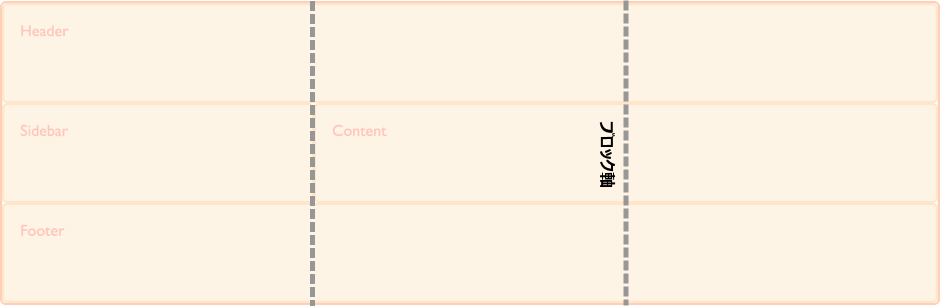
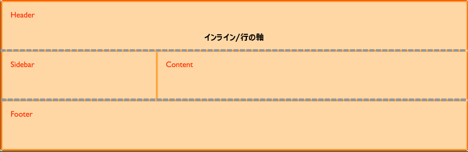
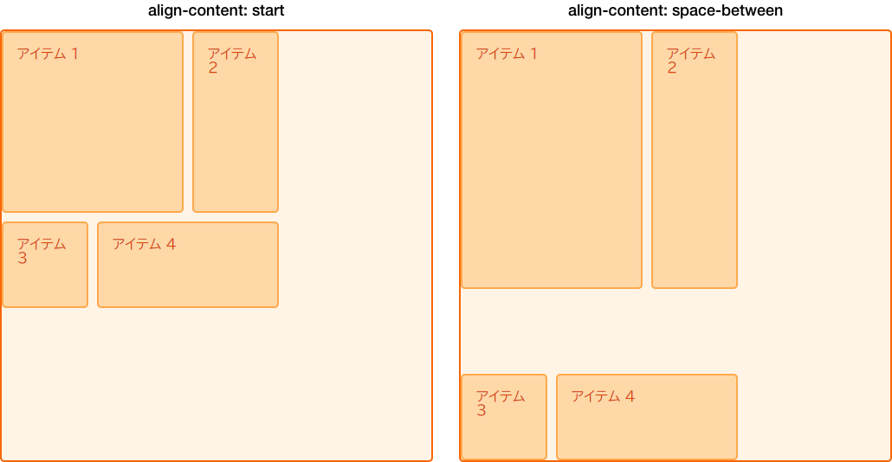
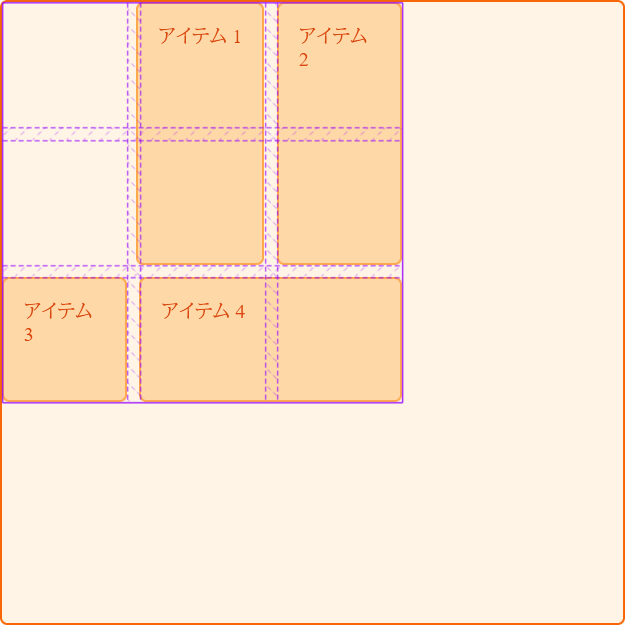

{{CSSRef}}

CSS グリッドレイアウトは [Box Alignment Level 3](https://drafts.csswg.org/css-align/) 仕様を実装しています。これは標準の[フレックスボックス](/ja/docs/Web/CSS/CSS_Flexible_Box_Layout)がフレックスコンテナーの中でアイテム配置を行うのと同じです。この仕様書には、様々なレイアウト方式すべてにおける配置の動作を詳述されています。どのレイアウト方式も、可能な限り仕様に準拠し、その違い (特徴と制約) に基づいて個々の動作を実装します。現在、仕様書にはすべてのレイアウト方式の詳細がありますが、ブラウザーの実装は完全ではありません。しかしながら、CSS グリッドレイアウト方式は広く実装されています。

このガイドでは、グリッドレイアウトにおけるボックス配置がどのように機能するのか説明します。フレックスボックスのプロパティと値の機能と多くの類似点があります。しかし、グリッドは二次元、フレックスボックスは一次元であるため、いくつか小さな違いがあることに気をつけてください。それではグリッド内のものを配置するときに使う 2 つの軸について見ていきましょう。

## グリッドレイアウトの 2 つの軸

グリッドレイアウトでは、*ブロック軸*と*インライン軸*という 2 つの軸が利用できます。ブロック軸は、ブロックレイアウトでブロックが配置される軸です。ページ内に 2 つの段落がある場合、上から下に向かって並べられますので、この方向がブロック軸となります。



*インライン軸*はブロック軸に交差する軸です。通常、テキストはインライン方向に向かって並べられます。



中身はグリッド領域の中に並べることができ、グリッドトラック自体が 2 つの軸の上にあります。

## ブロック軸上でのアイテムの配置

{{cssxref("align-self")}} と {{cssxref("align-items")}} プロパティは、ブロック軸上の配置を制御します。これらのプロパティを使用すると、配置したグリッド領域内でアイテムの配置を変更することができます。

<h3 id="Using_align-items">align-items の使用</h3>

以下の例には、4 つのグリッド領域があります。グリッドコンテナー上で {{cssxref("align-items")}} プロパティと次の値の一つを使い、アイテムを配置しています。

- `auto`
- `normal`
- `start`
- `end`
- `center`
- `stretch`
- `baseline`
- `first baseline`
- `last baseline`

```css hidden
* {
  box-sizing: border-box;
}

.wrapper {
  border: 2px solid #f76707;
  border-radius: 5px;
  background-color: #fff4e6;
}

.wrapper > div {
  border: 2px solid #ffa94d;
  border-radius: 5px;
  background-color: #ffd8a8;
  padding: 1em;
  color: #d9480f;
}
```

```css
.wrapper {
  display: grid;
  grid-template-columns: repeat(8, 1fr);
  gap: 10px;
  grid-auto-rows: 100px;
  grid-template-areas:
    "a a a a b b b b"
    "a a a a b b b b"
    "c c c c d d d d"
    "c c c c d d d d";
  align-items: start;
}
.item1 {
  grid-area: a;
}
.item2 {
  grid-area: b;
}
.item3 {
  grid-area: c;
}
.item4 {
  grid-area: d;
}
```

```html
<div class="wrapper">
  <div class="item1">Item 1</div>
  <div class="item2">Item 2</div>
  <div class="item3">Item 3</div>
  <div class="item4">Item 4</div>
</div>
```

{{ EmbedLiveSample('Using_align-items', '500', '500') }}

`align-items: start` を設定すると、それぞれの子である `<div>` の高さはコンテンツの `<div>` によって決定されることを覚えておいてください。また、[`align-items`](/ja/docs/Web/CSS/align-items) を完全に省略すると、それぞれの子である `<div>` の高さはグリッド領域を満たすように広がります。

{{cssxref("align-items")}} プロパティはすべての子グリッドアイテムに {{cssxref("align-self")}} プロパティを設定します。これは、グリッドアイテム上で `align-self` を使えばプロパティを個別に設定できるということです。

<h3 id="Using_align-self">align-self の使用</h3>

次の例では、`align-self` プロパティを使い、様々な配置の値を実験します。最初の領域で見られるのは `align-self` の既定の動作で、引き伸ばされています。2 つ目のアイテムは `align-self` が `start` 値を持っており、3 つ目は `end` 、4 つ目は `center` です。

```css hidden
* {
  box-sizing: border-box;
}

.wrapper {
  border: 2px solid #f76707;
  border-radius: 5px;
  background-color: #fff4e6;
}

.wrapper > div {
  border: 2px solid #ffa94d;
  border-radius: 5px;
  background-color: #ffd8a8;
  padding: 1em;
  color: #d9480f;
}
```

```css
.wrapper {
  display: grid;
  grid-template-columns: repeat(8, 1fr);
  gap: 10px;
  grid-auto-rows: 100px;
  grid-template-areas:
    "a a a a b b b b"
    "a a a a b b b b"
    "c c c c d d d d"
    "c c c c d d d d";
}
.item1 {
  grid-area: a;
}
.item2 {
  grid-area: b;
  align-self: start;
}
.item3 {
  grid-area: c;
  align-self: end;
}
.item4 {
  grid-area: d;
  align-self: center;
}
```

```html
<div class="wrapper">
  <div class="item1">Item 1</div>
  <div class="item2">Item 2</div>
  <div class="item3">Item 3</div>
  <div class="item4">Item 4</div>
</div>
```

{{ EmbedLiveSample('Using_align-self', '500', '500') }}

### アイテムと固有のアスペクト比

既定では、{{cssxref("align-self")}} の動作はアイテムを広げます。しかし、固有のアスペクト比を持つアイテムの動作は `start` になります。固有のアスペクト比を持つアイテムに既定で `stretch` を設定するとアイテムを歪めるからです。

この動作は現在、仕様で明確になっていますが、ブラウザーはまだ正しく実装していません。その間、{{cssxref("align-self")}} と {{cssxref("justify-self")}} を `start` に設定することによって、画像などのアイテムがグリッドの直接の子のように既定で広がらないことを保証できます。これにより、実装後の正しい動作を模倣することができます。

<h2 id="Justifying_Items_on_the_Inline_Axis">インライン軸上のアイテムの位置揃え</h2>

{{cssxref("align-items")}} と {{cssxref("align-self")}} がブロック軸上でアイテムの配置を処理するように、{{cssxref("justify-items")}} と {{cssxref("justify-self")}} は、インライン軸上で同じ動作をします。選べる値は `align-self` と同じです。

- `auto`
- `normal`
- `start`
- `end`
- `center`
- `stretch`
- `baseline`
- `first baseline`
- `last baseline`

以下では、{{cssxref("align-items")}} と同様の例を見ることができます。今回は {{cssxref("justify-self")}} を適用しています。

ここでも既定は、固有のアスペクト比を持つアイテム以外、`stretch` です。配置の設定を変更しない場合、グリッドアイテムはグリッド領域をカバーします。例の最初のアイテムは既定の配置を表しています。

```css hidden
* {
  box-sizing: border-box;
}

.wrapper {
  border: 2px solid #f76707;
  border-radius: 5px;
  background-color: #fff4e6;
}

.wrapper > div {
  border: 2px solid #ffa94d;
  border-radius: 5px;
  background-color: #ffd8a8;
  padding: 1em;
  color: #d9480f;
}
```

```css
.wrapper {
  display: grid;
  grid-template-columns: repeat(8, 1fr);
  gap: 10px;
  grid-auto-rows: 100px;
  grid-template-areas:
    "a a a a b b b b"
    "a a a a b b b b"
    "c c c c d d d d"
    "c c c c d d d d";
}
.item1 {
  grid-area: a;
}
.item2 {
  grid-area: b;
  justify-self: start;
}
.item3 {
  grid-area: c;
  justify-self: end;
}
.item4 {
  grid-area: d;
  justify-self: center;
}
```

```html
<div class="wrapper">
  <div class="item1">Item 1</div>
  <div class="item2">Item 2</div>
  <div class="item3">Item 3</div>
  <div class="item4">Item 4</div>
</div>
```

{{ EmbedLiveSample('Justifying_Items_on_the_Inline_Axis', '500', '500') }}

{{cssxref("align-self")}} と {{cssxref("align-items")}} と同様に、グリッドコンテナーに {{cssxref("justify-items")}} を適用することで、すべてのアイテムに {{cssxref("justify-self")}} の値を設定できます。

{{cssxref("justify-self")}} と {{cssxref("justify-items")}} プロパティは[フレックスボックス](/ja/docs/Web/CSS/CSS_Flexible_Box_Layout)に実装されていません。これはフレックスボックスが一次元であること、軸にそって複数のアイテムがあるかもしれず単一のアイテムを揃えることができないことによります。フレックスボックスの主軸・インライン軸に沿って配置するには、{{cssxref("justify-content")}} プロパティを使用します。

### 一括指定プロパティ

{{CSSxRef("place-items")}} プロパティは {{CSSxRef("align-items")}} と {{CSSxRef("justify-items")}} の一括指定です。

{{CSSxRef("place-self")}} は {{CSSxRef("align-self")}} と {{CSSxRef("justify-self")}} の一括指定です。

<h2 id="Center_an_item_in_the_area">領域内のアイテムを中央に揃える</h2>

align プロパティと justify プロパティを組み合わせると、グリッド領域の中でアイテムを簡単に中央揃えすることができます。

```css hidden
* {
  box-sizing: border-box;
}

.wrapper {
  border: 2px solid #f76707;
  border-radius: 5px;
  background-color: #fff4e6;
}

.wrapper > div {
  border: 2px solid #ffa94d;
  border-radius: 5px;
  background-color: #ffd8a8;
  padding: 1em;
  color: #d9480f;
}
```

```css
.wrapper {
  display: grid;
  grid-template-columns: repeat(4, 1fr);
  gap: 10px;
  grid-auto-rows: 200px;
  grid-template-areas:
    ". a a ."
    ". a a .";
}
.item1 {
  grid-area: a;
  align-self: center;
  justify-self: center;
}
```

```html
<div class="wrapper">
  <div class="item1">Item 1</div>
</div>
```

{{ EmbedLiveSample('Center_an_item_in_the_area', '500', '500') }}

## ブロック軸上のグリッドトラックの配置

グリッドトラックが使う領域がグリッドコンテナーより小さければ、コンテナー内にグリッドトラック自体を配置できます。繰り返しますが、これはブロック軸とインライン軸上で行われます。{{cssxref("align-content")}} はブロック軸方向でトラックを配置し、{{cssxref("justify-content")}} はインライン軸方向の配置を行います。{{CSSxRef("place-content")}} プロパティは {{cssxref("align-content")}} と {{cssxref("justify-content")}} のショートハンドです。{{cssxref("align-content")}} と {{cssxref("justify-content")}} と {{cssxref("place-content")}} の値は次の通りです。

- `normal`
- `start`
- `end`
- `center`
- `stretch`
- `space-around`
- `space-between`
- `space-evenly`
- `baseline`
- `first baseline`
- `last baseline`

以下の例では 500 ピクセル × 500 ピクセルのグリッドコンテナーがあります。3 つの行トラックと列トラックがあり、それぞれ、幅 100 ピクセル、溝 10 ピクセルです。これはグリッドコンテナー内でブロックとインラインどちらの方向にも隙間があることを意味します。

`align-content` プロパティはグリッドコンテナーに適用され、グリッド全体に作用します。

<h3 id="Default_alignment">既定の配置</h3>

グリッドレイアウトのデフォルトの動作は `start` です。そのため、グリッドトラックはグリッドの左上にあり、開始グリッドラインに対して整列しています。

```css
* {
  box-sizing: border-box;
}

.wrapper {
  border: 2px solid #f76707;
  border-radius: 5px;
  background-color: #fff4e6;
}

.wrapper > div {
  border: 2px solid #ffa94d;
  border-radius: 5px;
  background-color: #ffd8a8;
  padding: 1em;
  color: #d9480f;
}
```

```css
.wrapper {
  display: grid;
  grid-template-columns: repeat(3, 100px);
  grid-template-rows: repeat(3, 100px);
  height: 500px;
  width: 500px;
  gap: 10px;
  grid-template-areas:
    "a a b"
    "a a b"
    "c d d";
}
.item1 {
  grid-area: a;
}
.item2 {
  grid-area: b;
}
.item3 {
  grid-area: c;
}
.item4 {
  grid-area: d;
}
```

```html
<div class="wrapper">
  <div class="item1">Item 1</div>
  <div class="item2">Item 2</div>
  <div class="item3">Item 3</div>
  <div class="item4">Item 4</div>
</div>
```

{{ EmbedLiveSample('Default_alignment', '500', '550') }}

<h3 id="Setting_align-content_end">align-content: end を設定</h3>

コンテナーに `align-content` を追加し、値を `end` に設定すると、トラックは、すべてブロック方向の中でグリッドコンテナーが終わるラインに移動します。

```css hidden
* {
  box-sizing: border-box;
}

.wrapper {
  border: 2px solid #f76707;
  border-radius: 5px;
  background-color: #fff4e6;
}

.wrapper > div {
  border: 2px solid #ffa94d;
  border-radius: 5px;
  background-color: #ffd8a8;
  padding: 1em;
  color: #d9480f;
}
```

```css
.wrapper {
  display: grid;
  grid-template-columns: repeat(3, 100px);
  grid-template-rows: repeat(3, 100px);
  height: 500px;
  width: 500px;
  gap: 10px;
  grid-template-areas:
    "a a b"
    "a a b"
    "c d d";
  align-content: end;
}
.item1 {
  grid-area: a;
}
.item2 {
  grid-area: b;
}
.item3 {
  grid-area: c;
}
.item4 {
  grid-area: d;
}
```

```html
<div class="wrapper">
  <div class="item1">Item 1</div>
  <div class="item2">Item 2</div>
  <div class="item3">Item 3</div>
  <div class="item4">Item 4</div>
</div>
```

{{ EmbedLiveSample('Setting_align-content_end', '500', '550') }}

<h3 id="Setting_align-content_space-between">align-content: space-between の設定</h3>

このプロパティには、フレックスボックスでおなじみの値を使うこともできます。スペース配分の値は、 `space-between`、`space-around`、`space-evenly` です。 {{cssxref("align-content")}} を `space-between` に更新すると、グリッド上の要素がどのように配置されるかが分かります。

```css hidden
* {
  box-sizing: border-box;
}

.wrapper {
  border: 2px solid #f76707;
  border-radius: 5px;
  background-color: #fff4e6;
}

.wrapper > div {
  border: 2px solid #ffa94d;
  border-radius: 5px;
  background-color: #ffd8a8;
  padding: 1em;
  color: #d9480f;
}
```

```css
.wrapper {
  display: grid;
  grid-template-columns: repeat(3, 100px);
  grid-template-rows: repeat(3, 100px);
  height: 500px;
  width: 500px;
  gap: 10px;
  grid-template-areas:
    "a a b"
    "a a b"
    "c d d";
  align-content: space-between;
}
.item1 {
  grid-area: a;
}
.item2 {
  grid-area: b;
}
.item3 {
  grid-area: c;
}
.item4 {
  grid-area: d;
}
```

```html
<div class="wrapper">
  <div class="item1">Item 1</div>
  <div class="item2">Item 2</div>
  <div class="item3">Item 3</div>
  <div class="item4">Item 4</div>
</div>
```

{{ EmbedLiveSample('Setting_align-content_space-between', '500', '600') }}

スペース配分の値を使用すると、グリッド上のアイテムが大きくなる可能性があることに注意してください。アイテムが複数のグリッドトラックにまたがる場合、トラック間にさらにスペースを追加すると、アイテムはその分大きくなる必要があります。グリッドは常に厳密です。したがって、これらの値を使用する場合は、トラックの内容が追加のスペースに対応できるようにするか、整列プロパティを使用して引き伸ばさず始点に置くようにします。

下の図では、`align-content` を `start` にして配置したグリッドの隣に、`align-content` を `space-between` に設定して配置したグリッドがあります。2 つのトラックの間にスペースを取るとき、2 つの行トラックにまたがる Item 1 と 2 が どのように余分な高さを確保しているか見てください。



<h2 id="Justifying_the_grid_tracks_on_the_inline_axis">インライン軸上のグリッドトラックの位置揃え</h2>

ブロック軸で {{cssxref("align-content")}} を使うのと同様に、インライン軸では {{cssxref("justify-content")}} を使うことができます。

同じ例を使って、{{cssxref("justify-content")}} に `space-around` を設定してみましょう。やはり、1 つ以上の列トラックにまたがるトラックが余分なスペースを得ることになります。

```css hidden
* {
  box-sizing: border-box;
}

.wrapper {
  border: 2px solid #f76707;
  border-radius: 5px;
  background-color: #fff4e6;
}

.wrapper > div {
  border: 2px solid #ffa94d;
  border-radius: 5px;
  background-color: #ffd8a8;
  padding: 1em;
  color: #d9480f;
}
```

```css
.wrapper {
  display: grid;
  grid-template-columns: repeat(3, 100px);
  grid-template-rows: repeat(3, 100px);
  height: 500px;
  width: 500px;
  gap: 10px;
  grid-template-areas:
    "a a b"
    "a a b"
    "c d d";
  align-content: space-between;
  justify-content: space-around;
}
.item1 {
  grid-area: a;
}
.item2 {
  grid-area: b;
}
.item3 {
  grid-area: c;
}
.item4 {
  grid-area: d;
}
```

```html
<div class="wrapper">
  <div class="item1">Item 1</div>
  <div class="item2">Item 2</div>
  <div class="item3">Item 3</div>
  <div class="item4">Item 4</div>
</div>
```

{{ EmbedLiveSample('Justifying_the_grid_tracks_on_the_inline_axis', '500', '550') }}

<h2 id="Alignment_and_auto_margins">配置と自動マージン</h2>

領域の中でアイテムを配置するもう一つの方法は、自動マージンを使用することです。コンテナーブロックの左右のマージンを `auto` に設定すると、ビューポート内でレイアウトを中央に配置できます。既に知っているように、自動マージンは空きスペースのすべてを吸収します。両側のマージンを `auto` に設定すると、両マージンはスペースのすべてを取るよう試みるため、ブロックは中央に押し込まれます。

次の例では、Item 1 に `auto` の左マージンを与えます。自動マージンは、そのアイテムのコンテンツ用の空間が割り当てられた後に残りのスペースを取るため、コンテンツが領域の右側に押し出されます。どのように押し出されるか見てみましょう。

```css hidden
* {
  box-sizing: border-box;
}

.wrapper {
  border: 2px solid #f76707;
  border-radius: 5px;
  background-color: #fff4e6;
}

.wrapper > div {
  border: 2px solid #ffa94d;
  border-radius: 5px;
  background-color: #ffd8a8;
  padding: 1em;
  color: #d9480f;
}
```

```css
.wrapper {
  display: grid;
  grid-template-columns: repeat(3, 100px);
  grid-template-rows: repeat(3, 100px);
  height: 500px;
  width: 500px;
  gap: 10px;
  grid-template-areas:
    "a a b"
    "a a b"
    "c d d";
}
.item1 {
  grid-area: a;
  margin-left: auto;
}
.item2 {
  grid-area: b;
}
.item3 {
  grid-area: c;
}
.item4 {
  grid-area: d;
}
```

```html
<div class="wrapper">
  <div class="item1">Item 1</div>
  <div class="item2">Item 2</div>
  <div class="item3">Item 3</div>
  <div class="item4">Item 4</div>
</div>
```

{{ EmbedLiveSample('Alignment_and_auto_margins', '500', '550') }}

[Firefox Grid Highlighter](/ja/docs/Tools/Page_Inspector/How_to/Examine_grid_layouts) を使って、どのようにアイテムが整列されるか見てみましょう。



## 整列と書字方向

ここまでのすべての例は英語を使ったものであり、これは左から右へ書く言語です。物理方向で考えるとき、行の始点はグリッドの左上になります。

CSS グリッドレイアウトとボックス配置の仕様は、CSS の書字方向と共に機能するようデザインされています。アラビア語などの右から左へ書く言語で作業する場合、グリッドの始点は右上になり、`justify-content: start` の既定はグリッドトラックがグリッドの右手側から始まるようになるでしょう。

`margin-right` または `margin-left` で自動マージンを使用した場合、および `top`、`right`、`bottom`、`left` を使って位置を絶対指定した場合、書字方向が尊重されません。次のガイドでは、CSS グリッドレイアウトのボックス配置と書字方向の間における相互作用を見ていきます。複数の言語で表示するサイトを開発したり、言語や書字方向を混ぜたサイトをデザインするなら、非常に役立つでしょう。
