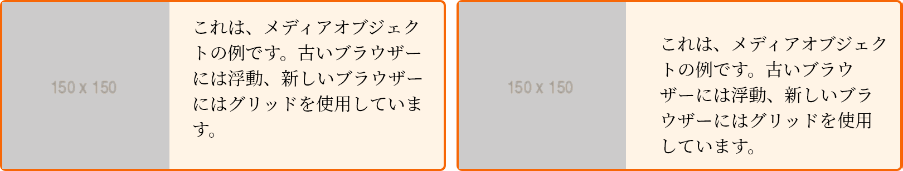
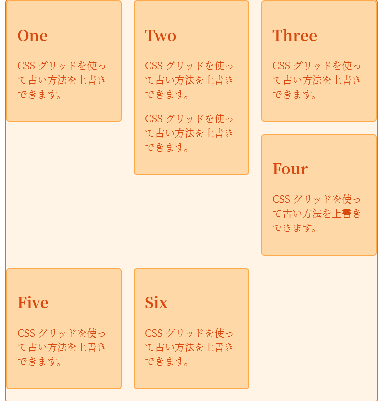
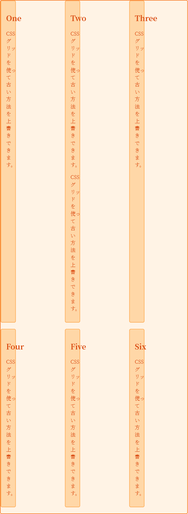

{{CSSRef}}

2017 年春、グリッドのようなメジャーな仕様がほぼ同時にブラウザーに搭載されるのを初めて目の当たりにし、現在までに Firefox、Chrome、Opera、Safari、Edge の公式バージョンが CSS グリッドレイアウトに対応しています。しかし、現役のブラウザー、すなわち多くのユーザーがとてもすばやくグリッドレイアウトの対応にあずかれる一方で、古い対応していないブラウザーもあります。このガイドでは、対応のためのさまざまな戦略を説明します。

## 対応しているブラウザー

Internet Explorer 以外の Safari、Chrome、Opera、Firefox、Edge では、CSS グリッドレイアウトはプリフィックスなしになっています。これらのガイドに記載されているすべてのプロパティと値は、ブラウザー間で相互運用可能です。つまり、Firefox でグリッドレイアウトのコードを書くと、 Chrome でも同じように動作するはずです。これはもはや実験的な仕様ではなく、本番環境でも安心して使用することができます。

## CSS のグリッドを使ってレイアウトしても大丈夫か

はい。他のフロントエンド技術と同様に、 CSS グリッドレイアウトを使用するかどうかは、サイト訪問者が通常使用しているブラウザーによります。

## 本番でグリッドの使用を始める

もちろん、グリッドの使用は*すべてか無か*で使用する必要はありません。まず、従来の方法では表示できなかったデザイン要素を、グリッドで強化することから始めましょう。従来の方法をグリッドレイアウトで上書きすると、グリッドが他の方法と相互作用するため、驚くほどうまくいきます。

### 浮動要素

私たちは通常、段組みレイアウトを作成するために[浮動要素](/ja/docs/Learn/CSS/CSS_layout/Floats)を使用してきました。対応しているブラウザーでグリッドアイテムでもあるアイテムを浮動させた場合、そのアイテムには浮動が適用されなくなります。実際には、_グリッドアイテムが優先されます_。以下の例では、単純なメディアオブジェクトがあります。非対応のブラウザーでは {{cssxref("float")}} を使用していますが、CSS グリッドで実装されている配置プロパティを使用するために、コンテナーをグリッドコンテナーとして定義しています。

{{cssxref("float")}} は適用されなくなり、CSS ボックス配置のプロパティである {{cssxref("align-self")}} を使用して、コンテンツをコンテナーの末尾に配置することができます。

```css
* {
  box-sizing: border-box;
}
img {
  max-width: 100%;
  display: block;
}
.media {
  border: 2px solid #f76707;
  border-radius: 5px;
  background-color: #fff4e6;
  max-width: 400px;
  display: grid;
  grid-template-columns: 1fr 2fr;
  grid-template-areas: "img content";
  margin-bottom: 1em;
}
.media::after {
  content: "";
  display: block;
  clear: both;
}
.media .text {
  padding: 10px;
  align-self: end;
}

/* old code we can't remove */
.media .image {
  float: left;
  width: 150px;
  margin-right: 20px;
}
```

```html
<div class="media">
  <div class="image">
    
  </div>
  <div class="text">
    これは、メディアオブジェクトの例です。古いブラウザーには浮動、新しいブラウザーにはグリッドを使用しています。
  </div>
</div>
```

{{ EmbedLiveSample('Floats', '500', '200') }}

下の画像は、左が非対応のブラウザ、右が対応しているブラウザーでメディアオブジェクトを表示したものです。



### 機能クエリーの使用

上の例は非常にシンプルで、グリッドに対応していないブラウザーでは、問題となるコードを書かなくても済むし、古いコードもグリッドに対応しているブラウザーでは問題になりません。しかし、物事はそれほど単純ではありません。

#### もっと複雑な例

次の例では、浮動させたカードを用意しました。カードに{{cssxref("width")}}を与え、{{cssxref("float")}}としています。カードの間に隙間を作るために、アイテムに{{cssxref("margin")}}を使用し、コンテナには負のマージンを使用しています。

```css hidden
* {
  box-sizing: border-box;
}

.wrapper {
  border: 2px solid #f76707;
  border-radius: 5px;
  background-color: #fff4e6;
  max-width: 600px;
  margin: 0 auto;
}
.wrapper li {
  border: 2px solid #ffa94d;
  border-radius: 5px;
  background-color: #ffd8a8;
  padding: 1em;
  color: #d9480f;
}
```

```css
.wrapper ul {
  overflow: hidden;
  margin: 0 -10px;
  padding: 0;
  list-style: none;
}
.wrapper li {
  float: left;
  width: calc(33.333333% - 20px);
  margin: 0 10px 20px 10px;
}
```

```html
<div class="wrapper">
  <ul>
    <li class="card">
      <h2>One</h2>
      <p>CSS グリッドを使って古い方法を上書きできます。</p>
    </li>
    <li class="card">
      <h2>Two</h2>
      <p>CSS グリッドを使って古い方法を上書きできます。</p>
    </li>
    <li class="card">
      <h2>Three</h2>
      <p>CSS グリッドを使って古い方法を上書きできます。</p>
    </li>
    <li class="card">
      <h2>Four</h2>
      <p>CSS グリッドを使って古い方法を上書きできます。</p>
    </li>
    <li class="card">
      <h2>Five</h2>
      <p>CSS グリッドを使って古い方法を上書きできます。</p>
    </li>
    <li class="card">
      <h2>Six</h2>
      <p>CSS グリッドを使って古い方法を上書きできます。</p>
    </li>
  </ul>
</div>
```

{{ EmbedLiveSample('A_more_complex_example', '550', '450') }}

この例では、浮動レイアウトの典型的な問題として、 1 枚のカードにコンテンツを追加すると、レイアウトが崩れてしまいます。



古いブラウザーへの配慮として、アイテムに {{cssxref("min-height")}} を設定し、コンテンツの編集者がコンテンツを追加しすぎてレイアウトを崩さないようにしています。

次に、グリッドを使ってレイアウトを強化します。 {{HTMLElement("ul")}} を 3 列のトラックを持つグリッドコンテナーにすることができます。しかし、リストアイテムに割り当てた幅がまだ適用されており、それらのアイテムはトラックの幅の 3 分の 1 になってしまいます。



幅を `auto` にリセットすると、古いブラウザーでは float の動作が行われなくなります。古いブラウザーでは幅を定義し、グリッドに対応しているブラウザーでは幅を削除できるようにする必要があります。[CSS 機能クエリー](/ja/docs/Web/CSS/@supports)のおかげで、CSS の中でこれを行うことができます。

#### 機能クエリーを用いた解決策

*機能クエリー*は、[メディアクエリー](/ja/docs/Web/CSS/CSS_media_queries)を使ってレスポンシブレイアウトを作成したことがある方にはとても親しみやすい形でしょう。ここでは、 {{glossary("viewport", "ビューポート")}}の幅や、ブラウザーや端末の機能をチェックするのではなく、 {{cssxref("@supports")}} のルールを使って、CSS のプロパティと値の組に対応しているかどうかをチェックします。機能クエリーの中では、最新のレイアウトを適用するために必要な CSS を記述し、古いレイアウトに必要なものは削除します。

```css
@supports (display: grid) {
  .wrapper {
    /* ここでグリッド対応ブラウザーのために何かをする。 */
  }
}
```

機能クエリーはブラウザーの対応が充実しており、更新されたグリッド仕様に対応しているブラウザーはすべて機能クエリーにも対応しています。機能クエリーを使って、浮動レイアウトを拡張することによる問題に対処することができます。

ここでは、 `@supports` ルールを使って、 `display: grid` に対応しているかどうかをチェックします。そして {{HTMLElement("ul")}} にグリッドコードを記述し、 width と {{cssxref("min-height")}} を {{HTMLElement("li")}} に設定して `auto` にしています。また、マージンと負のマージンを削除し、間隔を {{cssxref("gap")}} プロパティで置き換えています。これにより、ボックスの最後の行に最終マージンが発生しなくなりました。これで、 1 枚のカードに他のカードよりも多くのコンテンツがある場合でも、レイアウトが機能するようになりました。

```css hidden
* {
  box-sizing: border-box;
}

.wrapper {
  border: 2px solid #f76707;
  border-radius: 5px;
  background-color: #fff4e6;
  max-width: 600px;
  margin: 0 auto;
}
.wrapper li {
  border: 2px solid #ffa94d;
  border-radius: 5px;
  background-color: #ffd8a8;
  padding: 1em;
  color: #d9480f;
}
```

```css
.wrapper ul {
  overflow: hidden;
  margin: 0 -10px;
  padding: 0;
  list-style: none;
}
.wrapper li {
  float: left;
  width: calc(33.333333% - 20px);
  margin: 0 10px 20px 10px;
}
@supports (display: grid) {
  .wrapper ul {
    display: grid;
    grid-template-columns: repeat(3, 1fr);
    gap: 20px;
    margin: 0;
  }
  .wrapper li {
    width: auto;
    min-height: auto;
    margin: 0;
  }
}
```

```html
<div class="wrapper">
  <ul>
    <li class="card">
      <h2>One</h2>
      <p>CSS グリッドを使って古い方法を上書きできます。</p>
    </li>
    <li class="card">
      <h2>Two</h2>
      <p>CSS グリッドを使って古い方法を上書きできます。</p>
      <p>CSS グリッドを使って古い方法を上書きできます。</p>
    </li>
    <li class="card">
      <h2>Three</h2>
      <p>CSS グリッドを使って古い方法を上書きできます。</p>
    </li>
    <li class="card">
      <h2>Four</h2>
      <p>CSS グリッドを使って古い方法を上書きできます。</p>
    </li>
    <li class="card">
      <h2>Five</h2>
      <p>CSS グリッドを使って古い方法を上書きできます。</p>
    </li>
    <li class="card">
      <h2>Six</h2>
      <p>CSS グリッドを使って古い方法を上書きできます。</p>
    </li>
  </ul>
</div>
```

{{ EmbedLiveSample('A_solution_using_feature_queries', '550', '480') }}

## `display` の他の値を上書きする

浮動要素を使ってアイテムのグリッドを作成することには問題があるので、多くの人は一連のカードをレイアウトするために、上で示した浮動方式とは異なる方法を使うでしょう。`display: inline-block` を使うのがその代替方法です。

ここでも機能クエリーを使って `display: inline-block` を使ったレイアウトを上書きすることができますが、すべてを上書きする必要もありません。 `inline-block` に設定されたアイテムはグリッドアイテムになるので、 `inline-block` の動作は適用されなくなります。 `inline-block` の表示モードのときにアイテムに {{cssxref("vertical-align")}} プロパティを使っていましたが、このプロパティはグリッドアイテムには適用されないので、アイテムがグリッドアイテムになると無視されます。

```css hidden
* {
  box-sizing: border-box;
}

.wrapper {
  border: 2px solid #f76707;
  border-radius: 5px;
  background-color: #fff4e6;
  max-width: 600px;
  margin: 0 auto;
}

.wrapper li {
  border: 2px solid #ffa94d;
  border-radius: 5px;
  background-color: #ffd8a8;
  padding: 1em;
  color: #d9480f;
}
```

```css
.wrapper ul {
  margin: 0 -10px;
  padding: 0;
  list-style: none;
}

.wrapper li {
  display: inline-block;
  vertical-align: top;
  width: calc(33.333333% - 20px);
  margin: 0 10px 20px 10px;
}
@supports (display: grid) {
  .wrapper ul {
    display: grid;
    grid-template-columns: repeat(3, 1fr);
    gap: 20px;
    margin: 0;
  }
  .wrapper li {
    width: auto;
    margin: 0;
  }
}
```

```html
<div class="wrapper">
  <ul>
    <li class="card">
      <h2>One</h2>
      <p>CSS グリッドを使って古い方法を上書きできます。</p>
    </li>
    <li class="card">
      <h2>Two</h2>
      <p>CSS グリッドを使って古い方法を上書きできます。</p>
      <p>CSS グリッドを使って古い方法を上書きできます。</p>
    </li>
    <li class="card">
      <h2>Three</h2>
      <p>CSS グリッドを使って古い方法を上書きできます。</p>
    </li>
    <li class="card">
      <h2>Four</h2>
      <p>CSS グリッドを使って古い方法を上書きできます。</p>
    </li>
    <li class="card">
      <h2>Five</h2>
      <p>CSS グリッドを使って古い方法を上書きできます。</p>
    </li>
    <li class="card">
      <h2>Six</h2>
      <p>CSS グリッドを使って古い方法を上書きできます。</p>
    </li>
  </ul>
</div>
```

{{ EmbedLiveSample('Overwriting_other_values_of_display', '500', '480') }}

ここでも必要なのはアイテムの幅であり、次に強化したいその他のプロパティです。この例では、マージンや負のマージンではなく、 `gap` を使用して溝を作成しています。

## 仕様書ではどのように上書きを定義しているか

CSS グリッドレイアウト仕様書では、グリッドアイテムになったときに、特定のプロパティの動作を上書きできる理由を詳しく説明しています。仕様書の主な項目は以下の通りです。

- [グリッドコンテナーの確立](https://drafts.csswg.org/css-grid/#grid-containers)
- [グリッドアイテム](https://drafts.csswg.org/css-grid/#grid-items)
- [グリッドアイテムの表示](https://drafts.csswg.org/css-grid/#grid-item-display)

この動作は仕様に詳細が記載されているので、古いブラウザーに対応する際には、これらの上書きを使用するのが安全です。ここで説明していることは何も「ハック」ではなく、グリッドの仕様が異なるレイアウトメソッド間の相互作用を詳細に説明していることを利用しています。

### display のその他の値

要素の親が `display: grid` に設定されていると、 [CSS Display 仕様書](https://drafts.csswg.org/css-display-3/#blockify)で定義されているように、*ブロック化*になります。アイテムが `inline-block` に設定されている場合、 `display: inline-block` が適用されなくなったのはこのためです。

古いレイアウトで `display: table` を使用している場合、 `display: table-cell` に設定されたアイテムは無名ボックスを生成します。そのため、親要素に `display-table` を設定せずに `display: table-cell` を使用すると、あたかも `display: table` を設定した div や他の要素でセルを囲んだかのように、隣接するセルの周りに無名の表のラッパーが生成されます。アイテムが `display: table-cell` に設定されていて、 機能クエリーでその親を `display: grid` に変更すると、 この無名ボックスの作成は行われません。つまり、`display: table` ベースのレイアウトを上書きしても、 無名ボックスが追加されることはありません。

### 浮動要素

すでに説明したように、 {{cssxref("float")}} や {{cssxref("clear")}} は、グリッドアイテムに影響を与えません。そのため、アイテムを明示的に `float: none` に設定する必要はありません。

### 垂直方向の配置

配置プロパティ {{cssxref("vertical-align")}} は、グリッドアイテムには影響を与えません。 `display: inline-block` や `display: table` を使ったレイアウトでは、 vertical-align プロパティを使って基本的な整列を行うことができます。グリッドレイアウトには、より強力なボックス配置プロパティがあります。

### 段組みレイアウト

`column-*` プロパティはグリッドコンテナーには適用されないので、古いブラウザーの計画通りに段組みレイアウトを使用することもできます。

## 参考資料

- 機能クエリーの優れた説明と、その上手な使い方については、 [Using Feature Queries in CSS (2016)](https://hacks.mozilla.org/2016/08/using-feature-queries-in-css/) を参照してください。
- [CSS Grid and the New Autoprefixer (2018)](https://css-tricks.com/css-grid-in-ie-css-grid-and-the-new-autoprefixer)
