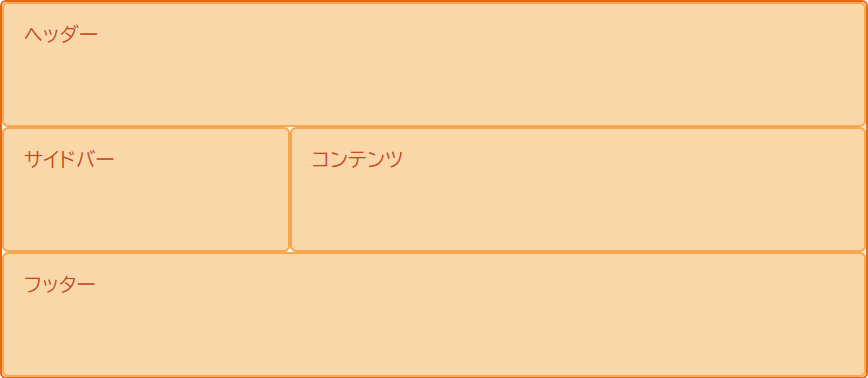

{{CSSRef}}

[前回のガイド](/ja/docs/Web/CSS/CSS_Grid_Layout/Line-based_Placement_with_CSS_Grid)では、グリッド線と、その線に対してアイテムを位置指定する方法をご紹介しました。CSS グリッドレイアウトでは、常に線が存在しており、グリッド上にアイテムを位置指定することを簡単にしています。しかし、グリッド上のアイテムを位置指定する別の方法があります。この方法は、単独で使用することも、線を使った位置指定と組み合わせて使用することもできます。この方法では、名前の付いたテンプレート領域を使ってアイテムを位置指定しますが、その方法を具体的に説明します。この方法を「アスキーアート方式のグリッドレイアウト」と呼んでいるのも、すぐにお分かりいただけるでしょう。

## グリッド領域に名前を付ける

すでに {{cssxref("grid-area")}} プロパティをご覧になったことがあると思います。これは、グリッド領域を配置するための 4 本の線をすべて値として取ることができるプロパティです。

```css
.box1 {
  grid-area: 1 / 1 / 4 / 2;
}
```

ここで 4 本の線を定義する際に行っているのは、領域を定義し、その領域を囲む線を指定することです。


領域を名前を付けて定義し、{{cssxref("grid-template-areas")}} プロパティの値でその領域の位置を指定することもできます。領域の名前は自由に決めることができます。例えば、以下のようなレイアウトを作りたい場合、 4 つの主要な領域を特定することができます。

- ヘッダー
- フッター
- サイドバー
- メインコンテンツ



{{cssxref("grid-area")}} プロパティにより、これらの領域にそれぞれ名前を付けることができます。これはまだレイアウトを生成していませんが、レイアウトで使用する名前付き領域になりました。

```css
.header {
  grid-area: hd;
}
.footer {
  grid-area: ft;
}
.content {
  grid-area: main;
}
.sidebar {
  grid-area: sd;
}
```

これらの名前を定義した後で、レイアウトを作成します。今回は、アイテム自体に指定された線番号を使ってアイテムを配置するのではなく、グリッドコンテナー上にレイアウト全体を作成します。

```css
.wrapper {
  display: grid;
  grid-template-columns: repeat(9, 1fr);
  grid-auto-rows: minmax(100px, auto);
  grid-template-areas:
    "hd hd hd hd   hd   hd   hd   hd   hd"
    "sd sd sd main main main main main main"
    "ft ft ft ft   ft   ft   ft   ft   ft";
}
```

```css hidden
* {
  box-sizing: border-box;
}

.wrapper {
  border: 2px solid #f76707;
  border-radius: 5px;
  background-color: #fff4e6;
  max-width: 940px;
  margin: 0 auto;
}

.wrapper > div {
  border: 2px solid #ffa94d;
  border-radius: 5px;
  background-color: #ffd8a8;
  padding: 1em;
  color: #d9480f;
}
```

```html
<div class="wrapper">
  <div class="header">Header</div>
  <div class="sidebar">Sidebar</div>
  <div class="content">Content</div>
  <div class="footer">Footer</div>
</div>
```

{{ EmbedLiveSample('Naming_a_grid_area', '300', '330') }}

この方法を使えば、個々のグリッドアイテムには何も指定する必要がなく、すべてはグリッドコンテナー上で行えます。レイアウトは {{cssxref("grid-template-areas")}} プロパティの値で表示されます。

## グリッドセルを空欄のままにする

この例では、グリッドを完全に領域で埋め尽くし、空欄をなくしています。しかし、このレイアウト方法では、グリッドのセルを空欄にすることができます。セルを空欄にするには、フルストップ文字「`.`」を使用します。メインコンテンツの直下にフッターのみを表示したい場合は、サイドバーの下にある 3 つのセルを空にする必要があります。

```css
.header {
  grid-area: hd;
}
.footer {
  grid-area: ft;
}
.content {
  grid-area: main;
}
.sidebar {
  grid-area: sd;
}
```

```css hidden
* {
  box-sizing: border-box;
}

.wrapper {
  border: 2px solid #f76707;
  border-radius: 5px;
  background-color: #fff4e6;
  max-width: 940px;
  margin: 0 auto;
}

.wrapper > div {
  border: 2px solid #ffa94d;
  border-radius: 5px;
  background-color: #ffd8a8;
  padding: 1em;
  color: #d9480f;
}
```

```css
.wrapper {
  display: grid;
  grid-template-columns: repeat(9, 1fr);
  grid-auto-rows: minmax(100px, auto);
  grid-template-areas:
    "hd hd hd hd   hd   hd   hd   hd   hd"
    "sd sd sd main main main main main main"
    ".  .  .  ft   ft   ft   ft   ft   ft";
}
```

```html
<div class="wrapper">
  <div class="header">Header</div>
  <div class="sidebar">Sidebar</div>
  <div class="content">Content</div>
  <div class="footer">Footer</div>
</div>
```

{{ EmbedLiveSample('Leaving_a_grid_cell_empty', '300', '330') }}

レイアウトをきれいにするために、複数の `.` 文字を使うことができます。ピリオドの間に空白がない限り、1 つのセルとしてカウントされます。複雑なレイアウトの場合、行と列をきれいに整列させることにはメリットがあります。つまり、このレイアウトがどのようなものであるかを、CSS の中で実際に確認することができるのです。

## 複数のセルにまたがらせる

この例では、それぞれの領域が複数のグリッドセルにまたがっており、グリッド領域の名前を空白を挟んで複数回繰り返すことでこれを実現しています。`grid-template-areas` の値には、列をきれいに並べるための空白を追加することができます。ここでは、`hd` と `ft` が `main` と並ぶようにしていることがわかります。

領域名を連結して作成する領域は長方形でなければならず、現時点では L 字型の領域を作成する方法はありません。仕様書には、将来のレベルでこの機能が提供されるかもしれないと書かれています。しかし、列と同じように簡単に行にまたがらせることができます。例えば、`.` を `sd` に置き換えることで、サイドバーがフッターの端まで広がるようにすることができます。

```css
.header {
  grid-area: hd;
}
.footer {
  grid-area: ft;
}
.content {
  grid-area: main;
}
.sidebar {
  grid-area: sd;
}
```

```css hidden
* {
  box-sizing: border-box;
}

.wrapper {
  border: 2px solid #f76707;
  border-radius: 5px;
  background-color: #fff4e6;
  max-width: 940px;
  margin: 0 auto;
}

.wrapper > div {
  border: 2px solid #ffa94d;
  border-radius: 5px;
  background-color: #ffd8a8;
  padding: 1em;
  color: #d9480f;
}
```

```css
.wrapper {
  display: grid;
  grid-template-columns: repeat(9, 1fr);
  grid-auto-rows: minmax(100px, auto);
  grid-template-areas:
    "hd hd hd hd   hd   hd   hd   hd   hd"
    "sd sd sd main main main main main main"
    "sd sd sd  ft  ft   ft   ft   ft   ft";
}
```

```html hidden
<div class="wrapper">
  <div class="header">Header</div>
  <div class="sidebar">Sidebar</div>
  <div class="content">Content</div>
  <div class="footer">Footer</div>
</div>
```

{{ EmbedLiveSample('Spanning_multiple_cells', '300', '330') }}

{{cssxref("grid-template-areas")}} の値は、完全なグリッドを示すものでなければならず、そうでない場合は無効となります（また、このプロパティは無視されます）。つまり、各行に同じ数のセルを用意し、空の場合はピリオド文字でそのセルを空欄にすることを示す必要があります。また、領域が長方形でない場合は、無効なグリッドが作成されます。

## メディアクエリーによるグリッドの再定義

レイアウトが CSS の一部分に収まったことで、さまざまなブレークポイントでの変更がとても容易になりました。これは、グリッドの再定義、グリッド上のアイテムの位置の再定義、またはその両方を一度に行うことができます。

その際、メディアクエリーの外側で領域の名前を定義します。これにより、コンテンツ領域は、グリッド上のどの位置に配置されても、常に `main` と呼ばれることになります。

上のレイアウトでは、狭い幅で 1 列のグリッドを定義し、アイテムを積み重ねていくというとてもシンプルなレイアウトにしたいと考えています。

```css hidden
* {
  box-sizing: border-box;
}

.wrapper {
  border: 2px solid #f76707;
  border-radius: 5px;
  background-color: #fff4e6;
  max-width: 940px;
  margin: 0 auto;
}

.wrapper > div {
  border: 2px solid #ffa94d;
  border-radius: 5px;
  background-color: #ffd8a8;
  padding: 1em;
  color: #d9480f;
}
```

```css
.header {
  grid-area: hd;
}
.footer {
  grid-area: ft;
}
.content {
  grid-area: main;
}
.sidebar {
  grid-area: sd;
}

.wrapper {
  display: grid;
  grid-auto-rows: minmax(100px, auto);
  grid-template-columns: 1fr;
  grid-template-areas:
    "hd"
    "main"
    "sd"
    "ft";
}
```

その後、メディアクエリーの中でレイアウトを再定義して、2 列のレイアウトにしたり、さらに広い空間が必要な場合は 3 列のレイアウトにすることもできます。広いレイアウトでは、9 列のトラックグリッドを維持し、`grid-template-areas` を使用してアイテムを配置する場所を再定義します。

```css
@media (min-width: 500px) {
  .wrapper {
    grid-template-columns: repeat(9, 1fr);
    grid-template-areas:
      "hd hd hd hd   hd   hd   hd   hd   hd"
      "sd sd sd main main main main main main"
      "sd sd sd  ft  ft   ft   ft   ft   ft";
  }
}
@media (min-width: 700px) {
  .wrapper {
    grid-template-areas:
      "hd hd hd   hd   hd   hd   hd   hd hd"
      "sd sd main main main main main ft ft";
  }
}
```

```html hidden
<div class="wrapper">
  <div class="header">Header</div>
  <div class="sidebar">Sidebar</div>
  <div class="content">Content</div>
  <div class="footer">Footer</div>
</div>
```

{{ EmbedLiveSample('Redefining_the_grid_using_media_queries', '550', '330') }}

## UI 要素への `grid-template-areas` の使用

ネット上にあるグリッドの例の多くは、ページのメインレイアウトにグリッドを使うことを前提としていますが、グリッドは小さな要素にも大きな要素と同じように使うことができます。特に {{cssxref("grid-template-areas")}} を使うと、コード上で要素がどのように見えるかを簡単に確認することができます。

### メディアオブジェクトの例

とても簡単な例として、「メディアオブジェクト」を作成することができます。これは、片側に画像などのメディアを置く空間があり、もう片側にコンテンツを置く空間がある部品です。画像は、ボックスの右または左に表示されます。


今回のグリッドは、2 列のトラックグリッドで、画像の列は `1fr` 、テキストは `3fr` の大きさになっています。固定幅の画像領域が必要な場合は、画像の列をピクセル幅に設定して、テキスト領域を `1fr` に割り当てることができます。そうすると、`1fr` の 1 列のトラックが残りの空間を占めることになります。

画像領域にはグリッド領域名として `img` を、テキスト領域には `content` を与え、`grid-template-areas` プロパティを使って、これらをレイアウトします。

```css
* {
  box-sizing: border-box;
}

.media {
  border: 2px solid #f76707;
  border-radius: 5px;
  background-color: #fff4e6;
  max-width: 400px;
}
.media {
  display: grid;
  grid-template-columns: 1fr 3fr;
  grid-template-areas: "img content";
  margin-bottom: 1em;
}

.media .image {
  grid-area: img;
  background-color: #ffd8a8;
}

.media .text {
  grid-area: content;
  padding: 10px;
}
```

```html
<div class="media">
  <div class="image"></div>
  <div class="text">
    これはメディアオブジェクトの例です。 grid-template-areas を使って、メディアオブジェクトの画像部分とテキスト部分を切り替えることができます。
  </div>
</div>
```

{{ EmbedLiveSample('Media_object_example', '300', '200') }}

### ボックスの反対側に画像を表示する

画像付きのボックスを逆に表示させたい場合もあるでしょう。そのためには、グリッドを再定義して `1fr` トラックを最後に置き、{{cssxref("grid-template-areas")}} の値を反転させます。

```css
* {
  box-sizing: border-box;
}

.media {
  border: 2px solid #f76707;
  border-radius: 5px;
  background-color: #fff4e6;
  max-width: 400px;
}
.media {
  display: grid;
  grid-template-columns: 1fr 3fr;
  grid-template-areas: "img content";
  margin-bottom: 1em;
}

.media.flipped {
  grid-template-columns: 3fr 1fr;
  grid-template-areas: "content img";
}

.media .image {
  grid-area: img;
  background-color: #ffd8a8;
}

.media .text {
  grid-area: content;
  padding: 10px;
}
```

```html
<div class="media flipped">
  <div class="image"></div>
  <div class="text">
    これはメディアオブジェクトの例です。
    grid-template-areasを使って、メディアオブジェクトの画像部分とテキスト部分を切り替えることができます。
  </div>
</div>
```

{{ EmbedLiveSample('Displaying_the_image_on_the_other_side_of_the_box', '300', '200') }}

## グリッド定義の一括指定

グリッドにアイテムを配置するさまざまな方法や、グリッドを定義するための多くのプロパティを見てきましたが、今回は、グリッドを定義するためのいくつかの一括指定と、それに関するさまざまなことを 1 行の CSS で定義する方法を見てみましょう。

これらは、他の開発者や将来の自分にとって、すぐに読みにくいものになってしまうかもしれません。しかし、これらは仕様の一部であり、たとえあなたが使用しなくても、サンプルや他の開発者が使用しているのを目にすることになるでしょう。

一括指定を使用する前に、一括指定は多くのプロパティを一度に設定できるだけでなく、一括指定で設定しなかった、または設定できなかったものを初期値に**リセット**する働きがあることを覚えておくとよいでしょう。したがって、一括指定を使用する場合は、他の場所で適用したものがリセットされる可能性があることに注意してください。

グリッドコンテナーの 2 つの一括指定は、明示的グリッド一括指定 `grid-template` と、グリッド定義一括指定 `grid` です。

### `grid-template`

{{cssxref("grid-template")}} プロパティは次のプロパティを設定します。

- {{cssxref("grid-template-rows")}}
- {{cssxref("grid-template-columns")}}
- {{cssxref("grid-template-areas")}}

このプロパティは、明示的なグリッドを定義する際に制御するものであり、作成される暗黙的な行や列のトラックに影響を与えるものではないことから、明示的なグリッドの一括指定と呼ばれています。

次のコードでは、{{cssxref("grid-template")}}を使用して、このガイドで以前に作成したレイアウトと同じレイアウトを作成しています。

```css
.wrapper {
  display: grid;
  grid-template:
    "hd hd hd hd   hd   hd   hd   hd   hd" minmax(100px, auto)
    "sd sd sd main main main main main main" minmax(100px, auto)
    "ft ft ft ft   ft   ft   ft   ft   ft" minmax(100px, auto)
    / 1fr 1fr 1fr 1fr 1fr 1fr 1fr 1fr 1fr;
}
```

最初の値は `grid-template-areas` の値ですが、各行の最後に行のサイズも宣言しています。これを行っているのは `minmax(100px, auto)` の部分です。

そして、 `grid-template-areas` の後にはスラッシュがあり、その後には列トラックの明示的なトラックリストがあります。

### `grid`

{{cssxref("grid")}} 一括指定は、さらに一歩進んで、暗黙のグリッドが使用するプロパティも設定します。つまり、設定するのは次のものです。

- {{cssxref("grid-template-rows")}}
- {{cssxref("grid-template-columns")}}
- {{cssxref("grid-template-areas")}}
- {{cssxref("grid-auto-rows")}}
- {{cssxref("grid-auto-columns")}}
- {{cssxref("grid-auto-flow")}}

この構文は、{{cssxref("grid-template")}} の一括指定とまったく同じ方法で使用できますが、プロパティで設定されている他の値がリセットされることに注意してください。

```css
.wrapper {
  display: grid;
  grid:
    "hd hd hd hd   hd   hd   hd   hd   hd" minmax(100px, auto)
    "sd sd sd main main main main main main" minmax(100px, auto)
    "ft ft ft ft   ft   ft   ft   ft   ft" minmax(100px, auto)
    / 1fr 1fr 1fr 1fr 1fr 1fr 1fr 1fr 1fr;
}
```

この一括指定が提供する他の機能については、後ほど自動配置と grid-auto-flow プロパティを見てみることにします。

ここまでの説明で、線ベースの配置や名前の付いた領域を使ったグリッドレイアウトを作成できるようになったと思います。時間をかけて、グリッドを使った一般的なレイアウトパターンを作ってみましょう。新しい用語がたくさん出てきますが、構文は比較的簡単です。例題を作成していくうちに、まだ説明していない疑問や使用例が出てくるかもしれません。このガイドの残りの部分では、グリッドを使って高度なレイアウトを作成できるように、仕様に含まれる詳細な情報を見ていきます。
