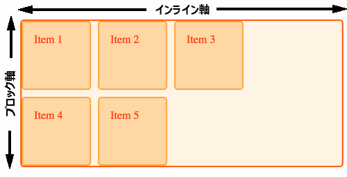
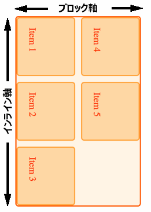

{{CSSRef}}

一連のガイドでは、グリッドレイアウトの重要な特徴である、仕様に組み込まれているさまざまな書字方向への対応についてすでに触れています。このガイドでは、グリッドやその他の最新のレイアウト方法のこの機能について、書字方向や論理的プロパティおよび物理的プロパティについて少しずつ学んでいきたいと思います。

## 論理的、物理的なプロパティと値

CSS には、左右や上下といった**物理的**な位置指定キーワードがたくさんあります。絶対位置指定を使ってアイテムを配置する場合、これらの物理的なキーワードをオフセット値として使用し、アイテムを移動させます。以下のコードでは、アイテムはコンテナーの上から 20 ピクセル、左から 30 ピクセルの位置に配置されています。

```css
.container {
  position: relative;
}
.item {
  position: absolute;
  top: 20px;
  left: 30px;
}
```

```html
<div class="container">
  <div class="item">Item</div>
</div>
```

また、テキストを右寄せにするために、 `text-align: right` という物理的なキーワードが使われることがあります。また、 CSS には物理的な**プロパティ**があります。例えば、 {{cssxref("margin-left")}} や {{cssxref("padding-left")}} などの物理的なプロパティを使って、マージンやパディング、境界を追加します。

これらのキーワードやプロパティは、見ている画面に関係するため、「物理的」と呼んでいます。Leftは、テキストがどの方向に走っていても、常に左です。

これは、テキストが左書きではなく右書きの言語など、複数の言語で動作するサイトを開発する際に問題となることがあります。ブラウザーはテキストの方向を扱うのが得意なので、 {{glossary("rtl")}} 言語で作業をしていなくても、見ることができます。以下の例には、2 つの段落があります。一つは {{cssxref("text-align")}} プロパティが設定されておらず、もう一つは `text-align` が左に設定されています。`html` 要素に `dir="rtl"` を追加し、英語の文書の既定値である `ltr` から書字方向を切り替えています。最初の段落は、`text-align` の値が `left` であるため、左書きのままになっているのがわかります。しかし、 2 番目の段落では方向が変わり、テキストは右書きになっています。


これは、 CSS で使用される物理的な値やプロパティの問題点を示すとても単純な例です。これらのプロパティは、テキストが左から右、上から下に流れていると仮定しているため、ブラウザーが書字方向を切り替えるための作業が行いにくくなります。

### 論理的プロパティの値

論理的なプロパティや値は、テキストの方向を想定していません。そのため、グリッドレイアウトでは、コンテナーの先頭に何かを配置する際に、キーワード `start` を使用します。英語で仕事をしている私にとって、`start` は左にあるかもしれませんが、そうである必要はありませんし、`start`という言葉は物理的な位置を意味しません。

## ブロックとインライン

物理的なプロパティではなく、論理的なプロパティを扱うようになると、世界を左から右、上から下のように見ることができなくなります。そこで必要になるのが、前回の*配置*で紹介した*ブロック軸*と*インライン軸*の理解です。ブロックとインラインの観点からレイアウトを捉えられるようになると、グリッドでの作業方法がより理解できるようになります。



## CSS 書字方向

ここでは、例題で使用するもうひとつの仕様、 CSS Writing Modes 仕様を紹介します。この仕様では、英語と異なる表記方法を持つ言語への対応だけでなく、クリエイティブな目的のために、 CSS で異なる表記方法を使用する方法を詳しく説明しています。ここでは、 {{cssxref("writing-mode")}} プロパティを使用して、グリッドに適用される書字方向を変更し、論理値がどのように機能するかを説明します。しかし、書字方向についてさらに詳しく知りたい場合は、Jen Simmons 氏の優れた記事である [CSS Writing Modes](https://24ways.org/2016/css-writing-modes/) を読むことをお勧めします。この記事では、ここで触れることができないほど、この仕様について深く掘り下げています。

### writing-mode

書字方向は、左書き、右書きのテキストだけではなく、`writing-mode` プロパティを使用することで、他の方向に走るテキストを表示することができます。 {{cssxref("writing-mode")}} プロパティは、以下の値を持つことができます。

- `horizontal-tb`
- `vertical-rl`
- `vertical-lr`
- `sideways-rl`
- `sideways-lr`

`horizontal-tb` の値は、ウェブ上のテキストの既定値です。このガイドを読んでいるときの方向です。その他のプロパティは、世界中で見られるさまざまな書き方に合わせて、文書内のテキストの流れ方を変えます。これらの詳細については、 [Jen の記事](https://24ways.org/2016/css-writing-modes/)を参照してください。簡単な例として、以下の 2 つの段落があります。1 つ目はデフォルトの `horizontal-tb` を使用し、 2 つ目は `vertical-rl` を使用しています。このモードでは、テキストは左書きですが、テキストの方向は垂直になり、インラインテキストはページの上から下に流れます。

```css hidden
.wrapper > p {
  border: 2px solid #ffa94d;
  border-radius: 5px;
  background-color: #ffd8a8;
  padding: 1em;
  margin: 1em;
  color: #d9480f;
  max-width: 300px;
}
```

```html
<div class="wrapper">
  <p style="writing-mode: horizontal-tb">
    書字方向が既定の <code>horizontal-tb</code> に設定されています
  </p>
  <p style="writing-mode: vertical-rl">
    書字方向が <code>vertical-rl</code> に設定されています
  </p>
</div>
```

{{ EmbedLiveSample('writing-mode', '500', '500') }}

## グリッドレイアウトでの書字方向

次にグリッドレイアウトの例を見てみると、書字方向を変更することで、ブロック軸とインライン軸の位置の考え方が変わることがわかります。

<h3 id="Default_writing_mode">既定の書字方向</h3>

この例のグリッドには、 3 つの列と 2 つの行のトラックがあります。つまり、ブロック軸に3つのトラックがあるということです。既定の書字方向では、グリッドは左上から右に向かってアイテムを自動配置し、インライン軸の 3 つのセルを埋めていきます。その後、次の行に移動して新しい行トラックを作成し、さらにアイテムを埋めていきます。

```css hidden
* {
  box-sizing: border-box;
}

.wrapper {
  border: 2px solid #f76707;
  border-radius: 5px;
  background-color: #fff4e6;
}

.wrapper > div {
  border: 2px solid #ffa94d;
  border-radius: 5px;
  background-color: #ffd8a8;
  padding: 1em;
  color: #d9480f;
}
```

```css
.wrapper {
  display: grid;
  grid-template-columns: repeat(3, 100px);
  grid-template-rows: repeat(2, 100px);
  gap: 10px;
}
```

```html
<div class="wrapper">
  <div class="item1">Item 1</div>
  <div class="item2">Item 2</div>
  <div class="item3">Item 3</div>
  <div class="item4">Item 4</div>
  <div class="item5">Item 5</div>
</div>
```

{{ EmbedLiveSample('Default_writing_mode', '500', '330') }}

<h3 id="Setting_writing_mode">書字方向の設定</h3>

グリッドコンテナーに `writing-mode: vertical-lr` を追加すると、ブロック軸とインライン軸が異なる方向に動くことがわかります。ブロックまたは*列の*軸は、ページを左から右に横切るようになり、インラインはページを下って、上から下に行を作成するようになりました。

```css hidden
* {
  box-sizing: border-box;
}

.wrapper {
  border: 2px solid #f76707;
  border-radius: 5px;
  background-color: #fff4e6;
}

.wrapper > div {
  border: 2px solid #ffa94d;
  border-radius: 5px;
  background-color: #ffd8a8;
  padding: 1em;
  color: #d9480f;
}
```

```css
.wrapper {
  writing-mode: vertical-lr;
  display: grid;
  grid-template-columns: repeat(3, 100px);
  grid-template-rows: repeat(2, 100px);
  gap: 10px;
}
```

```html
<div class="wrapper">
  <div class="item1">Item 1</div>
  <div class="item2">Item 2</div>
  <div class="item3">Item 3</div>
  <div class="item4">Item 4</div>
  <div class="item5">Item 5</div>
</div>
```

{{ EmbedLiveSample('Setting_writing_mode', '500', '330') }}



## 配置における論理的な値

ブロック軸とインライン軸が方向転換できるようになったことで、配置プロパティの論理値がより意味を持つようになりました。

次の例では、 `writing-mode: vertical-lr` に設定されたグリッド内のアイテムを整列させるために配置を使用しています。 `start` と `end` のプロパティは、既定の書字方向の場合とまったく同じように動作し、左右や上下を使ってアイテムを揃えることができないように、論理的な値を維持しています。これは、次のようにグリッドを横に反転させたときに発生します。

```css hidden
* {
  box-sizing: border-box;
}

.wrapper {
  border: 2px solid #f76707;
  border-radius: 5px;
  background-color: #fff4e6;
}

.wrapper > div {
  border: 2px solid #ffa94d;
  border-radius: 5px;
  background-color: #ffd8a8;
  padding: 1em;
  color: #d9480f;
}
```

```css
.wrapper {
  writing-mode: vertical-lr;
  display: grid;
  grid-template-columns: repeat(3, 1fr);
  grid-template-rows: repeat(3, 100px);
  gap: 10px;
}

.item1 {
  grid-column: 1 / 4;
  align-self: start;
}

.item2 {
  grid-column: 1 / 3;
  grid-row: 2 / 4;
  align-self: start;
}

.item3 {
  grid-column: 3;
  grid-row: 2 / 4;
  align-self: end;
  justify-self: end;
}
```

```html
<div class="wrapper">
  <div class="item1">Item 1</div>
  <div class="item2">Item 2</div>
  <div class="item3">Item 3</div>
</div>
```

{{ EmbedLiveSample('Logical_values_for_alignment', '500', '330') }}

右書きだけでなく、縦書きの書字方向で、これらの動作を確認したい場合は、 `vertical-lr` を `vertical-rl` に切り替えてください。

## 自動配置と書字方向

すでに示した例では、書字方向が、アイテムがグリッドに配置される方向をどのように変えるかを見ることができます。既定では、アイテムはインライン軸に沿って配置され、新しい行に移動します。しかし、そのインライン軸は、必ずしも左から右に向かっているとは限りません。

## 線ベースの配置と書字方向

線番号でアイテムを配置する際に覚えておくべき重要なことは、どのような書字方向であっても、行 1 が先頭の線であるということです。また、どの書字方向であっても、行 -1 が末尾の線となります。

### 左書きのテキストにおける線ベースの配置

次の例では、既定の `ltr` 方向のグリッドを使用しています。3 つのアイテムを線ベースの配置で配置しています。

- アイテム 1 は、列の線 1 から始まり、1 トラック分の範囲になります。
- アイテム 2 は、列の線 -1 から始まり、-3 までの範囲をカバーします。
- アイテム 3 は、列の線 1 から始まり、列の線 3 までを含みます。

```css hidden
* {
  box-sizing: border-box;
}

.wrapper {
  border: 2px solid #f76707;
  border-radius: 5px;
  background-color: #fff4e6;
}

.wrapper > div {
  border: 2px solid #ffa94d;
  border-radius: 5px;
  background-color: #ffd8a8;
  padding: 1em;
  color: #d9480f;
}
```

```css
.wrapper {
  display: grid;
  grid-template-columns: repeat(3, 1fr);
  grid-template-rows: repeat(2, 100px);
  gap: 10px;
}
.item1 {
  grid-column: 1;
}
.item2 {
  grid-column: -1 / -3;
}
.item3 {
  grid-column: 1 / 3;
  grid-row: 2;
}
```

```html
<div class="wrapper">
  <div class="item1">Item 1</div>
  <div class="item2">Item 2</div>
  <div class="item3">Item 3</div>
</div>
```

{{ EmbedLiveSample('Line-based_placement_with_left_to_right_text', '500', '330') }}

### 右書きのテキストにおける線ベースの配置

ここで、 {{cssxref("direction")}} プロパティに `rtl` という値を入れてグリッドコンテナーに追加すると、線 1 グリッドの右側に、線 -1 が左側になります。

```css hidden
* {
  box-sizing: border-box;
}

.wrapper {
  border: 2px solid #f76707;
  border-radius: 5px;
  background-color: #fff4e6;
}

.wrapper > div {
  border: 2px solid #ffa94d;
  border-radius: 5px;
  background-color: #ffd8a8;
  padding: 1em;
  color: #d9480f;
}
```

```css
.wrapper {
  direction: rtl;
  display: grid;
  grid-template-columns: repeat(3, 1fr);
  grid-template-rows: repeat(2, 100px);
  gap: 10px;
}
.item1 {
  grid-column: 1;
}
.item2 {
  grid-column: -1 / -3;
}
.item3 {
  grid-column: 1 / 3;
  grid-row: 2;
}
```

```html
<div class="wrapper">
  <div class="item1">Item 1</div>
  <div class="item2">Item 2</div>
  <div class="item3">Item 3</div>
</div>
```

{{ EmbedLiveSample('Line-based_placement_with_right_to_left_text', '500', '330') }}

これは、ページ全体またはページの一部でテキストの方向を切り替える場合に、線を使用していることを示しています。レイアウトの方向を完全に切り替えたくない場合は、線に名前を付けるとよいでしょう。例えば、グリッドにテキストコンテンツが含まれている場合には、この切り替えはまさに必要なことかもしれません。他の用途ではそうではないかもしれません。

### `grid-area` プロパティの値の順序が奇妙であること

{{cssxref("grid-area")}} プロパティを使用すると、グリッド領域の 4 行すべてを 1 つの値として指定できます。初めてこの機能を使う人は、値が margin の一括指定である時計回りの上、右、下、左と同じ順序ではないことに驚くことが多いようです。

`grid-area` の値の順序は次の通りです。

- `grid-row-start`
- `grid-column-start`
- `grid-row-end`
- `grid-column-end`

英語のような左書きの言語においては、この順序は次のようになります。

- `top`
- `left`
- `bottom`
- `right`

これは反時計回りです。つまり、マージンやパディングの場合とは逆です。ひとたび `grid-area` が世界を「ブロックとインライン」として見ていることを理解すれば、 2 つの先頭を設定し、次に 2 つの末尾を設定していると覚えることができます。これがわかれば、もっと論理的になりますね。

<h2 id="Mixed_writing_modes_and_grid_layout">書字方向の混合とグリッドレイアウト</h2>

言語に適した書字方向を使って文書を表示するだけでなく、`ltr` 以外の書字方向を文書内でクリエイティブに使用することができます。次の例では、グリッドレイアウトの片側にリンクを配置していますが、書字方向を使用して、これらを列トラックの中で横向きにしています。

```css
.wrapper {
  display: grid;
  grid-gap: 20px;
  grid-template-columns: 1fr auto;
  font:
    1em Helvetica,
    Arial,
    sans-serif;
}
.wrapper nav {
  writing-mode: vertical-lr;
}
.wrapper ul {
  list-style: none;
  margin: 0;
  padding: 1em;
  display: flex;
  justify-content: space-between;
}
.wrapper a {
  text-decoration: none;
}
```

```html
<div class="wrapper">
  <div class="content">
    <p>
      Turnip greens yarrow ricebean rutabaga endive cauliflower sea lettuce
      kohlrabi amaranth water spinach avocado daikon napa cabbage asparagus
      winter purslane kale. Celery potato scallion desert raisin horseradish
      spinach carrot soko. Lotus root water spinach fennel kombu maize bamboo
      shoot green bean swiss chard seakale pumpkin onion chickpea gram corn pea.
      Brussels sprout coriander water chestnut gourd swiss chard wakame kohlrabi
      beetroot carrot watercress. Corn amaranth salsify bunya nuts nori azuki
      bean chickweed potato bell pepper artichoke.
    </p>
    <p>
      Nori grape silver beet broccoli kombu beet greens fava bean potato
      quandong celery. Bunya nuts black-eyed pea prairie turnip leek lentil
      turnip greens parsnip. Sea lettuce lettuce water chestnut eggplant winter
      purslane fennel azuki bean earthnut pea sierra leone bologi leek soko
      chicory celtuce parsley jícama salsify.
    </p>
  </div>
  <nav>
    <ul>
      <li><a href="">Link 1</a></li>
      <li><a href="">Link 2</a></li>
      <li><a href="">Link 3</a></li>
    </ul>
  </nav>
</div>
```

{{ EmbedLiveSample('Mixed_writing_modes_and_grid_layout', '500', '330') }}

## 物理的な値とグリッドレイアウト

ウェブサイトを構築する際には、物理的なプロパティに頻繁に遭遇します。グリッドの配置や整列のプロパティや値は、書字方向を尊重していますが、グリッドでやりたいことで物理的なプロパティや値を使用せざるを得ないことがあるかもしれません。[ボックス配置とグリッド](/ja/docs/Web/CSS/CSS_Grid_Layout/Box_Alignment_in_CSS_Grid_Layout)のガイドでは、グリッド領域での自動マージンの働きを紹介しました。自動マージンを使用して 1 つのアイテムを他のアイテムから遠ざけるのは、フレックスボックスの一般的なトリックでもありますが、これはレイアウトを物理的な空間に結びつけるものでもあります。

グリッド領域内で絶対配置を使用する場合は、グリッド領域内でアイテムを移動させるために物理的なオフセットを使用することになります。ここで注意しなければならないのは、物理的なプロパティと論理的なプロパティと値の間の緊張感です。例えば、`ltr` から `rtl` への切り替えに対応するために、CSS を変更する必要があるかもしれないことに注意してください。

### すべてにおいて論理的プロパティを

新しいレイアウト方法では、これらの論理的な値を使用してアイテムを配置することができますが、マージンやパディングに使用される物理的なプロパティと組み合わせ始めるとすぐに、これらの物理的なプロパティは、書き込みモードによって変更されないことを覚えておく必要があります。

[CSS Logical Properties 仕様書](https://drafts.csswg.org/css-logical-props/)では、 {{cssxref("margin-left")}} や {{cssxref("margin-right")}} などのプロパティに対して、[論理的な同等のもの](/ja/docs/Web/CSS/CSS_Logical_Properties)が CSS で使用できることを意味しています。これらのプロパティや値は、現在のブラウザーでは十分に対応されています。ブロックやインラインからグリッドまでを理解していると、これらの使い方も理解できるようになります。
