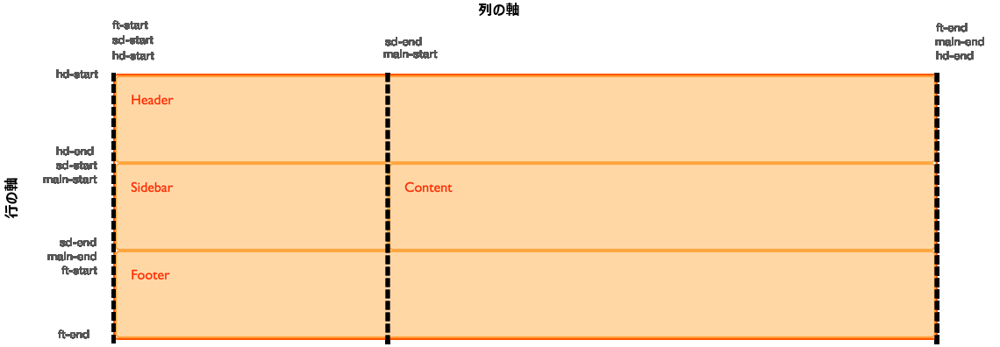
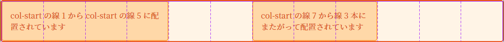

{{CSSRef}}

前のガイドでは、グリッドトラックを定義することによって作られた線に沿ってアイテムを配置する様子と、名前の付いたテンプレート領域を使用してアイテムを配置する方法を見てきました。このガイドでは、名前付きの線を使用したときにこれら 2 つが共にどのように動作するかを見てみます。線に名前をつけるととても便利ですが、名前とトラックの寸法の組み合わせではもっと難解なグリッドの構文になります。いくつかの例を使ってみることで、動作がより明確かつ易しくなるでしょう。

<h2 id="Naming_lines_when_defining_a_grid">グリッドを定義した場合の線の名前付け</h2>

グリッドを定義する際に、`grid-template-rows` と `grid-template-columns` のプロパティを使って、グリッド内の一部または全部の線に名前を割り当てることができます。ここでは、線ベースの配置のガイドで作成したシンプルなレイアウトを使って説明します。今回は、名前付きの線を使ってグリッドを作成します。

```css hidden
* {box-sizing: border-box;}

.wrapper {
  border: 2px solid #f76707;
  border-radius: 5px;
  background-color: #fff4e6;
}

.wrapper > div {
  border: 2px solid #ffa94d;
  border-radius: 5px;
  background-color: #ffd8a8;
  padding: 1em;
  color: #d9480f;
}
```

グリッドを定義する際、角括弧の中に線の名前を付けます。この名前は何でもかまいません。ここでは、コンテナーの先頭と末尾の名前を、行と列の両方で定義しました。また、グリッドの中心となるブロックには、列と行の両方に対して `content-start` と `content-end` という名前を定義しましたが、グリッド上のすべての線に名前を付ける必要はありません。しかし、グリッド上のすべての線に名前を付ける必要はありません。レイアウト上で重要な線だけに名前を付けることもできます。

```css
.wrapper {
  display: grid;
  grid-template-columns: [main-start] 1fr [content-start] 1fr [content-end] 1fr [main-end];
  grid-template-rows: [main-start] 100px [content-start] 100px [content-end] 100px [main-end];
}
```

線に名前を付けたら、線番号ではなく、名前を使ってアイテムを配置することができます。

```css
.box1 {
  grid-column-start: main-start;
  grid-row-start: main-start;
  grid-row-end: main-end;
}

.box2 {
  grid-column-start: content-end;
  grid-row-start: main-start;
  grid-row-end: content-end;
}

.box3 {
  grid-column-start: content-start;
  grid-row-start: main-start;
}

.box4 {
  grid-column-start: content-start;
  grid-column-end: main-end;
  grid-row-start: content-end;
}
```

```html
<div class="wrapper">
  <div class="box1">One</div>
  <div class="box2">Two</div>
  <div class="box3">Three</div>
  <div class="box4">Four</div>
</div>
```

{{ EmbedLiveSample('Naming_lines_when_defining_a_grid', '500', '330') }}

線ベースの配置に関する他のすべての機能は同じように動作し、名前付きの線と線番号を混在させることができます。名前付きの線は、レスポンシブデザインでグリッドを再定義する際に便利です。メディアクエリーで線番号を変更して内容物の位置を再定義するのではなく、定義の中で線の名前が常に同じになるようにすることができます。

### 線に複数の名前をつける

例えば、sidebar-end と main-start を表すために、1 つの線に複数の名前を付けたい場合があります。そのためには、 `[sidebar-end main-start]` のように角括弧の中に名前を入れて、その間に空白を入れます。これで、どちらの名前でもその行を参照することができます。

## 名前付きの線による暗黙のグリッド領域

線に名前を付けるとき、好きな名前を付けて良いと言いました。この名前は[カスタム識別子](https://drafts.csswg.org/css-values-4/#custom-idents)といって、作者が定義した名前です。名前を決める際には、`span` のような、仕様書に出てきて混乱を招くような言葉は避ける必要があります。識別子には引用符を付けません。

どのような名前でも良いのですが、上の例のように、領域を囲む行に `-start` と `-end` を追加すると、グリッドは主要部分で使用される名前の領域を作成します。上の例では、行と列の両方に `content-start` と `content-end` を付けています。つまり、`content`という名前のグリッド領域ができ、その領域に何かを配置することができるのです。

```css hidden
* {box-sizing: border-box;}

.wrapper {
  border: 2px solid #f76707;
  border-radius: 5px;
  background-color: #fff4e6;
}

.wrapper > div {
  border: 2px solid #ffa94d;
  border-radius: 5px;
  background-color: #ffd8a8;
  padding: 1em;
  color: #d9480f;
}
```

上記と同じグリッド定義を使用していますが、今回は `content` という名前の領域に 1 つのアイテムを配置することにします。

```css
.wrapper {
  display: grid;
  grid-template-columns: [main-start] 1fr [content-start] 1fr [content-end] 1fr [main-end];
  grid-template-rows: [main-start] 100px [content-start] 100px [content-end] 100px [main-end];
}
.thing {
  grid-area: content;
}
```

```html
<div class="wrapper">
  <div class="thing">content と名付けられた領域に配置されています。</div>
</div>
```

{{ EmbedLiveSample('Implicit_grid_areas_from_named_lines', '500', '330') }}

名前の付いた線が領域を作ってくれるので、 `grid-template-areas` で領域の位置を定義する必要はありません。

## 名前付き領域による暗黙のグリッド線

名前付きの線が名前付きの領域を作る方法を見てきましたが、これは逆に機能します。名前付きテンプレート領域を定義すると、アイテムを配置するのに使用できる名前付きの線が作成されます。グリッドテンプレート領域のガイドで作成されたレイアウトを使用すると、領域によって作成された線を使用して、これがどのように機能するかを確認することができます。

この例では、クラスを `overlay` に設定した div を追加しています。そして、`grid-area` プロパティで作成した名前付きの領域と、`grid-template-areas` で作成したレイアウトを用意しました。領域の名前は次の通りです。

- `hd`
- `ft`
- `main`
- `sd`

これによって、以下の行と列の線が得られます。

- `hd-start`
- `hd-end`
- `sd-start`
- `sd-end`
- `main-start`
- `main-end`
- `ft-start`
- `ft-end`

画像の中で名前付きの線を確認することができます。なお、線によっては 2 つの名前が付いています。例えば、 `sd-end` と `main-start` は同じ列の線を参照しています。



これらの暗黙に名づけられた線を使って `overlay` を配置することは、名づけた線を使ってアイテムを配置することと同じです。

```css hidden
* {box-sizing: border-box;}

.wrapper {
  border: 2px solid #f76707;
  border-radius: 5px;
  background-color: #fff4e6;
}

.wrapper > div {
  border: 2px solid #ffa94d;
  border-radius: 5px;
  background-color: #ffd8a8;
  padding: 1em;
  color: #d9480f;
}
```

```css
.wrapper {
  display: grid;
  grid-template-columns: repeat(9, 1fr);
  grid-auto-rows: minmax(100px, auto);
  grid-template-areas:
    "hd hd hd hd   hd   hd   hd   hd   hd"
    "sd sd sd main main main main main main"
    "ft ft ft ft   ft   ft   ft   ft   ft";
}

.header {
  grid-area: hd;
}

.footer {
  grid-area: ft;
}

.content {
  grid-area: main;
}

.sidebar {
  grid-area: sd;
}

.wrapper > div.overlay {
  z-index: 10;
  grid-column: main-start / main-end;
  grid-row: hd-start / ft-end;
  border: 4px solid rgb(92,148,13);
  background-color: rgba(92,148,13,.4);
  color: rgb(92,148,13);
  font-size: 150%;
}
```

```html
<div class="wrapper">
  <div class="header">Header</div>
  <div class="sidebar">Sidebar</div>
  <div class="content">Content</div>
  <div class="footer">Footer</div>
  <div class="overlay">Overlay</div>
</div>
```

{{ EmbedLiveSample('Implicit_Grid_lines_from_named_areas', '500', '330') }}

名前のついた領域からは線を、名前のついた線からは領域を作ることができるので、グリッドレイアウトの作成を始める際には、少し時間をかけて名前の付け方を計画するといいでしょう。自分や自分のチームにとって意味のある名前を選ぶことで、作成したレイアウトを誰もが簡単に使えるようになります。

## repeat() による複数の同一名の線の表示

グリッド内のすべての線に固有の名前を付けたい場合は、トラックを定義する際に角括弧内に名前を追加する必要があるため、反復構文を使わずにトラック定義を手書きする必要があります。反復構文を使用すると、同じ名前の線が複数できてしまいますが、これもとても便利です。

### repeat() を使用した 12 列のグリッド

次の例では、同じ幅の 12 列のグリッドを作成しています。 1fr の列トラックを定義する前に、線の名前を `[col-start]` と定義しています。つまり、幅が 1fr の列の前に、12 本の列の線名がすべて `col-start` となっているグリッドができあがるということです。

```css hidden
* {box-sizing: border-box;}

.wrapper {
  border: 2px solid #f76707;
  border-radius: 5px;
  background-color: #fff4e6;
}

.wrapper > div {
  border: 2px solid #ffa94d;
  border-radius: 5px;
  background-color: #ffd8a8;
  padding: 1em;
  color: #d9480f;
}
```

```css
.wrapper {
  display: grid;
  grid-template-columns: repeat(12, [col-start] 1fr);
}
```

グリッドを作成したら、そこにアイテムを配置します。 `col-start` という名前の複数の線があるので、 `col-start` という線の後にアイテムを配置すると、グリッドは `col-start` という名前の最初の線を使用します。この例では左端の線です。別の行を指定するには、名前とその線の番号を使用します。col-start という最初の行から 5 番目の行までアイテムを配置するには、次のようにします。

```css
.item1 {
  grid-column: col-start / col-start 5
}
```

ここでは、`span` キーワードを使うこともできます。次のアイテムは `col-start` という名前の 7 行目から、 3 行に渡って配置されます。

```css
.item2 {
  grid-column: col-start 7 / span 3;
}
```

```html
<div class="wrapper">
  <div class="item1">col-start の線 1 から col-start の線 5 に配置されています</div>
  <div class="item2">col-start の線 7 から線 3 本にまたがって配置されています</div>
</div>
```

{{ EmbedLiveSample('Twelve-column_grid_using_repeat', '500', '330') }}

このレイアウトを Firefox グリッドハイライターで見てみると、列の線がどのように表示されているか、そしてその線に対してアイテムがどのように配置されているかがわかります。



### トラックリストで名前付きの線を定義する

repeat 構文には、トラックリストを指定することもでき、繰り返されるのはトラックサイズが 1 つである必要はありません。以下のコードでは、 8 トラックのグリッドを作成し、幅の狭い `1fr` の列を `col1-start` とし、幅の広い `3fr` の列を `col2-start` としています。

```css
.wrapper {
  grid-template-columns: repeat(4, [col1-start] 1fr [col2-start] 3fr);
}
```

反復構文で 2 つの線が隣り合っていると統合され、反復のないトラック定義で 1 つの線に複数の名前を付けたのと同じ結果になります。次の定義では、 4 つの `1fr` トラックを作成し、それぞれに先頭と末尾の線を設定しています。

```css
.wrapper {
  grid-template-columns: repeat(4, [col-start] 1fr [col-end] );
}
```

この定義を反復記法を使わずに書き出すと、次のようになります。

```css
.wrapper {
  grid-template-columns: [col-start] 1fr [col-end col-start] 1fr [col-end col-start] 1fr  [col-end col-start] 1fr [col-end];
}
```

トラックリストを使用している場合は、`span` キーワードを使用して、複数の行にまたがるだけでなく、特定の名前の複数の行にまたがることもできます。

```css hidden
* {box-sizing: border-box;}

.wrapper {
  border: 2px solid #f76707;
  border-radius: 5px;
  background-color: #fff4e6;
}

.wrapper > div {
  border: 2px solid #ffa94d;
  border-radius: 5px;
  background-color: #ffd8a8;
  padding: 1em;
  color: #d9480f;
}
```

```css
.wrapper {
  display: grid;
  grid-template-columns: repeat(6, [col1-start] 1fr [col2-start] 3fr);
}

.item1 {
  grid-column: col1-start / col2-start 2
}

.item2 {
  grid-row: 2;
  grid-column: col1-start 2 / span 2 col1-start;
}
```

```html
<div class="wrapper">
  <div class="item1">col1-start の線 1 から col2-start の線 2 に配置されています</div>
  <div class="item2">col1-start の線 2 から col1-start と名付けられた線 2 本にまたがって配置されています</div>
</div>
```

{{ EmbedLiveSample('Defining_named_lines_with_a_track_list', '500', '330') }}

### 12 列のグリッドフレームワーク

これまでの 3 つのガイドで、グリッドを使ってアイテムを配置するには、さまざまな方法があることがわかりました。最初は少し複雑に感じるかもしれませんが、すべての方法を使う必要はありません。実際には、単純なレイアウトの場合は、名前の付いたテンプレート領域を使用するとうまくいきます。これにより、レイアウトがどのように見えるかを視覚的に表現することができ、グリッド上でのアイテムの移動も簡単です。

例えば、厳密な複数列のレイアウトを行う場合は、このガイドの最後の部分で紹介した名前付きの線の実行例がとても有効です。また、 Foundation や Bootstrap などのフレームワークに搭載されているグリッドシステムは、12 列のグリッドをベースにしています。フレームワークは、列の合計が 100% になるようにすべての計算を行うコードをインポートします。グリッドレイアウトでは、グリッドの「フレームワーク」に必要なコードは次のものだけです。

```css
.wrapper {
  display: grid;
  gap: 10px;
  grid-template-columns: repeat(12, [col-start] 1fr);
}
```

そして、そのフレームワークを使って、ページをレイアウトすることができます。例えば、ヘッダーとフッターを持つ 3 列のレイアウトを作るには、次のようなマークアップが必要です。

```css hidden
* {box-sizing: border-box;}

.wrapper {
  border: 2px solid #f76707;
  border-radius: 5px;
  background-color: #fff4e6;
}

.wrapper > * {
  border: 2px solid #ffa94d;
  border-radius: 5px;
  background-color: #ffd8a8;
  padding: 1em;
  color: #d9480f;
}
```

```html
<div class="wrapper">
  <header class="main-header">ヘッダー</header>
  <aside class="side1">サイドバー 1</aside>
  <article class="content">メイン記事</article>
  <aside class="side2">サイドバー 2</aside>
  <footer class="main-footer">フッター</footer>
</div>
```

これをグリッドレイアウトフレームワークに配置すると、次のようになります。

```css
.main-header,
.main-footer  {
  grid-column: col-start / span 12;
}

.side1 {
  grid-column: col-start / span 3;
  grid-row: 2;
}

.content {
  grid-column: col-start 4 / span 6;
  grid-row: 2;
}

.side2 {
  grid-column: col-start 10 / span 3;
  grid-row: 2;
}
```

{{ EmbedLiveSample('Twelve-column_grid_framework', '500', '330') }}

ここでも、グリッドハイライターはアイテムを配置したグリッドがどのように機能するかを示すのに役立ちます。


必要なのはこれだけです。グリッドが自動的に 10 ピクセルの溝トラックを削除し、 `1fr` の列トラックに空間を割り当ててくれるので、計算する必要はありません。自分でレイアウトを作り始めると、構文がより身近なものになり、自分や作りたいプロジェクトの種類に合わせて最適な方法を選ぶことができるようになります。これらの様々な方法で共通のパターンを作ってみると、自分にとって最も生産的な作業方法がすぐに見つかるでしょう。次のガイドでは、配置プロパティを使わなくても、グリッドがアイテムを配置する方法を紹介します。
